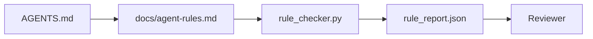

# أمر وكيل كحزم قابل للاستفادة

> وذلك في ظل أنّه من المفترض أن يكون هناك إختبار، وذلك في ظل أنّه من المفترض أن يكون هناك إختبار.

**类型：**الإنشاء
**语言：**Python (stdlib)
**前置要求：**المرحلة 14 · 32 (أقل عدد من الموظفين)
**时间：**حوالي 50 دقيقة

## 學习目标

- ستفصل المواصفات عن قواعد التشغيل.
- أن تُظهر القواعد الإبتدائية، والحظر على العمليات، والإنجاز من تعريف، والمعالجة غير المثيرة، والإقرار على الحدود التي يمكن فحصها على الجهاز.
- 实现 a قواعد معائنة، استخدام قواعد مجموعة لقيام بتقييم واحد من عملياتها.
- 让规则集便于不同,以便评审能看清发生了什么变化.

## 问题

النموذجي`AGENTS.md`阅读起来像进入职档. 它告诉代理 谨慎和充分测试,以及不确定就询问──三天后,Agent 交付了一个没有测试的变更,写入了被禁止的目录,而且从未问过,因为它根本不知道边界在哪里──

عندما تكون التعليمات قابلة للتشغيل، تكون قوية جداً؛ عندما تكون التعليمات مجرد رؤية، تكون ضعيفة جداً.

## 概念

القواعد يجب أن تكون قائمة`docs/agent-rules.md`وسط، بعيد عن المختصرة من رواتيوات الجذر.



### تغطي معظم القواعد الخمس فئات

| 类别 | 规则回答的问题 | 示例 |
|----------|---------------------------|---------|
| Startup | 工作开始前必须满足什么？ | “state file exists and is fresh” |
| Forbidden | 什么事情绝对不能发生？ | “do not edit `scripts/release.sh`” |
| Definition of done | 什么能证明任务已完成？ | “pytest exits 0 and acceptance line passes” |
| Uncertainty | Agent 不确定时该做什么？ | “open a question note instead of guessing” |
| Approval | 什么需要人工审批？ | “any new dependency, any prod write” |

لا يمكن أن يقع في واحدة من هذه القواعد الخمسة، وعادة ما ينبغي أن يتم تفكيكها إلى قواعد.

### القواعد هي آلة قابلة للقراءة

كل قاعدة لها طلقة، وفرقة، ووصف، و`check`字段,指向 `rule_checker.py`في وسط وظيفة ما، والإضافة القواعد تعني إضافة المراقبة، والمتفقدة سوف تنمو مع العمل.

### 规则便于不同

في ملف Markdown ، كل قاعدة تمثل عنواناً. تم إعادة تسمية القواعد الجديدة في مختلف الفئات. يجب حذف القواعد الجديدة بدلاً من الإفصاح عنها. لأن العمل هو مصدر الحقيقة فقط ، وليس سجل المحادثة الفعلية على الفريق.

### 规则与框架 محافظات

框架 guardrails(OpenAI Agents SDK guardrails、LangGraph interrupts) في تنفيذ القواعد على مستوى التشغيل。

### الكشف التدريجي: 圖,而不是百科全书

`AGENTS.md`سوف تتغير بشكل مستمر، لأن كل حادثة ستضيف قاعدة جديدة، ولكن في حالات قليلة ستتم حذف قاعدة واحدة. بعد عام، قد يكون هناك ألفين صفوف في هذا الملف.

修复方式不是 كتابة ملف أقصر، بل كتابة ملف من طبقة منفصلة. يجب أن يكون الجهاز التوجيهي صغيرًا حتى كل جلسة قادرة على قراءتها، ويحفظ فقط المؤشرات.

```text
AGENTS.md                  # router，少于 50 行：这个 repo 是什么、去哪里看、5 条硬规则
docs/
  agent-rules.md           # 完整规则集（本课）
  architecture.md          # 任务触及 module boundaries 时加载
  testing.md               # 任务编写或运行 tests 时加载
  deploy.md                # 只在 release 工作中加载，并受 approval rule 保护
feature_list.json          # backlog（Phase 14 · 36）
```

| Tier | 存放位置 | 读取时机 | 大小预算 |
|------|----------|----------|----------|
| Router | `AGENTS.md` | 每个 session，始终读取 | 少于约 50 行 |
| Rules | `docs/agent-rules.md` | 每个 session 启动时 | 每个 category 一屏 |
| Topic docs | `docs/<topic>.md` | 只有任务触及该主题时 | 需要多深就多深 |

الاختبار الثاني هو اختبار الطفافة: الجهاز الجهاز الجهاز الجهاز الجهاز الجهاز الجهاز الجهاز الجهاز الجهاز الجهاز الجهاز الجهاز الجهاز الجهاز الجهاز الجهاز الجهاز الجهاز الجهاز الجهاز الجهاز الجهاز الجهاز الجهاز الجهاز الجهاز الجهاز الجهاز الجهاز الجهاز الجهاز الجهاز الجهاز الجهاز الجهاز الجهاز الجهاز الجهاز الجهاز الجهاز الجهاز الجهاز الجهاز الجهاز الجهاز الجهاز الجهاز الجهاز الجهاز الجهاز الجهاز الجهاز الجهاز الجهاز الجهاز الجهاز الجهاز الجهاز الجهاز الجهاز الجهاز الجهاز الجهاز الجهاز الجهاز الجهاز الجهاز الجهاز الجهاز الجهاز الجهاز الجهاز الجهاز الجهاز الجهاز الجهاز الجهاز الجهاز الجهاز الجهاز الجهاز الجهاز الجهاز الجهاز الجهاز الجهاز الجهاز الجهاز الجهاز الجهاز الجهاز الجهاز الجهاز الجهاز الجهاز الجهاز الجهاز الجهاز الجهاز الجهاز الجهاز الجهاز الجهاز الجهاز الجهاز الجهاز الجهاز الجهاز الجهاز الجهاز الجهاز الجهاز الجهاز الجهاز الجهاز الجهاز الجهاز الجهاز الجهاز الجهاز الجهاز الجهاز الجهاز الجهاز الجهاز الجهاز الجهاز الجهاز الجهاز الجهاز الجهاز الجهاز الجهاز الجهاز الجهاز الجهاز الجهاز الجهاز الجهاز الجهاز الجهاز الجهاز الجهاز الجهاز الجهاز الجهاز الجهاز الجهاز الجهاز الجهاز الجهاز الجهاز الجهاز الجهاز الجهاز الجهاز الجهاز الجهاز الجهاز الجهاز الجهاز الجهاز الجهاز الجهاز الجهاز


```figure
wb-rule-checkoff
```

## بناءها

`code/main.py`提供:

- `agent-rules.md`المتحقق،将规则加载到数据类 中──
- `rule_checker.py`风格的检查函数, لكل `check`引用对应一个.
- وكيل تجري عملية تجريبية، ويتعارض مع القوانين، ويمكن أن يلتقط هذه القوانين مرة واحدة من خلال التفتيش.

运行它:

```
python3 code/main.py
```

输出:解析后的规则集、运行 追踪、通过/失败的每条规则,以及保存在脚本旁边的`rule_report.json`.

## النموذج في النمو

هناك ثلاثة أنماط يمكن أن تميز بين مجموعة قواعد يمكن أن تستمر فترة واحدة، و مجموعة قواعد يمكن أن تستمر في الانخفاض خلال أسبوع واحد.

**编写时标注严重性。**كل قاعدة مع`severity`:`block`.`warn`أو`info` المفتشات تقرير `block`عكس العدد العادي: (العدد العادي من المجموعات في وقت مبكر من المجموعات سوف يزيد من القدر من الدرجة الحادية، ثم يضعفها تحت ضغط النهاية؛ في وقت الكتابة، التسجيل سوف يضطر إلى فريق التقدير المقدمة.`block`规则的过渡 签入 `overrides.jsonl`سجل المراجعة

**规则过期作为强制机制。**كل قاعدة مع`expires_at`日期(默认是编写后 90 天) ・・・ عندما يكون هناك أي قاعدة لم تنته لمدة 60 يوم بدون أي مخالفات ، يقوم المفتش بإصدار تحذير ؛ في المرة القادمة ، يقوم المفتش بتحديد أو توضيح أسباب الاحتفاظ بها ، أو يضعفها.`info`، أو حذفها. . . . . . . . . . . . . . . . . . . . . . . . . . . . . . . . . . . . . . . . . . . . . . . . . . . . . . . . . . . . . . . . . . . . . . . . . . . . . . . . . . . . . . . . . . . . . . . . . . . . . . . . . . . . . . . . . . . . . . . . . . . . . . . . . . . . . . . . . . . . . . . . . . . . . . . . . . . . . . . . . . . . . . . . . . . . . . . . . . . . . . . . . . . . . . . . . . . . . . . . . . . . . . . . . . . . . . . . . . . . . . . . . . . . . . . . . . . . . . . . . . . . . . . . . . . . . . . . . . . . . . . . . . . . . . . . . . . . . . . . . . . . . . . . . . . . . . . . . . . . . . . . . . . . . . . . . . . . . . . . . . . . . . . . . . . . . . . . . . . . . . . . . . . . . . . . . . . . . . . . . . . . . . . . . . . . . . . . . . . . . . . . . . . . . . . . . . . . . . . . . . . . . . . . . . . . . . . . . . . . . . . . . . . . . . . . . . . . . . . . . . . . . . . . . . . . . . . . . . . . . . . . . . . . . . . . . . . . . . . . . . . . . . . . . . . . . . . . . . . . . . . . . .

**Markdown 作为 source，JSON 作为 cache。** `agent-rules.md`هو مؤلف الملفات`agent-rules.lock.json`هو المراقب في المسار الساخن 中读取的缓存──lock بواسطة خطة الالتزام المسبق 重新生成──Markdown diff 便于评审; JSON parsing 不会进入每轮──形态与 `package.json`- لا ، لا`package-lock.json`和 `Cargo.toml`- لا ، لا`Cargo.lock`مثله

## استخدمها

في الإنتاج:

- كلود كودكس كورسور قواعد القراءة عند بدء الجلسة ورفض التشغيل و استشهدها.
- ستقوم برنامج OpenAI Agents SDK الحراسة على نفس الاختبار لتسجيل المدخلات والخروج الحراسة.
- لانغغراف يقاطع العقد الذي ينفذ القانون عندما يبدأ التقطيع. يقاطع المعامل. يقطع القانون، يسأل الإنسان، ثم يستعيد.

يمكن نقل هذه القاعدة بين الثلاثة، لأنه مجرد علامة إضافة للفعالية.

## 交付 it

`outputs/skill-rule-set-builder.md`المالك المشاريع، سوف ينفصل التعليمات المكتوبة الحالية إلى خمس فئات، ومصدر نسخة معينة من`agent-rules.md`إضافة إلى جهاز فحص

## التدريب

1. إذا كان منتجك يحتاج إلى فئة السادسة، فاضربه.
2. 扩展检查器,让规则可以携带严重性(`block`.`warn`.`info`),并让报告按严重性聚聚
3. إضافة المفتش إلى المعلومات: إذا كان الوكيل الأخير ينفذ قواعد الحد الأقصى، فليفشل بناءه
4. لأي قاعدة إضافة إلى قاعدة واحدة.
5. 找一个真实 `AGENTS.md`و أعيد كتابته إلى خمس قواعد فئة. كم من هذه القواعد يمكن تشغيلها؟

## 关键术语

| 术语 | 人们的说法 | 它实际意味着什么 |
|------|----------------|------------------------|
| Operational rule | “一条真正的指令” | 工作台可在运行时检查的规则 |
| Aspirational rule | “谨慎一点” | 没有检查的规则；要么删除，要么升级 |
| Definition of done | “Acceptance” | 证明任务已完成的客观、基于文件的证据 |
| Block severity | “硬规则” | 违规会中止运行；没有 operator 不能静默处理 |
| Rule expiry | “过时规则清理” | 在 N 天内没有失败的规则可以考虑退役 |

## 延伸阅读

- [OpenAI Agents SDK guardrails](https://platform.openai.com/docs/guides/agents-sdk/guardrails)
- [LangGraph interrupts](https://langchain-ai.github.io/langgraph/how-tos/human_in_the_loop/breakpoints/)
- [Anthropic, Building Effective Agents](https://www.anthropic.com/research/building-effective-agents)
- [Rick Hightower, Agent RuleZ: A Deterministic Policy Engine](https://medium.com/@richardhightower/agent-rulez-a-deterministic-policy-engine-for-ai-coding-agents-9489e0561edf) حظر/تحذير/معلومات 严重性
- [Cloudflare, Orchestrating AI Code Review at Scale](https://blog.cloudflare.com/ai-code-review/) 131k 次 مراجعة 运行,规则组合经验
- [microservices.io, GenAI development platform — part 1: guardrails](https://microservices.io/post/architecture/2026/03/09/genai-development-platform-part-1-development-guardrails.html) 规则 والدفاع بين CI
- [Type-Checked Compliance: Deterministic Guardrails (arXiv 2604.01483)](https://arxiv.org/pdf/2604.01483) الركض 4  كقاعدة-كما-تحقق 的上限
- [logi-cmd/agent-guardrails](https://github.com/logi-cmd/agent-guardrails) إندماج-بوابة 实现:scope、mutation testing、violation budgets
- المرحلة 14 · 32  الحد الأدنى من مقاعد العمل
- المرحلة 14 · 38  بوابة التحقق من تقرير ضوابط الاستهلاك
- المرحلة 14 · 39  وكيل المراجعة في تقييم القواعد
