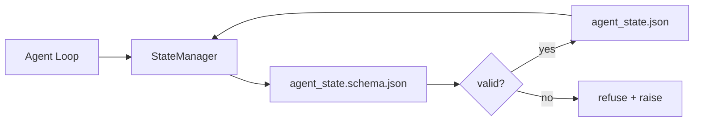

# الذاكرة و الحالة الدائمة

> تاريخ الدردشة هو سهل. . . . . . . . . . . . . . . . . . . . . . . . . . . . . . . . . . . . . . . . . . . . . . . . . . . . . . . . . . . . . . . . . . . . . . . . . . . . . . . . . . . . . . . . . . . . . . . . . . . . . . . . . . . . . . . . . . . . . . . . . . . . . . . . . . . . . . . . . . . . . . . . . . . . . . . . . . . . . . . . . . . . . . . . . . . . . . . . . . . . . . . . . . . . . . . . . . . . . . . . . . . . . . . . . . . . . . . . . . . . . . . . . . . . . . . . . . . . . . . . . . . . . . . . . . . . . . . . . . . . . . . . . . . . . . . . . . . . . . . . . . . . . . . . . . . . . . . . . . . . . . . . . . . . . . . . . . . . . . . . . . . . . . . . . . . . . . . . . . . . . . . . . . . . . . . . . . . . . . . . . . . . . . . . . . . . . . . . . . . . . . . . . . . . . . . . . . . . . . . . . . . . . . . . . . . . . . . . . . . . . . . . . . . . . . . . . . . . . . . . . . . . . . . . . . . . . . . . . . . . . . . . . . . . . . . . . . . . . . . . . . . . . . . . . . . . . . . . . . . . . .

**Type:** Build
**Languages:** Python (stdlib + `jsonschema` optional)
**Prerequisites:** Phase 14 · 32 (Minimal Workbench)
**Time:** ~60 minutes

## 學习目标
- 定义什么属于 repo memory,什么属于聊天历史.
- لأجل`agent_state.json`和 `task_board.json`编写 JSON Schemas──
- بناء مدير دولة، للاستخدام في تحميل التحقق والتغييرات والتحقيقات النووية.
- استخدام النظام في خراب写入破坏 workbench قبل رفضها.

## 问题
العميل  أنهى جلسة واحدة. دردشة  أغلقها. الجلسة التالية  فتحها و تسأل عن أين تبدأ. النموذج يقول  دعني أبحث في الملفات، وقراءة الملاحظات السابقة، ثم إعادة إعادة إعادة إتمام العمل.

طريقة تعديل لوحة العمل هي ذاكرة الاحتفاظ:الوضع 存在 repo 中的 JSON 文件里, حسب النظام 写入,以原子方式持久化,并且在代码审查中对对差友好──聊天是临时的;repo 是系统记录──

## 概念


### ما هو ذاكرة الاحتفاظ

| 属于 | 不属于 |
|---------|-----------------|
| Active task id | 原始 chat transcripts |
| 本 session 触碰过的文件 | Token-level reasoning traces |
| agent 做出的假设 | "The user seemed frustrated" |
| 未解决的 blockers | Sampled completions |
| 下一步 action | Vendor-specific model ids |

المعايير الحاكمة هي استمرارية: بعد ثلاثة أشهر في إعادة تشغيل CI، هل هذا مفيد أيضا؟ إذا كان، ضع في إعادة التأمين.

### النظام الأول

مخطط JSON هو اتفاق. لا يوجد هناك، كل عميل سوف يطور حلقة جديدة، كل مراجعة يجب أن تتعلم شكل جديد، كل نص CI يجب أن يكون حالة خاصة على الإصدار السابق.

مخطط 覆盖:

- ضرورة مفاتيح
- 允许的 `status`القيم
- 禁止的值(مثلاً صفوف`null`(‬)
- القيود النمطية`T-\d{3,}`(‬)
- تستخدم في مجال الإصدارات الهجرة

### "أتوميك" كتب

النظام 写入需要能承受部分失败:写入 tempfile,fsync, ثم إعادة تسمية 覆盖 هدف.

### الهجرة

عندما يتغير النظام، في تعطل النظام 旁边交付一个迁移脚本――状态文件 带有 带有 `schema_version`المدير سوف يرفض تحميل إصدار غير قابل للتحريك.


```figure
wb-state-persist
```

## بناءها
`code/main.py`实现:

- `agent_state.schema.json`和 `task_board.schema.json`.
- واحد فقط استخدام مؤكد stdlib ((JSON Schema 子集: مطلوب 、نوع 、enum、نموذج、عناصر) 
- مع وجود طاقة نووية و اسم جديد`StateManager.load`.`StateManager.update`.`StateManager.commit`.
- إثبات: تغير الحالة 持久化 重新حملها,并证明 ذهابًا وإيابًا

运行它:

```
python3 code/main.py
```

النص 会写入 `workdir/agent_state.json`和 `workdir/task_board.json`، عبر اثنين من التحولات  تغيرها ، و في كل خطوة طباعة من خلال حالة التحقق

## نمط الإنتاج في المشهد الحقيقي

أربعة أنماط يمكن أن تحويل هذا الدراسة إلى الحد الأدنى إلى أكثر وكلاء من الجهاز الواحد يمكن تحملها.

**Atomic temp-and-rename 不是可选项。**في 3 مايو 2026 ، أعلن تقرير خطأ في مشروع "هيف" عن هذا النظام الفاشل:`state.json` من خلال `write_text()`写入,并且例外 被捕后静默忽略──部分写入让会议在没有信号的情况下基于损坏状态 恢复──修复永远是:在与目标相似的目录中使用`tempfile.mkstemp`, كتابة ,`fsync`،`os.replace`(في POSIX و Windows 上 هم إعادة تسمية الذرية)`atomic_write`هذا ما تفعله

**每个非幂等 tool call 都要有 idempotency keys。**إذا كان العميل في استخدام الوسيلة  بعد checkpoint  نتائج قبل انهيار، عملية الاسترداد سوف تستجرب مرة أخرى هذه الدعوة الوسيلة  على قراءة آمنة ؛ على رسائل البريد الإلكتروني  إدخالات البيانات البيانية  تحميل الملفات  خطر `pending_calls.jsonl`重试时检查该 ID; إذا كان هناك،跳过调用并使用缓存结果──Anthropic 和 LangChain 都指出这一点 في توجيهات 2026؛ نقطة التفتيش لـ LongGraph من نفس السبب استمرار المنتظر الكتابات──

**将大型 artifacts 与 state 分离。**لا تضع CSVs 长 النصوص أو الملفات المولدة 存储进`agent_state.json` سوف الاحتفاظ بالأثاث للفيل الوحيد أو الوصول إلى مخزن الكائنات ،الوضع الوسط فقط الاحتفاظ بالطريق.

**Event sourcing 用于 audit，snapshots 用于 resume。**كل طفرة تُضاف إلى سجل الحدث`state.events.jsonl`); تصويرات دقيقة منتظمة إلى `state.json`✿ سيرتك الذاتية 读取快照, ثم تعيد عرض اللقطة 之后的所有 الأحداث ✿ هذا سوف يستهلك المزيد من الأقراص, ولكن يسمح لك بتحديد قرارات وكيل التمثيل, هذا على المدى الطويل من الجولات 至关重要✿ Postgres 内部用于 WAL أيضا نفس الشكل‬‬‬‬‬‬‬‬‬‬‬‬‬‬‬‬‬‬‬‬‬‬‬‬‬‬‬‬‬‬‬‬‬‬‬‬‬‬‬‬‬‬‬‬‬‬‬‬‬‬‬‬‬‬‬‬‬‬‬‬‬‬‬‬‬‬‬‬‬‬‬‬‬‬‬‬‬‬‬‬‬‬‬‬‬‬‬‬‬‬‬‬‬‬‬‬‬‬‬‬‬‬‬‬‬‬‬‬‬‬‬‬‬‬‬‬‬‬‬‬‬‬‬‬‬‬‬‬‬‬‬‬‬‬‬‬‬‬‬‬‬‬‬‬‬‬‬‬‬‬‬‬‬‬‬‬‬‬‬‬‬‬‬‬‬‬‬‬‬‬‬‬‬‬‬‬‬‬‬‬‬‬‬‬‬‬‬‬‬‬‬‬‬‬‬‬‬‬‬‬‬‬‬‬‬‬‬‬‬‬‬‬‬‬‬‬‬‬‬‬‬‬‬‬‬‬‬‬‬‬‬‬‬‬‬‬‬‬‬‬‬‬‬‬‬‬‬‬‬‬‬‬‬‬‬‬‬‬‬‬‬‬‬‬‬‬‬‬‬‬‬‬‬‬‬‬‬‬‬‬‬‬‬‬‬‬‬‬‬‬‬‬‬‬‬‬‬‬‬‬‬‬‬‬‬‬‬‬‬‬‬‬‬‬‬‬‬‬‬‬‬‬‬‬‬‬‬‬‬‬‬‬‬‬‬‬‬‬‬‬‬‬‬‬‬‬‬‬‬‬‬‬‬‬‬‬‬‬‬‬‬‬‬‬‬‬‬‬‬‬‬‬‬‬‬‬‬‬‬‬‬‬‬‬‬‬‬‬‬‬‬‬‬‬‬‬‬‬‬‬‬‬‬‬‬‬‬‬‬‬‬‬‬‬‬‬‬‬‬‬‬‬‬‬‬‬‬‬‬

**Schema migrations，否则拒绝加载。** `schema_version`عدد هو اتفاق. عندما يقوم المدير بتحميل نسخة غير معروفة من الملفات، فإنه سوف يرفض القراءة.`tools/migrate_state.py`في كل بداية عمل

## استخدمها
في الإنتاج:

- **LangGraph checkpointers。**نفس الفكرة، مختلفة التخزين. ستقوم نقطة التفتيش بتحقيق حالة الرسم البياني. ستتم استمرارها إلى SQLite. Postgres أو الخلفية المخصصة.
- **Letta memory blocks。**مع الكتل المستمرة من المخططات المهيكلة (مرحلة 14 · 08)  نفس القانون، والوصول إلى شخصيات طويلة الأمد
- **OpenAI Agents SDK session store。**الملفات الخلفية المضافة، المخططات المعرفة.

## 交付 it
`outputs/skill-state-schema.md`会生成一对项目特定 JSON Schema(state + board) 、一个连接到原子写的 Python `StateManager`، وسلطة الهجرة، تأكد من أن المخططات التالية لن تسبب في تدمير مقعد العمل

## التدريب
1. إضافة واحدة`last_human_touch`طابع زمني. رفض التحرير البشري.
2. 扩展 اعتبار 以支持 `oneOf`، مثل هذه المهمة يمكن أن تكون مهمة بناء، أو يمكن أن تكون مهمة مراجعة، وكل منهما لديهما مجالات مختلفة مطلوبة.
3. إضافة`schema_version`المجال،并编写从v1到v2的迁移(将 `blockers`重命名为`risks`(‬)
4. سوف تخزين الخلفية من الملف المحلي  تحويل إلى SQLite ‬‬‬‬‬‬‬‬‬‬‬‬‬‬‬‬‬‬‬‬‬‬‬‬‬‬‬‬‬‬‬‬‬‬‬‬‬‬‬‬‬‬‬‬‬‬‬‬‬‬‬‬‬‬‬‬‬‬‬‬‬‬‬‬‬‬‬‬‬‬‬‬‬‬‬‬‬‬‬‬‬‬‬‬‬‬‬‬‬‬‬‬‬‬‬‬‬‬‬‬‬‬‬‬‬‬‬‬‬‬‬‬‬‬‬‬‬‬‬‬‬‬‬‬‬‬‬‬‬‬‬‬‬‬‬‬‬‬‬‬‬‬‬‬‬‬‬‬‬‬‬‬‬‬‬‬‬‬‬‬‬‬‬‬‬‬‬‬‬‬‬‬‬‬‬‬‬‬‬‬‬‬‬‬‬‬‬‬‬‬‬‬‬‬‬‬‬‬‬‬‬‬‬‬‬‬‬‬‬‬‬‬‬‬‬‬‬‬‬‬‬‬‬‬‬‬‬‬‬‬‬‬‬‬‬‬‬‬‬‬‬‬‬‬‬‬‬‬‬‬‬‬‬‬‬‬‬‬‬‬‬‬‬‬‬‬‬‬‬‬‬‬‬‬‬‬‬‬‬‬‬‬‬‬‬‬‬‬‬‬‬‬‬‬‬‬‬‬‬‬‬‬‬‬‬‬‬‬‬‬‬‬‬‬‬‬‬‬‬‬‬‬‬‬‬‬‬‬‬‬‬‬‬‬‬‬‬‬‬‬‬‬‬‬‬‬‬‬‬‬‬‬‬‬‬‬‬‬‬‬‬‬‬‬‬‬‬‬‬‬‬‬‬‬‬‬‬‬‬‬‬‬‬‬‬‬‬‬‬‬‬‬‬‬‬‬‬‬‬‬‬‬‬‬‬‬‬‬‬‬‬‬‬‬‬‬‬‬‬‬‬‬‬‬‬‬‬‬‬‬‬‬‬‬‬‬‬‬‬‬‬‬‬‬‬‬‬‬‬‬‬‬‬‬‬‬‬‬‬‬‬‬‬‬‬‬‬‬‬‬‬‬‬‬‬‬‬‬‬‬‬‬‬‬‬‬‬‬‬‬‬`StateManager`نسبة الإستجابة لا تتغير
5. دع عملاء اثنين يكتبون في 50 ثانية في نفس الوقت في نفس الملف

## 关键术语
| Term | What people say | What it actually means |
|------|----------------|------------------------|
| Repo memory | "Notes file" | 按 schema 存储在 repo 的 tracked files 中的 state |
| Schema-first | "Validate inputs" | 先定义契约再写 writer，拒绝漂移 |
| Atomic write | "Just rename" | 写入 temp，fsync，rename，因此 partial failures 无法破坏 |
| Migration | "Schema bump" | 将 vN state 转换为 v(N+1) state 的 script |
| System of record | "Source of truth" | workbench 视为权威的 artifact |

## 延伸阅读
- [JSON Schema specification](https://json-schema.org/specification.html)
- [LangGraph checkpointers](https://langchain-ai.github.io/langgraph/concepts/persistence/)
- [Letta memory blocks](https://docs.letta.com/concepts/memory)
- [Fast.io, AI Agent State Checkpointing: A Practical Guide](https://fast.io/resources/ai-agent-state-checkpointing/) التفتيش الأول للخطط
- [Fast.io, AI Agent Workflow State Persistence: Best Practices 2026](https://fast.io/resources/ai-agent-workflow-state-persistence/) التحكم في التزامن TTL ‬التمويل من الأحداث
- [Hive Issue #6263 — non-atomic state.json writes silently ignored](https://github.com/aden-hive/hive/issues/6263) النظام الفشل في المشروع الحقيقي
- [eunomia, Checkpoint/Restore Systems: Evolution, Techniques, Applications](https://eunomia.dev/blog/2025/05/11/checkpointrestore-systems-evolution-techniques-and-applications-in-ai-agents/) من نظام التشغيل 历史 应用于 وكلاء من CR البدائيات
- [Indium, 7 State Persistence Strategies for Long-Running AI Agents in 2026](https://www.indium.tech/blog/7-state-persistence-strategies-ai-agents-2026/)
- [Microsoft Agent Framework, Compaction](https://learn.microsoft.com/en-us/agent-framework/agents/conversations/compaction)مدير نقطة التفتيش للمبيع
- المرحلة 14 · 08  كتلة الذاكرة وحساب وقت النوم
- المرحلة 14 · 32  本课为其方案的三档最小
- المرحلة 14 · 40  من نفس النظام 读取的交付包
