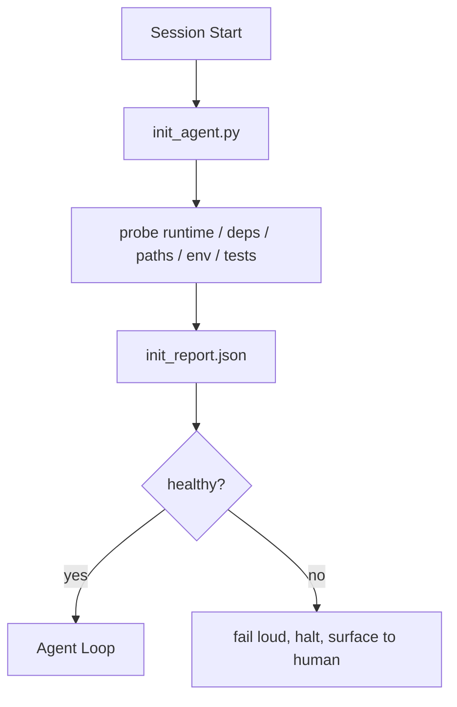

# كتابة المُبتكرة للعميل

> كل جلسة بدء بارد يجب أن تدفع ثمنها. العميل سوف يقرأ نفس الملفات، ويعيد تجربة نفس البحث، ويعيد اكتشاف نفس الطريق.

**Type:** Build
**Languages:** Python (stdlib)
**先修要求：**المرحلة 14 · 32 (أقل سطح عمل) ، المرحلة 14 · 34 (ذاكرة الإبلاغ)
**Time:** ~45 分钟

## 學习目标
- وكيل التعرف لا ينبغي أن يكرر العمل في كل جلسة
- بناء رسم الخط الأولي المحدد، لتحقيق وقت تشغيل تعتمدات ووضع الردود
- 持久化查查结果, دع العميل 读取它, بدلا من إعادة تشغيل المراقبة
- عندما يفشل الإبتدائية، يجب أن تكون سريعة، بسرعة، وفشل، وتوفير الموقع الوحيد للبحث.

## 问题
打开一个会议──Agent 猜测 Python version──Guess test command──为了 العثور على نقطة الدخول،列出 repo root 五次──尝试 import 一个尚未安装的包──询问用户配置文件 在哪里──等到它真正开始编辑时,已经有十万代币花在本应由一个脚本完成的设置工作 上──

修复方式是使用一个初始化脚本: انها تعمل قبل عميل القيام بأي شيء,并写入一个供 عميل 启动时读取的 `init_report.json`.

## 概念


### النص المبدئي 探查什么

| Probe | 为什么重要 |
|-------|------------|
| Runtime versions | 错误的 Python 或 Node version 意味着悄无声息的错误版本 bug |
| Dependency availability | 缺失的 package 如果到后面才发现，成本会是现在捕获它的十倍 |
| Test command | Agent 必须知道如何 verify；如果 command 缺失，workbench 就坏了 |
| Repo paths | Hard-coded paths 会漂移；一次性解析并固定下来 |
| Environment variables | 缺失 `OPENAI_API_KEY` 是一个 failure surface，而不是 runtime mystery |
| State + board freshness | 崩溃 session 留下的陈旧 state 是一个 footgun |
| Last-known-good commit | 作为 session 结束时 handoff diff 的锚点 |

### فاشل بشكل سريع، ومركز في نقطة واحدة

الفشل يعني التوقف عن التقدم إلى الإنسان. لا تقل: العميل سوف يوضح نفسه.

### غير قادر

连续运行两次──第二次除刷新时间打印 之外应该是没有开放――                                                                                                                                                                                                                                                   

### القواعد البدائية مقابل القواعد الإبتدائية

القواعد (المرحلة 14 · 33) 描述行动前必须满足什么――الابتكار هو إنشاء هذه القواعد يمكن فحصها كتبها―― بدون قواعد سوف تصبح要小心── بدون قواعد سوف تصبح ابتداء ناجحة فاشلة──


```figure
wb-init-probes
```

## بناءها
`code/main.py`تم تحقيقها`init_agent.py`:

- خمسة صواريخ: نسخة بيتون`importlib.util.find_spec`تعتمدات التسجيلات  قابلية تحديد القيادة الاختبارية ‬المحيط المطلوب ‬تجديد الملفات الحكومية‬‬
- كل صفقة تعود`(name, status, detail)`.
- الكتاب الكتابي يحتوي على مجموعة كاملة من المختبرين`init_report.json`، و في أي مسألة صرامة كتلة  فشل عندما إلى حالة غير صفر

运行它:

```
python3 code/main.py
```

脚本会打印探表,写入 `init_report.json`، في الطريق السعيد إرجاع إلى حالة صفر، أو إرجاع إلى حالة غير صفر في حالة الفشل وإعداد اختبارات فشلتها.

## نمط الإنتاج في المشهد الحقيقي

ثلاثة أنماط يمكن أن تفرق بين النص المفيد و الإرث

**Last-known-good commit anchoring.**سوف تتعهد حاليا مع الاندماج الناجح السابق`LKG`الملفات  إجراء البحث. إذا كان الاختلاف  تجاوز الميزانية (默认 50 文件) ، رفض الإطلاق،并要求 البشر 确认新基线── هذا هو مراجعة AI Code Review of Cloudflare باستخدام الجهاز المحدد للمراجعة 作用域: كل جلسة مراجعة تم تحديدها إلى نفس المعلم الأخير، لن تتجاوز الجلسات 叠加漂移──

**Lock files with TTL.**في أول نجاح في التحقيقات بعد مرور`prereqs.lock`◊ بعد运行会在 N 小时内信任该锁(默认 24h),并跳过昂贵的探测.

**No network, no LLM, no surprises in the hot path.**أجهزة التحقيقات الأولى هي التوصيلات التدريجية. تدعو لـ LLM لتصنيف الفشل، أو زيارة الخدمة الخارجية.

## استخدمها
في الإنتاج:

- **Claude Code hooks.** `pre-task`و عندما يفشل رفض تشغيل العميل
- **GitHub Actions.** `setup-agent`العمل 运行 init script; عميل العمل يعتمد عليه
- **Docker entrypoint.**حاوية العميل في وقت تشغيل العميل التنفيذي 之前运行 init script;失败时呈现日志──

النص الإصطناعي هو قابل للاستقالة، لأنه لا يستخدم أي إطار محدد. البش.

## 交付 it
`outputs/skill-init-script.md`المشاريع المقابلة، وتشغيل أعمالها التأسيسية، وتفصيلها للقياسات، ومصدرها للمشاريع المحددة.`init_agent.py`، و أيضاً عملية عمل المعلومات قبل أن تقوم بأي خطوة من العملاء

## التدريب
1. إضافة مسح، لتمييز الالتزام السابق و آخر معروف جيد الالتزام؛ إذا كان التغيير أكثر من 50 ملف، فإن رفض تشغيلها.
2. سوف يكتب الكتابة، وجعل الكتابة.`prereqs.lock`الملف، وقفل أكثر من 7 أيام رفض تشغيلها
3. إضافة واحدة`--fix`العلم، تلقائيًا تثبيت غياب اعتمادات المطور، ولكن غير المعتمدة لا تغير أبداً اعتمادات وقت التشغيل.
4. سوف نقوم بتحويل المسحات من وظائف مشفرة إلى سجل YAML
5. كل صفقة تُضيف ميزانية توقيتها.

## 关键术语
| Term | 人们会怎么说 | 它实际意味着什么 |
|------|--------------|------------------|
| Probe | “一个 check” | 返回 `(name, status, detail)` 的确定性函数 |
| Init report | “Setup output” | 与 state 放在一起、写有 probe results 的 JSON |
| Idempotent | “可以安全重新运行” | 连续两次运行会生成除 timestamp 外完全相同的 reports |
| Fail loud | “不要吞掉” | 停止并呈现给 human；没有 silent fallback |
| Setup tax | “Bootstrap cost” | Agent 每个 session 为重新发现显而易见信息所花费的 Token |

## 延伸阅读
- [Anthropic, Effective harnesses for long-running agents](https://www.anthropic.com/engineering/effective-harnesses-for-long-running-agents)
- [GitHub Actions, composite actions for setup](https://docs.github.com/en/actions/sharing-automations/creating-actions/creating-a-composite-action)
- [microservices.io, GenAI 开发平台：guardrails](https://microservices.io/post/architecture/2026/03/09/genai-development-platform-part-1-development-guardrails.html) التزام مسبق + CI 检查作为 init
- [Augment Code, How to Build Your AGENTS.md (2026)](https://www.augmentcode.com/guides/how-to-build-agents-md) توقعات init
- [Codex Blog, Codex CLI Context Compaction](https://codex.danielvaughan.com/2026/03/31/codex-cli-context-compaction-architecture/) بدء جلسة كـ " init " ذو الاكتئاب
- المرحلة 14 · 33  هذا الكتاب تعيين القواعد المستخدمة
- المرحلة 14 · 34  此脚本播种的状态文件
- المرحلة 14 · 38  النص الإبتدائي  إمدادات بوابة التحقق
- المرحلة 14 · 40  消费 init تقرير آخر معروف جيد
