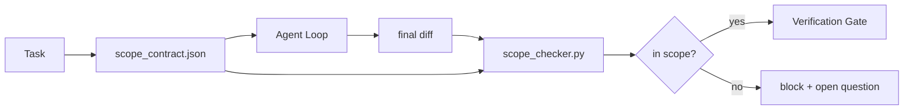

# المجال المطلوب من العقد ومحدود المهام

> النموذج لا يعرف العمل في أي مكان ينتهي. العقد هو ملف لكل مهمة، لتوضيح العمل من أين يبدأ.

**类型:**بناء
**语言:**Python (stdlib)
**先修:**المرحلة 14 · 32 (أقل عدد من الموظفين) ، المرحلة 14 · 33 (قواعد كقيود)
**时间:**~ 50 دقيقة

## 學习目标

- إعداد عقد المجال، دع العميل في البدء في المهمة، و جعل المؤكد في نهاية المهمة،
- تحديد الملفات المسموح بها، الملفات المحظورة، معايير القبول، خطة إعادة التأثير، وحدود الموافقة.
- تنفيذ فحص النطاق، سوف تختلف عن العقد مقارنة ومع تعليق انتهاكها.
- 让范围 creep可见、自动化且可审查──

## 问题

المهمة هي إصلاح خطأ تسجيل الدخول ──diff 触碰了登录路线、邮件助手、数据库驱动程序、README 和发布脚本──每次触碰在那时都有一个看似合理的理由──一起,它们已经变得不同于原本评论的内容的变化──

المجال المزعج هو أكثر حالة فشل من غير مراقبة في العمل ، لأن العميل سوف يروي بكل صدق كل خطوة.

## 概念



### المجال العقد

| Field | Purpose |
|-------|---------|
| `task_id` | 链接到 board 上的 task |
| `goal` | reviewer 可以验证的一句话 |
| `allowed_files` | agent 可以写入的 globs |
| `forbidden_files` | agent 即使意外也不得触碰的 globs |
| `acceptance_criteria` | 证明完成的 test commands 或 assertion lines |
| `rollback_plan` | 如果需要 halt，operator 可以执行的一段说明 |
| `approvals_required` | scope 外需要明确 human sign-off 的 actions |

لا يوجد`forbidden_files`العقد غير كامل.

### استخدام الكرات، وليس المسارات الخام

"أجل" "أجل" "أجل" "أجل" "أجل"`app/**/*.py`،`tests/test_signup*.py`), مثل هذه الجلسة 之间发生 refactor 时不会让合同 失效──

### الردفوع هو جزء من النطاق

列出如何滚回会迫使合同作者 思考可能出什么问题──不能滚回的合同是不应批准的合同──

### تحقق النطاق هو التحقق من الاختلاف

وكيل 写出 diff―checker 读取 diff―allowed globs、forbidden globs، فضلا عن قائمة لأي أوامر قبول تم تنفيذها. كل انتهاك كان هناك إكتشاف من علامة التحقق، بوابة التحقق يمكن رفضها.

### نطاق المجال: قائمة الميزات وعقد المهام

المجال المشترك هو مهمة واحدة. لا يقتصر على المشاريع بأكملها. يمكن للعميل أن يترك في المجال المحدد. ولكن المرحلة التالية من المشاريع تحتاج إلى صفحات الإعدادات.

الثانية تتطلب نفسها بدائية: جلسة`feature_list.json`هو مخزون مشروعات الخرق `status`لأجل`todo`من الميزة، ضعها`id`写入活范围合同,并被禁止在同一个会议中启动第二个功能──一次只做一个功能 不再是提示里代理可以绕过一句话,而一个写在磁盘上的值,也是门可以执行检查──

```json
{
  "project": "knowledge-base",
  "active": "import-pdf",
  "features": [
    { "id": "import-pdf", "status": "in_progress", "goal": "import a PDF into the library", "done_when": "pytest tests/test_import.py && a sample PDF appears in the library view" },
    { "id": "full-text-search", "status": "todo", "goal": "search document text and rank hits", "done_when": "query returns ranked results with snippets" },
    { "id": "cite-answers", "status": "todo", "goal": "answers carry source citations", "done_when": "every answer renders at least one clickable citation" }
  ]
}
```

| Field | Purpose |
|-------|---------|
| `active` | 当前 session 唯一允许触及的 feature；为空时表示选择一个并设置它 |
| `features[].id` | scope contract 的 `task_id` 指向的稳定 slug |
| `features[].status` | `todo`、`in_progress`、`done`、`blocked`；同一时间最多一个 `in_progress` |
| `features[].goal` | reviewer 能验证的一句话 |
| `features[].done_when` | 将 `in_progress` 翻转为 `done` 的 acceptance line |

两条规则让这个名单成为承重结构,而不是装饰.`at most one in_progress`هذا الثابت 本身就是 الافتتاح التحقق ((مرحلة 14 · 33): إذا ظهرت قائمة 里 اثنين، جلسة سوف ترفض البدء، حتى البشر  حل.`done`لذا، عندما تفتح الجلسة التالية، نرى اللوحة المحددة، بدلاً من إعادة التوصيل

العقد مع القائمة 通過 الأقل امتيازات 组合,方式与下文描述的融合 相同:مهمة عقد `allowed_files`يجب أن تقع في الميزة النشطة داخل نطاق الملموس، لا يمكن أن تتجاوز الحدود.


```figure
wb-scope-bounce
```

## بناءها

`code/main.py`实现:

- `scope_contract.json`schema(JSON Schema 的子集,全球阵列)。
- واحد مختلف المصفح ، سوف تلمس الملفات  قائمة وتشغيل الأوامر  قائمة تحويل إلى `RunSummary`.
- واحد`scope_check`، وفقاً للعقد`(violations, in_scope, off_scope)`.
- تم تشغيل إثنين من المشاهدات: واحد يبقى في نطاق، الآخر يحدث التشويش.

运行:

```
python3 code/main.py
```

الإصدار: العقد، الجريمتين، الحكم في كل جريمتين، والحفظ`scope_report.json`.

## النماذج في الإنتاج الحقيقي

واحد من ممارسي عمل specsmaxxing(في المستخدمين قبل استخدام عقود نطاق YAML)                                                                                                                                                                                                                                                                                                                                                                                                                                                                                                

**Violation budgets，而不是 binary failures。** `agent-guardrails`(كلود كودكورس ويندسرف كودكس عبر MCP استخدام بوابة دمج OSS) لكل مهمة`violationBudget`: النشرات الخفيفة في الميزانية سوف تكون تحذيرات  معرضة؛ فقط فوق الميزانية، بوابة الاندماج 才会拒绝──搭配 `violationSeverity: "error" | "warning"`استخدامها. هذا الميزانية التي تحدد إذا كان سيتم اعتمادها، أو سيتم كرهتها فريقها.

**按 path family 做 severity asymmetry。**على`docs/**`يكتب خارج نطاق العادة هو`warn`؛对 `scripts/**`.`migrations/**`.`config/prod/**`يكتب خارج نطاق 总是 `block` يجب أن تكون هذه التناظرة في العقد، وليس في الوقت المحدد، لأنه محدد للمشروع، وكل مهمة تتغير.

**Time 和 network budgets 与 file budgets 并列。** `time_budget_minutes`المجال 约束 ساعة الجدار؛ الوقت التشغيلي في حالة عدم إعادة الموافقة رفضوا مواصلة تجاوزها.`network_egress`الموافقة  منع وكيل  الوصول لا ينتمي إلى API خارجية المهمة .

**Multi-contract merge semantics（least privilege）。**عندما تكون عقدين في نطاق محدد مع الوقت المناسب عندما يتم استخدامها على نطاق واسع مثل عقد على مستوى المشروع بالإضافة إلى عقد محدد للمهام، يتم دمجها  قواعد هي:**intersect** `allowed_files`(عقدين يجب أن يسمحوا بهذه المسار)**union** `forbidden_files`(أي واحد يمكن منع) ،`time_budget_minutes`取最严格值 (((min) ،`approvals_required`جمعها`network_egress`في وسط`None`عدم التنفيذ`[]`أظهر أن النكره كلها`[...]`表示 Allowlist;merge 时,`None`让位于另一边,两个列表取交集,拒绝-所有 保持否认-所有.

## استخدمها

أنماط الإنتاج:

- **Claude Code slash commands.** `/scope`أمر 写入合同,并将其固定为会议背景──Subbagents 在行动前读取合同──
- **GitHub PRs.**سوف تعاقد 作为 JSON file 推送到PR body 中,或作为已注册文物──CI 会针对合并不同运行范围检查器──
- **LangGraph interrupts.**انتهاك النطاق 触发中断;مدير المراقبة 询问人 是需要扩大合同,还是代理 需要后退──

العقد مع المهمة 流转. عندما تكون المهمة مغلقة، العقد سوف يصل إلى الملف`outputs/scope/closed/`.

## 交付 it

`outputs/skill-scope-contract.md`سوف تصنع وصف المهمة عقد نطاق، فضلا عن عالم يمكن أن يشعر، والتحقق من كل عامل مختلفة في المعلومات الإحصائية.

## التدريب

1. إضافة واحدة`network_egress`المجال,列出允许的外部主机──拒绝触碰其他主机的运行──
2.  التوسع المحقق، جعله على `docs/**`软失败 对 `scripts/**`硬失败──说明 سبب هذه التناظر
3. استخدام القاعدة ثابتة المحددة (((不使用 LLM) جعل العقد من `goal`الحقل 推导 `allowed_files`ـ أول قضية حافة ـ ماذا ستحدث؟
4. إضافة`time_budget_minutes`و و على الساعة الجدارية
5. عندما يكون كل منهما مناسبًا ، ما هو المعنى الحقيقي للدمج؟

## 关键术语

| Term | What people say | What it actually means |
|------|----------------|------------------------|
| Scope contract | “任务 brief” | per-task JSON，列出 allowed/forbidden files、acceptance、rollback |
| Scope creep | “它还 touched 了...” | 同一 task 中发生了 contract 外的文件变更 |
| Rollback plan | “我们可以 revert” | 用于 halt 的一段 operator runbook |
| Approval boundary | “需要 sign-off” | contract 中列出的、需要明确 human approval 的 action |
| Diff check | “Path audit” | 将 touched files 与 contract globs 比较 |

## 延伸阅读

- [LangGraph human-in-the-loop 中断](https://langchain-ai.github.io/langgraph/concepts/human_in_the_loop/)
- [OpenAI Agents SDK tool approval policies](https://platform.openai.com/docs/guides/agents-sdk)
- [logi-cmd/agent-guardrails — merge gates 与 scope validation](https://github.com/logi-cmd/agent-guardrails) ميزانيات الانتهاكات
- [Dev|Journal, Preventing AI Agent Configuration Drift with Agent Contract Testing](https://earezki.com/ai-news/2026-05-05-i-built-a-tiny-ci-tool-to-keep-ai-agent-configs-from-drifting-in-my-repo/) 无 خارجية deps 的 `--strict`النظام
- [Agentic Coding Is Not a Trap (production logs)](https://dev.to/jtorchia/agentic-coding-is-not-a-trap-i-answered-the-viral-hn-post-with-my-own-production-logs-33d9) إيرادات التفاصيل:52% → 21%
- [OpenCode permission globs](https://opencode.ai/docs/agents/) 细粒度 من أجل الإذن
- [Knostic, AI Coding Agent Security: Threat Models and Protection Strategies](https://www.knostic.ai/blog/ai-coding-agent-security)  كمقل من الامتيازات جزء من نطاق
- [Augment Code, AI Spec Template](https://www.augmentcode.com/guides/ai-spec-template) نظام حدود ثلاثى المستويات ((يجب/سأل/لا)
- المرحلة 14 · 27  مع قفل النطاق 配套的快速注射防御
- المرحلة 14 · 33  هذا العقد  للكل مهمة  مجموعة من القواعد المخصصة
- المرحلة 14 · 38  المحقق 汇报 دخول بوابة التحقق
