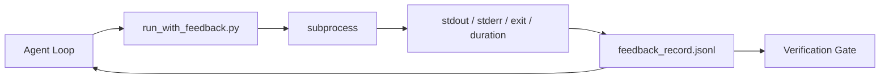

# حلقات ردود الفعل في الوقت الذي يتم تشغيلها فيه

> انظر لا يصل إلى إنتاج الأوامر الحقيقية من العميل فقط يمكن أن تخمين. راني ردود الفعل سوف يضع stdout ̊stderr ̊ الخروج رمز و توقيت ‬القبض على سجلات هيكلية، لدورة التالية.

**Type:** Build
**Languages:** Python (stdlib)
**先修要求：**المرحلة 14 · 32 (أقل سطح عمل) ، المرحلة 14 · 35 (مخطط بداية)
**Time:** ~50 minutes

## 學习目标
- 区分运行时间反与可观度远程测量──
- بناء مدرب تعليق، باستخدامها حزمة أوامر القذيفة ومتابعة سجلات هيكلية مدمرة
- على نحو مؤكد قطع الناتج الكبير، دع الدورة تبقى في ميزانية رمزية داخل.
- عندما تفتقر الرجوع، رفضوا الدورة

## 问题
يقول العميل: "تعمل الاختبارات"......................................................................................................................................................................................................................................................................................................................................................................................................................................................................................................................................................................................................................................................................................................................................................................................................................................................................................................................................................................................................................................

سيقضي المدير المراجعة على هذا الفجوة. كل أمر تمر عبر المدير. يتم تنفيذها. كل سجل يحتوي على أمر.

## 概念


### سجل المراجعة

| Field | 为什么重要 |
|-------|----------------|
| `command` | 精确 argv，避免 shell expansion 意外 |
| `stdout_tail` | 最后 N 行，确定性截断 |
| `stderr_tail` | 最后 N 行，与 stdout 分开 |
| `exit_code` | 明确无歧义的成功信号 |
| `duration_ms` | 暴露缓慢探测和失控进程 |
| `started_at` | 用于 replay 的 timestamp |
| `agent_note` | Agent 写下的一行预期说明 |

### التقطيع هو بالتأكيد

50 MB من التسجيلات سوف تدمير الدورة.`...truncated N lines...`علامة؛ هذا هو التأكيد، لذلك نفس المخرجات总会产生 نفس السجل.

### ردود الفعل مقابل التلفاز

التلفازات (مرحلة 14 · 23,OTel GenAI) تستخدم للمشغلين البشريين عبر فترة مراجعة الجوائز.

### لا تعليقات على ذلك

إذا كان الجاري في المخرج القبض قبل الخروج، سجل سوف يحتوي`exit_code: null`和 `error: <reason>`◊ حلقة العملاء  يجب أن ترفض `null`لا يوجد خروج، لا تقدم


```figure
wb-feedback-loop
```

## بناءها
`code/main.py`实现:

- `run_with_feedback(command, agent_note)`:包装 `subprocess.run`, قبضة الموقف/الموقف/المخرج/مدة, قطع التأكد,并追加到 `feedback_record.jsonl`.
- واحد محمول صغير، سيقوم بتدفق JSONL إلى قائمة Python 中──
- إظهار، عمل ثلاثة أوامر ((نجاح، فشل، بطء) ، ومطبوع آخر سجل لكل أمر

运行:

```
python3 code/main.py
```

输出: ثلاث条 سجلات الملاحظات 会追加到 `feedback_record.jsonl`,并 inline 印每条的最后一条──跨多次重复运行尾这个文件,你可以看到循环如何积累──

## أنماط الإنتاج في الإنتاج الحقيقي

هناك ثلاثة أنماط يمكن أن يضغط الجاري إلى مستوى يمكن أن يصل إلى السطح.

**写入时 redaction，而不是读取时 redaction。**أي اتصال مع أي شخص أو سجلات من سجلاتهم قد يكتشف الأسرار.`^Bearer `.`password=`.`api[_-]?key=`.`AKIA[0-9A-Z]{16}`(أو إس)`xox[baprs]-`(سلاك) ‬‬‬‬‬‬‬‬‬‬‬‬‬‬‬‬‬‬‬‬‬‬‬‬‬‬‬‬‬‬‬‬‬‬‬‬‬‬‬‬‬‬‬‬‬‬‬‬‬‬‬‬‬‬‬‬‬‬‬‬‬‬‬‬‬‬‬‬‬‬‬‬‬‬‬‬‬‬‬‬‬‬‬‬‬‬‬‬‬‬‬‬‬‬‬‬‬‬‬‬‬‬‬‬‬‬‬‬‬‬‬‬‬‬‬‬‬‬‬‬‬‬‬‬‬‬‬‬‬‬‬‬‬‬‬‬‬‬‬‬‬‬‬‬‬‬‬‬‬‬‬‬‬‬‬‬‬‬‬‬‬‬‬‬‬‬‬‬‬‬‬‬‬‬‬‬‬‬‬‬‬‬‬‬‬‬‬‬‬‬‬‬‬‬‬‬‬‬‬‬‬‬‬‬‬‬‬‬‬‬‬‬‬‬‬‬‬‬‬‬‬‬‬‬‬‬‬‬‬‬‬‬‬‬‬‬‬‬‬‬‬‬‬‬‬‬‬‬‬‬‬‬‬‬‬‬‬‬‬‬‬‬‬‬‬‬‬‬‬‬‬‬‬‬‬‬‬‬‬‬‬‬‬‬‬‬‬‬‬‬‬‬‬‬‬‬‬‬‬‬‬‬‬‬‬‬‬‬‬‬‬‬‬‬‬‬‬‬‬‬‬‬‬‬‬‬‬‬‬‬‬‬‬‬‬‬‬‬‬‬‬‬‬‬‬‬‬‬‬‬‬‬‬‬‬‬‬‬‬‬‬‬‬‬‬‬‬‬‬‬‬‬‬‬‬‬‬‬‬‬‬‬‬‬‬‬‬‬‬‬‬‬‬‬‬‬‬‬‬‬‬‬‬‬‬‬‬‬‬‬‬‬‬‬‬‬‬‬‬‬‬‬‬‬‬‬‬‬‬‬‬‬‬‬‬‬‬‬‬‬‬‬‬‬‬‬‬‬‬‬‬‬‬‬‬‬‬‬‬‬‬‬‬‬‬‬‬‬‬‬‬‬‬‬‬‬‬‬‬‬‬‬‬‬‬‬‬‬‬‬‬‬‬‬‬‬‬‬‬‬‬‬‬‬‬

**Rotation policy，而不是单个文件。**ستعمل`feedback_record.jsonl`الحد لكل ملف 1 MB؛ وتسجيل التداول`.1`.`.2`، تخلّلت عنّي`.5`◦ حلقة العميل فقط يقرأ الملفات الحالية، لذلك تكلفة الوقت التشغيلي هناك حد.‬ تخزين الأثاث المتحركات المتحركة للحصول على مجموعة كاملة المتحركة.‬ بدون دوران.‬

**用于 retry chains 的 parent-command id。**كل سجل موجود`command_id`- إعادة التأثير`parent_command_id`، تُذكر محاولة واحدة على أعلى.

## استخدمها
أنماط الإنتاج:

- **Claude Code Bash tool。**هذا الأداة  لقد تم القبض على stdout stderr exit 和 duration‬‬‬‬‬‬‬‬‬‬‬‬‬‬‬‬‬‬‬‬‬‬‬‬‬‬‬‬‬‬‬‬‬‬‬‬‬‬‬‬‬‬‬‬‬‬‬‬‬‬‬‬‬‬‬‬‬‬‬‬‬‬‬‬‬‬‬‬‬‬‬‬‬‬‬‬‬‬‬‬‬‬‬‬‬‬‬‬‬‬‬‬‬‬‬‬‬‬‬‬‬‬‬‬‬‬‬‬‬‬‬‬‬‬‬‬‬‬‬‬‬‬‬‬‬‬‬‬‬‬‬‬‬‬‬‬‬‬‬‬‬‬‬‬‬‬‬‬‬‬‬‬‬‬‬‬‬‬‬‬‬‬‬‬‬‬‬‬‬‬‬‬‬‬‬‬‬‬‬‬‬‬‬‬‬‬‬‬‬‬‬‬‬‬‬‬‬‬‬‬‬‬‬‬‬‬‬‬‬‬‬‬‬‬‬‬‬‬‬‬‬‬‬‬‬‬‬‬‬‬‬‬‬‬‬‬‬‬‬‬‬‬‬‬‬‬‬‬‬‬‬‬‬‬‬‬‬‬‬‬‬‬‬‬‬‬‬‬‬‬‬‬‬‬‬‬‬‬‬‬‬‬‬‬‬‬‬‬‬‬‬‬‬‬‬‬‬‬‬‬‬‬‬‬‬‬‬‬‬‬‬‬‬‬‬‬‬‬‬‬‬‬‬‬‬‬‬‬‬‬‬‬‬‬‬‬‬‬‬‬‬‬‬‬‬‬‬‬‬‬‬‬‬‬‬‬‬‬‬‬‬‬‬‬‬‬‬‬‬‬‬‬‬‬‬‬‬‬‬‬‬‬‬‬‬‬‬‬‬‬‬‬‬‬‬‬‬‬‬‬‬‬‬‬‬‬‬‬‬‬‬‬‬‬‬‬‬‬‬‬‬‬‬‬‬‬‬‬‬‬‬‬‬‬‬‬‬‬‬‬‬‬‬‬‬‬‬‬‬‬‬‬‬‬‬‬‬‬‬‬‬‬‬‬‬‬‬‬‬‬‬‬‬‬‬‬‬‬‬‬‬‬‬‬‬
- **LangGraph nodes。**سوف يضع عقدة القذيفة المحتملة داخل المدير، دع سجلات تمتد في حالة الرسم البياني خارجها
- **CI logs。**إعادة تشغيل JSONL إلى متجر الأثاث الخاص بك؛ يمكن للمراجعين إعادة تشغيل أي أمر، دون الحاجة إلى إعادة تشغيل الجلسة.

الجاري هو حزمة ضئيلة؛ فإنه يمكن أن تمر كل هجرة الإطار، لأنه يتحكم في سجلات شكلها.

## 交付 it
`outputs/skill-feedback-runner.md`سوف تخلق مشروع محدد `run_with_feedback.py`يحتوي على ميزانية قصف صحيحة تصل إلى كاتب JSONL من سطح العمل، وكذلك وكيل كل دورة القراءة

## التدريب
1. لـ كل سجل`cwd`المجال، وبالتالي يمكن التمييز بين نفس الأوامر التي تعمل في مختلف المجلات.
2. إضافة واحدة`redaction`خطوة، التناسب`^Bearer `أو`password=`行──在固定记录 上测试──
3.                                                                                                                                                                                                                                                                                                                                                                                                                                                                                                                              `.1`.`.2`文件,将 `feedback_record.jsonl`总大小限制为 1 MB──为 دوران السياسة 辩护──
4. إضافة`parent_command_id`, دع سلسلة محاولة ثانية 可见: أي أمر  خلق القيادة التالية 消费的输入──
5. وضع أنبوب JSONL إلى تيوي صغير ، أحدث خروج غير صفر عالية الوضوح.

## 关键术语
| Term | 人们常说 | 实际含义 |
|------|----------------|------------------------|
| Feedback record | “Run log” | 包含 command、output、exit、duration 的结构化 JSONL entry |
| Tail truncation | “Trim the log” | 确定性 head+tail 捕获，让 records 适配 token budget |
| Refuse-on-null | “Block on missing data” | 当 `exit_code` 为 null 时，loop 不得推进 |
| Agent note | “Expectation tag” | Agent 在读取结果前写下的一行预测 |
| Telemetry split | “Two log files” | Feedback 用于下一轮，telemetry 用于 operator |

## 延伸阅读
- [OpenTelemetry GenAI semantic conventions](https://opentelemetry.io/docs/specs/semconv/gen-ai/)
- [Anthropic, Effective harnesses for long-running agents](https://www.anthropic.com/engineering/effective-harnesses-for-long-running-agents)
- [Guardrails AI x MLflow — deterministic safety, PII, quality validators](https://guardrailsai.com/blog/guardrails-mlflow) وضع أنماط التحرير  كمختبرات تراجع
- [Aport.io, Best AI Agent Guardrails 2026: Pre-Action Authorization Compared](https://aport.io/blog/best-ai-agent-guardrails-2026-pre-action-authorization-compared/) أداة 前/后捕获
- [Andrii Furmanets, 2026 年的 AI Agents：面向 Tools、Memory、Evals、Guardrails 的实用架构](https://andriifurmanets.com/blogs/ai-agents-2026-practical-architecture-tools-memory-evals-guardrails) قابلة للمشاهدة
- المرحلة 14 · 23  الاتفاقيات المتعلقة بالسيطرة التلفزيونية
- المرحلة 14 · 24  منصات مراقبة العاملين ((لانغفوز، فينيكس، أوبيك)
- المرحلة 14 · 33                                                                                                                                                                                                                                                                                                                                                                                                                                                                                                                      
- المرحلة 14 · 38  读取 JSONL بوابة التحقق
