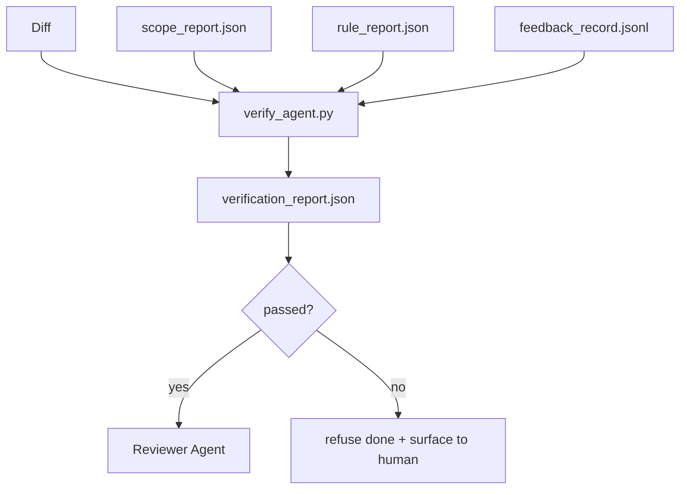

# بوابات التحقق

> وكيل غير قادر على وضع علامة على عمله لإنجازها.بوابة التحقق 会读取 scope contract、feedback log、rule report 和 diff،并回答一个问题: هل تم إنجاز هذه المهمة حقاً؟ إذا قال البوابة لا، فما كان في المحادثة، فإن المهمة لم يتم إنجازها.

**Type:** Build
**Languages:** Python (stdlib)
**Prerequisites:** Phase 14 · 33 (Rules), Phase 14 · 36 (Scope), Phase 14 · 37 (Feedback)
**Time:** ~55 分钟

## 學习目标
- سوف تحدد بوابة التحقق 定义为作用于工作桌文物的确定性函数──
- سوف تقرير القواعد , تقرير النطاق , سجلات الرجوع و اختلافات
- 输出 مراجعة وكيل و CI مدينة能读取 `verification_report.json`.
- إذا كان هناك أي فشل في الدرجة الحادة، فمن غير الاستثناء رفض العمل.

## 问题
العملاء 太容易宣称成功──三种失败形态最常见:

- يبدو خطأ. النموذج يقرأ اختلافه، ثم يقرأ أنه صحيح.
- 测试通过了──说得很自信──但没有测试实际运行的记录──
-  تلبية المعايير القبولية تم تفسيرها بسهولة بما فيه الكفاية، حتى يتم إتمام أي شيء مثل ما تم إنجازه 

طريقة تعديل لوحة العمل هو بوابة التحقق ، فإنها تقرأ وكيل 已生成的文物并作出判断──بوابة 是确定性的──بوابة 受版本控制 管理──بوابة 接入 CI──وكيل 无法它──

## 概念


### البوابة 检查什么

| Check | Source artifact | Severity |
|-------|-----------------|----------|
| 所有 acceptance commands 都已运行 | `feedback_record.jsonl` | block |
| 所有 acceptance commands 都以零退出码结束 | `feedback_record.jsonl` | block |
| Scope check 没有 forbidden writes | `scope_report.json` | block |
| Scope check 没有 off-scope writes | `scope_report.json` | block or warn |
| 所有 block-severity rules 都通过 | `rule_report.json` | block |
| feedback 中没有 `null` exit codes | `feedback_record.jsonl` | block |
| Touched files 匹配 `scope.allowed_files` | both | warn |

`warn`إيجاد الحكم`block`العثور على 会阻止 `passed: true`.

### 确定性، وليس احتمالية

بالنسبة لمجموعة الأثاث ذاتها، يجب أن ينتج كل مرة نفس الحكم. لا يحكم قضاة ماجستير في العلوم العليا.

### تقرير، طريق

كل مهمة في نهاية المطاف، بوابة المدينة ستخرج واحدة`verification_report.json`, كتابة`outputs/verification/<task_id>.json`✿CI 消费同一路──使用不同路的多个门 会分叉真理源──

### لا استثناء رفض

النتائج عن شدة الكتل غير قادرة على السماح بالوكيل.`override_reason`和 `overridden_by`اسم المستخدم: إعادة التأثير: إعادة التأثير: إعادة التأثير: إعادة التأثير: إعادة التأثير: إعادة التأثير: إعادة التأثير: إعادة التأثير: إعادة التأثير: إعادة التأثير: إعادة التأثير: إعادة التأثير: إعادة التأثير: إعادة التأثير: إعادة التأثير: إعادة التأثير: إعادة التأثير: إعادة التأثير: إعادة التأثير: إعادة التأثير: إعادة التأثير: إعادة التأثير: إعادة التأثير: إعادة التأثير: إعادة التأثير: إعادة التأثير: إعادة التأثير: إعادة التأثير: إعادة التأثير: إعادة التأثير: إعادة التأثير: إعادة التأثير: إعادة التأثير: إعادة التأثير: إعادة التأثير: إعادة التأثير: إعادة التأثير: إعادة التأثير: إعادة التأثير: إعادة التأثير: إعادة التأثير: إعادة التأثير: إعادة التأثير: إعادة التأثير: إعادة التأثير: إعادة التأثير: إعادة التأثير: إعادة التأثير: إعادة التأثير: إعادة التأثير: إعادة التأثير: إعادة التأثير: إعادة التأثير: إعادة التأثير: إعادة التأثير: إعادة التأثير: إعادة التأثير: إعادة التأثير: إعادة التأثير: إعادة إعادة إعادة إعادة إعادة إعادة إعادة إعادة إعادة إعادة إعادة إعادة إعادة إعادة إعادة إعادة إعادة إعادة إعادة إعادة إعادة إعادة إعادة إعادة إعادة إعادة إعادة إعادة إعادة إعادة إعادة إعادة إعادة إعادة إعادة إعادة إعادة إعادة إعادة إعادة إعادة إعادة إعادة إعادة إعادة إعادة إعادة إعادة إعادة إ إ إ إ إ إ إ إ إ إعادة إ إ إ إ إ إ إ إ إ إ إ إ إ إ إ إ إ إعادة إعادة إعادة إ إ إ إ إ إ إ إ إ إ إ إ إ إ إ إ إ إ إ إ


```figure
wb-gate-sequence
```

## بناءها
`code/main.py`实现:

- كل محمول من المواد المقدسة الموردة، كل شيء في الموقع المحلي، جعل هذا الدراسة نفسه يحتوي على
- واحد`verify(task_id, artifacts) -> VerdictReport`وظيفة نقية
- طابعة، عرض نتائج كل فحص والمرحلة النهائية / الفشل.
- ثلاث سيناريوهات مهمة: التجربة: مرور نظيف

运行它:

```
python3 code/main.py
```

输出: ثلاثة تقارير حكم، كل واحد محفوظ إلى الكتاب بجانبها

## نمط الإنتاج في المشهد الحقيقي

أربعة أنماط ستقوم بإعادة البوابة من وظيفة أخرى لتحسين الحافة القائمة

**Defense-in-depth，而不是 single gate。**الخطوة السابقة للالتزام → تحقق حالة CI → الخطوة السابقة للأداة authz الخطوة السابقة للاندماج.

**通过确定性 check 做 defense，model-judge 只处理细微差别。**انتروبيكا 2026 مزيج القاعدة الهجينة:可验证 rewards(اختبارات الوحدة ✓ اختبارات المخططات ✓ رموز الخروج) أجاب مخططات 是否解决了问题?LLM rubrics 回答مخططات 是否可读、安全、符合风格?gate 运行第一类;reviewer(Phase 14 · 39)运行第二类──混用它们会让信号塌──

**签名 override log，而不是 Slack threads。**كل مرة يتم فيها الإغراق`outputs/verification/overrides.jsonl`中输出一行,包含:خطط الزمنية 查找代码、理由、签署 المستخدم、القيام بالهدف الحالي。 runtime 会拒绝任何缺少签名的过渡; audit trail 由 git 跟踪。这是过渡政策与过渡剧院之间的界线──

**将 coverage floor 作为一等 check。** `coverage_report.json`سأدخله`coverage_floor`(م默认 80%) التحقق. إذا كان التغطية المتقدمة أقل من الأرض، أو أقل من الأرض في الاندماج مرة أخرى، والبوابة سوف تفشل.

**`--strict` mode 会将 warns 提升为 blocks。**لفرع الإفراج  روابط الحجز على السفن أو التجديد بعد الحادث`--strict`سوف يجعل كل تحذير يصبح فشلا صعبا.

## استخدمها
أنماط الإنتاج:

- **CI step。** `verify_agent`العمل مع العميل`passed: true`،حماية الاندماج سترفض
- **Pre-handoff hook。**وقت تشغيل العميل في إنتاج المعلومات
- **Manual triage。**عندما يزعم العميل نجاحه و يشك في ذلك، سوف يقرأ العملاء تقريرها

البوابة هي حافة التحكم في تدفق سطح العمل. جميع السطحات الأخرى تقع فوقها.

## 交付 it
`outputs/skill-verification-gate.md`سوف يصل البوابة إلى مشروع محدد: أي أوامر قبول سوف يدخلها، أي قواعد هي حدة الحظر، أي كتابات خارج نطاق المجال يتم تحملها، تجاوز سجل المراجعة  كيف يتم تخزينها.

## التدريب
1. إضافة واحدة`coverage_floor`التحقق: أمر الاختبار يجب أن يخلق تقرير تغطية، ويصل إلى 80% على الأقل.
2. 支持 `--strict`النظام، ستعمل كل `warn`提升为 `block` سجل وضع صارم 适合作为默认值场景‬
3. 让 gate خارج JSON 另外还生成 Markdown summary──论证 哪些字段应属于总结──
4. إضافة واحدة`time_since_last_human_touch`تحقق: إضغط مفتاح بشري بعد 60 ثانية تحرير أي ملف، ودون أي علامات خارج نطاق المجال.
5. في منتجاتك الوكيل الحقيقي تختلف فوق البوابة التشغيل.. كم من النتائج هي حقيقية، كم هو الضجيج؟ البوابة  بحاجة إلى النمو في أي مكان؟

## 关键术语
| Term | What people say | What it actually means |
|------|----------------|------------------------|
| Verification gate | “阻止事情的 check” | 作用于 workbench artifacts 的确定性函数，生成 pass/fail verdict |
| Block severity | “Hard fail” | 会阻止 `passed: true` 并要求签名 override 的 finding |
| Override log | “我们为什么放行它” | 带有 reason 和 user id 的签名条目，由 review 审计 |
| Acceptance command | “证明” | 一个 shell command，其零退出码就是 `done` 的含义 |
| One report path | “Source of truth” | `outputs/verification/<task_id>.json`，由 CI 和 humans 共同消费 |

## 延伸阅读
- [Anthropic, Harness design for long-running application development](https://www.anthropic.com/engineering/harness-design-long-running-apps)
- [OpenAI Agents SDK guardrails](https://platform.openai.com/docs/guides/agents-sdk/guardrails)
- [microservices.io, GenAI dev platform: guardrails](https://microservices.io/post/architecture/2026/03/09/genai-development-platform-part-1-development-guardrails.html)التزام مسبق للدفاع بين المعلومات والاتصالات
- [ICMD, The 2026 Playbook for Agentic AI Ops](https://icmd.app/article/the-2026-playbook-for-agentic-ai-ops-guardrails-costs-and-reliability-at-scale-1776661990431) بوابة الموافقة 阶梯(مصدر → موافقة → السيارات تحت العدوان)
- [Type-Checked Compliance: Deterministic Guardrails (arXiv 2604.01483)](https://arxiv.org/pdf/2604.01483) Lean 4 作为确定性门的上界
- [logi-cmd/agent-guardrails — merge gate 规范](https://github.com/logi-cmd/agent-guardrails) نطاق + بوابات اختبار الطفرات
- [Guardrails AI x MLflow](https://guardrailsai.com/blog/guardrails-mlflow) مؤكّدات تحديدية 作为 CI 评分器
- [Akira, Real-Time Guardrails for Agentic Systems](https://www.akira.ai/blog/real-time-guardrails-agentic-systems) أداة 调用前/后的门
- المرحلة 14 · 27  الدفاعات الحقن السريع ((بوابة من زوج المواجهة)
- المرحلة 14 · 36  هذا البوابة تنفيذ مدى العقد
- المرحلة 14 · 37                                                                                                                                                                                                                                                            
- المرحلة 14 · 39  البوابة تسليم إلى المراجعة وكيل
