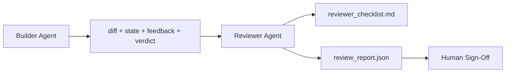

# المراجع الوكيل: المُبني والمرقق

> وكيل كتابة الكود غير قادر على إعطائه المقاطعة. المراجع هو الدورة الثانية، يستخدم مختلف النظام على عجلة مختلف الأهداف، وكل المحتوى الذي ينتج عنه المبني يحتوي على إمكانية الوصول فقط.

**Type:** Build
**Languages:** Python (stdlib)
**Prerequisites:** Phase 14 · 38 (Verification Gate)
**Time:** ~55 分钟

## 學习目标
- شرح لماذا وكيل واحد لا يستطيع مراجعة عمله بشكل موثوق
- 构建一个审查代理 循环,它消费建筑物,并输出结构化审查报告──
- 编写一个评论员条目,按具体维度评分,而不是凭感应.
- سوف يصل المراجع إلى مكتب العمل ، و يبدأ المراجعة الاصطناعية

## 问题
أنت جعلت العميل 修复 خطأ. لقد قام بتحرير أربع ملفات، و قام بتجربة، و قام بتقديم تقرير، و قام بتكمل البوابة.`passed: true`بعد يومين وجدت أن هذا الإصلاح هو نصف الأخطاء بدلاً من النصف الصحيح

القبول ضروري، ولكن غير كاف. سوف يطرح المراجع القبول لا يمكن طرح السؤال: هل هذا حل مشكلة صحيحة؟ هل توسع النطاق دون وضوح؟ هل يسجل الافتراضات التي يجب أن تكون موضع شك؟ هل يجعل مقعد العمل في الجلسة التالية قابلاً للتعامل؟

## 概念


### المراجعة

خمسة أبعاد، كل أبعاد تقييم 0 إلى 2

| Dimension | Question |
|-----------|----------|
| Problem fit | 这个变更是否解决了任务所陈述的问题，而不是相近的问题？ |
| Scope discipline | 编辑是否限制在 contract 内，或者 contract 的扩展是否是有意为之？ |
| Assumptions | 所有隐藏 assumptions 是否都写在了某个可 review 的地方？ |
| Verification quality | acceptance command 是否真的证明了目标，还是只证明了一个更弱的版本？ |
| Handoff readiness | 下一个 session 是否能从当前状态干净地接手？ |

总分 10 分── أقل من 7 分是软失败; أقل من 5 分是硬失败──

### المراجعة هي دور مستقل، وليس نموذج مستقل

يمكنك استخدام النموذج نفسه مع المبني 运行 مراجعة‬‬‬‬‬‬‬‬‬‬‬‬‬‬‬‬‬‬‬‬‬‬‬‬‬‬‬‬‬‬‬‬‬‬‬‬‬‬‬‬‬‬‬‬‬‬‬‬‬‬‬‬‬‬‬‬‬‬‬‬‬‬‬‬‬‬‬‬‬‬‬‬‬‬‬‬‬‬‬‬‬‬‬‬‬‬‬‬‬‬‬‬‬‬‬‬‬‬‬‬‬‬‬‬‬‬‬‬‬‬‬‬‬‬‬‬‬‬‬‬‬‬‬‬‬‬‬‬‬‬‬‬‬‬‬‬‬‬‬‬‬‬‬‬‬‬‬‬‬‬‬‬‬‬‬‬‬‬‬‬‬‬‬‬‬‬‬‬‬‬‬‬‬‬‬‬‬‬‬‬‬‬‬‬‬‬‬‬‬‬‬‬‬‬‬‬‬‬‬‬‬‬‬‬‬‬‬‬‬‬‬‬‬‬‬‬‬‬‬‬‬‬‬‬‬‬‬‬‬‬‬‬‬‬‬‬‬‬‬‬‬‬‬‬‬‬‬‬‬‬‬‬‬‬‬‬‬‬‬‬‬‬‬‬‬‬‬‬‬‬‬‬‬‬‬‬‬‬‬‬‬‬‬‬‬‬‬‬‬‬‬‬‬‬‬‬‬‬‬‬‬‬‬‬‬‬‬‬‬‬‬‬‬‬‬‬‬‬‬‬‬‬‬‬‬‬‬‬‬‬‬‬‬‬‬‬‬‬‬‬‬‬‬‬‬‬‬‬‬‬‬‬‬‬‬‬‬‬‬‬‬‬‬‬‬‬‬‬‬‬‬‬‬‬‬‬‬‬‬‬‬‬‬‬‬‬‬‬‬‬‬‬‬‬‬‬‬‬‬‬‬‬‬‬‬‬‬‬‬‬‬‬‬‬‬‬‬‬‬‬‬‬‬‬‬‬‬‬‬‬‬‬‬‬‬‬‬‬‬‬‬‬‬‬‬‬‬‬‬‬‬‬‬‬‬‬‬‬‬‬‬‬‬‬‬‬‬‬‬‬‬‬‬‬‬‬‬‬‬‬‬‬‬‬‬‬‬‬‬‬‬‬‬‬

### المراجع 不能编辑 diff

المراجعة 读取 diff、state、feedback、verdict──它写了一份报告──它不补贴 diff──如果报告说修复这个,下一轮建设者转去做修复;

### مقارنة بين عنوان المراجعة وبوابة التحقق

المرحلة 14 · 38) فحص تحديدات الفعل: قبول إما أن يتم عمل أو لا، القواعد إما أن تمر، المجال إما أن تبقى، المراجعة إما أن تقرر تحديدات العمل: إما أن يكون هذا العمل صحيحًا، وإما أن هناك سجلات وثائقية، وإما أن تكون متاحة، والتي تحتاج إلى كلتا.


```figure
wb-builder-marker
```

## بناءها
`code/main.py`实现:

- واحد`ReviewerInputs`درجة البيانات، تستخدم معالجة المراجعة 读取的文物──
- واحد من المواد المرجعية ، لكل درجة وظيفة واحدة. كل وظيفة هي محددة ، وبالنسبة للدورة استخدام درجة الحد الأدنى.
- واحد`review_report.json`الكتاب، يتضمن خمسة نقاط`pass`.`soft_fail`.`hard_fail`(‬)
- حالة تجريبيين: تغييرات واضحة، و تغييرات صحيحة، مشكلة خاطئة.

运行:

```
python3 code/main.py
```

输出: دو份 مراجعة تقرير 写入磁盘,并在控制台中显示一张维度分数表──

## نمط الإنتاج في المشهد الحقيقي

证据如下:Cloudflare في نظام مراجعة AI Code في أبريل 2026، خلال 30 天内跨 5,169  repos、48,095    merge طلبات 运行 131,246 مرة مراجعة。 مراجعة 完成时间中位数为 3 分 39 秒──最多七名专家评论员 ((أمن、أداء、جودة الرمز、وثائق、إدارة الإصدار、امتثال、إنجنيري كودكس) في مراجعة منسق 下并行运行، من قبل منسق النموذج 去重发现 并判断严重度──顶级 仅保留 منسق؛ المتخصصين 运行在更便宜的层次上.

أربعة أنماط جعلها قادرة على تحديد حجم النشاط

**Specialist pool, not one big reviewer.**للخلفية الإعادة، فإن المراجعة مع 5 维 المادة 足足. عندما يكون هناك قاعدة ضوابط أمن حرجة الأداء حرجة الأداء والأقراص، فيمكنك فصلها إلى مفاجئ.

**Bias mitigation as design requirement, not optimization.**قضاة ماجستير ماجستير في العلوم التدريسية 会表现出四类稳定偏见(Adnan Masood,2026 年 4 月):تحيز الموقف(GPT-4 在 (A,B) 与 (B,A) 排序上约40%不一致) Verbosity bias(更长输出有约15%得分通胀) ‧自偏))

**Calibration set, not vibes.**إعداد مجموعة من المهام التاريخية التي تحتوي على 10-20 مهمة، و هناك مجموعة من الأحكام الصحيحة المعروفة. كل مرة يتم فيها التعديل، يتم إجراءها بعد كل مرة من خلال المراجعة. إذا كان التوافق مع السجلات التاريخية أقل من 80٪، فإن المادة في المراجعة المطبوعة تحتاج إلى تعديل.

**Hybrid norm with the gate.**بوابة التحقق ((مرحلة 14 · 38) إدارة فحص التأكد ((القبض هو أو لا يعمل، والاختبارات هي أو لا تمر، والمقياس هو أو لا تمسك)

## استخدمها
أنماط الإنتاج:

- **Claude Code subagents.**المراجعة المشتركة في المبني 关闭任务后运行──它在 PR 上发布带有轮分的评论──
- **OpenAI Agents SDK handoffs.**المُبني في عملية الإنجاز يُسلمُ المُراجع. يمكن للمُراجع أن يُحضر قائمة النتائج.
- **Two-model pairing.**المُبني 运行在更快、更便宜的模型 上── مراجعة 运行在更强的模型 上, استخدام更小的文本,专注判断──

المراجعة هي عندما لا يستطيع البشر أن ينجحوا في كل مراجعة

## 交付 it
`outputs/skill-reviewer-agent.md`生成一个项目专用评论员条目、一个连接建设器文物的评论员代理 stub,以及与验证门的集成,让人工评论从书面报告开始,而不是从空白页开始──

## التدريب
1. إضافة الـ 6 الـ بعد المنتج الخاص بك، شرح لماذا لم يتم استيعابها في الـ 5 الـ بعد
2. استخدام اثنين من النظم المختلفة استفسارات (ثالثة، والذي يستخدم) عمل المراجعة.
3. لكل درجة إضافة`confidence`عندما كان الاعتقاد أقل من 0.6 时، رفض نشر تقرير
4. بناء مجموعة تحديد التأهل: 10 个 带有已知正确判决的历史任务闭合――对它们运行审查者――它在哪里与历史记录不一致?
5. إضافة إضافة طلب المزيد من الأدلة التسعير: يمكن للمراجع في تقييم قبل طلب المبني أن ينفذ اختبار معين.

## 关键术语
| Term | What people say | What it actually means |
|------|----------------|------------------------|
| Reviewer rubric | “Checklist” | 五维 0-2 评分，每个维度都有一个书面问题 |
| Soft fail | “Needs revisions” | 总分低于 7；builder 获得需要处理的 findings |
| Hard fail | “Reject” | 总分低于 5，或任一维度为 0；暂停并呈现给 human |
| Role separation | “Different prompt” | 同一个 model 可以承担两个角色；关键约束是 inputs 和 posture |
| Confidence floor | “Don't ship low-signal reports” | 当 rubric 不确定时，拒绝输出 verdict |

## 延伸阅读
- [OpenAI Agents SDK handoffs](https://platform.openai.com/docs/guides/agents-sdk/handoffs)
- [Anthropic Claude Code subagents](https://docs.anthropic.com/en/docs/agents-and-tools/claude-code/sub-agents)
- [Cloudflare, Orchestrating AI Code Review at Scale](https://blog.cloudflare.com/ai-code-review/) 7 个 متخصص + منسق 架构,30 天 131k 次 runs
- [Agent-as-a-Judge: Evaluating Agents with Agents (OpenReview / ICLR)](https://openreview.net/forum?id=DeVm3YUnpj) مقياس ديفاي،366 متطلبات الحلول الهيروقية
- [Adnan Masood, Rubric-Based Evaluations and LLM-as-a-Judge: Methodologies, Biases, Empirical Validation](https://medium.com/@adnanmasood/rubric-based-evals-llm-as-a-judge-methodologies-and-empirical-validation-in-domain-context-71936b989e80)4 أنواع التحيزات والطريقة للتخفيف
- [MLflow, LLM-as-a-Judge Evaluation](https://mlflow.org/llm-as-a-judge) باستخدام أدوات الإنتاج من المُبني/المُقيّم المُفصل
- [LangChain, How to Calibrate LLM-as-a-Judge with Human Corrections](https://www.langchain.com/articles/llm-as-a-judge) سير العمل المحدد حسب التصوير
- [Evidently AI, LLM-as-a-judge: a complete guide](https://www.evidentlyai.com/llm-guide/llm-as-a-judge)
- [Arize, LLM as a Judge — Primer and Pre-Built Evaluators](https://arize.com/llm-as-a-judge/)
- المرحلة 14 · 05  التكرير الذاتي والتحديديات
- المرحلة 14 · 30  تطوير عامل يقود Eval ((جهاز توليد مجموعة التصفية)
- المرحلة 14 · 38  المراجعة 读取的验证门
- المرحلة 14 · 40  تقرير المراجعة 输入的交付包
