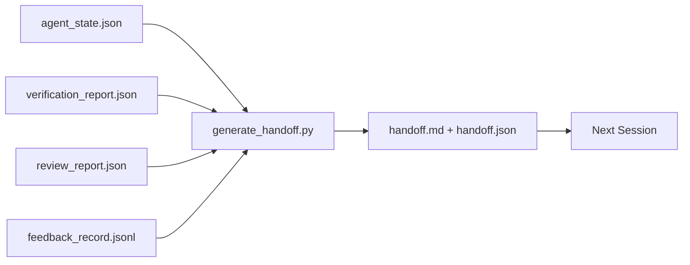

# التداول المتعدد الجلسات

> جلسة يجب أن تنتهي. العمل لا يزال لا ينتهي. الحزمة الرفيعة هي نوع من الأثاث، فإنها تُعدّ الوكيل.

**类型:**بناء
**语言:**Python (stdlib)
**先修:**المرحلة 14 · 34 (ذاكرة الإبلاغ) ، المرحلة 14 · 38 (التحقق) ، المرحلة 14 · 39 (المراجع)
**时间:**~ 50 دقيقة

## 學习目标

- 识别每一封包都需要的七字段──
- من الأثاث المكتبة النمطية 生成 hand-off، بدلا من كتابة المخطوطات
- رسم سجلات الملاحظات الكبيرة 剪成适合交付的摘要──
- دع الحركة الأولى من الجلسة القادمة تكون مؤكدة

## 问题

الجلسة  انتهت. العميل يقول  جيد، لقد حققنا تقدما ً الجلسة التالية فتح.‬‬‬‬‬‬‬‬‬‬‬‬‬‬‬‬‬‬‬‬‬‬‬‬‬‬‬‬‬‬‬‬‬‬‬‬‬‬‬‬‬‬‬‬‬‬‬‬‬‬‬‬‬‬‬‬‬‬‬‬‬‬‬‬‬‬‬‬‬‬‬‬‬‬‬‬‬‬‬‬‬‬‬‬‬‬‬‬‬‬‬‬‬‬‬‬‬‬‬‬‬‬‬‬‬‬‬‬‬‬‬‬‬‬‬‬‬‬‬‬‬‬‬‬‬‬‬‬‬‬‬‬‬‬‬‬‬‬‬‬‬‬‬‬‬‬‬‬‬‬‬‬‬‬‬‬‬‬‬‬‬‬‬‬‬‬‬‬‬‬‬‬‬‬‬‬‬‬‬‬‬‬‬‬‬‬‬‬‬‬‬‬‬‬‬‬‬‬‬‬‬‬‬‬‬‬‬‬‬‬‬‬‬‬‬‬‬‬‬‬‬‬‬‬‬‬‬‬‬‬‬‬‬‬‬‬‬‬‬‬‬‬‬‬‬‬‬‬‬‬‬‬‬‬‬‬‬‬‬‬‬‬‬‬‬‬‬‬‬‬‬‬‬‬‬‬‬‬‬‬‬‬‬‬‬‬‬‬‬‬‬‬‬‬‬‬‬‬‬‬‬‬‬‬‬‬‬‬‬‬‬‬‬‬‬‬‬‬‬‬‬‬‬‬‬‬‬‬‬‬‬‬‬‬‬‬‬‬‬‬‬‬‬‬‬‬‬‬‬‬‬‬‬‬‬‬‬‬‬‬‬‬‬‬‬‬‬‬‬‬‬‬‬‬‬‬‬‬‬‬‬‬‬‬‬‬‬‬‬‬‬‬‬‬‬‬‬‬‬‬‬‬‬‬‬‬‬‬‬‬‬‬‬‬‬‬‬‬‬‬‬‬‬‬‬‬‬‬‬‬‬‬‬‬‬‬‬‬‬‬‬‬‬‬‬‬‬‬‬‬‬‬‬‬‬‬‬‬‬‬‬‬‬‬‬‬‬‬‬‬‬‬‬‬‬‬‬‬‬‬

糟糕的交付成本,将持续支付在任务生命周期中的每次会议中──修复方式在会议结束时自动生成一套:改了什么什么、为什么改了、尝试过什么、失败了、还剩什么、下次首先做什么──

## 概念



### كلّ إرسالٍ يحمل سبعة أحاديث

| Field | 它回答的问题 |
|-------|---------------------|
| `summary` | 一段话说明完成了什么 |
| `changed_files` | 一眼看清 diff |
| `commands_run` | 实际执行过什么 |
| `failed_attempts` | 尝试过什么，以及为什么没有成功 |
| `open_risks` | 下个 session 可能踩到什么坑，附 severity |
| `next_action` | 下个 session 采取的第一个具体步骤 |
| `verdict_pointer` | 指向 verification + review reports 的路径 |

`next_action`字段是承重字段── واحد يحتوي على كل المحتوى ولكن يفتقر`next_action`إرسال الإرسال هو تقرير حالة، وليس إرسال الإرسال.

### التسليم هو المنتج، ليس المكتوب

يد كتابة المكتب،就是在困难日子里会被跳过的手稿──مدبر 读取工作桌文物并输出包──职责的代理是让工作桌处于生成器可以总结的状态,而不是亲自写总结──

### 两种形式: القراءة البشرية و القراءة الآلية

`handoff.md`لإنسان 阅读。`handoff.json`供下一个代理 加载── الاثنان من نفس مجموعة من الأثاث المصدر── إذا ظهرت اختلافات، فهي تُعدّ في JSON

### الملاحظات سجل 裁剪

كاملة`feedback_record.jsonl`ربما يكون هناك مئات المواد السجلة. ولكن فقط تحمل آخر K 条، فضلا عن كل المواد غير صفر الخروج.

### 留下干净 حالة

إن كانت الجلسة التالية لا تتطابق مع الجلسة التالية إذا كان الجلسة التالية تفتح عندما يواجه الاختلاف نصف فصل ، وكيل نسيت الملف الزمني فرع الفرع ، وكذلك لا يعمل حقا على اختبارات التقارير الخطأ ، فان المشكلة ستكون كاملة مرة أخرى`handoff.md`لا قيمة أيضا. العميل التالي سوف يقضي عشر دقائق في تنظيف شيء ترك في جلسة واحدة بدلا من مواصلة البناء. هذه التكلفة سوف تنمو في كل جلسة في دورة حياة المهمة.

لذا فإن الجلسة لا تنتهي عندما يتم تشغيلها، بل في مكتب العمل في المولد يمكن أن تجميعها، الجلسة التالية يمكن أن تنتهي عندما تكون في حالة ثقة.

| Check | Clean means | Dirty blocks because |
|-------|-------------|----------------------|
| Working tree | 每个变更都已 commit，或明确 stash 并附带说明 | 半截 diff 会被下一个 agent 看成有意图的工作 |
| Temp artifacts | 没有 `*.tmp`、scratch dirs、debug prints 或留下的注释块 | 游离文件会污染 diff 和下一个 agent 的 mental model |
| Tests | 绿色，或红色但在 `open_risks` 中命名了失败 | 沉默的红色 test 是下一个 session 会踩进去的陷阱 |
| Feature board | `feature_list.json` status 反映真实状态（Phase 14 · 36） | 过期 board 会把下一个 session 派去做已经完成的工作 |
| Branch | 位于预期 branch，没有 detached HEAD，没有 orphan branches | 错误 branch 会让下一个 session 的第一个 commit 落到错误位置 |

التنظيف 阶段会产出一个 `clean_state.json`, بينها قائمة قضايا الحظر;空列表是交付生成器 写包 前要断言的前置条件──建立在脏树上的交付不是交付,而是转发混乱── اثنين من الأدوات 成对出现:


```figure
wb-handoff-packet
```

## بناءها

`code/main.py`实现:

- واحد تحميل، ستعمل الحالة، الحكم، مراجعة ومراجعة`WorkbenchSnapshot`.
- واحد`generate_handoff(snapshot) -> (markdown, payload)`函数‬
- فلتر واحد، اختر آخر إدخالات تعليقات K 条 بالإضافة إلى جميع الخروج غير صفر
- إثباتيّة، في كتابة على الجانب`handoff.md`和 `handoff.json`.

运行它:

```
python3 code/main.py
```

输出: طباعة جسم المشاركة، فضلا عن الملفين على القرص

## نمط في الإنتاج الحقيقي

كودكس كلي، كلويد كود و OpenCode تقدم بشكل مختلف خطة ضغط مختلفة؛ حزمة التنقل المكوّنة تقع على هذا المكون.

**Compaction 策略各不相同；packet schema 不变。**كودكس كلي POST /v1/ردود/مكتبة هو نقطة AES غير مرئية على جانب الخادم ((أجهزة OpenAI) ؛ fallback هو a本地 handoff ملخص، ك`_summary`رسالة المستخدم-دور إضافة. كلويد كود في السياق صل إلى 95% 时运行五阶段 التضخم التقدم.

**Fresh-session handoff 不是 compaction。**التضغط 延长一期;handoff 干净地关闭一期,并启动下一个── Hermes Issue #20372 的框架(2026 年 4 月) 是对的: عندما تبدأ الضغط في مكان 降低质量时,Agent 应写一条紧的交付,结束会议,并在新背景恢复──包 让这种转换变得便宜──错误做法是直压到质量崩;修复方式是为早期干净的交付 预留预算──

**每个 branch 和 topic 只保留一个 active handoff。**التنسيق متعدد الوكلاء أكثر بسبب التسليمات القديمة ، وليس النموذج الفاسد`branch`.`last_known_good_commit`، و`active | superseded | archived`واحد من`status`ستتم أرشيف التبرعات المستمرة، فقط من النشطات التي تحركها الجلسة القادمة.

**在 50-75% context 之前收尾，不要等到撞墙。**كتاب لعب طريقة الكتابة ((CLAUDE.md + HANDOVER.md) تقرير، في جلسة في سياق ميزانية 50-75%  انتهاء، وليس 95% 时,效果 أفضل.

## استخدمها

النمط الناتج:

- **Session-end hook。**وقت تشغيل في المستخدم أغلق دردشة 时触发发发电机──包包 写入 `outputs/handoff/<session_id>/`.
- **PR template。**المُنتج أيضاً كهيئة للاتصالات العامة.
- **Cross-agent handoff。**استخدام منتج واحد بناء (كلود كود) ، استخدام آخر مواصلة (كودكس)

الحزمة 小、规则、生成成本低──节省下来的成本会随着每次会议 复利增长──

## أصدرها

`outputs/skill-handoff-generator.md`سوف تولد مولد مسارات الملفات المتكاملة للمشروع , واحد يعمل على خطة نهاية الجلسة , و الوكيل التالي`handoff.json`النظام

## التدريب

1. إضافة واحدة`assumptions_to_validate`字段, 暴露构建者记录过,但评论员评分没有超过1的每一个假设──
2. على الجريات الفاشلة و الجريات الممرة استخدام مختلف الطرق قص قصة الملاحظات الموجزة.
3. 加入一个 问题 列表 列表 列表 列表 列表 列表 列表 列表 列表 列表 列表 列表 列表 列表 列表 列表 列表 列表 列表 列表 列表 列表 列表 列表 列表 列表 列表 列表 列表 列表 列表 列表 列表 列表 列表 列表 列表 列表 列表 列表 列表 列表 列表 列表 列表 列表 列表 列表 列表 列表 列表 列表 列表 列表 列表 列表 列表 列表 列表 列表 列表 列表 列表 列表 列表 列表 列表 列表 列表 列表 列表 列表 列表 列表 列表 列表 列表 列表 列表 列表 列表 列表 列表 列表 列表 列表 列表 列表 列表 列表 列表 列表 列表 列表 列表 列表 列表 列表 列表 列表 列表 列表 列表 列表 列表 列表 列表 列表 列表 列表 列表 列表 列表 列表 列表 列表 列表 列表 列表 列表 列表 列表 列表 列表 列表 列表 列表 列表 列表 列表 列表 列表 列表 列表 列表 列表 列表 列表 列表 列表 列表 列表 列表 列表 列表 列 列表 列表 列表 列表 列 列 列 列 列 列 列 列 列 列 列 列 列 列 列 列 列 列 列 列 列 列 列 列 列 列 列 
4. 让发电机 具备无效:运行两次会产生相同的包――要成立,需要什么内容保持稳定?
5. إضافة إطار المواصفات المسبقة للجلسة التالية، تحديد قائمة المواد التي يجب تحملها في الجلسة التالية

## 关键术语

| Term | 人们常说 | 实际含义 |
|------|----------------|------------------------|
| Handoff packet | “Session summary” | 携带七个字段的生成 artifact，同时包含 markdown 和 JSON |
| Next action | “首先做什么” | 启动下一个 session 的一个具体步骤 |
| Feedback trim | “Log summary” | 最后 K 条 records 加上每个非零 exit |
| Status report | “我们做了什么” | 缺少 `next_action` 的文档；有用，但不是 handoff |
| Verdict pointer | “Receipt” | 指向 verification + review reports 的路径，用于 traceability |

## 延伸阅读

- [Anthropic，面向 long-running agents 的有效 harnesses](https://www.anthropic.com/engineering/effective-harnesses-for-long-running-agents)
- [OpenAI Agents SDK handoffs](https://platform.openai.com/docs/guides/agents-sdk/handoffs)
- [Codex Blog，Codex CLI Context Compaction：架构、配置、管理长会话](https://codex.danielvaughan.com/2026/03/31/codex-cli-context-compaction-architecture/) POST /v1/ ردود الفعل/موافقة و الرد على الوضع المحلي
- [Justin3go，Shedding Heavy Memories：Context Compaction in Codex, Claude Code, OpenCode](https://justin3go.com/en/posts/2026/04/09-context-compaction-in-codex-claude-code-and-opencode) ثلاثة مُبيعات ضغط مقابل
- [JD Hodges，Claude Handoff Prompt：如何跨 Sessions 保持 Context (2026)](https://www.jdhodges.com/blog/ai-session-handoffs-keep-context-across-conversations/) CLAUDE.md + HANDOVER.md،50-75% من ميزانية السياق
- [Mervin Praison，Managing Handoffs in Multi-Agent Coding Sessions：Fresh Context Without Losing Continuity](https://mer.vin/2026/04/managing-handoffs-in-multi-agent-coding-sessions-fresh-context-without-losing-continuity/) الأنظمة الموزعة 视角
- [Hermes Issue #20372 — compression 变得有风险时自动 fresh-session handoff](https://github.com/NousResearch/hermes-agent/issues/20372)
- [Hermes Issue #499 — Context Compaction Quality Overhaul](https://github.com/NousResearch/hermes-agent/issues/499) نصوص الكودكس CLI 中面向交付
- [Microsoft Agent Framework，Compaction](https://learn.microsoft.com/en-us/agent-framework/agents/conversations/compaction)
- [OpenCode，Context Management and Compaction](https://deepwiki.com/sst/opencode/2.4-context-management-and-compaction)
- [LangChain，Context Engineering for Agents](https://www.langchain.com/blog/context-engineering-for-agents)
- المرحلة 14 · 34  مولد 读取的状态文件
- المرحلة 14 · 38  حكم التحقق من الحزمة
- المرحلة 14 · 39  打包进包包进
