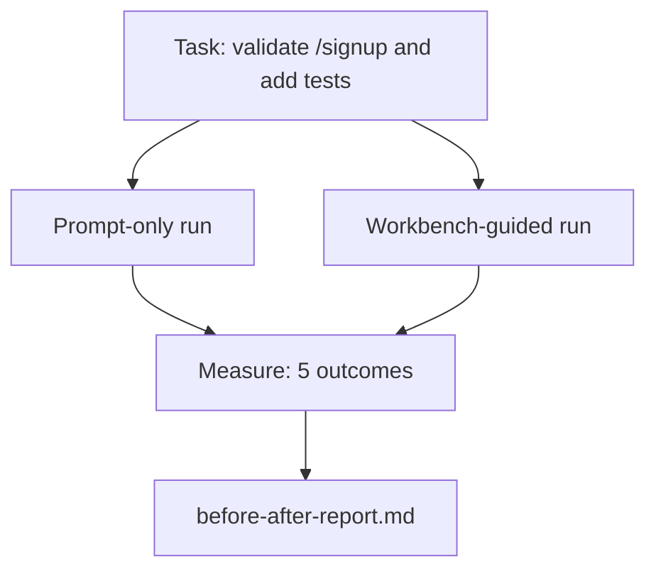

# في واقع Repo 上 استخدام مقعد العمل

> 十一节 دروس حول السطح، إذا لم تتمكن من تحمل اختبار قاعدة برمجة حقيقية، فهي بلا قيمة.

**Type:** Build
**Languages:** Python (stdlib)
**Prerequisites:** Phases 14 · 32 to 14 · 40
**Time:** ~60 minutes

## 學习目标
- ستقوم بتجميع سبعة سطحات من سطح المكتب إلى تطبيق صغير
- سوف تقوم بنفس المهمة مرتين فقط وبدقة العمل) ، ومقياس خمسة نتائج.
- قراءة قبل / بعد تقرير، ومحاكمة أي سطح قدم أكبر 杆──
- لكن نموذجي كان جيداً بما فيه الكفاية في الوقت الذي كان فيه الرد على هذا

## 问题
في مهمة اللعب فوق القيام بتجربة قول لا يتطلب أي شخص. قيمة مقعد العمل يجب أن تكون في إعادة التأمين ذات الحساسة الحقيقية فوق إنجاز مهمة ذات الحساسة الحقيقية عندما تظهر: أقل فشل ٬ أقل عكس ، وتنتج حزمة يمكن استخدامها في الجلسة التالية.

هذا الدروس يوفر هذا الإستعراض ذو شعور حقيقي، ويحصل على نفس المهمة عبر خط الأنابيبين.

## 概念


### تطبيق العينة

`sample_app/`واحد من أقل FastAPI 风格 المعاملة:

- `app.py`, يتضمن`/signup`(尚無核准)
- `test_app.py`، يحتوي على اختبار مسار السعادة
- `README.md`和 `scripts/release.sh`، كطعم في المنطقة المحظورة

### المهمة

> لأجل`/signup`إضافة تأكيد المدخل: رفض قصير إلى 8 حرف كلمة المرور، أعود مع غلاف الخطأ المكتوب 422♦ إضافة اختبار لتثبت السلوك الجديد♦

### خطوط الأنابيب الثانية

فقط في وقت مبكر:

1. 阅读 README。
2. 阅读 `app.py`.
3. 编辑文件。
4. 声称完成。

المكالمة الموجزة على المنصة:

1. 运行 init script ((درس 35)。
2. 阅读 المجال العقد ((درس 36)。
3. 读取 حالة ((درس 34)。
4. فقط تحرير الملفات المسموح بها
5. 通過 ردود الفعل رُكّب 运行 أمر قبول ((درس 37)。
6. 运行 بوابة التحقق ((درس 38)。
7. 运行 مراجعة ((درس 39)。
8. 生成 التسليم (درس 40)

### نتائج الامتحان الخمسة

| Outcome | Why it matters |
|---------|----------------|
| `tests_actually_run` | 大多数“tests passed”声明都无法验证 |
| `acceptance_met` | 证明目标达成的 test 必须就是实际运行过的 test |
| `files_outside_scope` | Scope creep 是主要的静默 failure |
| `handoff_quality` | 下一次 session 会为此付出代价或从中受益 |
| `reviewer_total` | 在 gate 之上的定性判断 |


```figure
wb-ab-runs
```

## بناءها
`code/main.py`针对同样样应用装置 编排两条管道──两条管道 都是脚本的(循环中没有LLM),因此 قياس 可复现──该脚本会将比较 写入 写入 `before-after-report.md`和 `comparison.json`.

运行:

```
python3 code/main.py
```

输出: حسب خط الأنابيب  عرض جدول المواصلات النتيجة ، حفظ إلى النص 旁边的标记报告,以及给想做图的人使用的 JSON──

## أنماط الإنتاج في الإنتاج الحقيقي

سؤال المشتبه به هو: هل هناك مساعدة كبيرة؟

**Terminal Bench Top-30 到 Top-5，使用同一个 model。**LangChain 的 * أناثومية حزمة وكيل*(2026 年 4 月): وكيل برمجة                                                                                                                                                                                                                                                                                                                                                                                                                                                                                                   

**Vercel 通过删除 tools 从 80% 到 100%。**ورسل  تقرير، حذف 80% من الوسائل الوكالة  بعد، معدل النجاح من 80%  ارتفاع إلى 100%  مساحة الوسائل الأصغر  نطاق أكثر وضوحا  مسارات الفشل أقل  فضاء إضافي للفوز 

**Harvey 仅靠 harness 实现 2x accuracy。**الوكلاء القانونيين من خلال تحسين الاستغلال سوف تحسن دقة إلى اثنين مرات أو أكثر، لا تغيير نموذجها.

**88% 的企业 AI agent projects 未能进入 production。**ورقة preprints.org من * Harness Engineering for Language Agents* ((2026 年 3 月) سوف يُعتبر الفشل  بسبب الوقت الزمني، وليس التفكير: حالة ثابتة 、 إعادة المحاولة الضعيفة 、 إطار التفجير المفرط ٬ إلى متوسط خطأ ٬

**Long-context collapse。**النجاح 40-50% في السياق الطويل  الظروف انخفضت إلى 10% 以下, السبب الرئيسي هو حلقات لا نهاية لها و فقدان الهدف.

**False negatives 仍然存在。**المهام الفعلية في خطوة واحدة, خطوط واحدة, تشغيلات الملفات, أي نموذج 已逐字记住的内容,这些用只快速会更快.

النتائج ليست harness 永远获胜── الموديلات سوف تتحرك مع مرور الوقت لتستيعب خدوش الحركة── النتيجة هي: اليوم، تحميل الهندسة 落在这七面上,而数字证明这一点──

## استخدمها
عندما يحدث ما يلي، يمكن استشهاد هذه الدروس كملف قضائي:

- يُسألُ شخص ما لماذا كلّ إعلامٍ عامٍ يُحتوي عليه`agent-rules.md`و المجال العقد
- فكر الفريق في هذا السباق و إزالت بوابة التحقق
- منتج جديد من وكيل الإصدار، وأنت بحاجة إلى مقياس محمول لتحديد ما إذا كان حقا توفير الوقت.

والرقم يفسر التنشر أكثر من ذلك

## 交付 it
`outputs/skill-workbench-benchmark.md`هو حزمة تقييم محمولة، يمكنك جعل أي وكيل منتج في مشروع  تطبيق عينك 上跑过两条管道,并报告五个结果──

## التدريب
1. 添加第六个结果:وقت-إلى-أول-مهمة-تحرير.
2. في قاعدة التعليمات الخاصة بك مهمة اليوم الثاني الحقيقي
3. إضافة إضافة سلبية كاذبة: قائمة الإجراءات المفروضة فقط 本会更快、 工作桌上上費是真成本的任务──然后为继续保留工作桌子 辩护──
4. ستقومون بتغيير المخططات إلى دعوة حقيقية للجامعة.
5. كتابة ملخص لمحترف صفحة واحدة. ما المحتويات التي يمكن أن تحتفظ بها؟

## 关键术语
| Term | What people say | What it actually means |
|------|----------------|------------------------|
| Sample app | “Toy repo” | 足够小，但也足够现实，能够演练全部七个 surface |
| Pipeline | “Workflow” | agent 遵循的 surface read/write 有序序列 |
| Before/after report | “The receipts” | 你交给怀疑者的 artifact |
| False negative | “Workbench overkill” | prompt-only 更快的任务；诚实列出它们很有用 |
| Workbench benchmark | “Reliability score” | 在你的 codebase 上运行 comparison 的 portable harness |

## 延伸阅读
- [LangChain, The Anatomy of an Agent Harness](https://blog.langchain.com/the-anatomy-of-an-agent-harness/) مؤشرات بين بينز التمرينال Top-30 إلى Top-5
- [MongoDB, The Agent Harness: Why the LLM Is the Smallest Part of Your Agent System](https://www.mongodb.com/company/blog/technical/agent-harness-why-llm-is-smallest-part-of-your-agent-system) Vercel + Harvey 数字
- [preprints.org, Harness Engineering for Language Agents](https://www.preprints.org/manuscript/202603.1756) 88%  معدل فشل الشركات ‬أسباب الجذور
- [HN: Improving 15 LLMs at Coding in One Afternoon. Only the Harness Changed](https://news.ycombinator.com/item?id=46988596) في 15 نموذج  上复现
- [Cloudflare, Orchestrating AI Code Review at Scale](https://blog.cloudflare.com/ai-code-review/) الإنتاج 中 30 天 / 131k مراجعة الجوائز
- [Anthropic, Building Effective Agents](https://www.anthropic.com/research/building-effective-agents)
- المراحل 14 · 32 إلى 14 · 40  本课端到端演练的表面
- المرحلة 14 · 19  SWE-bench、GAIA、AgentBench، كمرجعية كبيرة لتكمل هذه الدورة
- المرحلة 14 · 30  تطوير وكيل مدفوع بالقيام بالقيام بالقيام بالقيام بالقيام بالقيام بالقيام بالقيام بالقيام بالقيام بالقيام بالقيام بالقيام بالقيام بالقيام بالقيام بالقيام بالقيام بالقيام بالقيام بالقيام بالقيام بالقيام بالقيام بالقيام بالقيام بالقيام بالقيام بالقيام بالقيام بالقيام بالقيام بالقيام بالقيام بالقيام بالقيام بالقيام بالقيام بالقيام بالقيام بالقيام بالقيام بالقيام بالقيام بالقيام بالقيام بالقيام بالقيام بالقيام بالقيام بالقيام بالقيام بالقيام بالقيام بالقيام بالقيام بالقيام بالقيام بالقيام بالقيام بالقيام بالقيام بالقيام بالقيام بالقيام بالقيام بالقيام بالقيام بالقيام بالقيام بالقيام بالقيام
