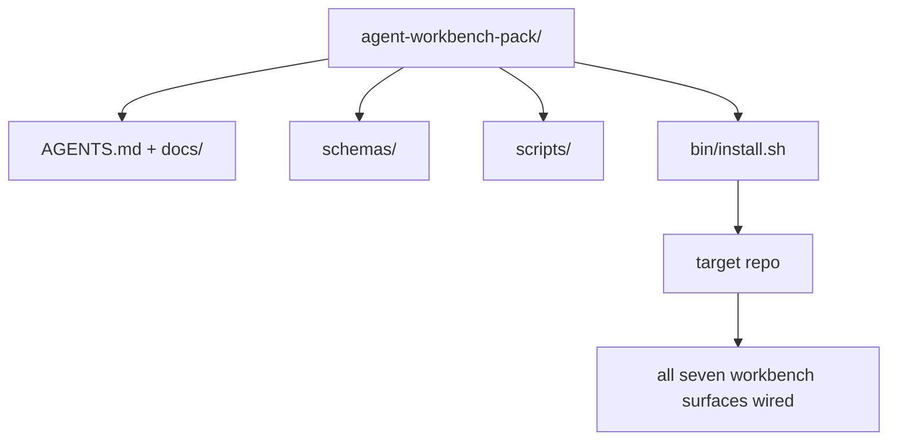

# كابستون:交付一个可复用代理工作板包

> هذه المسار الصغيره التي يمكن وضعها في أي حزمة من الاحتفاظ بها`cp -r`ثم في الصباح الباكر، دع العامل يعمل بشكل مستقر.

**类型：**بناء
**语言：**Python (stdlib)
**前置要求：**المراحل 14 · 31 إلى 14 · 41
**时间：**75 دقيقة

## 學习目标

- ستقوم بتجميع سبعة سطحات من المكتب المكتبي لتكون قائمة يمكن إدخالها مباشرة
- 固定 schema、script 和 template,让新 repo 获得已知可用基线──
- إضافة نص التثبيت، ووضع هذه الحزمة باستخدام 
- قرر ما يظل في الحزمة وما يظل في الخارج، وكل شخص يتحمل نفس الاختلاف.

## 问题

يوجد أحد أدوات Google Doc ‬ Chat ‬ History و3 أدوات مكتوبة في النص المذكور فقط، وهو أدوات مكتوبة في كل فترة. الحل هو حزمة من إصدارات: إعادة التأمين أو المجلد، الذي يحتوي على سطح، مخطط، والنص، بالإضافة إلى مرسوم إصدار يمكن تشغيله.

عندما تنتهي هذه الدورة، سوف تحصل على القرص`outputs/agent-workbench-pack/`ويمكن وضعها في أي ريبو هدف`bin/install.sh`.

## 概念



### ترتيب الحزمة

```
outputs/agent-workbench-pack/
├── AGENTS.md
├── docs/
│   ├── agent-rules.md
│   ├── reliability-policy.md
│   ├── handoff-protocol.md
│   └── reviewer-rubric.md
├── schemas/
│   ├── agent_state.schema.json
│   ├── task_board.schema.json
│   └── scope_contract.schema.json
├── scripts/
│   ├── init_agent.py
│   ├── run_with_feedback.py
│   ├── verify_agent.py
│   └── generate_handoff.py
├── bin/
│   └── install.sh
└── README.md
```

### ماذا ترك، ماذا وضع خارج

留下:

- مخطط السطح..
- أربعة نصوص أعلاه.
- أربعة أجزاء من المستندات.

وضعت خارج:

- المهام والمهام تنتمي إلى مجلس إدارة المستهدف، وليس من الحزمة.
- الموردين SDK 调用── هذا الحزمة مع الإطار 无关──
- إدخال 文案── هذا الحزمة  وضع فريق كان إدخال 旁边, بدلا من وضعها في ذلك──

### التركيب

قصيرة قصيرة`bin/install.sh`(أو `bin/install.py`):

1. لا يوجد`--force`عندما، رفض تغطية التثبيت حتى الحزمة
2. سوف نضع حزمة في غرضنا
3. إذا كان هناك`.github/workflows/`,إذا دخلت CI
4. 打印后续步骤: ملء اللوحة

### 版本管理

هذه الحزمة تحمل واحدة`VERSION`文件──需要迁移的 schema bump 和脚本 变更会出现重大突破──仅 doc 的变更会出现突破补丁──目标 repo 的 `agent_state.json`记录 it initiation وقت التجاوب مع إصدار الحزمة


```figure
wb-pack-install
```

## بناءها

`code/main.py`سأضع حزمة و أضعها في الجوار`outputs/agent-workbench-pack/`في وسط، لا تستخدم هذه المسار الصغير في المرحلة الأولى من الدروس، وكذلك المستند الذي كتبته بالفعل كنموذج.

运行它:

```
python3 code/main.py
```

هذا النص سوف يكرر ويمسك السطح، ويكتب في README، ويقوم بطبع شجرة الحزمة، ثم يخرج صفر.

## نمط في الإنتاج الحقيقي

حزمة واحدة فقط قادرة على تحمل الشوكة والتحديث والصداقة في الصعود تصل قيمةها.

**`VERSION` 是 contract，不是 marketing。**الضربة الرئيسية  تحتاج إلى الهجرة الحكومية ∙ الضربة الصغيرة  تحتاج إلى إعادة تشغيل المحقق ∙ الضربة المزيفة فقط تستخدم في الوثائق ∙ التركيب كل مرة تثبيت ∙`.workbench-version`写入目标 repo; إذا كان الهدف من قفل مع حزمة `VERSION`غير متوافق`lint_pack.py`سأرفض السحب`npm`.`Cargo`和 `pyproject.toml`يمكن أن تتحمل 10 سنوات من التأثيرات، وكيل لن يغير هذه القواعد.

**跨工具分发的单一来源。**نكس  إعطاء واحد `nx ai-setup`, من إعداد واحد وضع `AGENTS.md`.`CLAUDE.md`.`.cursor/rules/`.`.github/copilot-instructions.md`和一个MCP服务──这个包也应该这样做;安装器 输出 symlink(`ln -s AGENTS.md CLAUDE.md`), دعم واحد من الحقيقة من مصدر إلى كل وكيل التشفير ∙ ‬ ‬ ‬ ‬ ‬ ‬ ‬ ‬ ‬ ‬ ‬ ‬ ‬ ‬ ‬ ‬ ‬ ‬ ‬ ‬ ‬ ‬ ‬ ‬ ‬ ‬ ‬ ‬ ‬ ‬ ‬ ‬ ‬ ‬ ‬ ‬ ‬ ‬ ‬ ‬ ‬ ‬ ‬ ‬ ‬ ‬ ‬ ‬ ‬ ‬ ‬ ‬ ‬ ‬ ‬ ‬ ‬ ‬ ‬ ‬ ‬ ‬ ‬ ‬ ‬ ‬ ‬ ‬ ‬ ‬ ‬ ‬ ‬ ‬ ‬ ‬ ‬ ‬ ‬ ‬ ‬ ‬ ‬ ‬ ‬ ‬ ‬ ‬ ‬ ‬ ‬ ‬ ‬ ‬ ‬ ‬ ‬ ‬ ‬ ‬ ‬ ‬ ‬ ‬ ‬ ‬ ‬ ‬ ‬ ‬ ‬ ‬ ‬ ‬ ‬ ‬ ‬ ‬ ‬ ‬ ‬ ‬ ‬ ‬ ‬ ‬ ‬ ‬ ‬ ‬ ‬ ‬ ‬ ‬ ‬ ‬ ‬ ‬ ‬ ‬ ‬ ‬ ‬ ‬ ‬ ‬ ‬ ‬ ‬ ‬ ‬ ‬ ‬ ‬ ‬ ‬ ‬ ‬ ‬ ‬ ‬ ‬ ‬ ‬ ‬ ‬ ‬ ‬ ‬ ‬ ‬ ‬ ‬ ‬ ‬ ‬ ‬ ‬ ‬ ‬ ‬ ‬ ‬ ‬ ‬ ‬ ‬ ‬ ‬ ‬ ‬ ‬ ‬ ‬ ‬ ‬ ‬ ‬ ‬ ‬ ‬ ‬ ‬ ‬ ‬ ‬ ‬ ‬ ‬ ‬ ‬ ‬ ‬ ‬ ‬ ‬ ‬ ‬ ‬ ‬ ‬ ‬ ‬ ‬ ‬ ‬ ‬ ‬ ‬ ‬ ‬ ‬ ‬ ‬ ‬ ‬ ‬ ‬ ‬ ‬ ‬ ‬ ‬ ‬ ‬ 

**`uninstall.sh` 会在存在非平凡 state 时拒绝执行。** إزالة هذا الحزمة غير قادر على حذف المستخدم `agent_state.json`.`task_board.json`أو`outputs/`❖المُفصل سوف يُحذف النظام 、الوسم المخطط 、الدوك`AGENTS.md`(带 `--keep-agents-md`الامتناع عن الخروج) ، وإذا كان هناك أي تغييرات لم يتم تقديمها في ملف الدولة ، فرفض الاستمرار.

**Skill-as-publishable。SkillKit-style 分发。**هذه الحزمة كمهارة SkillKit 交付:`skillkit install agent-workbench-pack`سوف يضعها من مصدر واحد إلى 32 وكيلًا ذكيًا.

## استخدمها

الحزمة في ثلاثة أماكن:

- **作为一个你放进 repo 的目录。** `cp -r outputs/agent-workbench-pack /path/to/repo`.
- **作为一个公开 template repo。**- المفرق و التخصيص،并用 `VERSION`-تحكم في التنقل
- **作为一个 SkillKit skill。**إدخال وكيلك المنتجات، دع الأمر ينجح ووضعها

الحزمة هي وصفة.

## 交付 it

`outputs/skill-workbench-pack.md`سوف تولد حزمة للتعديل المخصصة للمشروع: القواعد سوف تتخذ من تاريخ الفريق أكثر وضوحاً، وسعة العالم سوف تتطابق مع النظام التنفيذي، وبعدها الرسمي سوف يوسع إلى نطاق محدد

## التدريب

1. قرر أي وثيقة خيارية الخامسة تستحق الترقية إلى الحزمة القنونية
2. استخدام Python 重写 التركيب،并添加 `--dry-run`العلم. ستعمل التجربة على النحو المُقارن مع البش.
3. إضافة واحدة`bin/uninstall.sh`و أمن نقل الحزمة و إرسالها إلى ملفات الدولة
4. إضافة واحدة`lint_pack.py`, كن حزمة`VERSION`时失败──把它插入包 自身 repo 的 CI──
5. كتابة كتابة من مقعد العمل المهني إلى كتابة هذه الحزمة.

## 关键术语

| 术语 | 人们常说 | 它实际含义 |
|------|----------------|------------------------|
| Workbench pack | “starter kit” | 一个带版本的目录，携带全部七个 surface |
| Installer | “Setup script” | 以幂等方式放置 pack 的 `bin/install.sh` |
| Pack version | “VERSION” | schema/script 变更使用 major bump，仅 doc 变更使用 patch |
| Drop-in pack | “cp -r and go” | Pack 在第一天无需按 repo 定制即可工作 |
| Forkable template | “GitHub template” | GitHub 的 “Use this template” 可以从中 clone 的公开 repo |

## 延伸阅读

- المراحل 14 · 31 إلى 14 · 41  هذه الحزمة 打包 كل سطح
- [SkillKit](https://github.com/rohitg00/skillkit)في 32 عميل ذكاء اصطناعي يثبتون هذه المهارة
- [Nx Blog, Teach Your AI Agent How to Work in a Monorepo](https://nx.dev/blog/nx-ai-agent-skills) 跨六种工具的单一来源发电机
- [agents.md — the open spec](https://agents.md/) توجيه حزمك  يجب أن تنفيذ المحتوى
- [HKUDS/OpenHarness](https://github.com/HKUDS/OpenHarness) تعادل الحزمة
- [andrewgarst/agentic_harness](https://github.com/andrewgarst/agentic_harness) 带 eval suite of Redis مدعومة 参考实现
- [Augment Code, A good AGENTS.md is a model upgrade](https://www.augmentcode.com/blog/how-to-write-good-agents-dot-md-files) حزمة الأدب
- [Anthropic, Effective harnesses for long-running agents](https://www.anthropic.com/engineering/effective-harnesses-for-long-running-agents)
- [Anthropic, Harness design for long-running application development](https://www.anthropic.com/engineering/harness-design-long-running-apps)
- المرحلة 14 · 30  消费 هذا الحزمة بوابة التحقق من تطوير وكيل القيادة على التقييم
- المرحلة 14 · 41  هذه الحزمة يجب تحسينها قبل / بعد مقياس الموازنة
