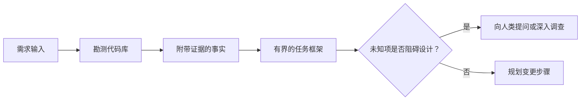

# في عميل 写代码前框定任务

> 编码智能体(Coding Agent) 能极其快速实现一个清晰的任务──它同样可以极其快速实现一个模糊的任务──它们的速度完全相同,但价格却天差地──

**Type:** Learn + Build
**Languages:** Python (stdlib)
**Prerequisites:** Phase 14 第 31 课与第 36 课
**Time:** ~60 分钟

## 學习目标

- قبل تعديل الكود، سيتم تحويل الاحتياجات الأصلية إلى إطار مهم مع حد واضح.
- وذلك من أجل أن تكون المشكلة واضحة.
- 明确定义 يسمح بإصلاح الطرق، يمنع التلمس، ويعطي شهادة قبولها.
- الحكم هو الوقت الذي يُمكن أن يُنفذ فيه العمل بشكل رسمي.

## 代价高昂的失败

 زيادة إعادة إرسال الملفات محمية  يبدو واضح جدا، ولكن في الواقع ليس كذلك  هذا الاختبار الوحيد يجب أن يكون على الوضع في API سطر  المجال خدمة سطر أو قاعدة البيانات؟ هل تقارن الملفات؟

إنّه من المحتمل أن يكون الكود الذي يُحققّقُه قد تمّت التطبيقات، ولكنّه لا يُمْكِنُ أَنْ يُمْكِنَ من إنجازه.

لذلك، فإن الوحدة الأولى التي يقوم بها الكود الذكي بالعمل ليست بالتحديد في التعديل على الكود، بل هي إنشاء إطار مهم يدعمها المكتبة الحقيقية للدليل الكود.

## 任务框架(إطار المهمة)

يحتوي إطار مهمة عملي على ستة عناصر أساسية:

| 字段 | 核心问题 |
|---|---|
| 目标（Goal） | 必须改变哪些可观测的行为？ |
| 代码库事实（Repository facts） | 你在代码、测试、配置或历史提交中验证了什么？ |
| 允许修改路径（Allowed paths） | 变更允许落在哪些位置？ |
| 禁止触碰路径（Forbidden paths） | 哪些文件与目录必须保持原样？ |
| 验收证据（Acceptance evidence） | 哪些具体命令或观测现象能证明目标已达成？ |
| 未知项（Unknowns） | 哪些决策仍需补充证据或依赖人类判断？ |

الحقيقة يجب أن تكون مع شهادة صحيحة. عندما يتعلق الأمر بالعمل الحركي، فإن إعطاء الأوامر لتنفيذها يكون أكثر استقرارًا.



## 勘测旨在寻找约束

لا تحاول أن تكتشف كل المخططات. يجب أن تبحث عن ما يمكن أن يشكّل هذا التغيير على مختلف الجوارب:

1. أظهار السلوك السابق و طريقة تطبيقه
2. أقرب حالات اختبارية
3.  الهيكل البياني للاتفاق العام أو التسلسل
4. تسيطر على هذا الطريق
5. تكوين مع التحقق من أمر
6. تم إنجازها من قبل، من الصين إلى التشييد المحلي

عندما يكون لكل قرار في الخطة دليلًا موضوعيًا تمتلكه ، أو يتم تحديده على أنه قرار غير معروف ، فإن الاختبار يمكن إيقافه.

## غير معروفة لم تكن خطأ

المعلومات غير المعروفة هي الفراغات المعلوماتية المحتملة، والفرضات غير المثبتة هي الافتراضات غير المحتملة على الفراغات.

ستقوم بكل قسم من المعلومات:

- **可探查的（Discoverable）：**الكودكوب نفسه أو النظام في النشاط قادر على إعطاء الإجابة.
- **可自决的（Decidable）：**تم منح المهام المشتركة سلطة اختيار الذكاء الذاتي.
- **需人类判断的（Human）：**هذا الاختيار سوف يغير سلوك المنتج ‬التكلفة‬المخاطر النظامية أو التوافق الخارجي‬
- **延后处理的（Deferred）：**هذا الاختيار يتجاوز نطاق القطعة الحالية، ينتمي إلى غير أهداف (غير أهداف)

يجب على الجهاز الذكي أن يعالج بشكل مستقل المعلومات غير المعلومة التي يمكن البحث عنها والتي تمنحها سلطة التوصل إلى القرارات؛ ولكن عندما يواجه المعلومات غير المعلومة التي تحتاج إلى الحكم البشري، يجب أن يتم تعليقها بشكل فعال أو تأكيدها قبل أن يتم تحديد القرار إلى الكود.

## 实现之前先定验收标准

قبل إصدار إصلاحات، أولاً إصدار إثبات الإنجاز.

- إرادة تحديد الأجزاء المستهدفة أو تحديد التجربة المتكاملة.
- عملية تشغيل المتصفح من نهاية إلى آخر لموقع المشاهد المحدد إلى حالة المنتظر ؛
- طلب شبكي و اتفاقية استجابة تتوافق تماما
- تصل إلى مقياس أداء محدد
- إقرار عدم وجود وثائق غير مرتبطة تم تحريرها

 اختبار تمرير ليست خطة إثبات فعالة يجب أن يكون واضحاً أن هناك حالة استخدام اختبار ذات القرارات وموضوع إثباتها

## بناءها

تجربة هذا الدرس سوف تخلق واحدة`TaskFrame`المواد، والتحقق من حدودها والثبات، والمصدر`outputs/task-frame.md`.

في قائمة الدورات الحالية:

```bash
python3 code/main.py
python3 -m unittest discover code/tests -v
```

尝试通过四种方式故意破坏示例: حذف هدف 删除事实凭证 制造允许路径与禁止路径的重叠,以及删除验收命令── يجب على المحققين استهداف مختلف الأسباب بشكل مختلف رفض هذه المهام الإطار──

## في واقع كودكود

في طلب تغييرات في القانون:

1. أن يكون الهدف هو أن يكون السلوك المحدد، وليس تحديداً في الملف.
2. سجل اثنين الى ثلاثة مقالات مع وجود كود كود الحقائق
3. 指定最小的允许修改路径集合──
4. 明确写出 ممنوع التأثير 负空间 (مساحة سلبية)。
5. كتابة قادرة على الإعلان عن المهمة المختلفة أو أوامر التحقق أو وسائل المراقبة.
6. 列出你目前未查清且没有决定权的决策项──

يجب أن يكون إطار المهمة عرضًا كاملًا داخل شاشة واحدة. إذا تجاوزت الشاشة، يجب أن يتم تقسيم المهمة بما يحتوي على العديد من التغييرات التي يمكن التحقق منها بشكل مستقل.

## التدريب

1. لك حذاء حقيقي في قاعدة البيانات محدد إطار مهمة، والعملية بأكملها لا تقدم أي حل محدد.
2. 找出任务框架中的一条实际上只是主张的主张,用客观证据取代它.
3. زيادة من شأنه أن يغير الاتفاقية العامة الخارجية، وبالتالي يجب أن تكون من قبل القرارات البشرية غير المعروفة.
4. تفرق مجموعة من الطرق الآمنة الأدنى
5. في سندات الإقرار إضافة إحصاءات محددة لتحديد حدود الحدود

## 延伸阅读

- [Nuseibeh and Easterbrook, Requirements Engineering: A Roadmap](https://www.cs.toronto.edu/~sme/papers/2000/ICSE2000.pdf): استكشاف كيفية تحقيق البرمجيات تتمحور على أهداف العالم الحقيقي مع ظروف التطور المتواصلة
- [Yang et al., SWE-agent: Agent-Computer Interfaces Enable Automated Software Engineering](https://arxiv.org/abs/2405.15793): يثبت أن نظام التواصل والقيود المحيط بالجهاز الذكي المعدني له تأثير حاسم على أداء عمله.

## 交付物与沉

رجاءً احتفظوا بإنتاج`outputs/task-frame.md` هي مدخل مباشر للقسم التالي، حيث سيتم تحويل هذا الإطار إلى خطة تنفيذية مدعومة بالدليل‬‬‬‬‬‬‬‬‬‬‬‬‬‬‬‬‬‬‬‬‬‬‬‬‬‬‬‬‬‬‬‬‬‬‬‬‬‬‬‬‬‬‬‬‬‬‬‬‬‬‬‬‬‬‬‬‬‬‬‬‬‬‬‬‬‬‬‬‬‬‬‬‬‬‬‬‬‬‬‬‬‬‬‬‬‬‬‬‬‬‬‬‬‬‬‬‬‬‬‬‬‬‬‬‬‬‬‬‬‬‬‬‬‬‬‬‬‬‬‬‬‬‬‬‬‬‬‬‬‬‬‬‬‬‬‬‬‬‬‬‬‬‬‬‬‬‬‬‬‬‬‬‬‬‬‬‬‬‬‬‬‬‬‬‬‬‬‬‬‬‬‬‬‬‬‬‬‬‬‬‬‬‬‬‬‬‬‬‬‬‬‬‬‬‬‬‬‬‬‬‬‬‬‬‬‬‬‬‬‬‬‬‬‬‬‬‬‬‬‬‬‬‬‬‬‬‬‬‬‬‬‬‬‬‬‬‬‬‬‬‬‬‬‬‬‬‬‬‬‬‬‬‬‬‬‬‬‬‬‬‬‬‬‬‬‬‬‬‬‬‬‬‬‬‬‬‬‬‬‬‬‬‬‬‬‬‬‬‬‬‬‬‬‬‬‬‬‬‬‬‬‬‬‬‬‬‬‬‬‬‬‬‬‬‬‬‬‬‬‬‬‬‬‬‬‬‬‬‬‬‬‬‬‬‬‬‬‬‬‬‬‬‬‬‬‬‬‬‬‬‬‬‬‬‬‬‬‬‬‬‬‬‬‬‬‬‬‬‬‬‬‬‬‬‬‬‬‬‬‬‬‬‬‬‬‬‬‬‬‬‬‬‬‬‬‬‬‬‬‬‬‬‬‬‬‬‬‬‬‬‬‬‬‬‬‬‬‬‬‬‬‬‬‬‬‬‬‬‬‬‬‬‬‬‬‬‬‬‬‬‬‬‬‬‬‬‬‬‬‬‬‬‬‬‬‬‬‬‬‬‬‬‬‬‬‬‬‬‬‬‬‬‬‬
