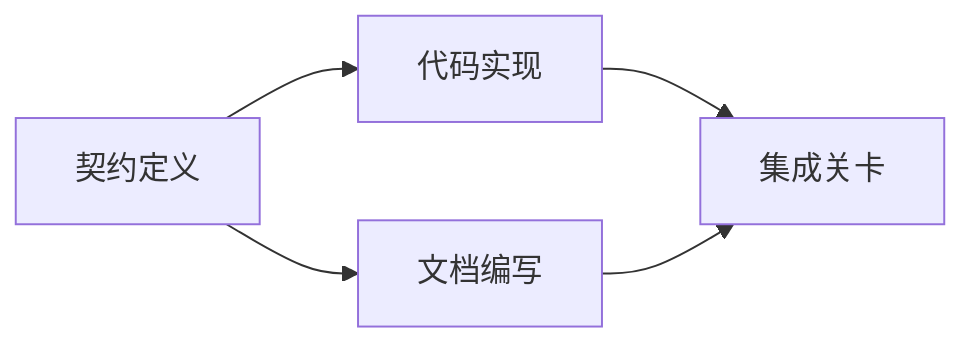

# إنشاء خطة تنفيذية بناء على الأدلة

> 计划 is definitely a more beautiful waiting list (قائمة العمل) . إنها رسمية تعتمد عليها: كل تحويل له أساس، كل نقطة نهاية لها دليل واضح على التحقق منها.

**Type:** Learn + Build
**Languages:** Python (stdlib)
**Prerequisites:** Phase 14 第 43 课
**Time:** ~65 分钟

## 學习目标

- تحويل إطار المهمة إلى مشروع عمل يحمل دليلًا موضوعيًا وإثبات التحقق.
- سوف تنفيذ ترتيب بناء النمط على صيغة العلاقة، وليس الخطوات الخطية المكتوبة.
- قبل تعديل الكود، فحص عدم وجود الحقائق 、 الاعتماد غير المعروف وكذلك الاعتماد الداخلي‬
- 区分哪些步骤可以并行执行,哪些步骤必须按序等.

## لماذا ينفشل خطة الذكاء دائماً

خطة الهشاشة هي مجرد إعادة تكرار احتياجات المستخدم في المستقبل:

1. تحديث إطار الإعدادات
2. إضافة تجربة
3. 更新文档──

لا يوجد أي بيان في هذا القائمة يوضح ما هو حقيقة الكود ، لماذا تغيير هذه الملفات صحيحة ، وما هي المواد التي تحتاج إلى تعديل الأولويات ، ولا يوضح أي عمل يمكن أن يتم إطلاقه.

خطة ثابتة للعمل في كل من المواد

| 承诺要素 | 核心作用 |
|---|---|
| 标识符（Identifier） | 用于依赖声明与会话交接（Handoff）的稳定引用 |
| 变更内容（Change） | 最小颗粒度的行为或契约改动 |
| 事实证据（Evidence） | 证明该变更合情合理且必要据实的代码库证据 |
| 前置依赖（Dependencies） | 必须率先完成并成立的前置工作项 |
| 验收证明（Proof） | 能够确凿宣告该工作项闭环的检查手段 |

## في التنفيذ المحدد قبل التخطيط

عندما تعتمد العديد من الكودات المختلفة على نفس السلوك ، يجب أن تكون الأولوية لتعريف اتفاقية السلوك.



هذا التوقف يظهر بوضوح إمكانية التطور الأمني: بعد إصلاح الميثاق، يمكن أن يتوافق تنفيذ الكود مع إعداد المستندات، بينما تنتظر مرحلة التكامل النهائية كل منهما جاهز.

## يجب أن يكون دليل الفعل قادرًا على تغيير خطة

في الواقع لا يوجد شيء لا يمكن فعله، يجب أن يكون قادرًا على التأثير على التخطيط العملي:

- اكتشاف وظيفة مساعدة موجودة، وبالتالي إزالة المستوى المفتاحي للمخطط الأصلي لإنشاء جديد.
- وجود اختبار التوافق، يجب أن يزيد خطة تحرك البيانات في خطة الإضراب.
- 部署环境的约束,将模式(Schema) تغير وتفريقها إلى مهمة مستقلة أخرى.
-  public response type format، تغيرت النظام الأول من إنجاز الكود والترتيبات التي تم إعدادها في المستندات.

إذا كان ما يُسمى بالدليل لا يمكن أن يغير خطتك، فمن المحتمل أن لا يكون دليلًا فعالًا على اتخاذ القرار.

## 面向会话中断而设计

编码智能体的会话往往会无预警中断──一个具有可恢复性(Resumable) المخطط، عمله المخططات الحجم دقيقة بما فيه الكفاية، بحيث يمكن أن تحكم على الفور عند دخول الاجتماع الآخر:

- 哪项工作已完成
- شهادة الوصول قد تم التنفيذ
- 哪些产品文件已修改;
- أي تعتمدات تم رفع العقبة؛
- المشاريع التي يمكن أن يتم بها بأمان هي ماذا؟

لا تترك حالة الإجراء فقط في مربع التخطيط في نافذة المحادثة.

## 计划有效性校验

في إطار التنفيذ الرسمي، إذا حدثت الحالات التالية، يجب رفضها مباشرة:

- وجود تعريفات للعمل
- عدم وجود دليل على حقيقة عمل
- عدم وجود دليل على قبول
- تعتمد على عمل لا يوجد فيه
- تتمثل الدورة في الدورة
- في غضون أن لا يتم التخلص من عدم اليقين المتعلق ، تم ترتيب أول عملية لا رجعة فيها.

يمكن إتمام الاختبارات الخمسة الأولى من خلال عملية الآلية الآلية ؛ والآخر يتطلب قدرة التحكم في المنهج ، يجب أن يُؤكد في المراجعة.

## بناءها

`code/main.py`建模了工作项,校验其证凭证,通过拓排序计算执行波次(执行波次),并将结果写入 `outputs/evidence-plan.json`.

运行命令:

```bash
python3 code/main.py
python3 -m unittest discover code/tests -v
```

في هذا المثال سوف تولد ثلاثة عمليات: أولاً تنفيذ تشريع محدد؛ ثم البرمجيات التنفيذية مع الملفات المكتوبة ومصدر النشاط؛ وأخيراً النشاطات المجمعة.

## 配合编码智能体使用

قبل السماح للجهاز الذكي بتغيير الملفات الكودية، تطلب منه أن يصدر هذا البرنامج أولا.

1. هل كل طريق و سلوك يحتوي على كود محدد
2. هل كل عمل لديه دليل واضح على الانتهاء من واحد واحد
3. يعتمد على ما إذا كان العمل سيكون مكلفاً أو لا يمكن إرجاعه بعد أن يتم إزالة عدم اليقين الذي يتعلق به.

الموافقة هي خطة واضحة محددة، وليس مجرد كلمة فارغة

## التدريب

1. إضافة عمل نقل قاعدة البيانات يحتاج إلى موافقة بشرية واضحة
2. تشكيل دائرة الاعتماد، وتفسيرها خلفها
3. 拆分一个包含两条不同证明命令的工作项.
4. إضافة واحدة يمكن أن تعمل في الموجة الثانية، و لا تلمس أي من المشاريع المفصلة الحالية.
5. سوف يخطط染 للتعرض على شكل Markdown، مع الحفاظ على JSON 作为单一事实来源──

## 延伸阅读

- [Nuseibeh and Easterbrook, Requirements Engineering: A Roadmap](https://www.cs.toronto.edu/~sme/papers/2000/ICSE2000.pdf): بحث العلاقة بين الهدف والنظام والاتفاق والتنمية
- [Barry Boehm, A Spiral Model of Software Development and Enhancement](https://dl.acm.org/doi/10.1145/12944.12948): شرح كيفية تنظيم عملية البحث والتطوير حول التخطيطات

## 交付物与沉

رجاءً احتفظوا بإنتاج`outputs/evidence-plan.json`ستعمل كإطار اتفاقية لتمويل المهام في الدورة التالية.
