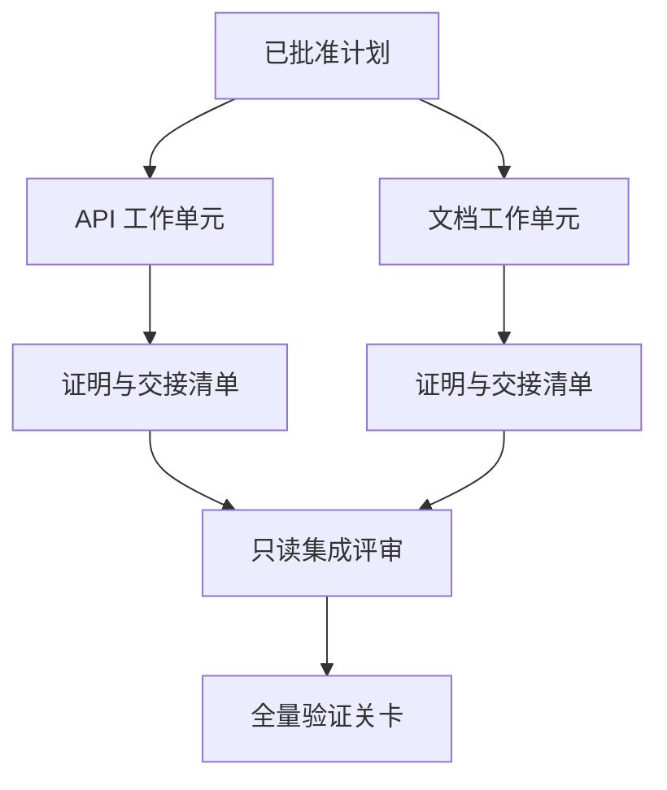

# الوكيل الموكب لـ"تفريق"

> وبالإضافة إلى ذلك، فإن الكائنات الذكية لا تستطيع أن توفر الوقت الفيزيائي إلا عندما تعمل بشكل مستقل عن بعضها البعض. وإلا، فإنها فقط تحويل مهمة واضحة إلى تكلفة تنسيق أعلى، وتسريع الفشل أسرع في الكوارث التعاونية.

**Type:** Learn + Build
**Languages:** Python (stdlib)
**Prerequisites:** Phase 14 第 39 课与第 44 课
**Time:** ~70 分钟

## 學习目标

- وفقاً لمهمة تحكم الاستقلال الحقيقي المفروض عليها وموافقةها، هل هذا أمر معقول؟
- وكل وحدة عمل (العامل) تمنح تصريحه بالوثائق
- على أساس الاعتماد على حساب الأمن
- 设计合并契约(合同合并) لتدمير آمن لمجموعة من المنتجات المنزلية الذكية.

## معايير الاختبار

لا تُكفّر فقط لأنّ هناك المزيد من الأجهزة الذكية المتاحة للقيام بمهمات المهام، ولكن فقط عندما يتمّ تلبية شرط واحد على الأقل من التوالي، يكون المهام معقولة:

- - تحقيقتان قادرة على حل مختلف المشاكل المجهولة بشكل مستقل
-  إنجاز اثنين من الكود أن يكون هناك طرق وثائق متداخلة مع الاتفاقية؛
- 评审智能体 ((المراجع) قادر على إجراء التفتيش بشكل مستقل على أساس المنتج غير المعدل
- يمكن إجراء فحص خارجي طويل الأمد في الوقت نفسه في العمل المحلي.

عندما تحتاج العديد من الكائنات الذكية إلى تعديل نفس الملفات، وتعتمد على نفس القرارات غير المحلّة، أو تعتمد على نفس البيئة المتغيرة، يجب أن تتمرّد على التنفيذ.

## 工作单元就是一份契约

كل وحدة عمل تم تكليفها تحتاج إلى تحديدات واضحة:

| 字段 | 含义 |
|---|---|
| 目标（Goal） | 单一可观测的结果 |
| 负责人（Owner） | 单一负责执行的工作智能体 |
| 路径（Paths） | 排他的写入所有权 |
| 前置依赖（Dependencies） | 启动前必须已完工的前置单元 |
| 证明（Proof） | 返回给集成者的确凿验证证据 |
| 交接清单（Handoff） | 已修改的文件、已做出的决策以及残留风险 |

 المعالجة  لا تكون وحدات العمل المختصة `app/accounts.py`تم تنفيذ فحص المقاييس المعدنية وإجراء اختبار تخصصي لمراقبة الحسابات لتثبت أن الوحدة العمل المؤهلة هي

## نظام ثلاثي المستوى

1. **文件系统隔离（Filesystem isolation）：**独立工作树 (شجرة عمل) أو صندوق عمل، لمنع وقوع وقوع غير متوقع
2. **所有权隔离（Ownership isolation）：**嚴格的契约限制, منع جسمين ذكيان عن عمد تغيير نفس الطريق.
3. **状态隔离（State isolation）：**独立日志和输出目录, منع جسم ذكي يغطي دليل على ثقل جسم ذكي آخر.

لا يمكن حل مشكلة حقوق الملكية في التصميم. لا يزال هناك احتمالات لإنتاج اثنين من الأشجار المشتركة في تصميمات بنية متضاربة.



## 集成者不负责重构代码

يجب أن تكون المهام المشتركة:

1. تأكيد أن كل نتيجة للاتصال تقع بشكل صارم ضمن نطاق توزيعها
2. 认真审查验证证明的输出, وليس مجرد ملخص كتب من قبل أعمى信工作智能体;
3. 按照依赖关系的时间序依次合并改动;
4. 运行覆盖跨单元的全量验证关卡
5.  दृढ़ly reject any hidden scope spread (توسيع نطاق الإخفاء) ؛
6. سجل الصراع لتحقيق القرارات الجديدة التي تحتاج إلى حل، وليس تغييرات صامتة.

إذا كانت مرحلة التكامل تحتاج إلى إعادة كتابة معظم منتجات الكود في جهاز عمل ذكي، فان تحليل المهمة الأولية هو خطأ في حد ذاته.

## تقسيم أدوار الإنسان والجهاز الذكي

ولا يعني تفويض المهام التخلي عن قدرة الإنسان على الحكم. البشر لا يزالون يسيطرون على القرارات الأساسية التي ستغير سلوك النظام الخارجي، ودرجة المخاطر، أو السلطة الأمنية أو تجلب تكاليف لا رجعة فيها.

هذا هو**校准型自主（Calibrated Autonomy）**: أنظمة توفر الحرية الكبيرة للجهاز الذكي في مكان ما يثبت ذلك بشكل كامل وسهل التداول، في غضون ذلك، في الحالات الرئيسية التي تفرض على البشر أن يُقيموا أوراق فحص.

## بناءها

سوف يقوم برنامج التجربة في هذا الدراسة بفحص الطرق المتداخلة ، والتحقق من الاعتماد ، والتنفيذ من الموجات التنفيذية للسلامة الحسابية ، و سوف تنبع النتائج إلى`outputs/delegation-plan.json`.

运行命令:

```bash
python3 code/main.py
python3 -m unittest discover code/tests -v
```

尝试修改文档单元,جعلها تملك `app/`حالياً، يجب أن يتم إيقاف خطة الإعدادات وتقديمها تلقائياً.

## التدريب

1. تغيير العمل الحقيقي وتقسيمه إلى وحدتين مستقلة من العمل التابعين ودور واحد تجمع.
2. إيجاد نظام منفصل يبدوا على الجانب المعتاد مستقلًا ولكن في الواقع متوافقًا ، يوضح بوضوح أن هذه القرارات السرية مشتركة.
3. 增加一个只读的研究型智能体 (نوع من الموظفين البحثيين) ، إنتاجها ليكون جزءا من المعلومات.
4. 增加一个合并关卡(Merge Gate),对照所有工作单元契约检查最终修改的文件集合──
5. لحد العمل تعريف إزالة القواعد: عندما يكون التوقف السابق يعتمد على الفشل، وتوقف التنفيذ التالي.

## 延伸阅读

- [Reid Smith, The Contract Net Protocol](https://doi.org/10.1109/TC.1980.1675516): تقسيم المهام الموزعة ومعلومات النتائج
- [Eric Horvitz, Principles of Mixed-Initiative User Interfaces](https://dl.acm.org/doi/10.1145/302979.303030): بحث آلية التشغيل الذاتي متى ينبغي أن تعمل بشكل مستقل

## 交付物与沉

رجاءً احتفظوا بإنتاج`outputs/delegation-plan.json`تُسجل لماذا يكون نظام الانفصال آمن  كل طريق للعودة إلى ملكيته، وكذلك ما هو دليل على ضرورة التكامل
