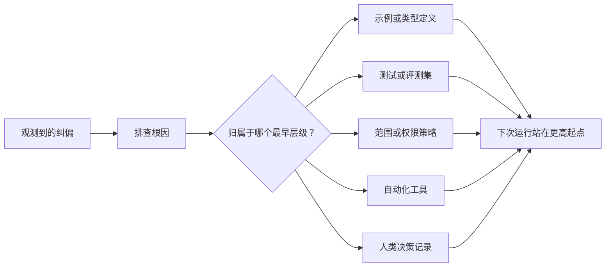

# كل عميل سيتم تحويله إلى محسن

> فقط البقاء في سجلات المحادثة يمكن أن تصحيح فقط هذه المرة الحالية، بينما التوقف على الاختبار، استراتيجية الحدود، أو المثال أو الجهاز التحكم، يمكن أن يجعل كل عملية لاحقة أفضل.

**Type:** Learn + Build
**Languages:** Python (stdlib)
**Prerequisites:** Phase 14 第 37 至 41 课
**Time:** ~65 分钟

## 學习目标

- سيتم تحويل التحكم المؤقت في الأجهزة الذكية إلى آلية تحكم نظامية طويلة الأمد.
- وضع كل جهاز تحكم قادر على منع تكرار المشاكل في أول مستوى
- استخدام علامات إصبع ثابتة للتدريب على إعادة التدريب
- 及时退役那些不再应对现实风险的旧控制规则──

## التصديق في حد ذاته هو دليل قيم

عندما تقول للجهاز الذكي "لا تنسخ الملف" ، فقد وجدت بالفعل: حدود المجال الحالي (حدود النطاق) عدم وجود قيود قابلة للتنفيذ. عندما تشير إلى أن هذا الناتج من شكل الخطأ، فقد وجدت في الواقع عدم وجود مثال معياري أو اختبار التلقين. عندما يذكر إعداد البيئة خطأ مرة أخرى ، تدرك أن المعلومات البيئية المبدئية يجب أن تكون متواضعة في الكتابة التلقينية.

يجب أن نعتبر تصحيحات الجهاز الذكي كإدراك ملاحظي للخلل في النظام العامل نفسه ، وليس كخطأ في اللغة في وقت مبكر.

## 提升沉重 إلى أوائل مستويات فعالة

التحكم في الأولويات التالية:

| 频发故障类型 | 长效沉淀去处 |
|---|---|
| 错误计算结果或代码回归 | 自动化测试或评测集（Test / Evaluation） |
| 超范围越界或不安全操作 | 范围契约或权限策略（Scope / Permission Policy） |
| 重复出现的环境配置或命令错误 | 自动化脚本或专用工具（Automation / Tool） |
| 重复出现的输出格式错误 | 标准规范示例外加数据校验器（Canonical Example + Validator） |
| 模糊不清的本地工程惯例 | 附带具体场景检查的指令（Instruction + Scenario Check） |
| 产品层面的分歧与争议 | 人类决策记录（Human Decision Record） |

越早生效控制机制成本越低── ‬‬‬‬‬‬‬‬‬‬‬‬‬‬‬‬‬‬‬‬‬‬‬‬‬‬‬‬‬‬‬‬‬‬‬‬‬‬‬‬‬‬‬‬‬‬‬‬‬‬‬‬‬‬‬‬‬‬‬‬‬‬‬‬‬‬‬‬‬‬‬‬‬‬‬‬‬‬‬‬‬‬‬‬‬‬‬‬‬‬‬‬‬‬‬‬‬‬‬‬‬‬‬‬‬‬‬‬‬‬‬‬‬‬‬‬‬‬‬‬‬‬‬‬‬‬‬‬‬‬‬‬‬‬‬‬‬‬‬‬‬‬‬‬‬‬‬‬‬‬‬‬‬‬‬‬‬‬‬‬‬‬‬‬‬‬‬‬‬‬‬‬‬‬‬‬‬‬‬‬‬‬‬‬‬‬‬‬‬‬‬‬‬‬‬‬‬‬‬‬‬‬‬‬‬‬‬‬‬‬‬‬‬‬‬‬‬‬‬‬‬‬‬‬‬‬‬‬‬‬‬‬‬‬‬‬‬‬‬‬‬‬‬‬‬‬‬‬‬‬‬‬‬‬‬‬‬‬‬‬‬‬‬‬‬‬‬‬‬‬‬‬‬‬‬‬‬‬‬‬‬‬‬‬‬‬‬‬‬‬‬‬‬‬‬‬‬‬‬‬‬‬‬‬‬‬‬‬‬‬‬‬‬‬‬‬‬‬‬‬‬‬‬‬‬‬‬‬‬‬‬‬‬‬‬‬‬‬‬‬‬‬‬‬‬‬‬‬‬‬‬‬‬‬‬‬‬‬‬‬‬‬‬‬‬‬‬‬‬‬‬‬‬‬‬‬‬‬‬‬‬‬‬‬‬‬‬‬‬‬‬‬‬‬‬‬‬‬‬‬‬‬‬‬‬‬‬‬‬‬‬‬‬‬‬‬‬‬‬‬‬‬‬‬‬‬‬‬‬‬‬‬‬‬‬‬‬‬‬‬‬‬‬‬‬‬‬‬‬‬‬‬‬‬‬‬‬‬‬‬‬‬‬‬‬‬‬‬‬‬‬‬‬‬‬‬‬‬‬‬‬‬‬‬‬‬‬‬‬‬‬‬‬‬‬‬‬‬



## (كتابة (راتشي)

يجب أن يحتوي السجل الكامل على:

- بسبب الاضطرابات
- 根因分析 ((سبب الجذر) ؛
- 造成的后果(نتيجة) ؛
- 重复出现次数 (عدد التكرار) ؛
- الجهاز المختار للسيطرة
- طريقة التحقق من الجهاز التحكم
- 责任人(مالك)
- 审查或退役日期 ((مراجعة / تاريخ التقاعد) 』

لا تثبت كل إيجابية إيجابية للأفراد بشكل دائم. فقط عندما تكون تردد تكرار المشاكل أو خطورة النتائج المحتملة كافية لإثبات زيادة معقولية التعقيدات الحافظة على المدى الطويل، يمكن تحسينها إلى آلية مراقبة دائمة.

## 区分根因与表象

 المجهر الذكي يغير قراءة مجرد إظهار.

- إطار المهمات يسمح بتعديل كل كود كوكين كود كوكين
- الملفات المستندية تعتبر بشكل عام قابلة للتحرير الآمن.
- تنفيذ خطة تنفيذية ستعمل على تحقيق وظائفها مع كتابة الملفات مرتبطة معها.
- اثنين من العمل الذكي وجود على التكلفة الملفات الملكية.

مختلفة الأصول للاستجابة مختلفة تماما وسائل التحكم. إذا كان فقط الآلية تحظر كتابة صورة نسخة، في المرة القادمة التي تظهر نفس المشاكل في شكل تغيير طفيف، فإن النظام لا يزال سوف يفقد مرة أخرى.

##                                                                                                                                                                                                                                                                                                                                                                                                                                                                                                                              

ستحدث قواعد التحكم القديمة صراعًا ، وتتزايد على نافذة النظام التالي ، وتثبت تلك التي لم تعد موجودة منذ فترة طويلة. كل قاعدة يتم رفعها في الوزن تحتاج إلى فحص إعادة التأهيل بانتظام. في الحالات التالية يجب القرار بإزالة أو إعادة كتابة:

- تم تغيير بنية الأساسية
- تم وضع آلية تحكم قابلة للتنفيذ أقوى ستستبدلها
- في فترة طويلة من الزمن ، لم يعود الاختراق مرة أخرى.
- وقد تجاوزت العقبات والانحرافات التي تسببها القاعدة نفسها من المخاطر التي تمنعها منها.

الهدف من المهندسية ليس كتابة أطول وثائق تعليمية، ولكن باستخدام آلية نظامية أدنى الحد للحفاظ على تلك القوى المهندسية التي لا تصل بسهولة.

## بناءها

سيتم إجراء عملية تجريبية في هذا الدروس لتقسيم التصحيحات ، وتطويرها إلى آلية تحكم ، وتوليد الصفحة الأصلية لترقيمها ، ويكتب النتائج .`outputs/feedback-ratchet.json`.

运行命令:

```bash
python3 code/main.py
python3 -m unittest discover code/tests -v
```

حاول إدخال بيانين مختلفين ولكن متأصلين من نفس التأثيرات.

## التدريب

1. من خلال الحديث الأخير، تم تحديد 5 قواعد للتحليل والتحليل إلى مستوى الفشل الحقيقي.
2. إعادة بناء قواعد النص على متن محمولة إلى اختبار آلي قابل للتنفيذ.
3. زيادة الوزن الناتجية (تقييم الوزن الناتج) ، مما يجعل الخطأ الخطأ الخطأ الخطأ يمكن أيضاً تحديده على الفور إلى التحكم الدائم.
4. في تجربة الإنتاج والإصدار، كل جهاز تحكم يُكمل المسؤولين عن التخفيضات.
5. • مراجعة إرشادات الجهاز الذكي الحالية، وإثبات وجود آلية تحكم أقوى لها، وإزالتها

## 延伸阅读

- [Basili, Caldiera, and Rombach, The Goal Question Metric Approach](https://www.cs.toronto.edu/~sme/CSC444F/handouts/GQM-paper.pdf): استكشاف كيفية تحويل أهداف الدرجة العليا إلى مشاكل ومعايير قياسية قابلة للتنفيذ
- [Shinn et al., Reflexion](https://arxiv.org/abs/2303.11366): تعريف كيفية استخدام الالتزام للتحسينات والقيام بالقرارات اللاحقة، دون الحاجة إلى تحليل الوزن النموذجي
- [Madaan et al., Self-Refine](https://arxiv.org/abs/2303.17651): في المهام المغلقة داخل تنفيذ التغييرات التالية

## 交付物与沉

رجاءً احتفظوا بإنتاج`outputs/feedback-ratchet.json` هي النتائج النهائية والطويلة من طريق المساعدة في مجال الهندسة الذكية، كما أنها أيضاً إدخال أساسي لمكتب العمل في المستقبل.
