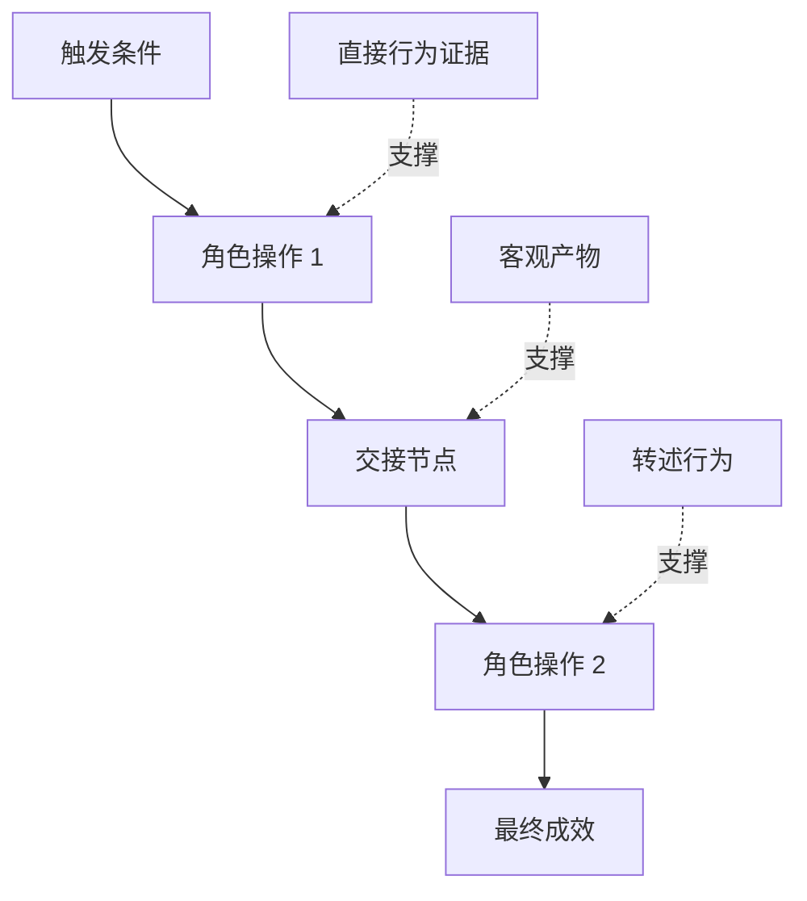

# 发掘人们真正执行的工作流

> الحاجة الحقيقية لن تجلس أبداً في غرف الاجتماعات التي تأتي لتجمعها.

**Type:** Learn + Build
**Languages:** Python (stdlib)
**Prerequisites:** Phase 14 第 47 课
**Time:** ~70 分钟

## 學习目标

- أن تكون النظام التنفيذي الذي يُؤدي إلى بناء عمليات العمل الحالية على أساس الدليل.
- التمييز بين الملاحظة المباشرة للحقائق والتحويل أو التوصيل إلى النتائج.
- 定位流程中的摩擦阻力(فرق) 交接节点(تسليمات) 审批权限(سلطة) و隐性状态( hidden state)
- الحفاظ على عدم اليقين على الظهور الواضح للموضوع، ولكن لا يمكن أن يتحول بشكل سهل إلى حاجة صلبة مباشرة.

## من النظام الحالي

لا تبدأ في سؤال المستخدم عن ما يريدونه من وظيفة يجب عليك القيام به الآن

وبالنسبة لكل خطوة في التدريبات، قم بتسجيل المقاطع التالية:

| 字段 | 示例 |
|---|---|
| 执行角色（Actor） | 值班工程师 |
| 触发条件（Trigger） | 生产环境告警到达 |
| 具体操作（Action） | 打开告警详情，随后在监控看板中搜索 |
| 输入信息（Input） | 告警 Payload 与发布记录 |
| 产出结果（Output） | 疑似故障服务及责任人 |
| 摩擦阻力（Friction） | 在三个不同运维工具之间来回切换上下文 |
| 审批权限（Authority） | 事故指挥官批准执行写入操作 |
| 支撑证据（Evidence） | 屏幕录像、事故复盘日志、运维手册 |

يتضمن التدفقات الحقيقية للعمل أكثر فاصلة من الواجهة التي تظهر على الشاشة. يتضمن ذلك الوقت الانتظار، نسخ التلصق، الخطوط الخاصة، عملية الموافقة، والإصلاح الخطأ، والحركات الصغيرة التي اعتاد الناس على إعتادتها، حتى أن لا يدركوها.

## الأدلة على وجود مستوى قوي ضعيف

建立简单的证据阶梯(دليل السلم):

1. **直接行为（Direct behavior）：**现场观测、系统调用追踪(تتبع) 、屏幕录屏或系统事件日志。
2. **客观产物（Artifact）：**سجلات العمل، رسالة عمل، دفتر المراجعة، وثائق النتائج المكتملة.
3. **转述行为（Reported behavior）：**الناس تصف بأفواههم ما يفعلونه عادة
4. **主观推断（Inference）：**المجموعة تقرر ما سيحدث

هذه المصادر الأربعة لها قيمة، ولكن فقط الاثنان الأولين يمكنهم التأكيد على السلوك الواقعي الحالي مباشرة. يجب أن يضع علامة واضحة على الاثنين الأخيرين، لمنع ثقة الفريق في الحقائق المفقودة من الارتفاع.



## 重点搜寻四大要素

- **摩擦阻力（Friction）：**تعدد العمل المضطرب، لا داعي للتأجيل في الانتظار، إعادة تسجيل البيانات أو إعادة إصابة المضطرب.
- **隐性状态（Hidden state）：**فقط يبقى في عقول الموظفين ‬التسجيلات المباشرة أو المعلومات في الملاحظات الشخصية‬‬
- **审批权限（Authority）：**الحق في اتخاذ قرارات مهمة ذات عواقب كبيرة من قبل الموظفين أو النظام المسيطر عليها.
- **异常分支（Exceptions）：**عادةً ما يحدث انقطاع في العملية، لا يعد هناك أي شيء يتعلق بالعمل.

وغالباً ما يكون السبب في انهيار وظائف الذكاء الاصطناعي في كثير من الأحيان عندما يتواصل مع المعالجة غير عادية ، لأن في البداية تم تصميمها فقط لمعالجة كل شيء بشكل جيد.

## لا تسمحوا لي أن أطلبكم

يجب أن يحتفظ المستخدمون بالكامل بهذه التغيرات، لأنها قد تمثل:

- أدوار تنظيمية ومسؤوليات مختلفة
- مستوى التسامح مع المخاطر مختلف
- التبديل بين التدفقات القديمة والتي تمتد
-  الفرق بين الخبرة المهنية والمهارة
- استراتيجيات الأعمال الحقيقية والإدارة

تدفق العمل في مجال التعبير، لا يمكن وصف أي شخص حقيقي

## بناءها

ويتم إدراج النتائج في المادة التالية:`outputs/workflow-evidence.json`.

运行命令:

```bash
python3 code/main.py
python3 -m unittest discover code/tests -v
```

尝试增加一条部署记录缺失的异常分支路径──保持主流程顺序不变,并清晰记录该分支的起点位置──

## التدريب

1. لا تحدث مع أي شخص، فقط مع نظام واحد من أداء المقالة
2. المقابلة أحد المستخدمين الحقيقيين، علامة على جميع المستخدمين الذين يشاركونها في الموقع لا يزال هناك نقص في بياناتهم.
3. 增加一处权限审批边界(حدود السلطة) وخطوة
4. تُظهر تغيرات في التدفقات المختلفة على نفس المشهد، دون أن تُنفذها معاً.
5. إيجاد وظيفة جديدة للمقترح: على الرغم من أنه قد أزال على الجانب الآخر عملية مرئية، إلا أنه لا يلمس تماماً العمل الخفي الخلفي.

## 延伸阅读

- [Nuseibeh and Easterbrook, Requirements Engineering: A Roadmap](https://www.cs.toronto.edu/~sme/papers/2000/ICSE2000.pdf): التركيز على تحديد الاهتمام بالتحقيق في الاحتياجات هو التفريغ والبناء والتحقق وليس مجرد التعبير عن المعلومات.
- [Gotel and Finkelstein, An Analysis of the Requirements Traceability Problem](https://doi.org/10.1109/ICRE.1994.292398): تحليل الصعوبات الصعبة في الالتزام بالعلاقة بين احتياجات الحفاظ على الأساس والإستنادا إلى المصدر

## 交付物与沉

رجاءً احتفظوا بإنتاج`outputs/workflow-evidence.json`في الدروس التالية، سوف تحويل المقاومة واللامتأكد من التضارب الملاحظ إلى مخطط افتراضي (خريطة افتراضية)
