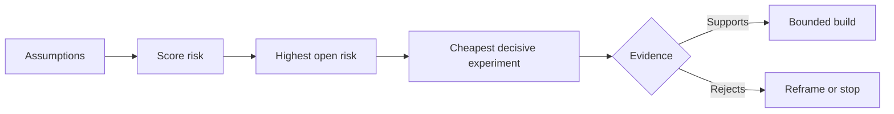

# 理假设并优先化解最高风险

> 产品路线图 (路线图)  roadmap) 往往把不确定性掩盖在功能列表中;而假设图谱 (假设图谱) 假设图) 则会揭示: قبل أن يتم بناء هذه الوظائف، يجب أولاً تأكيد ما هي الظروف المسبقة التي يتم وضعها.

**Type:** Learn + Build
**Languages:** Python (stdlib)
**Prerequisites:** Phase 14 lesson 48
**Time:** ~65 minutes

## 學习目标

- سوف يتم تفكيك العمل المقترح و تحويله إلى افتراضات واضحة واضحة
- 分别对影响程度 (أثر) 、不确定性 (不确定性) 及不可逆性 (不可逆性) ◎
- 风险排序选择下一个实验,而不是 باستخدام موضوعية حرارة محركها
- تستخدم الأدلة والقرارات القرارية المحددة بدلا من فرضية الاختبار.

## كل عملية بناء هي شرط

واحد من أدوات الوقوع في الحوادث (التي تتمثل في:

- المعلومات الواردة في الإشعارات تحتوي على معلومات كافية لتحديد خدمات الإعاقة.
- المهندسين يثقون في نتائج التوصيات التي تمت تقديرها
-  الوقت المتوقع للرد على النقل هو أمر حاسم جداً على المستوى التنفيذي.
- يمكن الوصول إلى البيانات المطلوبة على شرط عدم إدخال حقوق غير آمنة
- وتتكرار حدوث هذه التدفقات الكافية، لتثبت أن تكلفة صيانة النظام معقولة.

هذه ليست مجرد كود لتنفيذ المهام، ولكن جعل البناء يصبح قيمة، قابل للاستخدام، قابل للاستخدام، يمكن القيام به، ويمكن تحقيقه، ويكون آمنا.

## 假设的类别

| 类别 | 核心问题 |
|---|---|
| 价值（Value） | 产出的最终结果是否足够重要？ |
| 可用性（Usability） | 用户能否理解并据此采取行动？ |
| 可行性（Feasibility） | 现有系统能否利用可获取的数据和约束产出该结果？ |
| 存续性（Viability） | 组织能否长期承受其成本、归属权与运维负担？ |
| 安全性（Safety） | 系统出现故障时是否不会造成无法接受的后果？ |

سوف نكتب فرضية إلى بيانات يمكن تصحيحها. فالمفترض أن تكون حقيقة مشاهدة واضحة يمكن تحديدها من الناحية المنطقية.

## 风险 ليست رقم واحد

هذه التجربة من 1 إلى 5 من المقاييس لتقييم ثلاثة أبعاد:

- **影响（Impact）：**إذا لم يتم التوقيع على ذلك، فستكون هناك حد من التدمير الذي قد تسببه النظام أو الأعمال.
- **不确定性（Uncertainty）：**درجة ضعف الادلة التي تملكها في السابق
- **不可逆性（Irreversibility）：**في إجراء تعهدات أو إدخال كبير فقط بعد اكتشاف تكاليف العودة الخطأ.

مثالية الاعتبارات سوف تؤثر على عدم اليقين، و يضاف إلى عدم الرد. هذه الصيغة ليست معايير مقبولة لها، والغرض منها هو إجبار الفريق على توضيح لماذا يجب أن يكون شيء ما غير معروف أولوية على حل غير معروف.



## 设计实验,而不是 رسم التأكيد

تجربة ذات قيمة حقيقية لها العناصر التالية:

- ويمكن أن تكون مشهدة
- مجموعة من المُستقبلين الحقيقيين أو نموذج ممثلي؛
- نتيجة ذات نظرة مرئية
- في رؤية النتيجة قبل تحديد القيمة المحددة
-  إدارة القرارات المقبلة على طريقها المحدد من خلال 、 الفشل والثبات المظلم

避免 designs that are merely to prove the team have the ability to make this idea out التأكد من أن الاختبار الروحي

## 可逆性会改变构建顺序

后果严重且不可逆的选择需要更早获得证据支持──只读重放(只读重播) يجب أن يكون أولًا لتنسيق بيئة الإنتاج ؛ يمكن أن يكون جهاز التكيف المؤقت قد يكون أولًا لتحويل البيانات على نطاق واسع ؛ يجب أن يكون أولًا لتنفيذ التوصيات الاصطناعية بشكل كامل.

يجب أن يتوافق مع معدل تحليل عدم اليقين.

## 动手实现

هذا التجربة تقوم بتنظيم الافتراضات، وتمييز بين الافتراضات المثبتة والغير المحددة، واختيار المفترضات غير المحددة الأكثر خطورة، وتوليد`outputs/assumption-map.json`.

```bash
python3 code/main.py
python3 -m unittest discover code/tests -v
```

修改 حالة الأدلة على فرضية أعلى风险، مشاهدة النظام

## 课后练习

1. و أنت مستعد لبناء وظيفة و كتابة خمسة مفروضات رئيسية
2. 补充一条您原本的功能列表中遗漏的安全假设──
3. و أن يحدد أحد ما سيقوم بك أن تنتهي من صلابة البناء
4. استبدال تجربة اختبارية كبيرة أصلاً بتكلفة أقل وامتلاك اختبارات حاسمة
5. مقارنة مع الأولوية لخطر المنتج الأصلي، ومشرح لماذا هناك خطأ في المنتج الأصلي.

## 延伸阅读

- [Barry Boehm, A Spiral Model of Software Development and Enhancement](https://dl.acm.org/doi/10.1145/12944.12948)، بحث في عملية تدخل أعمق قبل حل عدم اليقين من دورة التنمية المحفزة على المخاطر.
- [Dardenne, van Lamsweerde, and Fickas, Goal-Directed Requirements Acquisition](https://doi.org/10.1016/0167-6423(93)90021-G) ، بحث في تحسين أهداف النظام في الوقت نفسه في التعرض للتعوقات والقيود تدريجيا.

## 交付物沉

حافظ`outputs/assumption-map.json` القسم التالي من الدراسة سوف تستفيد من هذه الملفات اختيار قادرة على إنتاج أقصر قطع من الأدلة القرارية
