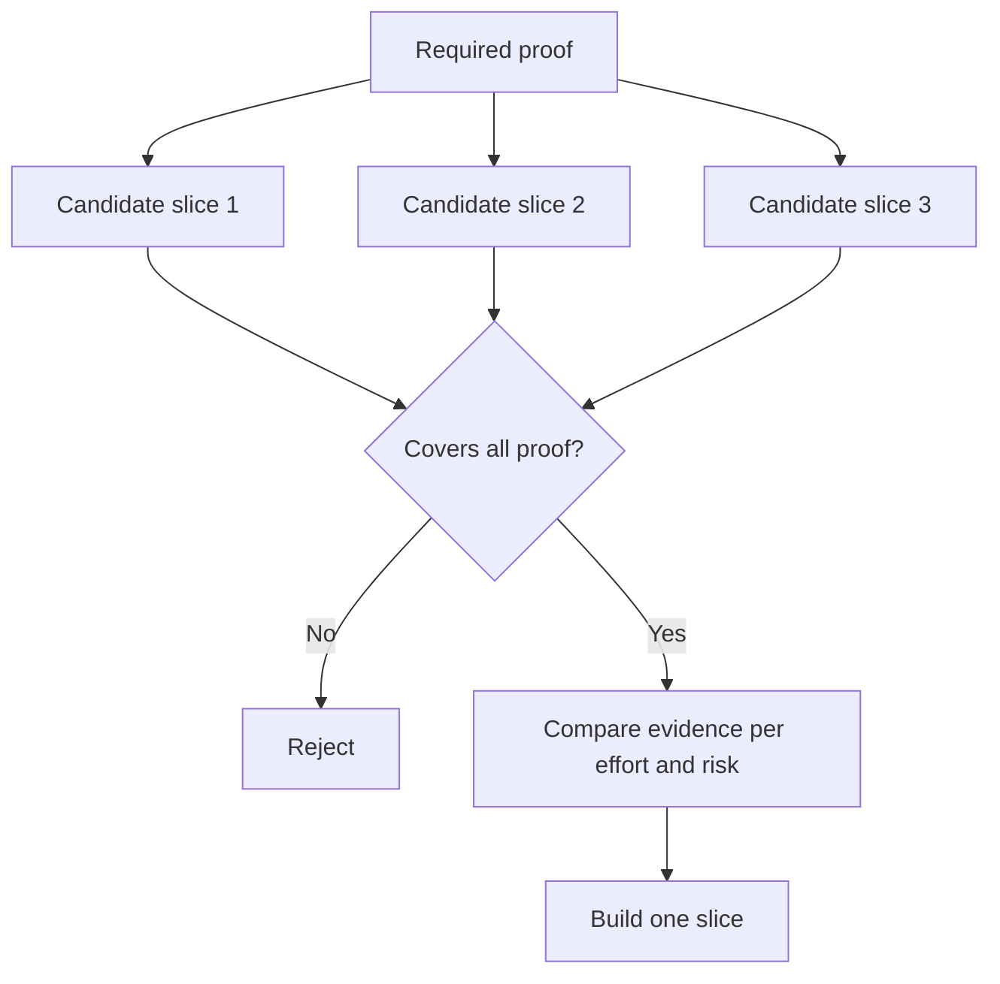

# 选择能够改变决策 最小的切片

> فقط عندما تكون الصغرى قادرة على إثبات المشكلة الرئيسية، فإن التحليل ليس له قيمة.

**Type:** Learn + Build
**Languages:** Python (stdlib)
**Prerequisites:** Phase 14 lesson 49
**Time:** ~65 minutes

## 學习目标

- وفقاً لفرضات القصص التي يمكن أن تثبتها،
- 权衡结果价值(قيمة النتيجة)、 عدم اليقين性化解、研发投入与潜在后果──
- الاختيار الأولوي للثبات الحقيقي، وليس الالتزام بالولادة المبكرة.
- القرار أو القرار تلك المخططات لتجنب العمل

## المقطع المباشر يعني حقيقة نهاية إلى نهاية

垂直切片(Vertical Slice) هو الحد الأدنى من العمل الحقيقي اللازم لتحقيق نتيجة من خلال تجربة. يمكن أن يكون ضيقًا جدًا في عدد المستخدمين ، حجم البيانات ، دورة التشغيل ، ومدى الوظائف ، ولكن لا يمكن أن يفرض عدم اليقين الأساسي في الاختبار.

نموذج:

- على أساس 10 起真故障的只读重放 (تدوين القراءة فقط) ، قادرة على اختبار خدمة تحديد دقة والثقة من المدير.
- على أساس بيانات مصنوعة من أجهزة أجهزة دقيقة، ربما يمكن أن تحقق فهم الواجهة، ولكن لا يمكن أن تختبر تماما الوصول إلى البيانات.
- محاولة إصلاح الأخطاء التلقائية تحت بيئة الإنتاج، محاولة اختبار كل عناصر مرة واحدة، ولكن أدت إلى خطر كبير من التدمير غير المقبول.

## قبل أن يُحدد الضروري

提取风险最高的未决假设,将将其转化为必要证据集 (需证据集) ── 切片候选人只有在完全覆盖该证据集时,才具备入选资格 (合格) ──

ثم يتم إجراء تقييم مقارنة بين قطع المرشحة:

| 评估维度 | 期望方向 |
|---|---|
| 产出价值（Outcome value） | 越大越好 |
| 化解的不确定性（Uncertainty reduced） | 越多越好 |
| 研发投入（Effort） | 越小越好 |
| 潜在后果（Consequence） | 越轻越好 |
| 可逆性（Reversibility） | 越高越好 |

نموذج تقييم المستخدم في هذا التجربة هو أن يبقى بسيطاً، لأن إعداد المهارات (الجهاز) هو أكثر أهمية من الحساب الرقمي نفسه.



## 常见的伪极小值陷

- **纯界面极小值（UI-only minimum）：** تجنب الحصول على البيانات الأساسية والتحقيق غير المثالي
- **纯基础设施极小值（Infrastructure-only minimum）：**تثبت التكنولوجيا المطبقة، ولكن لا يمكن اختبار قيمة المستخدم.
- **纯顺境极小值（Happy-path minimum）：**刻意省略构成大部分风险的异常边界处理.
- **演示极小值（Demo minimum）：**وقد أُنتجَتِ المنتجات المثيرة للكثير من الإقناع، لكنها لم تُقدِّم تقييمًا كميًا قابلاً للرد.
- **平台化极小值（Platform minimum）：**في الوقت الذي لم يتم فيه تأكيد قيمة العمل الواحد، كان من المبكر بناء مكونات إعادة الاستخدام العامة.

## 预先设定停止规则

قبل أن يبدأ التنفيذ، يجب أن يكتب كتاباً واضحاً إذا فشلت هذه اللقطة في اختبار التجربة، سيتم اتخاذ الإجراءات:

- ترك هذا النتيجة المتوقعة
- تحويل المجموعة المستهدفة للمستخدمين أو المشهد التجاري؛
- الاختبار الاختيار التقني الآلية؛
- جمع أدلة أساسية ذات جودة أعلى
-  إضافة إضافية إلى تقييد نظام

إذا كانت نتائج كل اختبار في نهاية المطاف تتجه نحو المتابعة في البناء، فإن هذه القطعة ليست تجربة حقيقية على الإطلاق.

## 动手实现

هذه التجربة بناء على الأدلة الضرورية تم تقييم المنتخبين المختصين`outputs/slice-decision.json`.

```bash
python3 code/main.py
python3 -m unittest discover code/tests -v
```

حاول إضافة تكلفة أقل ولكن فقط يمكن أن يثبت المفترض الواحد من المحتملات. لاحظ أنه حتى لو كانت القيمة العددية عالية جداً، لماذا لا تزال مؤهلة مباشرة للوقوف.

## 课后练习

1.  تخصيص ثلاثة قطع من الاختبار على نفس النتائج المتوقعة لتتوافق مع مختلف المستويات
2. قبل تقييم المشاركين، قم بتقديم قائمة واضحة لأدلة ضرورية.
3. 尝试裁减一项功能,同时确保能够保留关键决定性证据──
4. لتنظيم المحاولة المكملة لقانون وقف عمليات عملياتها
5. بحث عن سبب يجب تأخيره إلى التحقق من التحقق من المقطع بعد إعادة تشغيل المكونات المشتركة للمنصة

## 延伸阅读

- [Barry Boehm, A Spiral Model of Software Development and Enhancement](https://dl.acm.org/doi/10.1145/12944.12948)، استكشاف كيفية تكييف كل دورة تطورية مع المخاطر التي يجب تحليلها حاليا.
- [Lenarduzzi and Taibi, MVP Explained: A Systematic Mapping Study on the Definitions of Minimal Viable Product](https://arxiv.org/abs/1609.07592)في عملية هندسة البرمجيات الفحرية، تُحدد الحد الأدنى من التوضيحات التي يمكن القيام بها.

## 交付物沉

حافظ`outputs/slice-decision.json` هذا الملف يُسجل سبب وجود هذه القطعة في أساس أدلة على أنها قادرة على تغيير القرار
