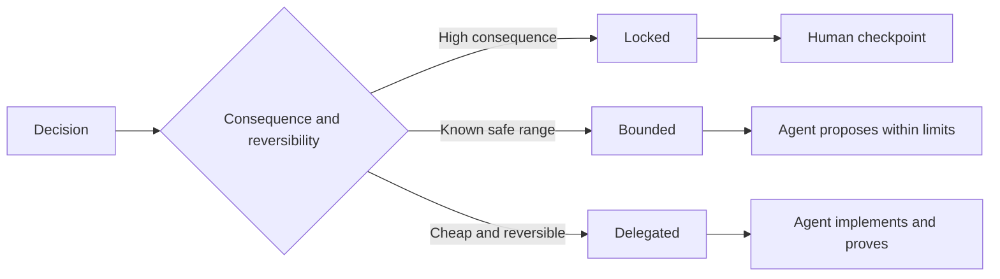

#  صياغة مواصفات المهام للحفاظ على حق القرار الذاتي

> يجب أن يكون القواعد ذات القيمة ثابتة مع الأدلة، مع الاحتفاظ بالفتوح في اختيار التحقق من العكس.

**Type:** Learn + Build
**Languages:** Python (stdlib)
**Prerequisites:** Phase 14 lesson 50
**Time:** ~75 minutes

## 學习目标

- 将预期产出、不变量(غيرات) 、范例、非目标(غير أهداف) مع إثباتات تصريح
- 将决策划分为锁定 (مغلق) 限 (محدود)
- في اختيار الحلقة ذات التكلفة المنخفضة والمتعكسة للغاية، يحفظ وكيل الحكم الذاتي تماما.
- في النقاط التي تتعلق بالعواقب الخطيرة أو التدمير في السلوك العام، يجب إعداد نقاط فحص إصطناعية (بوابات فحص إنسانية)

## -أصير فظيع

规范不足(Undespecified) من المهمات إلزام الوكيل 凭空猜测系统行为;而过度规范((Over specified) من المهمات إذا جعل الوكيل 机械照抄可能本身存在缺陷的具体设计──

والتي تعمل بشكل فعال**可执行契约（Executable Contract）**:

| 规范要素 | 核心作用 |
|---|---|
| 预期产出（Outcome） | 可直接观测的最终交付结果 |
| 不变量（Invariants） | 必须始终严格成立的前置与后置约束 |
| 范例（Examples） | 能够直观展现真实意图的具体用例 |
| 非目标（Non-goals） | 明确刻意排除在外的周边行为 |
| 决策策略（Decision policy） | 标明哪些选择属于锁定、受限或完全委派 |
| 验证证据（Proof） | 任务验收前必须提供的测试或观测实据 |

## ثلاثة أشكال

- **锁定（Locked）：**嚴禁代理 擅自選擇──适用公共兼容性、写权限、安全红线、不可逆成本或核心产品承诺──
- **受限（Bounded）：**允许 Agent 在明确界定的安全区内自主选择──适用搜索预算、重试次数上限、白名单依赖库或既定接口族──
- **委派（Delegated）：** تمكين الوكيل 全权裁量并附带解释说明。 تطبق على هيكل كود محلي٬ تسمية قواعد٬ يمكن تعديل التركيب والتنفيذ الداخلي ٬



## 通过具体范例界定行为

مع نموذج محدد، نُريد أن نُنقل نُقطة، بعيدة عن المجموعة من المُصطلحات المُثلى بكثير.  الصداقة 

范例不能替代不变量: حالة استخدام ناجحة تمت مرارا، لا يمكن إثبات أن قواعد السلامة العامة المستخدمة يتم ضمانها.

## يجب أن تكون شهادة التحقق مطابقة لدرجة الإعلان

- 单元测试(اختبار الوحدة) تستخدم لتثبت وظيفة局部契约。
- 传输协议测试(Wire Test) لاستخدام دليل على تسلسل وتحقيق الاتصالات عبر الإنترنت.
- 浏览器旅程(Browser Journey) لتحديد المستخدم إلى آخر
- 重放测试集(Replay Set) تستخدم لإثبات النظام في المشهد التمثيلي
- 审计日志(سجل المراجعة) لاستخدام نظام إثبات الحدود الحكومية دائماً نافذة.

لا ينبغي أبداً أن تكون الاختبارات من المستوى السفلي كدليل على قبول التصريحات من المستوى العالي.

## 刻意保留合理的未知空间

يمكن أن يُعلن القواعد بوضوح: تنفيذ محدد لتحقيق إمكانية الاختيار لتحقيق الوقت المخصص للميزانية. هذا ليس بالتأكيد مُضموناً، بل قرار مُفوض صريح يحتوي على حدود واضحة مع قيود الأدلة.

مع تراكم شهادات التعرف، يجب أن يتوافق القواعد مع الوقت. سجل الحجز والسبب الأساسي وراء اختيار المحدود، والفريق التالي قادر على ضبط القرارات بوضوح في حالة لا حاجة إلى قواعد القواعد القديمة.

## 动手实现

هذا التجربة كل طول من المعاهدة التجربية، فحص قانونية نموذج القرارات، وموجبة`outputs/executable-specification.json`.

```bash
python3 code/main.py
python3 -m unittest discover code/tests -v
```

尝试将生产环境写权从锁定调整为委派──分析为什么数据方案 能够通过校验,而产品层面风险控制却坚决不允许这种变化──

## 课后练习

1. تحويل إرث واحد إلى الستة أبعاد من النظام المشترك
2. باستخدام قاعدة عدم التغير إضافة مثالين نموذجيين، استبدال تصفية التعليمات الثلاثة
3. كل قرار في مهمة العلامة، ومواصفات اختيار كل مكان مقفل أو مقيد.
4. وكل مادة لا تتغير في القواعد تُضيف إلى دليل التحقق من الالتزام.
5. 找出一条既无实证支又无论根据依据的冗余约束并将删除

## 延伸阅读

- [Nuseibeh and Easterbrook, Requirements Engineering: A Roadmap](https://www.cs.toronto.edu/~sme/papers/2000/ICSE2000.pdf), تحليل الأهداف,, تحديد القواعد,, التحقق,, التوافق بين التطورات
- [Zave and Jackson, Four Dark Corners of Requirements Engineering](https://doi.org/10.1145/237432.237434), دراسة عميقة في فرضيات البيئة , احتياجات النظام والقواعد التقنية
- [Gotel and Finkelstein, An Analysis of the Requirements Traceability Problem](https://doi.org/10.1109/ICRE.1994.292398)، استكشاف كيفية الحفاظ على أسباب وجود الاحتياجات وتعقيبها

## 交付物沉

حافظ`outputs/executable-specification.json`ستصبح وكيل التشفير اتفاقية تعاونية تتبعها مع المراجعين البشريين
