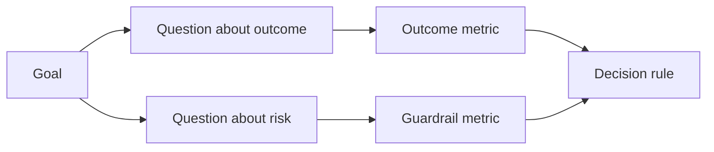

# في النتيجة الناتجة قبل تصميم مؤشر نجاح

> يجب أن يكون مؤشر القياس خدمة في اتخاذ القرارات، وليس مجرد تزيين للوحة.

**Type:** Learn + Build
**Languages:** Python (stdlib)
**Prerequisites:** Phase 14 lessons 47 and 51
**Time:** ~70 minutes

## 學习目标

- من الأهداف المتوقعة للنتائج، تحديد المشكلة الأساسية ومعايير القياس.
- قبل مشاهدة النتائج الفعلية، تحديد القيمة مقدماً، نافذة الزمن، مصدر البيانات وتحسين الاتجاهات.
- ستصدر مؤشرات وترصد مؤشرات وترصد مؤشرات وترصد مؤشرات وترصد مؤشرات وترصد مؤشرات وترصد مؤشرات وترصد مؤشرات وترصد مؤشرات وترصد مؤشرات وترصد مؤشرات وترصد مؤشرات وترصد مؤشرات وترصد مؤشرات وترصد مؤشرات وترصد مؤشرات وترصد مؤشرات وترصد مؤشرات وترصد مؤشرات وترصد مؤشرات وترصد مؤشرات وترصد مؤشرات وترصد ملامح
- لتتطابق الأدلة التقييمية مع القرارات المحددة التي يتطلبها التدعم في البناء.

## 目標、問題與指标 (مجموعة المعلومات والتنمية)

من الغاية (غاية)

> 缩短定位受影响服务所需时间,同时不增加任何不安全操作──

推导出问题:

- هل السرعة الصحيحة للخدمة سريعة؟
- هل هناك معدل عال لتحقيق الخدمات المحددة؟
- هل عملية التشخيص دائماً تكون مجرد قراءة؟
- هل أدت هذه التدفقات إلى تجاهل الإنذارات بشكل متكرر أو زيادة عبء المديرين؟

ثم يختارون هذه المشاكل للتشغيل



## كل مؤشر يحتاج إلى اتفاقية

كل مؤشر يجب أن يكون له:

| 契约字段 | 示例 |
|---|---|
| 指标名称（Name） | `median_identification_seconds` |
| 方向（Direction） | 至多不超过（at most） |
| 阈值（Threshold） | 120 |
| 窗口（Window） | 10 次故障事件重放 |
| 数据源（Source） | 重放事件日志 |
| 统计样本（Population） | 参与试点的在岗工程师 |
| 类别（Kind） | 成果指标（outcome）或护栏指标（guardrail） |

إذا كانت هناك نقص في مصادر البيانات والنوافذ الإحصائية، فإن أي أرقام لا يمكن إعادة التمثيل؛ إذا كانت هناك نقص في القيمة المسبقة، فإن المؤشر لا يمكن أن يحرك القرارات الواضحة.

## مؤشر النتائج  مؤشر التأثير ومؤشر الوقوف

- **成果指标（Outcome metric）：**هل تحسن الحالة؟
- **护栏指标（Guardrail）：**هل ستحافظ على ظروف الحماية والتحكم؟
- **制衡指标（Counter-metric）：**هل سيتم نقل التكلفة الخفية أو التدمير المحلي إلى عناصر أخرى؟

 بالنسبة لتدفقات العمل في إصدار الأخطاء، فإن النور غير كافٍ.  معدل الدقة، وتوقيف عمليات إنتاج، وتوقيف عمليات التنفيذ، وتعبير الموظفين عن العمل، وتخفيض التنبيهات، يشكّل معًا حواجزًا أمنية لمنع الوصول إلى استنتاجات خاطئة كارثية سريعة.

## شهادة على الإنترنت

离线重放(أفلين Replay) جدا مناسبة للتحقق من قابلية التكرار مع زيادة نسبة تغطية المشهد الحدودية؛受控试点(Bunded Pilot)则擅长检查真实人类行为、信任度建立与工作流上下游影响──二者互补,不可替代──

始终选择能够支最低成本证据当前决策――绝不能仅仅因为代码已经写好就商业然将真实用户暴露于未知风险――

## قبل أن تقيس القرار

قبل رؤية النتائج الإحصائية، يجب أولاً تحديد مسار العمل تحت المشهد الفاشل والظلم. وإلا، فإن الفريق يوافق على التغييرات المؤقتة لتفريق النتائج البناءية الحالية.

نموذج قواعد:

- 通過(Pass): شرح تحديد المواقع الخدمية لا يقل عن 0.9، ومعدل استهلاك المواقع في الوقت الراهن لا يزيد عن 120 ثانية.
- 失败(فشل: أي عملية إنتاج غير قانونية، أو معدلات تحديد الموقع أقل من 0.75؛
- 模糊(غموض): الأداء على الرغم من تحسينات صغيرة ولكن التركيز كبير جدا، تحتاج إلى توسيع إعادة التجربة

## 动手实现

هذا التجربة الكمالة من خطة قياس المختبرات، وتقييم تشمل قيمة الحدود، سجل مؤشر غياب، ومصدر`outputs/measurement-report.json`.

```bash
python3 code/main.py
python3 -m unittest discover code/tests -v
```

尝试删除护指标在度量计划,观察为什么 حتى لو كان مؤشر النتائج لا يزال موجوداً، فإن البرنامج بأكمله سيظل يُحكم عليه النظام بأنه غير قانوني.

## 课后练习

1. من نفس الهدف الناتج، تم تحديد ثلاثة أهمية مختلفة.
2. 补充一条 قادرة على التقاط مؤشر التوازن الذي يؤدي إلى زيادة عبء الأدوار الأخرى بسبب التحسينات الحالية
3. لكل مؤشر تحديد مصدر البيانات، ومجموعات النموذج الإحصائي ونوافذ الوقت.
4. قبل أن يتم إنتاج القيمة الحقيقية، يجب أن يكون هناك قرارات في ثلاثة حالات:
5. إيجاد إحصائي سهل ولكن لا يمكن تغيير أي مؤشر إضافي لقرار، وإيضا

## 延伸阅读

- [Basili, Software Modeling and Measurement: The Goal/Question/Metric Paradigm](https://drum.lib.umd.edu/items/8119803a-362b-42ec-b6ce-2311713e7236)، تعريف كيفية إطلاق نظام قياس يمكن تنفيذه من خلال أهداف محددة
- [Basili, Caldiera, and Rombach, The Goal Question Metric Approach](https://www.cs.toronto.edu/~sme/CSC444F/handouts/GQM-paper.pdf)ووضح أن هذه الطريقة ستكون ممارسة في نظام التحسين المستمر.

## 交付物沉

حافظ`outputs/measurement-report.json`ستصبح إلى المرحلة الأولى (البروتوتيب) 试点 (بيلوت) أو (إنتاج)
