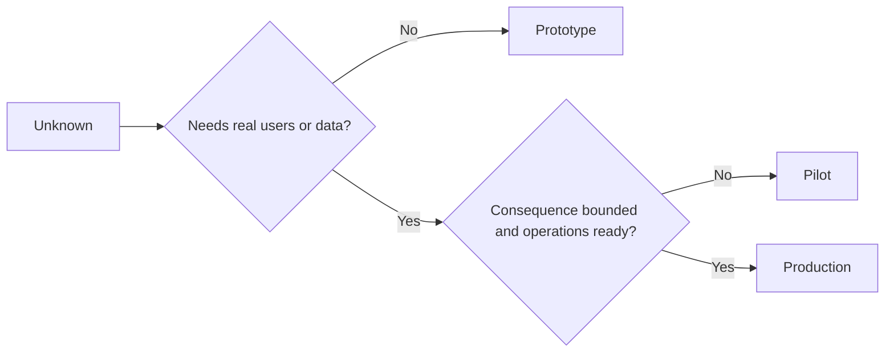

# 审慎择原型、试点还是生产

> تمثل بيئة معرفت مختلفة تماما، وليس مجرد اختلافات دقيقة.

**Type:** Learn + Build
**Languages:** Python (stdlib)
**Prerequisites:** Phase 14 lessons 50 to 52
**Time:** ~70 minutes

## 學习目标

- حسب نوع غير معروف، نطاق الجمهور، حساسية البيانات، تدمير النتائج والعمل والنمو، اختيار الصيانة في مرحلة الإنشاء.
- وضع كل مرحلة خاصة لقيادة الإدارة (مراقبة) ومبادئ الخروج (معايير الخروج)
-  منع النظام الأصلي من تطوره إلى نظام إنتاج دون مسؤولية من أحد 
- في شهادة و运维保障充分就绪 قبل، تأخر منح نظام حق الإنتاج الحقيقي

## ثلاثة مشاكل جوهرية مختلفة تماما

| 阶段 | 核心问题 |
|---|---|
| 原型（Prototype） | 该技术机制到底能不能产生预期的实证结果？ |
| 试点（Pilot） | 在受控真实受众与真实工况下，它能否安全稳定运行？ |
| 生产（Production） | 组织能否按照既定的可靠性与风险承诺，持续对该系统承担长期责任？ |

يمكن تصميم النموذج الأولي الذي يتمتع بتكامل تقني للغاية لا يزال مصمماً للاستخدام في السحب بعد ذلك. يمكن استخدام البيانات الإنتاجية الحقيقية في محاولة، ولكن يجب أن تكون حجم المستخدمين والسماح بالعمل محدودة بشكل صارم.

## المرحلة الأولى

عندما تحتاج إلى حل الافتراضات غير المعلومة لا تحتاج إلى إدخال المستخدم الحقيقي أو البيانات الإنتاجية الحقيقية، تبني المرحلة الأصلية.

- 随时可废弃 (يمكن إزالتها)
- 严格隔离
- 功能边界狭窄 (تصرفات ضيقة) ؛
- 核心验证问题显式明确 (توضيح سؤال التعلم) ؛
- لا يُعدّ الالتزام بالثبات والتنفيذ

في الآلية نفسها لم تثبت أنه يستحق الدخول إلى المرحلة التالية ، لا تحسين مبكراً على بنية النظام الكاملة.

## 试点阶段

عندما يتعين على الافتراضات المجهولة الاعتماد على أفعال العمليات الحقيقية أو البيانات الحقيقية أو تدفق العمل الحقيقي للتحقق، ولكن التدمير أو النمو الناتج لا يزال غير كافٍ لدعم الإصدار الكامل، تبني مرحلة التجريبية.

يجب أن يكون لدى تجربة مؤهلة:

- (إشارة إلى المشاركين)
- 明确 مسؤولي الإنسان
- دورة التشغيل والسماح بالعمل المحدودة بشكل صارم
- إطار التراجع والتحقيق السريع
- مؤشر النجاح و مؤشر الحفاظ على قيمة النجاح
- 明确针对扩容、修改或彻底终止退出准则

## المرحلة

مرحلة الإنتاج لا تكاد تساوي فقط إعداد الكود:

- 明确的服务等级目标(SLO) ؛
- الموظفين المسؤولين عن معالجة الحوادث المتعلقة بالفشل
- مراجعة أمن والخصوصية
- الحد الأقصى للإنتاج ومراقبة السعة المنتشرة
- الجهاز التنفيذي للتعافي من المواد المضادة
- 7x24 小时全天候监控
- 清晰的退役与下线路径──



## 阶段漂移陷

عندما يصبح النموذج الأصلي خطراً للغاية عندما يتم الحصول على حقوق تشغيل المستخدم الحقيقي أو البيانات الحساسة أو النواة في حالة عدم إنشاء نظام تحمل المسؤولية.**阶段漂移（Stage Drift）**يجب أن يكون هناك حدة صلبة للنموذج الأول والحصول على المحاولة في المستندات الإماراتية، وذلك على حد سواء على الواجهة.

يجب أن تكون مرحلة من النظام موجودة قادرة على المراقبة والتحقق مباشرة في حالة تشغيل النظام نفسه.

## 动手实现

هذا التجربة بناء على القرارات التالية تلقائيًا يوصي بالمرحلة المناسبة ، ويعود إلى الإجراءات الضرورية للسيطرة اللازمة في كل مرحلة ،并输出 `outputs/stage-decisions.json`.

```bash
python3 code/main.py
python3 -m unittest discover code/tests -v
```

سوف تتم تغيير نموذج المحاولة ليكون منخفضاً للخطر والذي يحتوي على النمو والنمو.

## 课后练习

1. 根据认知探索阶段 (而不是 مجرد حالة نشر الكود) ، يتم إعادة تصنيف المشاريع الثلاثة الحالية التي تم وضعها على رأسك.
2. 编写一份包含果断终止果断选项的试点退出准则──
3. زيادة تدابير التحكم التقني، ومنع كود الأصل من التأثير على بيانات بيئة الإنتاج.
4. 找出第一标志着系统真正转变为生产级责任的运维职责──
5. لـ "مُحَصَّلَةٍ محدودةٍ" تصميم مجموعةٍ كاملةٍ من "مُحَصَّلَاتٍ"

## 延伸阅读

- [Barry Boehm, A Spiral Model of Software Development and Enhancement](https://dl.acm.org/doi/10.1145/12944.12948)، استكشاف كيفية توازن كل جيل من الموارد المخصصة مع درجة المخاطر التي تم تحديدها.
- [Fagerholm et al., Building Blocks for Continuous Experimentation](https://doi.org/10.1145/2601248.2601276)، والتحليل المستمر لإجراء التجربات المهنية المطلوبة

## 交付物沉

حافظ`outputs/stage-decisions.json` تسجل الأسباب التي جعلت كل مرحلة من هذه المرحلة تختار، وكذلك التدابير الإدارية التي يجب تنفيذها قبل الدخول إلى المرحلة التالية.
