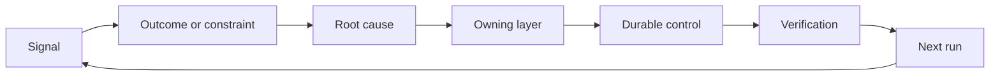

#  تكوين دورة ضدّ العقبات التي تملك آلية الانتماء والإسقاط

> إصدار الكود ينهي دورة بناء هذه الفترة، و يبدأ دورة تعلم طويلة الأمد.

**Type:** Learn + Build
**Languages:** Python (stdlib)
**Prerequisites:** Phase 14 lessons 46 and 53
**Time:** ~75 minutes

## 學习目标

- تحويل حادثات الإصابة، وتقييم البيانات، وتصرفات المستخدمين والتحديدات والتحديات إلى إجراءات ذات الخصومة المسؤولة.
- أن تكون هناك إشارات مختلفة على الطريق إلى أسفل
- تخصيص الأولويات لمخاطر الإصابة بالانفجارات المترتبة على الدرجة الزمنية والمرة المتكررة.
- لكل نظام نظام تحكم آلية تحديد ظروف الإنسحاب

## و في نفسها هي أيضا البنية التحتية

يمكن لفريق واحد جمع الكثير من سلسلة النظام تتبع (تعقب) ، تقييم سجلات، دعم وحدة العمل والكوارث، ولكن لا تتعلم أي دروس إدراكية تماما من ذلك.**晋级通道（Promotion）**: أي من مشاهدة الحقائق، إلى امتلاك مسؤولية واضحة، والطريق الثابت لتغيير نظام استمرارية من الأدلة.

المرحلة الأخيرة:

1. 观测到具体实测信号؛
2. أن تكون مرتبطة بالنتائج المحددة أو الظروف المحددة أو افتراضات التوقعات
3. التعرف على أساسية مستوى النظام على تحمل المسؤولية عن هذا التحفيز
4. تنفيذ تحسينات مستمرة
5. 验证 تم تقليل احتمالية ارتفاع الوفيات
6. هل يجب أن يستمر المراجعة المنتظمة في إطار الجهاز المالي للسيطرة؟

## 精准路由至应对责任层级

| 信号类型 | 归属目的地 |
|---|---|
| 误报、功能倒退、错误输出结果 | 评测集（Evaluation）或自动化测试 |
| 上下文缺失、重复劳动、过时事实 | 上下文数据源或检索路由策略 |
| 不安全操作或越权漏洞 | 安全策略（Policy）或权限硬边界 |
| 超时、重试风暴、依赖服务不可用 | 运行时控制（Runtime Control） |
| 新的产品需求或尚未决断的权衡取舍 | 经过规范成型（Shaped）的待办项 |

عندما تكون القيود الآلية أو القاسية كافية لجعلها غير ممكنة تماما، لا تحتاج إلى إضافة نصيحة أخرى في المفاوضات.



## المسؤولية هي جزء من آلية التحكم

كل عملية محورية يجب أن تكون واضحة:

- 唯一的人类责任人 (مالك)
- التركيز على التركيز على التركيز على التركيز على التركيز على التركيز على التركيز على التركيز على التركيز على التركيز على التركيز على التركيز على التركيز على التركيز على التركيز على التركيز على التركيز على التركيز على التركيز على التركيز على التركيز على التركيز على التركيز على التركيز على التركيز على التركيز على التركيز على التركيز على التركيز على التركيز على التركيز على التركيز على التركيز على التركيز على التركيز على التركيز على التركيز على التركيز على التركيز على التركيز على التركيز على التركيز على التركيز على التركيز على التركيز على التركيز على التركيز على التركيز على التركيز على التركيز على التركيز على التركيز على التركيز على التركيز على الجهة.
- 拟修改的目标系统组件 (المصنوع) ؛
- إثبات أن إصلاح نظام التحقق من التحقق من التحقق من التحقق من التحقق من التحقق من التحقق من التحقق من التحقق من التحقق من التحقق من التحقق من التحقق من التحقق من التحقق من التحقق من التحقق من التحقق من التحقق من التحقق من التحقق من التحقق من التحقق من التحقق من التحقق من التحقق من التحقق من التحقق من التحقق من التحقق من التحقق من التحقق من التحقق من التحقق من التحقق من التحقق من التحقق من التحقق من التحقق من التحقق من التحقق من التحقق من التحقق من التحقق من التحقق من التحقق من التحقق من التحقق من التحقق من التحقق.
- نافذة إعادة النظر أو إغلاق التأثيرات الذاتية
- 明确的退役条件(شروط التقاعد)

ويتمّ إصدارها على نحوٍ ما، ويتمّ إصدارها على نحوٍ ما.

## 果断退役过时的控制机制

في هذه الحالات، يجب أن يكون هناك إطار فعال لمراجعة وإعادة إعلانات للسيطرة:

- تغيرات أساسية في بنية النظام أو عمليات العمل
- لقد استبدل الجهاز غير المتغير في المستوى السفلي إرشادات الكلمات في المستوى العلوي بشكل كامل.
- في نافذة الوقت المحددة، لم يظهر إعاقة محمية مرة أخرى.
- قواعد التحكم التي تعيق تردد تنفيذ الأعمال العادية، تجاوزت فوائدها المترتبة على الحماية من المخاطر.

كما يحتاج الهيئة إلى إثبات أنّه لا يمكن أن يُزيلها فقط لأنّها تبدو طويلة جداً.

## 打通 المنتجات بناء مع وكيل التشفير

ويمكن أن يكون هناك نفس الجهاز المحرك في خدمة العمل المنتج والتنمية الذكية على نفس الوقت:

- 產品业务实证驱动预期产出框架、假设图谱、最小切片或量度计划的演化;
- تحسين عملية إصلاح وكيل التشفير أو تحريك اختبار التلقائيات
- يمكن أن يؤدي إصابة الفشل الحقيقي على الخط إلى تعديل حدود وظائف المنتج، ويمكن أيضاً أن يؤدي إلى تعزيز الوكيل.

وهذا هو السبب في أن إطار المهمة لا يصل إلى مرحلة الإعلان قبل التدوين، بل يمر عبر كل تغيير يتم قبوله في النظام.

## 动手实现

هذا التجربة على إشارات التحقق من التفرقة، إنشاء دورة عمل من التأثيرات المرتبطة بالمسؤولية، حسب الترتيب الأولوي، والمخرج`outputs/feedback-backlog.json`.

```bash
python3 code/main.py
python3 -m unittest discover code/tests -v
```

尝试添加一个运行时超时信号,验证它将被正确路由到运行时控制层,而不是泛化混入通用需求待机列表.

## 课后练习

1. لنقل إلى إصابة قصيرة الأجل ومرجعية حقيقية للمستخدم، على حد سواء إلى تحويل إلى تحركات محورية محددة.
2. التعرف على أنّه قادر على منع إعادة ظهورها من الأساس إلى الأساس على مستوى النظام الأساسيّ.
3. لتحقيق التجارب المنتجة إضافة إلى إرشادات التحقق الآلي المطبقة أو إشارات المراقبة.
4. لـ قواعد استراتيجية الأمن القائمة وضع شروط واضحة للإسحاب من الخدمة
5. أن تكون المهام المُتعلقة بالتحديد والتحديد التي يتم قبولها من قبل النظام، والمتابعة المُعكسة، وترتبط في إطار المهمة التالي.

## 延伸阅读

- [Basili, Caldiera, and Rombach, The Goal Question Metric Approach](https://www.cs.toronto.edu/~sme/CSC444F/handouts/GQM-paper.pdf)، استكشاف كيفية تحقيق مستمرة التعرف على مستوى المنظمة من خلال آلية قياسية موجهة للأهداف.
- [Fagerholm et al., Building Blocks for Continuous Experimentation](https://doi.org/10.1145/2601248.2601276)، والتحليل سوف يثبت أن الأدلة الحقيقية والموارد المتواصلة والتنمية المتصلة مع المنتجات هي التقنية والتنظيمية.
- [Nuseibeh and Easterbrook, Requirements Engineering: A Roadmap](https://www.cs.toronto.edu/~sme/papers/2000/ICSE2000.pdf)، وضح الحاجة إلى النظر في وجهة نظر التطوير عبر كل نظام دورة حياة حركات التطور.

## 交付物沉

حافظ`outputs/feedback-backlog.json` هو  المنتج القوة الحاكمة والسفر  المنتج الحكم والسفر  تعلم الطريق المنتج، وفتح أيضاً نقطة البدء التالية من إطار توقعات المنتج
