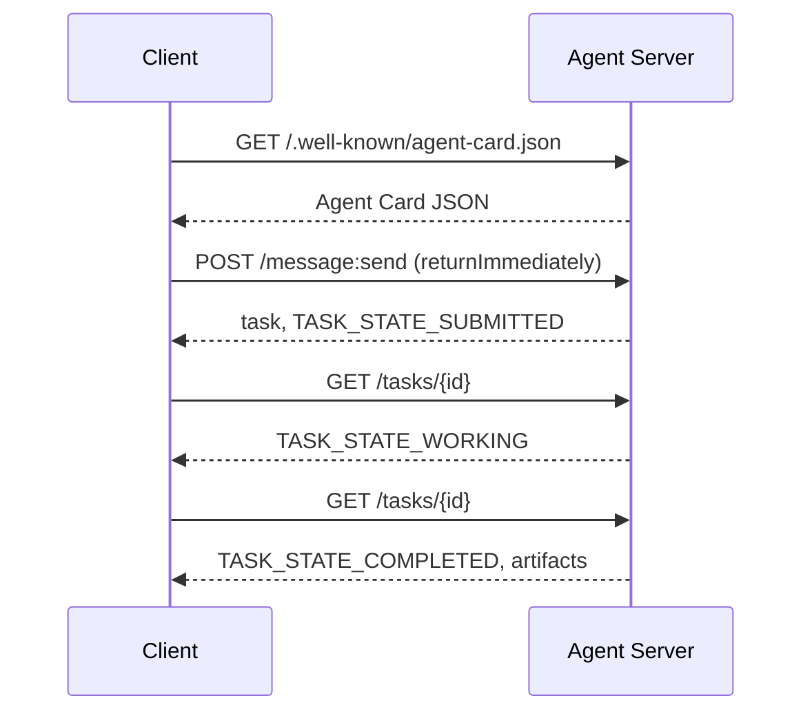

# A2A  智能体间通信协议(بروتوكول وكيل إلى وكيل)

> أصدرت جوجل A2A في أبريل 2025؛ حتى أبريل 2026، تم تطوير المواصفات الرسمية إلى 1.0.1، وحصلت على دعم من 150+ مؤسسة بما في ذلك AWS  Microsoft  Salesforce وغيرها. A2A هو بروتوكول متكامل متكامل لـ MCP: MCP 聚焦  وكيل  أدوات) ، بينما A2A 聚焦 横向点对点  وكيل  وكيل) .

**Type:** Learn + Build
**Languages:** Python (stdlib, `http.server`, `json`)
**Prerequisites:** Phase 16 · 04（原语模型）
**Time:** ~75 分钟

## 问题背景

عندما يحتاج وكيلك إلى استخدام وكيل في نظام آخر أو منظمة أخرى، كيف ينبغي أن تتواصل؟ يمكنك بالتأكيد أن تكشف نقطة نهاية HTTP الخاصة، وتحدد نظام JSON المخصص، وتتوقع أن يتمكن الآخرون من استخدامها وفقا لقواعدك. ولكن في هذه الحالة، كل تعاون بين وكيل سوف يتحول إلى تكلفة عالية التجميع المخصصة ذات مرة.

A2A لهذا التطبيق عبر النظام يوفر بروتوكول الاتصال العام (البروتوكول السلكي) ، وهو يحدد الوصول إلى خدمات قياسية ، استنتاج المهام القياسية ، وتوصيل المواد المحددة ، مثل HTTP + REST ، التي يتم تحديدها على أساس الجسم الذكي.

## مفهوم الأساسي

### أربعة عناصر أساسية

**Agent Card（智能体名片）。**ووضعها`/.well-known/agent-card.json`JSON 文档,用于全面描述 وكيل:名称、技能、`supportedInterfaces`(端点 URL、协议绑定、协议版本)、默认输入和输出媒体类型,以及鉴权要求(`securitySchemes`مع`securityRequirements`)── على المحطة من خلال دراسة تم إنجاز حركة البحث──

```http
GET /.well-known/agent-card.json HTTP/1.1
Host: agent.example.com
```

```json
{
  "name": "code-review-agent",
  "description": "审查 Python 与 TypeScript 代码。",
  "version": "1.0.0",
  "supportedInterfaces": [
    {
      "url": "https://agent.example.com",
      "protocolBinding": "HTTP+JSON",
      "protocolVersion": "1.0"
    }
  ],
  "capabilities": {"streaming": false, "pushNotifications": false},
  "securitySchemes": {
    "bearer": {"httpAuthSecurityScheme": {"scheme": "Bearer"}}
  },
  "securityRequirements": [{"schemes": {"bearer": {"list": []}}}],
  "defaultInputModes": ["text/plain", "application/json"],
  "defaultOutputModes": ["application/json"],
  "skills": [
    {
      "id": "review-python",
      "name": "审查 Python 代码",
      "description": "审查传入的 Python 源码并给出改进建议。",
      "tags": ["code-review", "python"]
    },
    {
      "id": "review-typescript",
      "name": "审查 TypeScript 代码",
      "description": "审查传入的 TypeScript 源码并给出类型与逻辑改进建议。",
      "tags": ["code-review", "typescript"]
    }
  ]
}
```

**Task（任务）。**基本工作委托单元── عبارة عن جسم مختلف له دورة حياة:`TASK_STATE_SUBMITTED``TASK_STATE_WORKING``TASK_STATE_COMPLETED`- لا ، لا`TASK_STATE_FAILED`- لا ، لا`TASK_STATE_CANCELED` العميل 发送消息,Server 创建任务,随后 العميل 通过轮询或流式订阅获取更新──

**Artifact（产物）。**المهام  تنفيذ كامل المنتجات النتائج المنسيقة  دعم المقال   المنسيقة JSON 图像 视频 音频 多模态媒体 `text`.`raw`.`url`أو`data`واحد并可指明其`mediaType`.

**不透明生命周期（Opaque Lifecycle）。**A2A 绝不规定远程代理 *内部* كيفية إنجاز المهمة── العميل 仅观察状态转换与最终产品;被调用方完全自由选择任何底层模型和框架──

### المشاركة في المشاريع المختلفة

- **MCP**: العميل  أداة。 العميل 借助 JSON-RPC 读写工具 خادم,核心完全无状态。
- **A2A**: العميل  العميل  مقابل اتفاقيات تعاون، كل من الطرفين يتوافقون مع كل ذكي ذكي لديه قدرة على التفكير المستقلة

في إنتاج نظام متعدد الذكاء، يتم تنفيذ تعاون بينهما: A2A على الطرف على جانب نفسه لتطبيق أدوات MCP المخصصة محليا.

### 发现与调用时序



الطرق المذكورة أعلاه تتبع HTTP + JSON  قواعد التوثيق ، وكل طلب يتحمل `A2A-Version: 1.0`في حالة اعتماده`SendMessage`سوف يُعيق حتى نهاية المهمة، لذا وضع موقف الاستفسار العميل`configuration.returnImmediately`لكي نحصل على المهام على الفور

对于流式传输:`POST /message:stream`返回 Server-Send Events( أولاً输出 `task`, ثم陆续推送`statusUpdate`مع`artifactUpdate`事件) ، و `/tasks/{id}:subscribe`则用于重新附加到运行中的任务──流在任务进入终态时正常关闭,报文中不包含单独的 `final`العلامة

### 身份认证与安全 (أصدر)

أ2أأأصلياتدعم ثلاث أشكال أمن رئيسية:

- **Bearer Token**:OAuth2 أو غير شفافة`httpAuthSecurityScheme`أو`oauth2SecurityScheme`(‬)
- **mTLS**:双向 TLS 认证,组织间强证明身份(`mtlsSecurityScheme`(‬)
- **API Key**: located requesthead、URL 查询参数 أو المفاتيح داخل الكوكي`apiKeySecurityScheme`(‬)

认证规则在代理卡 中公布:`securitySchemes`إعداد المعلومات`securityRequirements`规定调用方必须满足要求──

```figure
sw-agent-card-discovery
```

## 动手实践

`code/main.py` على أساس A2A 1.0 HTTP+JSON  إتفاقية ربط، استخدام Python       `http.server`مع`json`实现极简的A2A Server与 Client──Server 功能包括:

-  التعرض `/.well-known/agent-card.json`(إنه)
-  قبول `POST /message:send`调用
- 管理 مهمة  حالت机转换
- في`GET /tasks/{id}`أعاد المنتج

العميل 功能 تشمل:

- 拉取并解析 بطاقة العميل
- أرسلت معهم`returnImmediately`خبر إنشاء مهمة
- الاستجواب المستمر حتى يتم إتمام المهمة
- 读取并验证最终 Artifact。

运行命令:

```bash
python3 code/main.py
```

سيبدأ الكتب في الخط الخادم في الخط الخلفي، ثم يقوم العميل بتشغيله في عملية التنفيذ الكاملة، ويعرض مباشرة العثور على المعلومات والإرسال والمسائل والحصول على المنتجات.

## 交付物

本课交付 `outputs/skill-a2a-integrator.md` للتخطيط لتصميم كامل A2A  إتكامل الحل: محتويات بطاقة العملاء  المهام  التجارب  تحديد الاختيارات والحصول على الحقوق و التدريبات والحركات الاستفسارية

## 核心专业术语

| 术语 | 规范定义 |
|------|---------|
| A2A | 跨系统异构智能体间互相调用的对等开放协议 |
| Agent Card | 暴露于 `/.well-known/agent-card.json` 的元数据卡片，声明技能、端点与鉴权要求 |
| Task | 具备明确生命周期、完成时生成产物的异步工作单元 |
| Artifact | 任务产出的具名、带类型结果（文本、结构化 JSON、音视频媒体等） |
| 不透明生命周期 (Opaque lifecycle) | 内部解决过程对调用方隐藏，仅对外暴露状态流转与产物 |
| 服务发现 (Discovery) | 通过发起 `GET /.well-known/agent-card.json` 获取名片并了解支持能力 |
| MCP 对比 A2A | MCP 属于垂直的 Agent 与工具交互，A2A 属于水平的 Agent 间对等协作 |

## 延伸阅读

- [A2A 规范主站](https://a2a-protocol.org/latest/specification/) 官方权威规范
- [A2A v1.0.1 源码发布](https://github.com/a2aproject/A2A/tree/v1.0.1) تعريف المبادئ والمعاهدات التي يتبعها هذا الدراسة
- [Google Developers Blog — A2A 发布说明](https://developers.googleblog.com/en/a2a-a-new-era-of-agent-interoperability/) 官方设计背景
