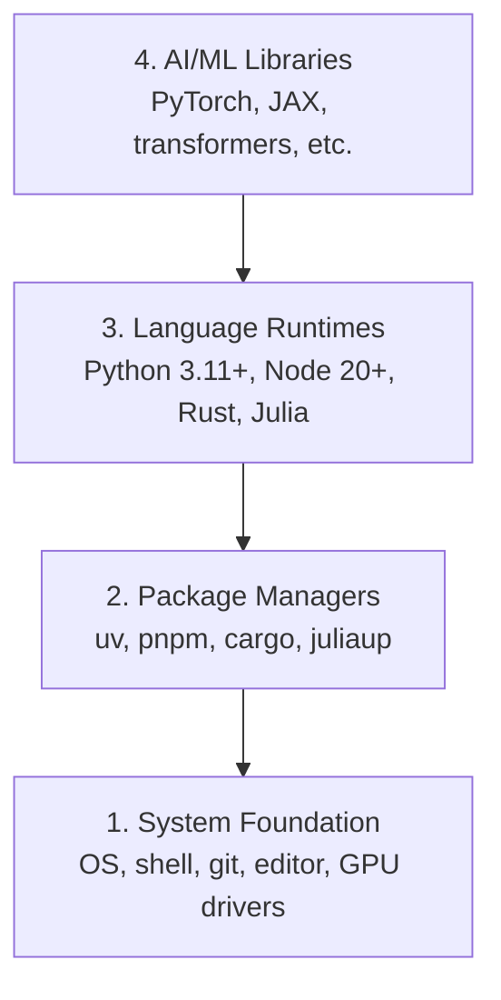

# Medio ambiente de desarrollo

> Sus herramientas formarán tu forma de pensar. Una vez, una vez, una vez.

**Type:** Build
**Languages:** Python, Node.js, Rust
**Prerequisites:** None
**Time:** ~45 分钟

## El objetivo del aprendizaje
- Desde zero comenzó a configurar Python 3.11+、Node.js 20+ y Rust toolchains
- Configurar entornos virtuales y administradores de paquetes, para lograr construcciones replicables
- Utiliza CUDA/MPS 验证 GPU acceso,并运行一个测试 Tensor operación
- Comprender las cuatro capas de la pila: sistemas, paquetes, tiempos de ejecución, bibliotecas de IA

##  problemas
Usará Python, TypeScript, Rust y Julia para aprender más de 200 cursos de ingeniería artificial. Si tu entorno está mal, cada uno de ellos se convertirá en herramientas de lucha, en lugar de aprendizaje.

La mayoría de la gente saltará la configuración del entorno. Luego pasan un par de horas desactivando errores de importación, conflictos de versión y falta de controladores CUDA.

## 概念
Un entorno de ingeniería de IA tiene cuatro niveles:



Nos instalamos de abajo a arriba. Cada uno de los niveles depende de la otra.


```figure
s0-env-stack
```

## Construirlo
### Paso 1: Fundación del Sistema

Chequear su sistema y instalar los componentes básicos 

```bash
# macOS
xcode-select --install
brew install git curl wget

# Ubuntu/Debian
sudo apt update && sudo apt install -y build-essential git curl wget

# Windows (use WSL2)
wsl --install -d Ubuntu-24.04
```

### 步骤 2: Python con uv

Nosotros usamos`uv`Es más rápido que pip 快 10-100x, y automáticamente procesará entornos virtuales

```bash
curl -LsSf https://astral.sh/uv/install.sh | sh

uv python install 3.12

uv venv
source .venv/bin/activate  # or .venv\Scripts\activate on Windows

uv pip install numpy matplotlib jupyter
```

验证:

```python
import sys
print(f"Python {sys.version}")

import numpy as np
print(f"NumPy {np.__version__}")
a = np.array([1, 2, 3])
print(f"Vector: {a}, dot product with itself: {np.dot(a, a)}")
```

### 步骤 3: Node.js con pnpm

Utilizado en el tipo de escritura  cursos  agentes  MCP servidores  aplicaciones web) 

```bash
curl -fsSL https://fnm.vercel.app/install | bash
fnm install 22
fnm use 22

npm install -g pnpm

node -e "console.log('Node', process.version)"
```

### Paso 4: Corrosidad

Utilizando los sistemas de referencia y de rendimiento críticos.

```bash
curl --proto '=https' --tlsv1.2 -sSf https://sh.rustup.rs | sh

rustc --version
cargo --version
```

### 步骤 5: Julia (opcional)

Con Julia en su clase de matemáticas.

```bash
curl -fsSL https://install.julialang.org | sh

julia -e 'println("Julia ", VERSION)'
```

### 步骤 6:GPU 设置( si tienes)

```bash
# NVIDIA
nvidia-smi

# Install PyTorch with CUDA
uv pip install torch torchvision torchaudio --index-url https://download.pytorch.org/whl/cu124
```

```python
import torch
print(f"CUDA available: {torch.cuda.is_available()}")
if torch.cuda.is_available():
    print(f"GPU: {torch.cuda.get_device_name(0)}")
```

没有 GPU?没有问题──大多数课程可在CPU上运行──对于训练重的课程,使用Google Colab或云GPU──

### Paso 7: Verifique todo

运行验证脚本:

```bash
python phases/00-setup-and-tooling/01-dev-environment/code/verify.py
```

## Usalo
Su entorno está ahora listo para cada sección de este curso. A continuación se muestra el contenido que se utilizará en todas partes:

| Language | Used In | Package Manager |
|----------|---------|-----------------|
| Python | Phases 1-12 (ML, DL, NLP, Vision, Audio, LLMs) | uv |
| TypeScript | Phases 13-17 (Tools, Agents, Swarms, Infra) | pnpm |
| Rust | Phases 12, 15-17 (Performance-critical systems) | cargo |
| Julia | Phase 1 (Math foundations) | Pkg |

##  entregarlo
Este curso se produce un guión de verificación que cualquier persona puede usar para revisar su propia configuración.

¿ Qué pasa ?`outputs/prompt-env-check.md`, uno de ellos es rápido, puede ayudar a los asistentes de IA  diagnóstico de problemas ambientales 

##  ejercicios
1. 运行验证脚本并修复 cualquier fallo
2. Para este curso crear un entorno virtual Python, y instalar PyTorch
3. Usando todos los cuatro idiomas, escribe un "hola mundo", y cada uno de ellos se ejecuta.
