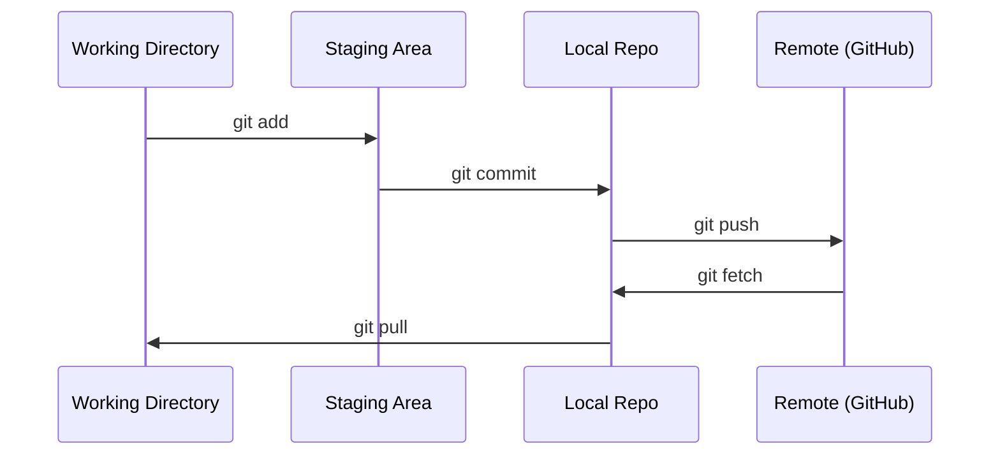

# Git y colaboración

> El control de versiones no es una opción. Cada experimento que construyes aquí, cada modelo, cada sección de la clase debe ser rastreado.

**Type:** Learn
**Languages:** --
**Prerequisites:** Phase 0, Lesson 01
**Time:** ~30 分钟

## El objetivo del aprendizaje
- 配置 git identidad,并使用 añadir、compromiso 和 push del flujo de trabajo diario
- Para experimentos separados, crear y fusionar ramas, evitar dañar el principal
- 编写一个 `.gitignore`, eliminación de los puntos de control de modelos y grandes archivos binarios
- Uso `git log`浏览 Compromiso de historia, entender la evolución del proyecto

##  problemas
Se transcurrirán 20 fases  redactar cientos de archivos de código― sin control de versión, perderá el trabajo― destruirá cosas irrevocables, y no podrá colaborar con otros―.

Git es un instrumento. GitHub es un código ubicado en el lugar donde este curso cubre solamente el contenido de este curso, no más que poco.

## 概念


记住三件事:
1. 经常保存(`git commit`(en inglés)
2. Empuje hasta el remoto`git push`(en inglés)
3. Para experimentar  crear una rama(`git checkout -b experiment`(en inglés)


```figure
s0-commit-dag
```

## Construirlo
### 步骤 1: Configurar git

```bash
git config --global user.name "Your Name"
git config --global user.email "you@example.com"
```

### Paso 2: Trabajo diario

```bash
git status
git add file.py
git commit -m "Add perceptron implementation"
git push origin main
```

### Paso 3: Para experimentar

```bash
git checkout -b experiment/new-optimizer

# ... make changes, commit ...

git checkout main
git merge experiment/new-optimizer
```

### Paso 4: Utiliza este programa de recuperación

```bash
git clone https://github.com/rohitg00/ai-engineering-from-scratch.git
cd ai-engineering-from-scratch

git checkout -b my-progress
# work through lessons, commit your code
git push origin my-progress
```

## Usalo
Para este curso, sólo necesitas estos comandos:

| Command | When |
|---------|------|
| `git clone` | 获取 course repo |
| `git add` + `git commit` | 保存你的工作 |
| `git push` | 备份到 GitHub |
| `git checkout -b` | 在不破坏 main 的情况下尝试东西 |
| `git log --oneline` | 查看你做过什么 |

En este curso no se necesita una base de base o submodules.

##  ejercicios
1. Clone este repo, crea un nombre`my-progress`de la sucursal, crear un archivo, comprometerlo, empujarlo
2. Crear uno .`.gitignore`, eliminación de archivos de los puntos de control de modelo`.pt`¿Qué es esto?`.pth`¿Qué es esto?`.safetensors`(en inglés)
3. ¿ Qué ?`git log --oneline`查看这个 repo de historial de compromisos,并阅读教训是如何被添加的

## 关键术语: "El hombre es un hombre"
| Term | What people say | What it actually means |
|------|----------------|----------------------|
| Commit | “保存” | 你的整个 project 在某个时间点的 snapshot |
| Branch | “一个副本” | 指向某个 commit 的 pointer，会随着你的工作向前移动 |
| Merge | “合并 code” | 把一个 branch 的 changes 应用到另一个 branch |
| Remote | “云端” | 托管在其他地方的 repo 副本（GitHub、GitLab） |
