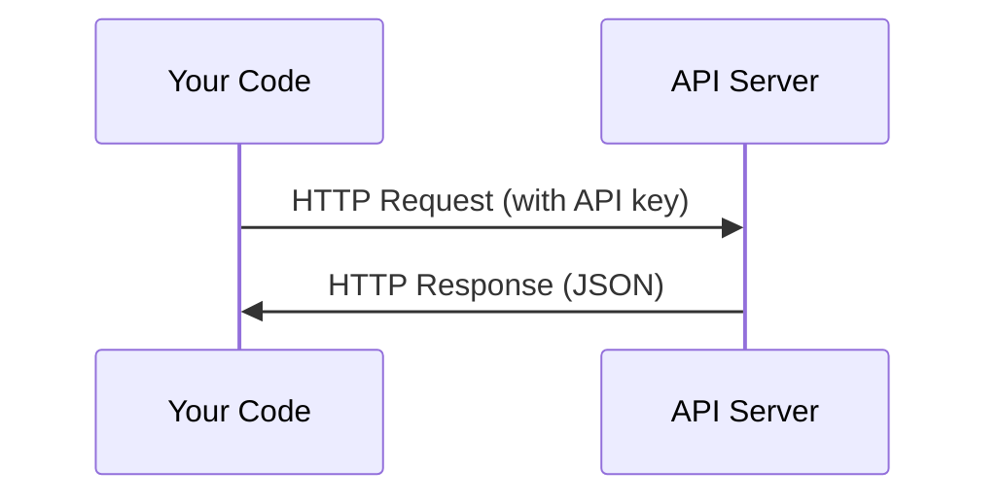

# Las API y las claves

> Cada API de IA trabaja de la misma manera: envíe una solicitud, reciba una respuesta.

**Type:** Build
**Languages:** Python, TypeScript
**Prerequisites:** Phase 0, Lesson 01
**Time:** ~30 分钟

## El objetivo del aprendizaje
- Utiliza variables ambientales y `.env`archivos seguridad de almacenamiento API claves
- En el mismo tiempo, utilizar Anthropic Python SDK y HTTP crudo
- Comparar los formatos de solicitud/respuesta basados en SDK y HTTP crudo, para deshacerse
- 识别并处理常见 API errores, incluyendo límites de autenticación y tasa

##  problemas
Desde la Fase 11  comienza, usted va a utilizar API LLM ((Antropic、OpenAI、Google)  En la Fase 13-16, usted va a construir en los bucles utilizando agentes de estas API  Usted necesita saber las claves API  cómo funciona  cómo almacenarlas de forma segura, y cómo iniciar su primera llamada API 

## 概念


Cada llamada de API tiene:
1. Un punto final (URL)
2. Una clave de API (authenticación)
3. Un cuerpo de solicitud (tú quieres qué)
4. Un cuerpo de respuesta (¡¿qué tienes?)


```figure
s0-secret-inject
```

## Construirlo
### Paso 1: llaves de API de almacenamiento seguro

绝不要把 API keys 放进代码――使用环境变量――

```bash
export ANTHROPIC_API_KEY="sk-ant-..."
export OPENAI_API_KEY="sk-..."
```

O usar `.env`archivo(把它加入 `.gitignore`):

```
ANTHROPIC_API_KEY=sk-ant-...
OPENAI_API_KEY=sk-...
```

### 步骤 2: Primera API 调用 (Python)

```python
import anthropic

client = anthropic.Anthropic()

response = client.messages.create(
    model="claude-sonnet-4-20250514",
    max_tokens=256,
    messages=[{"role": "user", "content": "What is a neural network in one sentence?"}]
)

print(response.content[0].text)
```

### Paso 3: Primera API 调用 (TypeScript)

```typescript
import Anthropic from "@anthropic-ai/sdk";

const client = new Anthropic();

const response = await client.messages.create({
  model: "claude-sonnet-4-20250514",
  max_tokens: 256,
  messages: [{ role: "user", content: "What is a neural network in one sentence?" }],
});

console.log(response.content[0].text);
```

### 步骤 4: HTTP crudo (sin SDK)

```python
import os
import urllib.request
import json

url = "https://api.anthropic.com/v1/messages"
headers = {
    "Content-Type": "application/json",
    "x-api-key": os.environ["ANTHROPIC_API_KEY"],
    "anthropic-version": "2023-06-01",
}
body = json.dumps({
    "model": "claude-sonnet-4-20250514",
    "max_tokens": 256,
    "messages": [{"role": "user", "content": "What is a neural network in one sentence?"}],
}).encode()

req = urllib.request.Request(url, data=body, headers=headers, method="POST")
with urllib.request.urlopen(req) as resp:
    result = json.loads(resp.read())
    print(result["content"][0]["text"])
```

Esto es lo que hacen los SDK en el fondo. Comprender llamadas HTTP crudas y ayudar a deshacerse.

## Usalo
对于本课程:

| API | When you need it | Free tier |
|-----|-----------------|-----------|
| Anthropic (Claude) | Phases 11-16（agents, tools） | 注册赠送 $5 credit |
| OpenAI | Phase 11（comparison） | 注册赠送 $5 credit |
| Hugging Face | Phases 4-10（models, datasets） | Free |

Usted ahora no necesita todas las configuraciones.

##  entregarlo
Esta lección se produce:
- `outputs/prompt-api-troubleshooter.md`- 诊断常见 API errores

##  ejercicios
1. Obtener una clave de API antropico, hacer su primera llamada de API
2. 尝试 raw HTTP 版本,并将响应格式与SDK 版本进行比较
3. Por lo tanto, el uso erróneo de API clave,并阅读 error message

## 关键术语: "El hombre es un hombre"
| Term | What people say | What it actually means |
|------|----------------|----------------------|
| API key | "Password for the API" | 一个唯一字符串，用于标识你的 account 并授权 requests |
| Rate limit | "They're throttling me" | 每分钟/每小时最大 requests 数量，用于防止滥用并确保公平使用 |
| Token | "A word"（在 API 语境中） | 一个 billing unit：input 和 output Tokens 会被分别计数并收费 |
| Streaming | "Real-time responses" | 逐词获取 response，而不是等待完整 response |
