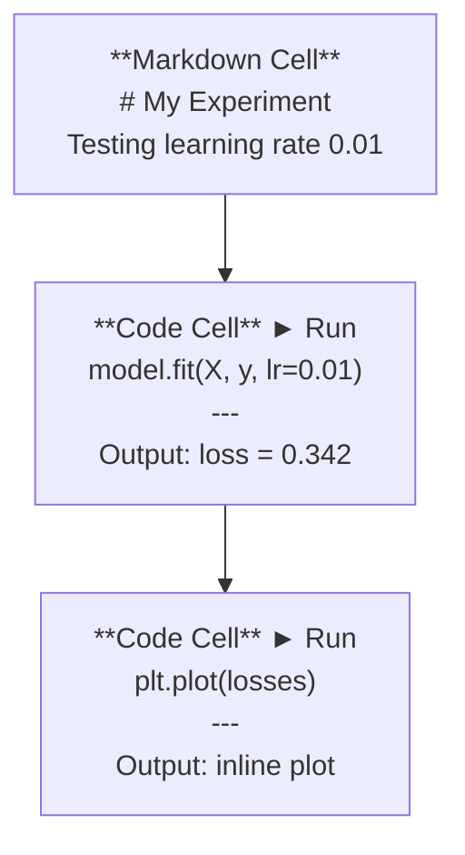
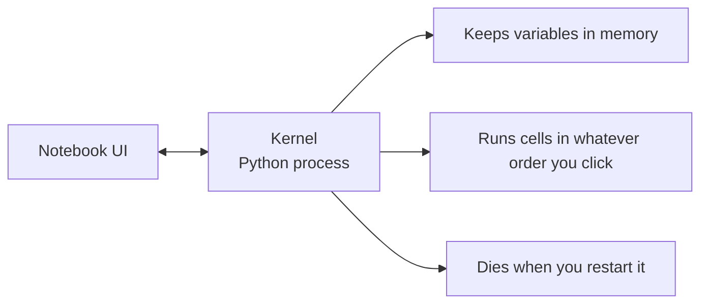

# Cuadernos de Jupyter

> Los cuadernos son la base de experimentación de la ingeniería de IA.

**类型：**Construir
**语言：**Python
**前置要求：**Fase 0, Lección 01
**时间：**30 minutos aproximadamente

## El objetivo del aprendizaje

- Instalar y iniciar JupyterLab、Jupyter Notebook, o con la extensión de Jupyter VS Código
- Utiliza comandos mágicos`%timeit`¿Qué es esto?`%%time`¿Qué es esto?`%matplotlib inline`) para realizar un índice de referencia y en línea
- 区分何时使用笔记本、何时使用脚本,并应用 在笔记本中探索, 在脚本中交付的工作流
- 识别并避免常见笔记本 陷:乱序执行、隐藏状态和内存泄漏

##  problemas

Cada artículo de IA papel、tutorial 和 Kaggle competencia usan Jupyter cuadernos de notas── ellos te hacen dividir el proceso de código、 en línea 查看输出、混合代码与说明,并快速代── si intentas no usar cuadernos aprender AI, como hacer tareas matemáticas pero no hay un rascacielos papel──

Pero los cuadernos sí tienen una trampa. La gente los usa en todo, incluso en cosas que no son muy buenas.

## 概念

El cuaderno es una lista compuesta por un grupo de unidades. Cada uno de ellos es un código, un texto.



El kernel es un proceso de Python que se ejecuta en la base de datos. Cuando se ejecuta una célula, se envía el código al kernel, el kernel ejecuta el código y se devuelve el resultado. Todas las células comparten el mismo kernel, por lo que la variación se mantiene entre las células.



Tu acuerdo con lo que ordenas Tu acuerdo con lo que ordenas Este punto es tanto supercapacidad como fácil de pisotear


```figure
s0-cell-order
```

## Construcción

### Paso 1: Seleccione su interfaz

Tres tipos de selección, de la misma forma:

| Interface | Install | Best for |
|-----------|---------|----------|
| JupyterLab | `pip install jupyterlab` then `jupyter lab` | 完整 IDE 体验、多标签、文件浏览器、terminal |
| Jupyter Notebook | `pip install notebook` then `jupyter notebook` | 简单、轻量、一次一个 notebook |
| VS Code | Install "Jupyter" extension | 已在你的 editor 中、git 集成、debugging |

Tres personas han escrito un libro.`.ipynb`文件──选你喜欢的即可──JupyterLab es la opción más común en el trabajo de IA.

```bash
pip install jupyterlab
jupyter lab
```

### Paso 2: importante clave

Operará en dos modos.`Escape`进入 modo de comando 左侧蓝色),按 `Enter`进入 modo de edición(绿色)。

**Command mode（最常用）：**

| Key | Action |
|-----|--------|
| `Shift+Enter` | 运行 cell，移动到下一个 |
| `A` | 在上方插入 cell |
| `B` | 在下方插入 cell |
| `DD` | 删除 cell |
| `M` | 转换为 markdown |
| `Y` | 转换为 code |
| `Z` | 撤销 cell 操作 |
| `Ctrl+Shift+H` | 显示所有快捷键 |

**Edit mode：**

| Key | Action |
|-----|--------|
| `Tab` | Autocomplete |
| `Shift+Tab` | 显示函数签名 |
| `Ctrl+/` | 切换 comment |

`Shift+Enter`Es que cada día usas un montón de teclas rápidas.

### Paso 3: Tipo de célula

**Code cells**运行 Python 并显示输出:

```python
import numpy as np
data = np.random.randn(1000)
data.mean(), data.std()
```

输出:`(0.0032, 0.9987)`

**Markdown cells**染格式化文本──Use ellos para registrar lo que estás haciendo y por qué lo haces──support header、bold、italic、LaTeX math(`$E = mc^2$`)、tablas y imágenes¬

### Paso 4: Los comandos mágicos

Estos no son Python. Son órdenes especiales de Jupitero.`%`(Mágico de línea) o `%%`(Mágico celular) ¿Qué?

**为你的代码计时：**

```python
%timeit np.random.randn(10000)
```

输出:`45.2 us +/- 1.3 us per loop`

```python
%%time
model.fit(X_train, y_train, epochs=10)
```

输出:`Wall time: 2.34 s`

`%timeit`Las operaciones de la compañía se han multiplicado por un total de cinco años.`%%time`Sólo se hace una vez.`%timeit`Hacer microbenscales, usar `%%time`Hacer carreras de entrenamiento.

**启用 inline plots：**

```python
%matplotlib inline
```

Ahora cada uno.`plt.plot()`O `plt.show()`La ciudad estará directamente en el cuaderno.

**不离开 notebook 安装 packages：**

```python
!pip install scikit-learn
```

`!`Antes de que se ejecutara el comando de la captura.

**检查环境变量：**

```python
%env CUDA_VISIBLE_DEVICES
```

### Paso 5: En línea  muestra la salida rica

Los cuadernos mostrarán automáticamente la última expresión en la célula... pero también puedes controlarlo:

```python
import pandas as pd

df = pd.DataFrame({
    "model": ["Linear", "Random Forest", "Neural Net"],
    "accuracy": [0.72, 0.89, 0.94],
    "training_time": [0.1, 2.3, 45.6]
})
df
```

Esto se hace en una tabla HTML de formato, en lugar de un vertedero de texto.

```python
import matplotlib.pyplot as plt

plt.figure(figsize=(8, 4))
plt.plot([1, 2, 3, 4], [1, 4, 2, 3])
plt.title("Inline Plot")
plt.show()
```

Plot 会出现在细胞 正下方──这是笔记本 主导 AI 工作的原因──你可以同时看到数据、plot 和代码──

 Para las imágenes:

```python
from IPython.display import Image, display
display(Image(filename="architecture.png"))
```

### Paso 6: Colab de Google

Colab es un portátil Jupyter gratuito de cloud-end.

1. El pasado[colab.research.google.com](https://colab.research.google.com)
2. 上传本课程中的任意 `.ipynb`文件
3. Tiempo de ejecución > Cambiar el tipo de tiempo de ejecución > T4 GPU(免费)

Colab y Jupitero nativos:
- Archivos no se guardarán entre sesiones (para almacenar en Drive o descargar)
- 预装:numpy、pandas、matplotlib、torch、tensorflow、sklearn
- Uso `from google.colab import files`上传/ descargar archivos
- Uso `from google.colab import drive; drive.mount('/content/drive')`Hacer un almacenamiento permanente
- 免费层会议在90分钟不活动后会超时

## Uso

### Cuadernos versus guiones:何时使用哪一个

| Use notebooks for | Use scripts for |
|-------------------|-----------------|
| 探索 dataset | Training pipelines |
| Prototype model | Reusable utilities |
| 可视化结果 | 任何包含 `if __name__` 的东西 |
| 解释你的工作 | 按计划运行的 code |
| 快速 experiments | Production code |
| Course exercises | Packages and libraries |

规则:**在 notebooks 中探索，在 scripts 中交付**¿Qué es eso?

Trabajo en el sector de la inteligencia artificial
1. En el cuaderno de notas explorar datos
2. En el cuaderno prototipo de tu modelo
3. Una vez que se haga, se mueve el código.`.py`archivos
4. ¿Qué es esto?`.py`archivos de nuevo importar a la libreta, para experimentos adicionales

### 常见陷

**乱序执行。**Usted primero ejecuta la célula 5, re-ejecuta la célula 2, re-ejecuta la célula 7―Notesbook en tu máquina puede usarse, pero otros de arriba a abajo ejecutar cuando se malen¬¬¬¬¬¬¬¬¬¬¬¬¬¬¬¬¬¬¬¬¬¬¬¬¬¬¬¬¬¬¬¬¬¬¬¬¬¬¬¬¬¬¬¬¬¬¬¬¬¬¬¬¬¬¬¬¬¬¬¬¬¬¬¬¬¬¬¬¬¬¬¬¬¬¬¬¬¬¬¬¬¬¬¬¬¬¬¬¬¬¬¬¬¬¬¬¬¬¬¬¬¬¬¬¬¬¬¬¬¬¬¬¬¬¬¬¬¬¬¬¬¬¬¬¬¬¬¬¬¬¬¬¬¬¬¬¬¬¬¬¬¬¬¬¬¬¬¬¬¬¬¬¬¬¬¬¬¬¬¬¬¬¬¬¬¬¬¬¬¬¬¬¬¬¬¬¬¬¬¬¬¬¬¬¬¬¬¬¬¬¬¬¬¬¬¬¬¬¬¬¬¬¬¬¬¬¬¬¬¬¬¬¬¬¬¬¬¬¬¬¬¬¬¬¬¬¬¬¬¬¬¬¬¬¬¬¬¬¬¬¬¬¬¬¬¬¬¬¬¬¬¬¬¬¬¬¬¬¬¬¬¬¬¬¬¬¬¬¬¬¬¬¬¬¬¬¬¬¬¬¬¬¬¬¬¬¬¬¬¬¬¬¬¬¬¬¬¬¬¬¬¬¬¬¬¬¬¬¬¬¬¬¬¬¬¬¬¬¬¬¬¬¬¬¬¬¬¬¬¬¬¬¬¬¬¬¬¬¬¬¬¬¬¬¬¬¬¬¬¬¬¬¬¬¬¬¬¬¬¬¬¬¬¬¬¬¬¬¬¬¬¬¬¬¬¬¬¬¬¬¬¬¬¬¬¬¬¬¬¬¬¬¬¬¬¬¬¬¬¬¬¬¬¬¬¬¬¬¬¬¬¬¬¬¬¬¬¬¬¬¬¬¬¬¬¬¬¬¬¬¬¬¬¬¬¬¬¬¬¬¬¬¬¬¬¬¬¬¬¬¬¬¬¬¬¬¬¬¬¬¬¬

**隐藏状态。**Usted eliminó una célula, pero la variación que creó todavía está en memoria.

**内存泄漏。**Cargar un conjunto de datos de 4 GB, un modelo de entrenamiento, volver a cargar otro conjunto de datos, todo lo que no se ha liberado.`del variable_name`Y `gc.collect()`, o reiniciar el núcleo.

## 交付

Encuentro de trabajo:
- `outputs/prompt-notebook-helper.md`, para la modificación de los cuadernos 问题

##  ejercicios

1. 打开 JupyterLab, crear un cuaderno,并使用 `%timeit`Comparación de la comprensión de la lista con la numpy en la creación de 100.000 个随机数组 时的差异
2. Crear una libreta que contenga marcas y células de código, cargar CSV, mostrar un marco de datos, y dibujar un gráfico.
3. ¿ Qué ?`code/notebook_tips.py`Enlace de código en el portátil Colab en el portátil de la aplicación

## 关键术语: "El hombre es un hombre"

| Term | What people say | What it actually means |
|------|----------------|----------------------|
| Kernel | “运行我代码的东西” | 一个独立的 Python process，用来执行 cells 并在内存中保存变量 |
| Cell | “一个 code block” | Notebook 中可独立运行的单元，可以是 code 或 markdown |
| Magic command | “Jupyter 技巧” | 以 `%` 或 `%%` 为前缀、用于控制 notebook 环境的特殊命令 |
| `.ipynb` | “Notebook file” | 一个包含 cells、outputs 和 metadata 的 JSON 文件。代表 IPython Notebook |

## 延伸阅读

- [JupyterLab Docs](https://jupyterlab.readthedocs.io/)查看完整功能集
- [Google Colab FAQ](https://research.google.com/colaboratory/faq.html)查看 Colab 特定限制与功能
- [28 Jupyter Notebook Tips](https://www.dataquest.io/blog/jupyter-notebook-tips-tricks-shortcuts/)查看进阶快捷键
