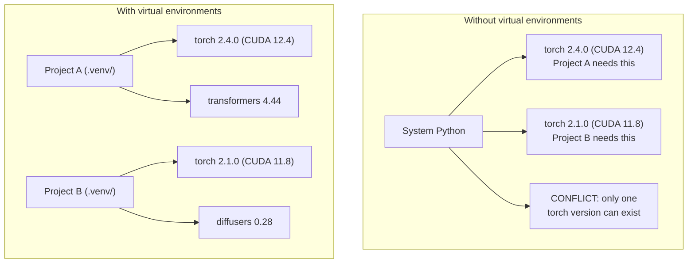

# Entornos de Python

> La dependencia es un infierno.

**Type:** Build
**Languages:** Shell
**Prerequisites:** Phase 0, Lesson 01
**Time:** ~30 分钟

## Objetivos de aprendizaje

- Uso `uv`¿Qué es esto?`venv`O `conda`Crear entornos virtuales separados
- 编写带有可选依赖群的                                                                                                                                                                                                                                                                                                                                                                                                                                                                                                                   `pyproject.toml`, y generar ficheros de bloqueo para garantizar la capacidad de recuperación
- 诊断并修复常见陷:instalas globales pip/conda 混用、CUDA versionas desajustes
- Proyectos de dependencias de conflictos  Implementación de una estrategia medioambiental en fase

##  problemas

Usted para un proyecto de ajuste fino instaló PyTorch 2.4──下周, otro proyecto 需要 PyTorch 2.1, porque su construcción CUDA está fija──你全局升级后, el primer proyecto 坏了──你降级后, el segundo proyecto 又坏了──

Esto es el infierno de la dependencia.

- PyTorch、JAX y TensorFlow cada uno lleva su propio CUDA
- Las bibliotecas de modelos se fijarán en versiones de marco específicas
- Todo el mundo`pip install`会覆盖 contenido previo
- CUDA 11.8 construye 不能与 CUDA 12.x controladores 配合使用,反之亦然

 solución: cada proyecto tiene su propio entorno de aislamiento, así como sus propios paquetes.

## 概念




```figure
s0-env-isolation
```

## Construye el mismo

### 选项 1:uv venv(推)

`uv`Es el más rápido gestor de paquetes Python (比 pip 快 10-100 veces) ⋅ en un instrumento para procesar entornos virtuales, versiones de Python y resolución de dependencias.

```bash
curl -LsSf https://astral.sh/uv/install.sh | sh

uv python install 3.12

cd your-project
uv venv
source .venv/bin/activate
```

Packages de montaje:

```bash
uv pip install torch numpy
```

Una etapa de creación `pyproject.toml`El proyecto:

```bash
uv init my-ai-project
cd my-ai-project
uv add torch numpy matplotlib
```

### 选项 2:venv(内置)

Si no puedes instalarlo`uv`,Python se lleva`venv`¿Qué es esto ?

```bash
python3 -m venv .venv
source .venv/bin/activate  # Linux/macOS
.venv\Scripts\activate     # Windows

pip install torch numpy
```

Más que`uv`Es lento, pero en el lugar donde se ha instalado Python todo puede funcionar.

### 选项 3:conda(需要时使用)

Conda  administrar los kits de herramientas CUDA, cuDNN y bibliotecas C etc. no dependientes de Python.

- Necesitas una versión específica de la kit de herramientas CUDA, pero no quieres instalarlo en todo el sistema.
- En el cluster compartido, no puedes instalar paquetes de sistema
- 某某图书馆的安装说明写着 使用公寓 

```bash
# Install miniconda (not the full Anaconda)
curl -LsSf https://repo.anaconda.com/miniconda/Miniconda3-latest-Linux-x86_64.sh -o miniconda.sh
bash miniconda.sh -b

conda create -n myproject python=3.12
conda activate myproject

conda install pytorch torchvision torchaudio pytorch-cuda=12.4 -c pytorch -c nvidia
```

Una regla: si en un entorno usas una conda, usa la conda para administrar los paquetes de ese entorno.`pip install`La confusión entre los clientes puede causar conflictos de dependencia y también causar dolor.

### Este curso: estrategia de fase

Puedes crear un entorno para toda la clase. No lo hagas.

策略:

```
ai-engineering-from-scratch/
├── .venv/                    <-- phases 0-3 共用的轻量 env
├── phases/
│   ├── 04-neural-networks/
│   │   └── .venv/            <-- PyTorch env
│   ├── 05-cnns/
│   │   └── .venv/            <-- 同一个 PyTorch env（symlink 或 shared）
│   ├── 08-transformers/
│   │   └── .venv/            <-- 可能需要不同的 transformer versions
│   └── 11-llm-apis/
│       └── .venv/            <-- API SDKs，不需要 torch
```

`code/env_setup.sh`El script de la escuela será para este curso.

## pyproject.toml 基础

Cada proyecto Python debería tener uno .`pyproject.toml`◊ Lo reemplazo con un archivo `setup.py`¿Qué es esto?`setup.cfg`Y `requirements.txt`¿Qué es eso?

```toml
[project]
name = "ai-engineering-from-scratch"
version = "0.1.0"
requires-python = ">=3.11"
dependencies = [
    "numpy>=1.26",
    "matplotlib>=3.8",
    "jupyter>=1.0",
    "scikit-learn>=1.4",
]

[project.optional-dependencies]
torch = ["torch>=2.3", "torchvision>=0.18"]
llm = ["anthropic>=0.39", "openai>=1.50"]
```

Luego se instala:

```bash
uv pip install -e ".[torch]"    # base + PyTorch
uv pip install -e ".[llm]"     # base + LLM SDKs
uv pip install -e ".[torch,llm]" # everything
```

## Ficha de bloqueo

El archivo de bloqueo se fijará en cada dependencia (incluidas las dependencias transitivas) fijadas hasta una versión precisa. Esto garantiza la capacidad de repetición: cualquier persona que se instala en el archivo de bloqueo, obtendrá los mismos paquetes.

```bash
# uv generates uv.lock automatically when using uv add
uv add numpy

# pip-tools approach
uv pip compile pyproject.toml -o requirements.lock
uv pip install -r requirements.lock
```

Coloque su archivo de bloqueo en el archivo de bloqueo de otro usuario, luego de que el archivo de bloqueo se instale, obtendrá versiones perfectamente compatibles.

## 常见错误

### 1. Todo el mundo

```bash
pip install torch  # BAD: installs to system Python

source .venv/bin/activate
pip install torch  # GOOD: installs to virtual environment
```

Revisa tus paquetes.

```bash
which python       # should show .venv/bin/python, not /usr/bin/python
which pip           # should show .venv/bin/pip
```

### 2. 混用 pip 和 conda

```bash
conda create -n myenv python=3.12
conda activate myenv
conda install pytorch -c pytorch
pip install some-other-package   # BAD: can break conda's dependency tracking
conda install some-other-package # GOOD: let conda manage everything
```

Si tienes que usar tubo en el condado, primero instala todos los tubos, y luego vuelve a instalar tubos.

### 3.  olvidar activar

```bash
python train.py           # uses system Python, missing packages
source .venv/bin/activate
python train.py           # uses project Python, packages found
```

Su shell prompt 应显示 el nombre del entorno:

```
(.venv) $ python train.py
```

### 4. ¿Por qué no se compromete a hacerlo ?

```bash
echo ".venv/" >> .gitignore
```

Los entornos virtuales suelen tener 200 MB-2GB. Son locales, no pueden ser transferidos entre máquinas.`pyproject.toml`Y el archivo de bloqueo.

### 5. Desajuste de la versión CUDA

```bash
nvidia-smi                # shows driver CUDA version (e.g., 12.4)
python -c "import torch; print(torch.version.cuda)"  # shows PyTorch CUDA version

# These must be compatible.
# PyTorch CUDA version must be <= driver CUDA version.
```

## Usalo

运行 script de configuración  Crea tu entorno de clases:

```bash
bash phases/00-setup-and-tooling/06-python-environments/code/env_setup.sh
```

Esto se hará en la raíz de repo Crear uno`.venv`,并安装和验证 dependencias centrales.

##  ejercicios

1. 运行                                                                                                                                                                                                                                                                                                                                                                                                                                                                                                                           `env_setup.sh`Y confirmó que todos los controles fueron aprobados
2. Crear un segundo entorno virtual, instalar en él diferentes versiones de Numpy, y confirmar dos entornos separados entre sí
3. Para un proyecto simultáneo de PyTorch y SDK Antropico 编写 `pyproject.toml`
4. Por lo tanto, todo el equipo ha instalado un paquete, no ha activado el venv, lo ha visto y lo ha desmontado.

## 关键术语: "El hombre es un hombre"

| Term | What people say | What it actually means |
|------|----------------|----------------------|
| Virtual environment | “A venv” | 一个隔离目录，包含 Python interpreter 和 packages，并与 system Python 分离 |
| Lockfile | “Pinned dependencies” | 一个列出每个 package 及其精确 version 的文件，保证跨机器安装一致 |
| pyproject.toml | “The new setup.py” | 标准 Python project 配置文件，替代 setup.py/setup.cfg/requirements.txt |
| Transitive dependency | “A dependency of a dependency” | Package B 依赖 C；如果你安装依赖 B 的 A，那么 C 就是 A 的 transitive dependency |
| CUDA mismatch | “My GPU isn't working” | PyTorch 编译所用的 CUDA version 与你的 GPU driver 支持的版本不同 |
