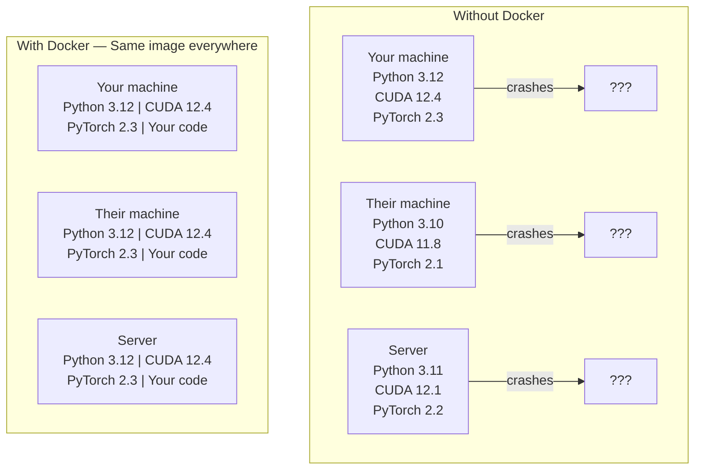

# Docker para IA

> Los contenedores pueden correr en mi máquina y convertirse en el pasado.

**Type:** Build
**Languages:** Docker
**Prerequisites:** Phase 0, Lessons 01 and 03
**Time:** ~60 分钟

## Objetivos de aprendizaje

- Desde el archivo de Docker Construir la imagen de Docker de la GPU, que contiene CUDA、PyTorch y bibliotecas de IA
- Los directorios de host  como volúmenes montados, para que en los contenedores reconstruye  entre modelos de perpetuidad DATASETs y código
- Configurar NVIDIA Container Toolkit, hacer que los contenedores  interno puede acceder a las GPUs
- Utiliza Docker Compone 编排多服务 aplicaciones de IA(servidor de inferencia + base de datos vectorial)

##  problemas

Tu equipo usa PyTorch 2.1 ̊CUDA 12.4 y Python 3.12  entrenar un modelo― tus compañeros usan PyTorch 2.1 ̊CUDA 11.8 y Python 3.10― tu modelo se derrumba en sus máquinas― tu archivo de Docker está en ambos lados todo puede trabajar―

Los proyectos de IA son pesadillas de dependencia. Una pila típica incluye Python, PyTorch, drivers CUDA, cuDNN, bibliotecas C a nivel de sistema, así como paquetes especializados de versiones de compilador precisas como Flash-attn. Docker pondrá todo esto en una imagen y en cualquier lugar funcionará de la misma manera.

## 概念

Docker pondrá su código, tiempo de ejecución, bibliotecas y herramientas del sistema envueltas en una unidad aislada llamada contenedor. Puede considerarse una máquina virtual de pequeña escala, simplemente comparte el kernel del sistema operativo host, en lugar de ejecutar su propio kernel, por lo que solo se necesitan unos segundos para iniciar, en lugar de unos minutos.



### ¿Por qué los proyectos de IA necesitan más Docker que la mayoría de los proyectos ?

1. **GPU drivers 很脆弱。**CUDA 12.4 código 不能在 CUDA 11.8 上运行──Docker 会隔离容器内的 CUDA toolkit, simultáneamente a través de NVIDIA Container Toolkit 共享主机GPU驱动器──

2. **Model weights 很大。**Un modelo de parámetro 7B en fp16 abajo tiene 14 GB. Usted no quiere volver a descargarlo en cada reconstrucción. Volúmenes de Docker le permiten montar un directorio de modelos de host.

3. **Multi-service architectures 很常见。**Una aplicación de IA real no es sólo un script Python. Es un servidor de inferencias para la base de datos vectorial de RAG, puede haber un frontend web.

### 关键词汇: "El lenguaje de la lengua"

| Term | What it means |
|------|---------------|
| Image | 只读 template。你的 recipe。由 Dockerfile 构建。 |
| Container | image 的运行实例。你的 kitchen。 |
| Dockerfile | 构建 image 的 instructions。逐层构建。 |
| Volume | 可在 container restarts 后保留的持久化 storage。 |
| docker-compose | 用 YAML 定义 multi-container applications 的工具。 |

### Modelos de contenedores de IA

```
Dev Container
  完整 toolkit。Editor support。Jupyter。Debugging tools。
  用于 development 和 experimentation。

Training Container
  最小化。只有 training script 和 dependencies。
  在 GPU clusters 上运行。没有 editor，没有 Jupyter。

Inference Container
  为 serving 优化。Small image。Fast cold start。
  在 production 中运行于 load balancer 后方。
```


```figure
s0-image-layers
```

## Construye el mismo

### Paso 1: Instalar el Docker

```bash
# macOS
brew install --cask docker
open /Applications/Docker.app

# Ubuntu
curl -fsSL https://get.docker.com | sh
sudo usermod -aG docker $USER
# Log out and back in for group change to take effect
```

验证:

```bash
docker --version
docker run hello-world
```

### Paso 2: instalar NVIDIA Container Toolkit (con NVIDIA GPU de Linux)

Esto permite que los contenedores de Docker puedan acceder a su GPU. MacOS y Windows.

```bash
distribution=$(. /etc/os-release;echo $ID$VERSION_ID)
curl -fsSL https://nvidia.github.io/libnvidia-container/gpgkey | sudo gpg --dearmor -o /usr/share/keyrings/nvidia-container-toolkit-keyring.gpg
curl -s -L https://nvidia.github.io/libnvidia-container/$distribution/libnvidia-container.list | \
    sed 's#deb https://#deb [signed-by=/usr/share/keyrings/nvidia-container-toolkit-keyring.gpg] https://#g' | \
    sudo tee /etc/apt/sources.list.d/nvidia-container-toolkit.list

sudo apt-get update
sudo apt-get install -y nvidia-container-toolkit
sudo nvidia-ctk runtime configure --runtime=docker
sudo systemctl restart docker
```

En el contenedor interno de acceso de GPU:

```bash
docker run --rm --gpus all nvidia/cuda:12.4.1-base-ubuntu22.04 nvidia-smi
```

Si ves información de la GPU, explica el kit de herramientas.

### Paso 3: Comprender las imágenes de base

选择正确的基像可以节省几个小时调试时间──

```
nvidia/cuda:12.4.1-devel-ubuntu22.04
  完整 CUDA toolkit。包含 compilers。
  Use for: 构建需要 nvcc 的 packages（flash-attn、bitsandbytes）
  Size: ~4 GB

nvidia/cuda:12.4.1-runtime-ubuntu22.04
  仅 CUDA runtime。没有 compilers。
  Use for: 运行 pre-built code
  Size: ~1.5 GB

pytorch/pytorch:2.3.1-cuda12.4-cudnn9-runtime
  基于 CUDA 预装 PyTorch。
  Use for: 跳过 PyTorch install step
  Size: ~6 GB

python:3.12-slim
  没有 CUDA。仅 CPU。
  Use for: CPU inference、lightweight tools
  Size: ~150 MB
```

### Paso 4: para el desarrollo de IA 编写 Dockerfile

Es el .`code/Dockerfile`En el centro de Dockerfile.

```dockerfile
FROM nvidia/cuda:12.4.1-devel-ubuntu22.04

ENV DEBIAN_FRONTEND=noninteractive
ENV PYTHONUNBUFFERED=1

RUN apt-get update && apt-get install -y --no-install-recommends \
    python3.12 \
    python3.12-venv \
    python3.12-dev \
    python3-pip \
    git \
    curl \
    build-essential \
    && rm -rf /var/lib/apt/lists/*

RUN update-alternatives --install /usr/bin/python python /usr/bin/python3.12 1

RUN python -m pip install --no-cache-dir --upgrade pip setuptools wheel

RUN python -m pip install --no-cache-dir \
    torch==2.3.1 \
    torchvision==0.18.1 \
    torchaudio==2.3.1 \
    --index-url https://download.pytorch.org/whl/cu124

RUN python -m pip install --no-cache-dir \
    numpy \
    pandas \
    scikit-learn \
    matplotlib \
    jupyter \
    transformers \
    datasets \
    accelerate \
    safetensors

WORKDIR /workspace

VOLUME ["/workspace", "/models"]

EXPOSE 8888

CMD ["python"]
```

Construirlo:

```bash
docker build -t ai-dev -f phases/00-setup-and-tooling/07-docker-for-ai/code/Dockerfile .
```

La primera vez que me llevan algunos días, descargo de CUDA base imagen + PyTorch)

¿Qué es eso ?

```bash
docker run --rm -it --gpus all \
    -v $(pwd):/workspace \
    -v ~/models:/models \
    ai-dev python -c "import torch; print(f'PyTorch {torch.__version__}, CUDA: {torch.cuda.is_available()}')"
```

En el contenedor en el que se ejecuta el Jupyter:

```bash
docker run --rm -it --gpus all \
    -v $(pwd):/workspace \
    -v ~/models:/models \
    -p 8888:8888 \
    ai-dev jupyter notebook --ip=0.0.0.0 --port=8888 --no-browser --allow-root
```

### Paso 5: para el uso de datos y modelos de montajes de volumen

El volumen aumenta para la IA 工作至关重要──没有它们, tus descargas de modelos de 14 GB se van a parar después de desaparecer──

```bash
# Mount your code
-v $(pwd):/workspace

# Mount a shared models directory
-v ~/models:/models

# Mount datasets
-v ~/datasets:/data
```

En tu guión de entrenamiento, desde el camino montado

```python
from transformers import AutoModel

model = AutoModel.from_pretrained("/models/llama-7b")
```

modelo  está en su sistema de archivos host 上。 puedes reconstruir el contenedor de forma dispuesta, sin necesidad de volver a descargar。

### Paso 6: Compone Docker para aplicaciones de IA de múltiples servicios

Una aplicación RAG real  necesita servidor de inferencia 和 vector de base de datos──Docker Compose Utilize a una条命令运行两者──

¿ Qué ?`code/docker-compose.yml`¿Qué es esto ?

```yaml
services:
  ai-dev:
    build:
      context: .
      dockerfile: Dockerfile
    deploy:
      resources:
        reservations:
          devices:
            - driver: nvidia
              count: all
              capabilities: [gpu]
    volumes:
      - ../../../:/workspace
      - ~/models:/models
      - ~/datasets:/data
    ports:
      - "8888:8888"
    stdin_open: true
    tty: true
    command: jupyter notebook --ip=0.0.0.0 --port=8888 --no-browser --allow-root

  qdrant:
    image: qdrant/qdrant:v1.12.5
    ports:
      - "6333:6333"
      - "6334:6334"
    volumes:
      - qdrant_data:/qdrant/storage

volumes:
  qdrant_data:
```

启动所有服务:

```bash
cd phases/00-setup-and-tooling/07-docker-for-ai/code
docker compose up -d
```

Ahora tu contenedor de desarrollo de IA puede pasar por el nombre de servicio en`http://qdrant:6333`访问 vector database──Docker Compose 会自动创建共享网络──

Desde el contenedor de IA 内测试连接:

```python
from qdrant_client import QdrantClient

client = QdrantClient(host="qdrant", port=6333)
print(client.get_collections())
```

停止所有服务:

```bash
docker compose down
```

Además`-v`También eliminará el volumen:

```bash
docker compose down -v
```

### Paso 7: comandos de Docker en uso real en AI 工作中

```bash
# List running containers
docker ps

# List all images and their sizes
docker images

# Remove unused images (reclaim disk space)
docker system prune -a

# Check GPU usage inside a running container
docker exec -it <container_id> nvidia-smi

# Copy a file from container to host
docker cp <container_id>:/workspace/results.csv ./results.csv

# View container logs
docker logs -f <container_id>
```

## Usalo

Ahora tienes un entorno de desarrollo de IA replicable.

- Uso `docker compose up`Al mismo tiempo, iniciar su entorno de desarrollo y base de datos vectorial
- Codificar modelos y datos como volúmenes montados, asegurarse de que no pierda nada entre las reconstrucciones
- Cuando una lección necesita un nuevo paquete Python, añade a un archivo de Docker y reconstruye
- Compartir tu archivo de Docker con los compañeros de equipo. Ellos tendrán el mismo entorno.

### ¿No tiene GPU?

移除                                                                                                                                                                                                                                                                                                                                                                                                                                                                                                                           `--gpus all`bandera y NVIDIA deploy block──contenedor  todavía se aplica para las lecciones basadas en CPU──PyTorch 会自动检测没有 CUDA,并倒退到CPU──

##  ejercicios

1. Construir un archivo de archivo, y en el contenedor 内运行 `python -c "import torch; print(torch.__version__)"`
2. Initiar la pila de docker-compuesto,并验证可从AI contenedor 访问 `http://qdrant:6333/collections`El Qdrant de arriba
3. ¿ Qué ?`flask`添加到Dockerfile,rebuild, y en el puerto 5000 上运行一个简单API server──使用 `-p 5000:5000`mapa 端口
4. Uso `docker images`测量 imagen size──尝试把 base de imagen de `devel`切换到 `runtime`,并比较大小

## 关键术语: "El hombre es un hombre"

| Term | What people say | What it actually means |
|------|----------------|----------------------|
| Container | “Lightweight VM” | 使用 host kernel 的隔离进程，拥有自己的 filesystem 和 network |
| Image layer | “Cached step” | 每条 Dockerfile instruction 都会创建一个 layer。未变化的 layers 会被 cached，因此 rebuilds 很快。 |
| NVIDIA Container Toolkit | “GPU in Docker” | 一个 runtime hook，通过 `--gpus` flag 将 host GPUs 暴露给 containers |
| Volume mount | “Shared folder” | host 上映射进 container 的目录。container 停止后 changes 仍会保留。 |
| Base image | “Starting point” | 你的 Dockerfile 基于其构建的 `FROM` image。它决定了预装内容。 |
