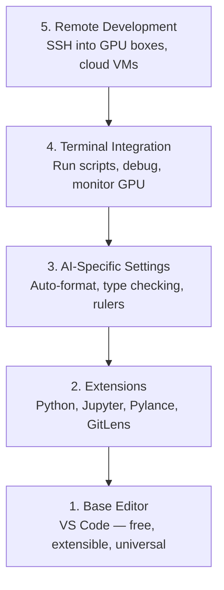

# Configuración del editor

> Tu editor es tu socio colaborador. Configúrate de una vez, deja que no te detenga, y empieza a funcionar realmente.

**Type:** Build
**Languages:** --
**Prerequisites:** Phase 0, Lesson 01
**Time:** ~20 分钟

## El objetivo del aprendizaje
- Instalar VS Code, y configurar Python、Jupyter、linting y las extensiones centrales necesarias para SSH remoto
- Para los flujos de trabajo de IA  Configurar formato-en-salvamiento  Verificación de tipo y desplazamiento de salida de portátil
- Configurar SSH remoto, como editar código local como en la GPU de distancia  Máquina de edición y desarreglamiento  código
- 评估其他编辑器选择(Cursor、Windsurf、Neovim) y sus cambios en el trabajo de IA

##  problemas
Usted gastará miles de horas en el editor: escribir Python, ejecutar cuadernos de notas, deshacer los bucles de entrenamiento, así como SSH a GPU 机器── un editor de configuración incorrecta hará que cada trabajo esté lleno de resistencia: sin autocompletar, sin sugerencias de tipo, sin errores de línea, sin necesidad de formato manual, así como un flujo de trabajo terminal pesado──

La configuración correcta sólo toma 20 minutos. Saltar sobre ella, todos los días perderán 20 minutos.

## 概念
La configuración de los editores de ingeniería de IA requiere de cinco cosas:




```figure
s0-lsp-roundtrip
```

## Construirlo
### Paso 1: Instalar el código VS

 Usar VS Code.  Es gratis, puede funcionar en todos los sistemas operativos.  Tiene un gran soporte para el portátil de Jupyter, y el modo de extensión abarca todo lo que se necesita para trabajar en IA.

Desde[code.visualstudio.com](https://code.visualstudio.com/)Descarga.

En el terminal de la prueba:

```bash
code --version
```

Si macOS 上找不到 `code`, abre VS Código, por`Cmd+Shift+P`,输入 "Shell Command", y luego seleccionar "Installar el comando 'código' en PATH"。

### Paso 2: Instalación necesaria para ampliar

En VS Code en el terminal de apertura integrada`Ctrl+`` `O `` Cmd+```), instalar el trabajo de IA 需要的扩展:

```bash
code --install-extension ms-python.python
code --install-extension ms-python.vscode-pylance
code --install-extension ms-toolsai.jupyter
code --install-extension eamodio.gitlens
code --install-extension ms-vscode-remote.remote-ssh
code --install-extension ms-python.debugpy
code --install-extension ms-python.black-formatter
code --install-extension charliermarsh.ruff
```

Cada extensión de la acción:

| Extension | Why |
|-----------|-----|
| Python | Language 支持、virtual env 检测、run/debug |
| Pylance | 快速 type checking、autocomplete、import resolution |
| Jupyter | 在 VS Code 内运行 notebooks、variable explorer |
| GitLens | 查看谁改了什么、inline git blame |
| Remote SSH | 像本地一样打开远程 GPU 机器上的文件夹 |
| Debugpy | Python 的 step-through debugging |
| Black Formatter | 保存时自动格式化，保持风格一致 |
| Ruff | 快速 linting，捕获常见错误 |

本课中   en el curso`code/.vscode/extensions.json`文件包含完整推列表──当你打开项目文件时,VS Code 会提示你安装它们──

### Paso 3: Configuración de configuración

复制本课                                                                                                                                                                                                                                                                                                                                                                                                                                                                                                                         `code/.vscode/settings.json`En medio de la configuración, o a través de `Settings > Open Settings (JSON)`Aplicación manual.

Configuración clave de trabajo de IA:

```jsonc
{
    "python.analysis.typeCheckingMode": "basic",
    "editor.formatOnSave": true,
    "editor.rulers": [88, 120],
    "notebook.output.scrolling": true,
    "files.autoSave": "afterDelay"
}
```

¿Por qué son importantes?

- **Type checking on basic**En el caso de los tipos de argumentos de la aplicación, puede ser necesario deshacerse de los parámetros de los parámetros de la API.
- **Format on save**No hay necesidad de pensar en el formato.
- **Rulers at 88 and 120**: Negro en 88 处换行──120 标记显示 docstrings 和 comments 什么时候过长──
- **Notebook output scrolling**Los bucles de entrenamiento imprimirán miles de líneas. No se desplazarán.
- **Auto-save**Tu guión de entrenamiento se ejecutará en el código antiguo.

### Paso 4: Terminal 集成

El terminal integrado de VS Code es el lugar donde se ejecutan los scripts de entrenamiento, se controla la GPU y se administran los entornos.

La configuración correcta:

```jsonc
{
    "terminal.integrated.defaultProfile.osx": "zsh",
    "terminal.integrated.defaultProfile.linux": "bash",
    "terminal.integrated.fontSize": 13,
    "terminal.integrated.scrollback": 10000
}
```

Hay un rápido clave útil:

| Action | macOS | Linux/Windows |
|--------|-------|---------------|
| Toggle terminal | `` Ctrl+` `` | `` Ctrl+` `` |
| New terminal | `Ctrl+Shift+`` ` | `Ctrl+Shift+`` ` |
| Split terminal | `Cmd+\` | `Ctrl+\` |

Terminals divididos  muy útil: uno para ejecutar tu script, otro para usar `nvidia-smi -l 1`O `watch -n 1 nvidia-smi`Monitoring GPU♪

### Paso 5: desarrollo de distancia (SSH a GPU)

Esto es el trabajo de IA, la extensión más importante. Usted va a correr en la formación de máquinas de distancia.

Configuración:

1. Instalar extensión remota de SSH (((Ya está en el paso 2 完成)
2. 按  `Ctrl+Shift+P`(o `Cmd+Shift+P`),输入 "Remote-SSH: Conectarse a el host"──
3. 输入  `user@your-gpu-box-ip`¿Qué es eso?
4. VS Code se instalará automáticamente en el servidor de su componente en el equipo remoto.

Si se necesita acceso sin contraseña, configurar las claves SSH:

```bash
ssh-keygen -t ed25519 -C "your-email@example.com"
ssh-copy-id user@your-gpu-box-ip
```

Para su conveniencia, añade al anfitrión.`~/.ssh/config`¿Qué es esto ?

```
Host gpu-box
    HostName 203.0.113.50
    User ubuntu
    IdentityFile ~/.ssh/id_ed25519
    ForwardAgent yes
```

Ahora .`Remote-SSH: Connect to Host > gpu-box`¡Me voy a llamar!

## Las alternativas

### El cursor

[cursor.com](https://cursor.com)Es una generación de código de IA en el interior de la generación de código de VS. Utiliza la misma extensión, modo y configuración. Si usas Cursor, todo el contenido de esta clase sigue siendo aplicable.`settings.json`Y `extensions.json`¿Qué es eso?

### El windsurf

[windsurf.com](https://windsurf.com)Es otro fork de código VS de AI-primero. La situación es la misma: las mismas extensiones, las mismas configuraciones, el mismo formato, el mismo SSH remoto 支持。

### Vim/Neovim

Si ya utilizas Vim o Neovim y la eficiencia es alta, entonces sigue usando.

- **pyright**O **pylsp**Usado para comprobar el tipo (a través de Mason o manual)
- **nvim-lspconfig**Utilizado para la integración del servidor de lenguaje
- **jupyter-vim**O **molten-nvim**Utilizando una ejecución similar a un cuaderno .
- **telescope.nvim**Usándolo para buscar archivos/símbolos
- **none-ls.nvim**搭配 negro 和 ruff Usado para el formato / enlace

Si aún no usas Vim, no empieces ahora.

## Usalo
Con este conjunto de configuraciones, tu flujo de trabajo diario se ve así:

1. En VS Code en el centro de la página de proyecto de la aplicación de software de alta velocidad (RMS)
2. En editores, se puede escribir Python, usando autocompletos, sugerencias de tipo y errores de línea.
3. Utiliza extensión de Jupyter 内联运行 Jupyter cuadernos".""
4. Utiliza terminal integrado 运行 guiones de entrenamiento`uv pip install`Y el monitoreo de la GPU.
5. 提交前用 GitLens revisión de cambios。

##  ejercicios
1. Instalación VS Código y Paso 2 En la lista de todas las extensiones
2. ¿Qué es esto?`settings.json`复制到你的 VS código configuración 中
3. Abre un archivo Python, verifique Pylance muestra sugerencias de tipo y Black 会在保存时格式化
4. Si puedes acceder a una máquina remota, configure Remote SSH y abra un archivo en ella

## 关键术语: "El hombre es un hombre"
| Term | What people say | What it actually means |
|------|----------------|----------------------|
| LSP | "Autocomplete engine" | Language Server Protocol：一种标准，让 editors 可以从特定 language 的 server 获取 type info、completions 和 diagnostics |
| Pylance | "The Python plugin" | Microsoft 的 Python language server，使用 Pyright 进行 type checking 和 IntelliSense |
| Remote SSH | "Working on the server" | VS Code extension，在远程机器上运行轻量 server，并将 UI stream 到本地 editor |
| Format on save | "Auto-prettier" | 每次保存时 editor 都会运行 formatter（Black、Ruff），因此 code style 始终一致 |
