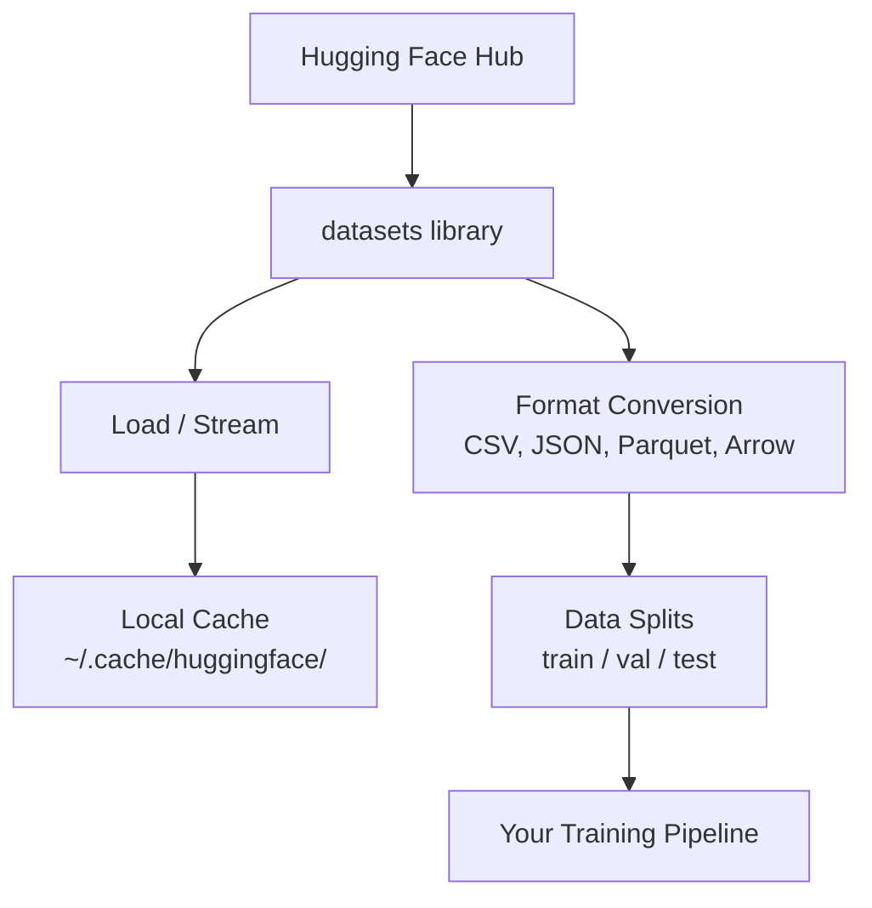

# Gestión de datos

> Los datos son combustible. Cómo manejarlos, es lo que decide que puedes ir más rápido.

**Type:** Build
**Language:**Python
**Prerequisites:** Phase 0, Lesson 01
**Time:** ~45 分钟

## El objetivo del aprendizaje
- Uso de cara abrazada`datasets`biblioteca DATASETs de carga, flujo y caché
- En CSV、JSON、Parquet y Arrow formatos                                                                                                                                                                                                                                                                                                                                                                                                                                                                                                                
- Utiliza semillas aleatorias fijas 创建可复现的 tren/validación/test split
- Uso `.gitignore`、Git LFS o DVC 管理 grandes modelos y archivos de conjuntos de datos

##  problemas
Cada proyecto de IA se basa en datos. Se necesita encontrar conjuntos de datos, descargarlos, convertirlos entre formatos, desglosarlos para su formación y evaluación, hacer versiones, hacer experimentos, hacerlos repetibles.

## 概念


Un rostro abrazador .`datasets`La biblioteca es para el trabajo de la IA, y es el método estándar para cargar datos.


```figure
s0-data-pipeline
```

## Construirlo
### Paso 1: Instalar la biblioteca de conjuntos de datos

```bash
pip install datasets huggingface_hub
```

### 步骤 2: Cargar un conjunto de datos

```python
from datasets import load_dataset

dataset = load_dataset("imdb")
print(dataset)
print(dataset["train"][0])
```

Esto se descargará en el conjunto de datos de IMDB. Después de su primera descarga, se descargará desde el sitio web.`~/.cache/huggingface/datasets/`El caché está cargado.

### Paso 3: procesamiento de grandes conjuntos de datos

Algunos conjuntos de datos son demasiado grandes, no pueden ser completos para colocar en un disco.

```python
dataset = load_dataset("wikimedia/wikipedia", "20220301.en", split="train", streaming=True)

for i, example in enumerate(dataset):
    print(example["title"])
    if i >= 4:
        break
```

La transmisión te dará una .`IterableDataset` Usted estará en filas hasta llegar el tiempo de procesarlos  Independientemente del conjunto de datos, el uso de memoria se mantiene constante 

### 步骤 4: Formatos de conjunto de datos

`datasets`biblioteca 底层 usando Apache Arrow。 puedes convertirlo en otros formatos según las necesidades del pipeline。

```python
dataset = load_dataset("imdb", split="train")

dataset.to_csv("imdb_train.csv")
dataset.to_json("imdb_train.json")
dataset.to_parquet("imdb_train.parquet")
```

Formatos en relación con:

| Format | Size | Read Speed | Best For |
|--------|------|-----------|----------|
| CSV | 大 | 慢 | Human readability、spreadsheets |
| JSON | 大 | 慢 | APIs、nested data |
| Parquet | 小 | 快 | Analytics、columnar queries |
| Arrow | 小 | 最快 | In-memory processing（`datasets` 内部使用的格式） |

Para el trabajo de IA, Parquet es el mejor formato de almacenamiento. Arrow es el formato que utilizas en la memoria.

### Paso 5: División de datos

Cada proyecto de ML necesita tres divisiones:

- **Train**:modelo de aquí aprender (normalmente 80%)
- **Validation**: tu en el proceso de formación  Inspección de progreso (normalmente 10%)
- **Test**: formación 完成后的最终评估 (normalmente 10%)

Algunos conjuntos de datos han sido previamente divididos.

```python
dataset = load_dataset("imdb", split="train")

split = dataset.train_test_split(test_size=0.2, seed=42)
train_val = split["train"].train_test_split(test_size=0.125, seed=42)

train_ds = train_val["train"]
val_ds = train_val["test"]
test_ds = split["test"]

print(f"Train: {len(train_ds)}, Val: {len(val_ds)}, Test: {len(test_ds)}")
```

Siempre establecer semillas para garantizar la reproductibilidad. Cada vez se produce la misma división.

### Paso 6: Descargar el modelo de almacenamiento

Los modelos son grandes documentos.`huggingface_hub`Biblioteca 会处理 descarga y almacenamiento en caché

```python
from huggingface_hub import hf_hub_download, snapshot_download

model_path = hf_hub_download(
    repo_id="sentence-transformers/all-MiniLM-L6-v2",
    filename="config.json"
)
print(f"Cached at: {model_path}")

model_dir = snapshot_download("sentence-transformers/all-MiniLM-L6-v2")
print(f"Full model at: {model_dir}")
```

Los modelos se almacenarán hasta`~/.cache/huggingface/hub/`下载一次后后后续运行会立即加载──

### Paso 7: Tratar los grandes archivos

Los pesos de modelo y los conjuntos de datos grandes no deberían entrar en git.

**Option A: .gitignore（最简单）**

```
*.bin
*.safetensors
*.pt
*.onnx
data/*.parquet
data/*.csv
models/
```

**Option B: Git LFS（在 git 中跟踪大型文件）**

```bash
git lfs install
git lfs track "*.bin"
git lfs track "*.safetensors"
git add .gitattributes
```

Git LFS en su repo de almacenamiento de indicadores, y el archivo de archivos real será almacenado en un servidor independiente.

**Option C: DVC（data version control）**

```bash
pip install dvc
dvc init
dvc add data/training_set.parquet
git add data/training_set.parquet.dvc data/.gitignore
git commit -m "Track training data with DVC"
```

DVC 会创建小型 `.dvc`文件, apuntando hacia tus datos―Data se almacena en S3、GCS o en otro backend de almacenamiento remoto―

| Approach | Complexity | Best For |
|----------|-----------|----------|
| .gitignore | 低 | 个人项目、可重新获取的 downloaded data |
| Git LFS | 中 | 通过 git 共享 model weights 的团队 |
| DVC | 高 | 可复现 experiments、大型 datasets、团队 |

对于本课程,`.gitignore`已足够── Cuando necesites experimentos trans-máquinas, vuelve a usar DVC──

### Paso 8: patrones de almacenamiento

**Local storage** se aplica a conjuntos de datos de ~ 10 GB. HF caché 会自动处理──

**Cloud storage** para contenido más amplio, o que requiere el intercambio de contenido entre dispositivos:

```python
import os

local_path = os.path.expanduser("~/.cache/huggingface/datasets/")

# s3_path = "s3://my-bucket/datasets/"
# gcs_path = "gs://my-bucket/datasets/"
```

DVC puede ser directamente integrado con S3 y GCS:

```bash
dvc remote add -d myremote s3://my-bucket/dvc-store
dvc push
```

对于本课程,本地存储 足够──云存储会在您的远程GPU实例上调时变得相关──

## Este curso utiliza Datasets

| Dataset | Lessons | Size | What It Teaches |
|---------|---------|------|----------------|
| IMDB | Tokenization、classification | 84 MB | Text classification 基础 |
| WikiText | Language modeling | 181 MB | Next-token prediction |
| SQuAD | QA systems | 35 MB | Question answering、spans |
| Common Crawl (subset) | Embeddings | 不定 | Large-scale text processing |
| MNIST | Vision basics | 21 MB | Image classification fundamentals |
| COCO (subset) | Multimodal | 不定 | Image-text pairs |

Ahora no necesitas descargar todo esto. Cada sección te explicará lo que necesitas.

## Usalo
运行 utility script 验证一切正常:

```bash
python code/data_utils.py
```

Se descargará un pequeño conjunto de datos, se transformará, se dividirá, se imprimirá un resumen.

##  entregarlo
本课产 出:
- `code/data_utils.py`- Utilidad de carga de datos y caché de uso repetitivo
- `outputs/prompt-data-helper.md`- Usado para la tarea de buscar el conjunto de datos adecuado de la solicitud

##  ejercicios
1. Uso `mrpc`Configurar `glue`conjunto de datos,并检查前 5 个例子
2. - ¿ Qué ?`c4`conjunto de datos,并统计 10 秒内可以处理多少例
3. Convertir un conjunto de datos en Parquet, y el tamaño del archivo en relación con el CSV
4. Utiliza semillas fijas 创建 70/15/15 tren/val/test split,并验证 tamaños

## 关键术语: "El hombre es un hombre"
| Term | What people say | What it actually means |
|------|----------------|----------------------|
| Dataset split | "Training data" | 一个命名 subset（train/val/test），用于 ML lifecycle 的不同阶段 |
| Streaming | "Load it lazily" | 从远程 source 逐行处理 data，而不下载完整 dataset |
| Parquet | "Compressed CSV" | 一种 columnar file format，针对 analytical queries 和 storage efficiency 优化 |
| Arrow | "Fast dataframe" | `datasets` library 内部使用的 in-memory columnar format，用于 zero-copy reads |
| Git LFS | "Git for big files" | 一个 extension，将大型文件存储在 git repo 外，同时在 version control 中保留 pointers |
| DVC | "Git for data" | 一个用于 datasets 和 models 的 version control system，可与 cloud storage 集成 |
| Cache | "Already downloaded" | 之前获取过的 data 的本地副本，默认存储在 ~/.cache/huggingface/ |
