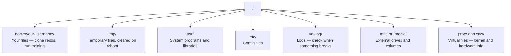

#  Facia a la inteligencia artificial de Linux

> La mayoría de la IA funciona en Linux. Necesitas saber hasta qué punto no se puede conectar.

**类型：**El aprendizaje
**语言：**- ¿ Qué ?
**先修要求：**Fase 0, Lección 01
**时间：**- 30 minutos

## El objetivo del aprendizaje

- 浏览 Linux sistema de archivos,并从命令行执行基本文件操作
- Uso `chmod`Y `chown`administra los permisos de archivo, para resolver los errores "Permisos negados"
- Uso `apt`Instalar paquetes de sistema,并为AI 工作设置一台新GPU box
- 识别当从macOS 切换到Linux 时, desarrollador siempre pisó en un cañón en máquinas de distancia

##  problemas

Usted está en macOS o Windows en el desarrollo. Pero una vez que usted SSH a la caja de GPU en la nube, alquilar una instancia Lambda, o iniciar una máquina EC2, entrará en Ubuntu. El terminal es su única interfaz.

Este es un manual de supervivencia. Sólo cubre lo que necesitas para hacer trabajo de IA en máquinas Linux remotas.

## Sistema de archivos 布局

Linux pone todo organizado en una sola raíz .`/`No hay nada.`C:\`O `/Volumes`你实际会接触的目录:



Su directorio de hogar es`~`O `/home/your-username` Prácticamente todo lo que ocurre aquí

## ¡ ¡ ¡ ¡ ¡ ¡ ¡ ¡ ¡ ¡ ¡ ¡ ¡ ¡ ¡ ¡ ¡ ¡ ¡ ¡ ¡ ¡ ¡ ¡ ¡ ¡ ¡ ¡ ¡ ¡ ¡ ¡ ¡ ¡ ¡ ¡ ¡ ¡ ¡ ¡ ¡ ¡ ¡ ¡ ¡ ¡ ¡ ¡ ¡ ¡ ¡ ¡ ¡ ¡ ¡ ¡ ¡ ¡ ¡ ¡ ¡ ¡ ¡ ¡ ¡ ¡ ¡ ¡ ¡ ¡ ¡ ¡ ¡ ¡ ¡ ¡ ¡ ¡ ¡ ¡ ¡ ¡ ¡ ¡ ¡ ¡ ¡ ¡ ¡ ¡ ¡ ¡ ¡ ¡ ¡ ¡ ¡ ¡ ¡ ¡ ¡ ¡ ¡ ¡ ¡ ¡ ¡ ¡ ¡ ¡ ¡ ¡ ¡ ¡ ¡ ¡ ¡ ¡ ¡ ¡ ¡ ¡ ¡ ¡ ¡ ¡ ¡ ¡ ¡ ¡ ¡ ¡ ¡ ¡ ¡ ¡ ¡ ¡ ¡ ¡ ¡ ¡ ¡ ¡ ¡ ¡ ¡ ¡ ¡ ¡ ¡ ¡ ¡ ¡ ¡ ¡ ¡ ¡ ¡ ¡ ¡ ¡ ¡ ¡ ¡ ¡ ¡ ¡ ¡ ¡ ¡ ¡ ¡ ¡ ¡ ¡ ¡ ¡ ¡ ¡ ¡ ¡ ¡ ¡ ¡ ¡ ¡ ¡ ¡ ¡ ¡ ¡ ¡ ¡ ¡ ¡ ¡ ¡ ¡ ¡ ¡ ¡ ¡ ¡ ¡ ¡ ¡ ¡ ¡ ¡ ¡ ¡ ¡ ¡ ¡ ¡ ¡ ¡ ¡ ¡ ¡ ¡ ¡ ¡ ¡ ¡ ¡ ¡ ¡ ¡ ¡ ¡ ¡ ¡ ¡ ¡ ¡ ¡ ¡ ¡ ¡ ¡ ¡ ¡ ¡ ¡ ¡ ¡ ¡ ¡ ¡ ¡ ¡ ¡ ¡ ¡ ¡ ¡ ¡ ¡ ¡ ¡ ¡ ¡ ¡ ¡ ¡ ¡ ¡ ¡ ¡ ¡ ¡ ¡ ¡ ¡ ¡ ¡ ¡ ¡ ¡ ¡ ¡ ¡ ¡ ¡ ¡ ¡ ¡ ¡ ¡ ¡ ¡ ¡ ¡ ¡ ¡ ¡ ¡ ¡ ¡ ¡ ¡ ¡ ¡ ¡ ¡ ¡ ¡ ¡ ¡ ¡ ¡ ¡ ¡ ¡ ¡ ¡ ¡ ¡ ¡ ¡ ¡ ¡ ¡ ¡ ¡ ¡ ¡ ¡ ¡ ¡ ¡ ¡ ¡ ¡ ¡ ¡ ¡ ¡ ¡ ¡ ¡ ¡ ¡ ¡ ¡ ¡ ¡ ¡ ¡ ¡ ¡ ¡ ¡ ¡ ¡ ¡ ¡ ¡ ¡ ¡ ¡ ¡ ¡ ¡ ¡ ¡ ¡ ¡ ¡ ¡ ¡ ¡ ¡ ¡ ¡ ¡ ¡ ¡ ¡ ¡ ¡ ¡ ¡ ¡ ¡ ¡ ¡ ¡ ¡ ¡ ¡ ¡ ¡ ¡ ¡ ¡ ¡ ¡ ¡ ¡ ¡ ¡ ¡ ¡ ¡ ¡ ¡ ¡ ¡ ¡ ¡ ¡ ¡ ¡ ¡ ¡ ¡ ¡ ¡ ¡ ¡ ¡ ¡ ¡ ¡ ¡ ¡ ¡ ¡ ¡ ¡ ¡ ¡ ¡ ¡ ¡ ¡ ¡ ¡ ¡ ¡ ¡ ¡ ¡ ¡ ¡ ¡ ¡ ¡ ¡ ¡ ¡ ¡ ¡ ¡ ¡ ¡ ¡ ¡ ¡ ¡ ¡ ¡ ¡ ¡ ¡ ¡ ¡ ¡ ¡ ¡ ¡ ¡ ¡ ¡ ¡ ¡ ¡ ¡ ¡ ¡ ¡ ¡ ¡ ¡ ¡ ¡ ¡ ¡ ¡ ¡ ¡ ¡ ¡ ¡ ¡ ¡ ¡ ¡ ¡ ¡ ¡ ¡ ¡ ¡ ¡ ¡ ¡

Los siguientes 15 comandos cubren el 95% de la operación en la caja de GPU remota:

###  Moviendo

```bash
pwd                         # Where am I?
ls                          # What's here?
ls -la                      # What's here, including hidden files with details?
cd /path/to/dir             # Go there
cd ~                        # Go home
cd ..                       # Go up one level
```

### 文件和目录

```bash
mkdir my-project            # Create a directory
mkdir -p a/b/c              # Create nested directories in one shot

cp file.txt backup.txt      # Copy a file
cp -r src/ src-backup/      # Copy a directory (recursive)

mv old.txt new.txt          # Rename a file
mv file.txt /tmp/           # Move a file

rm file.txt                 # Delete a file (no trash, it's gone)
rm -rf my-dir/              # Delete a directory and everything inside
```

`rm -rf`Es permanente. No se puede deshacer.

### 读取文件

```bash
cat file.txt                # Print entire file
head -20 file.txt           # First 20 lines
tail -20 file.txt           # Last 20 lines
tail -f log.txt             # Follow a log file in real time (Ctrl+C to stop)
less file.txt               # Scroll through a file (q to quit)
```

###  búsqueda

```bash
grep "error" training.log           # Find lines containing "error"
grep -r "learning_rate" .           # Search all files in current directory
grep -i "cuda" config.yaml          # Case-insensitive search

find . -name "*.py"                 # Find all Python files under current dir
find . -name "*.ckpt" -size +1G     # Find checkpoint files larger than 1GB
```

## Permisos

Cada archivo en Linux tiene un propietario y bits de permiso. Cuando los scripts no pueden ejecutarse, o no pueden escribir en algún directorio, se encuentra este problema.

```bash
ls -l train.py
# -rwxr-xr-- 1 user group 2048 Mar 19 10:00 train.py
#  ^^^             owner permissions: read, write, execute
#     ^^^          group permissions: read, execute
#        ^^        everyone else: read only
```

常见修复方式:

```bash
chmod +x train.sh           # Make a script executable
chmod 755 deploy.sh         # Owner: full, others: read+execute
chmod 644 config.yaml       # Owner: read+write, others: read only

chown user:group file.txt   # Change who owns a file (needs sudo)
```

Cuando alguien dice "permisión denegada", casi siempre hay permisos 问题──`chmod +x`O `sudo`Puede reparar la mayoría de las situaciones.

## Gestión de paquetes (apto)

Ubuntu `apt` Ésta es la forma de instalar software a nivel de sistema

```bash
sudo apt update             # Refresh the package list (always do this first)
sudo apt install -y htop    # Install a package (-y skips confirmation)
sudo apt install -y build-essential  # C compiler, make, etc. Needed by many Python packages
sudo apt install -y tmux    # Terminal multiplexer (keep sessions alive after disconnect)

apt list --installed        # What's installed?
sudo apt remove htop        # Uninstall
```

Usted estará en la nueva caja de GPU en los paquetes de montaje habitual:

```bash
sudo apt update && sudo apt install -y \
    build-essential \
    git \
    curl \
    wget \
    tmux \
    htop \
    unzip \
    python3-venv
```

## Usuarios y sudo

Usted normalmente tiene un usuario normal 登录── algunos de los procedimientos requieren de roots(admin)

```bash
whoami                      # What user am I?
sudo command                # Run a single command as root
sudo su                     # Become root (exit to go back, use sparingly)
```

En las instancias de GPU en la nube, usualmente eres el único usuario, y ya tienes acceso a sudo.

## Procesos y sistemas

Cuando entrenar, o cuando necesitas revisar el contenido que está funcionando:

```bash
htop                        # Interactive process viewer (q to quit)
ps aux | grep python        # Find running Python processes
kill 12345                  # Gracefully stop process with PID 12345
kill -9 12345               # Force kill (use when graceful doesn't work)
nvidia-smi                  # GPU processes and memory usage
```

Si ejecutas servidores de inferencia, usarás:

```bash
sudo systemctl start nginx          # Start a service
sudo systemctl stop nginx           # Stop it
sudo systemctl restart nginx        # Restart it
sudo systemctl status nginx         # Check if it's running
sudo systemctl enable nginx         # Start automatically on boot
```

## 磁盘空间

El espacio en el disco de las cajas de GPU es normalmente limitado. Los modelos y conjuntos de datos se llenan rápidamente.

```bash
df -h                       # Disk usage for all mounted drives
df -h /home                 # Disk usage for /home specifically

du -sh *                    # Size of each item in current directory
du -sh ~/.cache             # Size of your cache (pip, huggingface models land here)
du -sh /data/checkpoints/   # Check how big your checkpoints are

# Find the biggest space hogs
du -h --max-depth=1 / 2>/dev/null | sort -hr | head -20
```

常见省空间方式:

```bash
# Clear pip cache
pip cache purge

# Clear apt cache
sudo apt clean

# Remove old checkpoints you don't need
rm -rf checkpoints/epoch_01/ checkpoints/epoch_02/
```

## Las redes

Usted va a descargar modelos de orden, transmitir archivos, y utilizar las APIs.

```bash
# Download files
wget https://example.com/model.bin                   # Download a file
curl -O https://example.com/data.tar.gz              # Same thing with curl
curl -s https://api.example.com/health | python3 -m json.tool  # Hit an API, pretty-print JSON

# Transfer files between machines
scp model.bin user@remote:/data/                     # Copy file to remote machine
scp user@remote:/data/results.csv .                  # Copy file from remote to local
scp -r user@remote:/data/checkpoints/ ./local-dir/   # Copy directory

# Sync directories (faster than scp for large transfers, resumes on failure)
rsync -avz --progress ./data/ user@remote:/data/
rsync -avz --progress user@remote:/results/ ./results/
```

Para cualquier transporte de gran tamaño, uso prioritario `rsync`En vez de`scp`                                                                                                                                                                                                                                                              

## tmux: mantener Sessions 存活

Cuando llegues a la caja de seguridad, el portátil te matará.

```bash
tmux new -s train           # Start a new session named "train"
# ... start your training, then:
# Ctrl+B, then D            # Detach (training keeps running)

tmux ls                     # List sessions
tmux attach -t train        # Reattach to session

# Inside tmux:
# Ctrl+B, then %            # Split pane vertically
# Ctrl+B, then "            # Split pane horizontally
# Ctrl+B, then arrow keys   # Switch between panes
```

长时间训练任务总是放在tmux 里运行――总是如此――

## Face hacia Windows usuario de WSL2

Si estás en Windows, WSL2 puede proporcionar un entorno Linux real sin necesidad de doble arranque.

```bash
# In PowerShell (admin)
wsl --install -d Ubuntu-24.04

# After restart, open Ubuntu from Start menu
sudo apt update && sudo apt upgrade -y
```

WSL2 运行真实Linux kernel──本课中的所有内容都能在其中工作──从WSL 内部看, tus archivos de Windows 位于 `/mnt/c/Users/YourName/`¿Qué es eso?

La GPU pasa por 需要 Windows 侧安装 NVIDIA drivers──安装 Windows NVIDIA driver(no es un driver Linux),CUDA 就会在 WSL2 内可用──

## MacOS a Linux

Si vienes de macOS, estas cosas te quedarán:

| macOS | Linux | 说明 |
|-------|-------|-------|
| `brew install` | `sudo apt install` | package names 有时不同。`brew install htop` 和 `sudo apt install htop` 效果相同，但 `brew install readline` 和 `sudo apt install libreadline-dev` 不同。 |
| `open file.txt` | `xdg-open file.txt` | 但远程 box 上通常没有 GUI。使用 `cat` 或 `less`。 |
| `pbcopy` / `pbpaste` | 不可用 | SSH 上不存在 pipe 到/来自 clipboard 的能力。 |
| `~/.zshrc` | `~/.bashrc` | macOS 默认使用 zsh。大多数 Linux servers 使用 bash。 |
| `/opt/homebrew/` | `/usr/bin/`, `/usr/local/bin/` | Binaries 位于不同位置。 |
| `sed -i '' 's/a/b/' file` | `sed -i 's/a/b/' file` | macOS sed 需要在 `-i` 后加一个空字符串。Linux 不需要。 |
| Case-insensitive filesystem | Case-sensitive filesystem | 在 Linux 上，`Model.py` 和 `model.py` 是两个不同文件。 |
| Line endings `\n` | Line endings `\n` | 相同。但 Windows 使用 `\r\n`，会破坏 bash scripts。运行 `dos2unix` 修复。 |

## 快速参考卡

```
Navigation:     pwd, ls, cd, find
Files:          cp, mv, rm, mkdir, cat, head, tail, less
Search:         grep, find
Permissions:    chmod, chown, sudo
Packages:       apt update, apt install
Processes:      htop, ps, kill, nvidia-smi
Services:       systemctl start/stop/restart/status
Disk:           df -h, du -sh
Network:        curl, wget, scp, rsync
Sessions:       tmux new/attach/detach
```


```figure
s0-process-fork
```

##  ejercicios

1. SSH a cualquier máquina Linux (((o abrir WSL2),并导航到你的家庭目录──创建一个项目文件,其中使用`touch`Crear tres documentos vacíos, y luego usarlos.`ls -la`Los he sacado.
2. Utilizado para el montaje`htop`, ejecutarlo, y encontrar el proceso que utiliza más memoria.
3. Iniciar una sesión de tmux, en la que se ejecuta`sleep 300`, desprender, las sesiones de salida, y luego volver a unir.
4. Uso `df -h`检查可用磁盘空间, luego usar `du -sh ~/.cache/*`找出 cache 中占空间的内容──
5. Uso `scp`Transmitir un archivo desde la máquina local a la máquina remota, y luego usarlo.`rsync`Hacer el mismo transmisión,并比较体验.
