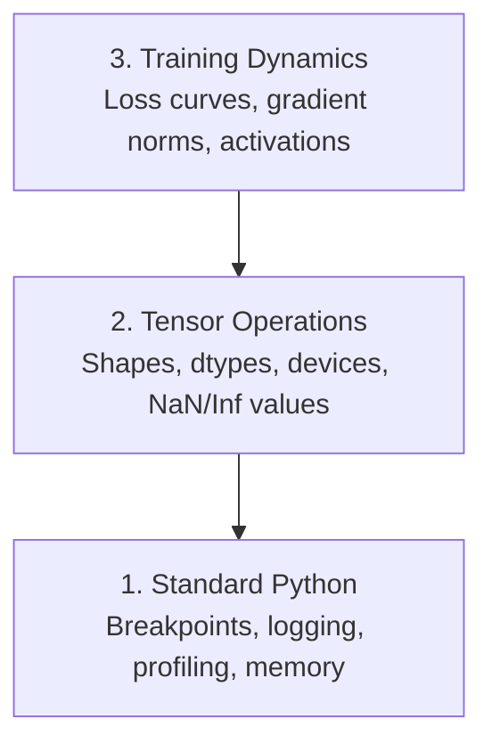

# Desarreglamiento y perfil

> Los peores errores de IA no se derrumbarán. Entrenarán silenciosamente en datos de basura y reportarán una hermosa curva de pérdida.

**类型：**Construcción
**语言：**Python
**先修要求：**Lección 1 ((Entorno profundo), PyTorch básico 熟悉度
**时间：**- 60 minutos

## El objetivo del aprendizaje

- Uso condicional `breakpoint()`Y `debug_print`En el entrenamiento en el camino de la inspección de formas tensores, tipos y valores de NaN
- Uso `cProfile`¿Qué es esto?`line_profiler`Y `tracemalloc`Profil  entrenamiento ciclo, encontrar cuellos de botella
- 检测常见 errores de IA: desajustes de forma, pérdida de NaN, filtración de datos y tensores de dispositivo equivocado
- configurar TensorBoard para ver curvas de pérdida, histogramas de peso y distribuciones de gradientes

##  problemas

El método de falla del código de IA es diferente al código ordinario. La aplicación web llevará un rastro de pila de colapsos. La configuración de un error de entrenamiento se ejecutará durante 8 horas, quemará 200 dólares de tiempo de GPU, y luego se producirá un modelo de valor promedio de pronóstico para cada entrada.`.detach()`, o etiquetas                                                                                                                                                                                                                                                                                                                                                                                                                                                                                                                         

Necesitas herramientas de depuración, y en estos silencios fallas pierdes tu tiempo y computación antes de capturarlas.

## 概念

El desbateo de IA se divide en tres niveles:



La mayoría de las personas saltarán directamente a la tercera capa. Pero el 80% de los errores de la IA están en la primera y segunda.


```figure
s0-flame-hot
```

## Construirlo

### Parte 1: Imprimir Desarreglamiento (¿es de, es válido?)

El descomposición de impresión  frecuentemente es menospreciado―, pero no es así―, para el código tensor, una declaración de impresión específica 往往胜过逐步调试器, porque necesitas ver una vez las formas, los tipos y los rangos de valores―.

```python
def debug_print(name, tensor):
    print(f"{name}: shape={tensor.shape}, dtype={tensor.dtype}, "
          f"device={tensor.device}, "
          f"min={tensor.min().item():.4f}, max={tensor.max().item():.4f}, "
          f"mean={tensor.mean().item():.4f}, "
          f"has_nan={tensor.isnan().any().item()}")
```

En cada operación de duda, después de usarlo, encontrar el error, eliminar estas impresiones.

### Parte 2: Python Debugger (pdb y punto de ruptura)

Debugger interno en el trabajo de IA fue subestimado.`breakpoint()`放进训练循环,并交互式检查门子──

```python
def training_step(model, batch, criterion, optimizer):
    inputs, labels = batch
    outputs = model(inputs)
    loss = criterion(outputs, labels)

    if loss.item() > 100 or torch.isnan(loss):
        breakpoint()

    loss.backward()
    optimizer.step()
```

Cuando el desembolso se detiene, los comandos útiles:

- `p outputs.shape`检查 formas
- `p loss.item()`查看 valor de pérdida
- `p torch.isnan(outputs).sum()`统计 NAN
- `p model.fc1.weight.grad`检查 gradientes
- `c`continuar,`q` Retiro

Esto es un proceso de depuración condicional. Sólo en el aspecto no se puede detener. Para el entrenamiento de 10,000 pasos, esto es importante.

### Parte 3: registro de Python

Cuando tu depuración 超出快速检查范围时, utiliza registro  sustituir las declaraciones de impresión。

```python
import logging

logging.basicConfig(
    level=logging.INFO,
    format="%(asctime)s [%(levelname)s] %(message)s",
    handlers=[
        logging.FileHandler("training.log"),
        logging.StreamHandler()
    ]
)
logger = logging.getLogger(__name__)

logger.info("Starting training: lr=%.4f, batch_size=%d", lr, batch_size)
logger.warning("Loss spike detected: %.4f at step %d", loss.item(), step)
logger.error("NaN loss at step %d, stopping", step)
```

Logging  proporciona timestamps、niveles de severidad y salida de archivo―Cuando el entrenamiento se ejecuta en las 3 horas del día, cuando falla, lo que quieres es el archivo de registro, no el resultado terminal de la pantalla―.

### Parte 4: Por el código de la zona de tiempo

Saber dónde pasa el tiempo es el primer paso para mejorar.

```python
import time

class Timer:
    def __init__(self, name=""):
        self.name = name

    def __enter__(self):
        self.start = time.perf_counter()
        return self

    def __exit__(self, *args):
        elapsed = time.perf_counter() - self.start
        print(f"[{self.name}] {elapsed:.4f}s")

with Timer("data loading"):
    batch = next(dataloader_iter)

with Timer("forward pass"):
    outputs = model(batch)

with Timer("backward pass"):
    loss.backward()
```

常见发现:carga de datos 占训练时间的60%──修复方式在你的 DataLoader中设置 `num_workers > 0`, en lugar de cambiar más rápido GPU.

### Parte 5: cProfile 和 line_profiiler

Cuando necesites más información que los cronómetros manuales:

```bash
python -m cProfile -s cumtime train.py
```

Esto mostrará cada llamada de función, y en tiempo acumulado 排序──若要逐行配置:

```bash
pip install line_profiler
```

```python
@profile
def train_step(model, data, target):
    output = model(data)
    loss = F.cross_entropy(output, target)
    loss.backward()
    return loss

# Run with: kernprof -l -v train.py
```

### Parte 6: Profiles de memoria

#### Utiliza tracemalloc 查看 memoria de la CPU

```python
import tracemalloc

tracemalloc.start()

# your code here
model = build_model()
data = load_dataset()

snapshot = tracemalloc.take_snapshot()
top_stats = snapshot.statistics("lineno")
for stat in top_stats[:10]:
    print(stat)
```

#### Utilize memory_profiler 查看 CPU memoria

```bash
pip install memory_profiler
```

```python
from memory_profiler import profile

@profile
def load_data():
    raw = read_csv("data.csv")       # watch memory jump here
    processed = preprocess(raw)       # and here
    return processed
```

¿ Qué ?`python -m memory_profiler your_script.py`运行,以查看 de memoria en memoria.

#### Utiliza PyTorch 查看 memoria de la GPU

```python
import torch

if torch.cuda.is_available():
    print(torch.cuda.memory_summary())

    print(f"Allocated: {torch.cuda.memory_allocated() / 1e9:.2f} GB")
    print(f"Cached: {torch.cuda.memory_reserved() / 1e9:.2f} GB")
```

Cuando te encuentras con OOM (Fuera de la memoria)

1. 减小批量 (perpetuo es el primer que quiero probar)
2. Uso `torch.cuda.empty_cache()`释放 memoria almacenada en caché
3. Para los grandes intermediarios`del tensor`, luego调用 `torch.cuda.empty_cache()`
4. Uso de precisión mixta`torch.cuda.amp`) el uso de memoria  reducido a la mitad
5. Para modelos muy profundos, utilizar el control de gradientes

### Parte 7:                                                                                                                                                                                                                                                                                                                                                                                                                                                                                                                            

#### Desajuste de forma

La forma más común de un tensor es:`[batch, features]`, pero el modelo 期望 `[batch, channels, height, width]`¿Qué es eso?

```python
def check_shapes(model, sample_input):
    print(f"Input: {sample_input.shape}")
    hooks = []

    def make_hook(name):
        def hook(module, inp, out):
            in_shape = inp[0].shape if isinstance(inp, tuple) else inp.shape
            out_shape = out.shape if hasattr(out, "shape") else type(out)
            print(f"  {name}: {in_shape} -> {out_shape}")
        return hook

    for name, module in model.named_modules():
        hooks.append(module.register_forward_hook(make_hook(name)))

    with torch.no_grad():
        model(sample_input)

    for h in hooks:
        h.remove()
```

Usando un lote de muestra 运行一次──它会映射模型中每一次形状转变──

#### Pérdida de

La pérdida de NaN indica que algo se ha roto.

- Taxa de aprendizaje 太高
- pérdida de costos
- Registro de números cero o negativo
- RNN entre gradientes  explosión

```python
def detect_nan(model, loss, step):
    if torch.isnan(loss):
        print(f"NaN loss at step {step}")
        for name, param in model.named_parameters():
            if param.grad is not None:
                if torch.isnan(param.grad).any():
                    print(f"  NaN gradient in {name}")
                if torch.isinf(param.grad).any():
                    print(f"  Inf gradient in {name}")
        return True
    return False
```

#### Fugas de datos

Tu modelo en el conjunto de pruebas alcanza el 99% de precisión.

```python
def check_data_leakage(train_set, test_set, id_column="id"):
    train_ids = set(train_set[id_column].tolist())
    test_ids = set(test_set[id_column].tolist())
    overlap = train_ids & test_ids
    if overlap:
        print(f"DATA LEAKAGE: {len(overlap)} samples in both train and test")
        return True
    return False
```

También hay que revisar la fuga temporal: Using futur dato predicción pasado.

#### Dispositivo equivocado

Los tensores en diferentes dispositivos (CPU vs GPU) causarán errores de tiempo de ejecución. Pero a veces un tensor se quedará quieto en la CPU, mientras que todo lo demás está en la GPU, el entrenamiento sólo funciona muy lentamente.

```python
def check_devices(model, *tensors):
    model_device = next(model.parameters()).device
    print(f"Model device: {model_device}")
    for i, t in enumerate(tensors):
        if t.device != model_device:
            print(f"  WARNING: tensor {i} on {t.device}, model on {model_device}")
```

### Parte 8: TensorBoard 基础

TensorBoard se mostrará lo que pasó dentro del proceso de entrenamiento.

```bash
pip install tensorboard
```

```python
from torch.utils.tensorboard import SummaryWriter

writer = SummaryWriter("runs/experiment_1")

for step in range(num_steps):
    loss = train_step(model, batch)

    writer.add_scalar("loss/train", loss.item(), step)
    writer.add_scalar("lr", optimizer.param_groups[0]["lr"], step)

    if step % 100 == 0:
        for name, param in model.named_parameters():
            writer.add_histogram(f"weights/{name}", param, step)
            if param.grad is not None:
                writer.add_histogram(f"grads/{name}", param.grad, step)

writer.close()
```

- ¡Activa el juego !

```bash
tensorboard --logdir=runs
```

Qué hacer:

- **Loss 不下降**:Trabajo de aprendizaje  demasiado bajo, o arquitectura de modelos  problemas
- **Loss 剧烈震荡**:Tota de aprendizaje 太高
- **Loss 变成 NaN**:Instabilidad numérica ((see arriba de NaN 部分)
- **Train loss 下降，val loss 上升**Reajuste:
- **Weight histograms 坍缩到零**Gradientes que se desvanecen
- **Gradient histograms 爆炸**: necesita recorte de gradiente

### Parte 9: Descargador de código VS

对于交互式调试,用 `launch.json`配置 VS Código:

```json
{
    "version": "0.2.0",
    "configurations": [
        {
            "name": "Debug Training",
            "type": "debugpy",
            "request": "launch",
            "program": "${file}",
            "console": "integratedTerminal",
            "justMyCode": false
        }
    ]
}
```

点击 gutter 设置breakpoints──使用变量表 检查子属性──Debug Console 让你在执行中途运行任意Python表达式──

Esto es útil para ver los procesos de preprocesamiento de datos de forma gradual, especialmente cuando quieres ver cada transformación.

## Usalo

El flujo de trabajo de depuración de la IA puede capturarse en la mayoría de los errores:

1. **训练前**:用 muestra de lote 运行 `check_shapes` la evaluación de las dimensiones de entrada y salida  conforme a la expectativa.
2. **前 10 步**: para pérdidas, salidas y gradientes `debug_print`                                                                                                                                                                                                                                                              
3. **训练期间**El estudio de la teoría de la teoría de la teoría de la teoría de la teoría de la teoría de la teoría de la teoría de la teoría de la teoría de la teoría de la teoría de la teoría de la teoría de la teoría de la teoría de la teoría de la teoría de la teoría de la teoría de la teoría de la teoría de la teoría de la teoría de la teoría de la teoría de la teoría de la teoría de la teoría de la teoría de la teoría de la teoría de la teoría de la teoría de la teoría de la teoría de la teoría de la teoría de la teoría de la teoría de la teoría de la teoría de la teoría de la teoría de la teoría de la teoría de la teoría de la teoría de la teoría de la teoría de la teoría de la teoría de la teoría de la teoría de la teoría de la teoría de la teoría de la teoría de la teoría de la teoría de la teoría de la teoría de la teoría de la teoría de la teoría de la teoría de la teoría de la teoría de la teoría de la teoría de la teoría de la teoría de la teoría de la teoría de los cuentas de los cuentas de la teoría de los cuentas de la teoría de la teoría de la teoría de los cuentas de la teoría de la teoría de la teoría de los cuentas de la teoría de la teoría de la teoría de los cuentas de los cuentas de cuentas de cuentas de cuentas de cuentas de cuentas de cuentas de cuentas de cuentas de cuentas de cuentas de cuentas de cuentas de cuentas de cuentas de cuentas de cuentas de cuentas de cuentas de cuentas de cuentas de cuentas de cuentas de cuentas de cuentas de cuentas de cuentas de cuentas de cuentas de cuentas de cuentas de cuentas de cuentas de cuentas de cuentas de cuentas de cuentas de cuentas de cuentas de cuentas de cuentas de cuentas de cuentas de cuentas de cuentas de cuentas de cuentas de cuentas de cuentas de cuentas de cuentas de cuentas de cuentas de cuentas de cuentas de cuentas de cuentas de cuentas de cuentas de cuentas de cuentas de cuentas de cuentas de cuentas de cuentas de cuentas de cuentas de cuentas de cuentas de cuentas de cuentas de cuentas de cuentas de cuentas de cuentas de cuentas de cuentas
4. **出问题时**: en el punto de falla  colocar `breakpoint()`◊ 交互式检查テンсоров──
5. **针对性能**:计时 datos de carga, pase hacia adelante, hacia atrás, en el OOM, entonces memoria de perfil.

##  entregarlo

运行 guión de depuración del kit de herramientas:

```bash
python phases/00-setup-and-tooling/12-debugging-and-profiling/code/debug_tools.py
```

¿ Qué pasa ?`outputs/prompt-debug-ai-code.md`, uno de ellos ayuda a diagnosticar errores específicos de IA .

##  ejercicios

1. 运行                                                                                                                                                                                                                                                                                                                                                                                                                                                                                                                           `debug_tools.py`, , , , , , , , , , , , , , , , , , , , , , , , , , , , , , , , , , , , , , , , , , , , , , , , , , , , , , , , , , , , , , , , , , , , , , , , , , , , , , , , , , , , , , , , , , , , , , , , , , , , , , , , , , , , , , , , , , , , , , , , , , , , , , , , , , , , , , , , , , , , , , , , , , , , , , , , , , , , , , , , , , , , , , , , , , , , , , , , , , , , , , , , , , , , , , , , , , , , , , , , , , , , , , , , , , , , , , , , , , , , , , , , , , , , , , , , , , , , , , , , , , , , , , , , , , , , , , , , , , , , , , , , , , , , , , , , , , , , , , , , , , , , , , , , , , , , , , , , , , , , , , , , , , , , , , , , , , , , , , , , , , , , , , , , , , , , , , , , , , , , , , , , , , , , , , , , , , , , , , , , , , , , , , , , , , , , , , , , , , , , , , , , , , , , , , , , , , , , , , , , , , , , , , , , , , , , , , , , , , , , , , , , , , , , , , , , , , , , , , , , , , , , , , , , , , , , , , , , , , , , , , , , , , , , , , , , , , , , , , , , , , , , , , , , , , , , , , , , , , , , , , , , , , , , , ,
2. Uso `cProfile`perfil Un bucle de entrenamiento,并识别最慢的功能──
3. Uso `tracemalloc`找出数据 loading pipeline 中哪一行分配了最多内存的部分──
4. Para una simple carrera de entrenamiento, configurar TensorBoard,并识别模型 是否过合──
5. En el ciclo de entrenamiento`breakpoint()`◊ practicar desde el desembolso de la solicitud  inspeccionar las formas del tensor、 dispositivos 和 valores de gradiente。
