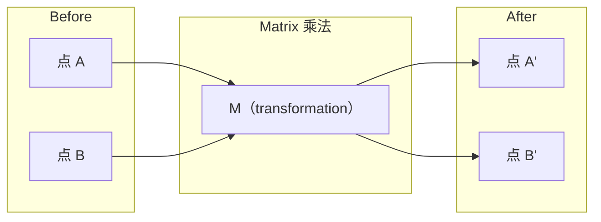
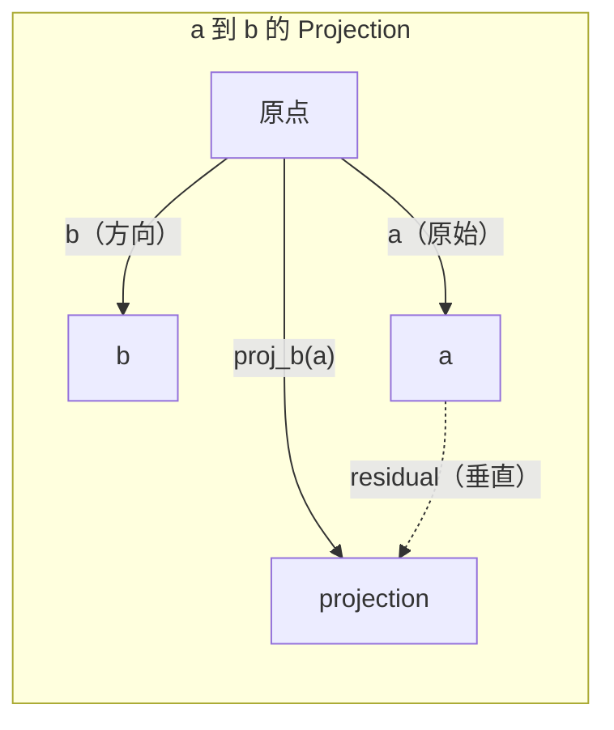

# Algebra lineal 直觉

> Cada modelo de IA sólo llevaba un sombrero de la Matrix Matemática.

**类型：**El aprendizaje
**语言：**Python, Julia
**先修要求：**Fase 0
**时间：**- 60 minutos

## El objetivo del aprendizaje

- En Python desde zero implementar Vector y Matrix 运算 (a)
- Desde un punto de vista de la explicación de punto producto, proyección y proceso de Gram-Schmidt en hacer qué
- Utiliza reducción de filas 判断一组 independencia lineal de vectores ランク 和 base
- Los conceptos de álgebra lineal se conectan a ellos en la aplicación de la IA:embeddings, scores de atención y LoRA

##  problemas

打开任意一篇 ML论文──在第一页之内, usted verá Vector、Matrix、dot product 和 transformation──没有直觉时,这些只是符号──有它,你就能看到神经网络 实际在做什么-- 在空间中移动点──

No necesitas ser matemático. Necesitas ver lo que significan estos cálculos en geometría y luego escribirlos en código.

## 概念

### Los vectores es la dirección

El vector es sólo una lista de números. Pero estos números tienen significado.

**2D Vector [3, 2]：**

| x | y | 点 |
|---|---|-------|
| 3 | 2 | 这个 Vector 从原点 (0,0) 指向平面上的 (3, 2) |

Esta magnitud del vector es cuadrado ((3^2 + 2^2) = cuadrado ((13), dirección arriba y dirección derecha。

En AI, Vector dice todo:
- Una palabra → Una contiene 768 个数字的向量(se está incrustando 空间中的含义)
- Una imagen → Un vector compuesto por millones de imágenes
- Un usuario → Un vector de preferencia de indicación

### Las matrices son transformaciones

Matrix se convertirá en otro vector. Puede girar, acortar, extender o proyectar.



En AI, la Matrix es el modelo:
- Pesos de la red neuronal → 将 input 转换为 output de las matrices
- Puntos de atención → decidir qué concentrar las matrices
- Embedings → 将词映射到 Vectors 的矩阵

### Producto de punto 衡量相似性

El producto de puntos de dos vectores te dirá que tienen muchas similitudes.

```
a · b = a₁×b₁ + a₂×b₂ + ... + aₙ×bₙ

方向相同：      a · b > 0  （相似）
相互垂直：      a · b = 0  （无关）
方向相反：      a · b < 0  （不相似）
```

Esto es exactamente lo que hacen los motores de búsqueda, los sistemas de recomendación y los RAG, encontrar vectores de producto de puntos más altos.

### Independencia lineal

Si en el conjunto no hay ningún vector que pueda escribirse en la combinación de otros vectores, entonces estos vectores son linealmente independientes. Si v1、v2、v3 son independientes, abarcan un espacio 3D. Si uno de ellos es la combinación de otros vectores, solo abarcan una superficie.

La importancia de la IA: su matriz de características  debería tener columnas linealmente independientes ⋅ Si dos características – totalmente relacionadas – dependientes linealmente –, el modelo no puede distinguir sus respectivos efectos ⋅ Esto causará multicolinariedad en la Regresión – la matriz de peso – se volverá inestable, los pequeños cambios de entrada – llevarán a una gran oscilación ⋅

**具体示例：**

```
v1 = [1, 0, 0]
v2 = [0, 1, 0]
v3 = [2, 1, 0]   # v3 = 2*v1 + v2
```

v1 y v2 son independientes de -- 二者都不是另一个标量倍数或组合──但是 v3 = 2*v1 + v2,所以 {v1, v2, v3} es un conjunto dependiente── estos tres vectores están en el plano xy── no importa cómo los compones, no puedes llegar a [0, 0, 1]── tienes tres vectores, pero solo dos dimensiones libres──

En el conjunto de datos: si feature_3 = 2*feature_1 + feature_2, añadir feature_3 no dará a la modelo ningún nuevo información.

### Base y rango

La base es un grupo de vectores linealmente independientes mínimos, que abarcan todo el espacio. La cantidad de vectores base es la dimensión del espacio.

La base estándar del espacio 3D es {1,0,0], [0,1,0], [0,0,1]}──pero en 3D cualquier tres vectores independientes pueden constituir una base válida── base de selección es en la base de la selección 坐标系──

Matrix 的排名 = número de columnas linealmente independientes 的数量 = número de filas linealmente independientes 的数量──如果排名 < min(rras, cols),这个Matrix 就是排名缺陷──这意味着:
- El sistema tiene infinidad de soluciones (o no)
- Transformación en medio de la pérdida de información
- Matrix 不能被逆转

| 情况 | Rank | 对 ML 的含义 |
|-----------|------|---------------------|
| Full rank (rank = min(m, n)) | 最大可能值 | 存在唯一 least-squares solution。Model well-conditioned。 |
| Rank deficient (rank < min(m, n)) | 低于最大值 | Features 冗余。有无穷多个 weight solutions。需要 regularization。 |
| Rank 1 | 1 | 每一列都是某个 Vector 的缩放副本。所有数据都位于一条线上。 |
| Near rank-deficient（较小的 singular values） | 数值上较低 | Matrix ill-conditioned。极小的 input noise 会造成很大的 output changes。使用 SVD truncation 或 ridge regression。 |

### Proyección

Voy a hacer vector**a**投影到 Vector **b**arriba, voy a conseguir**a**En el**b**方向上的分量:

```
proj_b(a) = (a dot b / b dot b) * b
```

Esta descomposición ortogonal es la base de la adaptación de los cuadrados mínimos.

Proyección en ML:
- Regresión lineal, observaciones mínimas hasta el espacio de columna de distancia -- 解本身就是一个投影
- PCA proyectará datos en la dirección de mayor variación
- Los transformadores de la atención calcula las consultas a las proyecciones de las claves



**示例：**a = [3, 4], b = [1, 0]

Proj_b(a) = (3*1 + 4*0) / (1*1 + 0*0) * [1, 0] = 3 * [1, 0] = [3, 0]

Esta proyección se ha ido y la cantidad de y. Es la forma más simple de reducción de dimensión.

### Proceso de Gram-Schmidt

将任意一组独立向量 转换为正规的基础──正规的意思是每个向量 长度为 1,并且任意一对向量都互相垂直──

算法:
1. 取第一个矢量, se normaliza
2. Toma el segundo vector, reduce en la proyección del primer vector, volver a normalizar
3. Toma el tercer vector, reduce en todos los vectores anteriores de las proyecciones, volver a normalizar
4. Para los vectores restantes 重复该过程

```
Input:  v1, v2, v3, ...（linearly independent）

u1 = v1 / |v1|

w2 = v2 - (v2 dot u1) * u1
u2 = w2 / |w2|

w3 = v3 - (v3 dot u1) * u1 - (v3 dot u2) * u2
u3 = w3 / |w3|

Output: u1, u2, u3, ...（orthonormal basis）
```

Éste es el método de descomposición de QR en el interior.
- 求解线路系统(比高斯的消除 更稳定)
- 计算 eigenwales(algoritmo de RQ)
- Regresión de cuadrados mínimos (standard数值方法)


```figure
eigen-directions
```

## Construirlo

### Paso 1: Desde el punto de implementación de vectores (Python)

```python
class Vector:
    def __init__(self, components):
        self.components = list(components)
        self.dim = len(self.components)

    def __add__(self, other):
        return Vector([a + b for a, b in zip(self.components, other.components)])

    def __sub__(self, other):
        return Vector([a - b for a, b in zip(self.components, other.components)])

    def dot(self, other):
        return sum(a * b for a, b in zip(self.components, other.components))

    def magnitude(self):
        return sum(x**2 for x in self.components) ** 0.5

    def normalize(self):
        mag = self.magnitude()
        return Vector([x / mag for x in self.components])

    def cosine_similarity(self, other):
        return self.dot(other) / (self.magnitude() * other.magnitude())

    def __repr__(self):
        return f"Vector({self.components})"


a = Vector([1, 2, 3])
b = Vector([4, 5, 6])

print(f"a + b = {a + b}")
print(f"a · b = {a.dot(b)}")
print(f"|a| = {a.magnitude():.4f}")
print(f"cosine similarity = {a.cosine_similarity(b):.4f}")
```

### Paso 2: Desde el punto de realización de matrices (Python)

```python
class Matrix:
    def __init__(self, rows):
        self.rows = [list(row) for row in rows]
        self.shape = (len(self.rows), len(self.rows[0]))

    def __matmul__(self, other):
        if isinstance(other, Vector):
            return Vector([
                sum(self.rows[i][j] * other.components[j] for j in range(self.shape[1]))
                for i in range(self.shape[0])
            ])
        rows = []
        for i in range(self.shape[0]):
            row = []
            for j in range(other.shape[1]):
                row.append(sum(
                    self.rows[i][k] * other.rows[k][j]
                    for k in range(self.shape[1])
                ))
            rows.append(row)
        return Matrix(rows)

    def transpose(self):
        return Matrix([
            [self.rows[j][i] for j in range(self.shape[0])]
            for i in range(self.shape[1])
        ])

    def __repr__(self):
        return f"Matrix({self.rows})"


rotation_90 = Matrix([[0, -1], [1, 0]])
point = Vector([3, 1])

rotated = rotation_90 @ point
print(f"Original: {point}")
print(f"Rotated 90°: {rotated}")
```

### Paso 3: ¿Por qué es importante para la IA ?

```python
import random

random.seed(42)
weights = Matrix([[random.gauss(0, 0.1) for _ in range(3)] for _ in range(2)])
input_vector = Vector([1.0, 0.5, -0.3])

output = weights @ input_vector
print(f"Input (3D): {input_vector}")
print(f"Output (2D): {output}")
print("This is what a neural network layer does -- matrix multiplication.")
```

### 步骤 4: Julia 版本

```julia
a = [1.0, 2.0, 3.0]
b = [4.0, 5.0, 6.0]

println("a + b = ", a + b)
println("a · b = ", a ⋅ b)       # Julia supports unicode operators
println("|a| = ", √(a ⋅ a))
println("cosine = ", (a ⋅ b) / (√(a ⋅ a) * √(b ⋅ b)))

# Matrix-vector multiplication
W = [0.1 -0.2 0.3; 0.4 0.5 -0.1]
x = [1.0, 0.5, -0.3]
println("Wx = ", W * x)
println("This is a neural network layer.")
```

### Paso 5: Desde el zero lograr la independencia lineal y la proyección (Python)

```python
def is_linearly_independent(vectors):
    n = len(vectors)
    dim = len(vectors[0].components)
    mat = Matrix([v.components[:] for v in vectors])
    rows = [row[:] for row in mat.rows]
    rank = 0
    for col in range(dim):
        pivot = None
        for row in range(rank, len(rows)):
            if abs(rows[row][col]) > 1e-10:
                pivot = row
                break
        if pivot is None:
            continue
        rows[rank], rows[pivot] = rows[pivot], rows[rank]
        scale = rows[rank][col]
        rows[rank] = [x / scale for x in rows[rank]]
        for row in range(len(rows)):
            if row != rank and abs(rows[row][col]) > 1e-10:
                factor = rows[row][col]
                rows[row] = [rows[row][j] - factor * rows[rank][j] for j in range(dim)]
        rank += 1
    return rank == n


def project(a, b):
    scalar = a.dot(b) / b.dot(b)
    return Vector([scalar * x for x in b.components])


def gram_schmidt(vectors):
    orthonormal = []
    for v in vectors:
        w = v
        for u in orthonormal:
            proj = project(w, u)
            w = w - proj
        if w.magnitude() < 1e-10:
            continue
        orthonormal.append(w.normalize())
    return orthonormal


v1 = Vector([1, 0, 0])
v2 = Vector([1, 1, 0])
v3 = Vector([1, 1, 1])
basis = gram_schmidt([v1, v2, v3])
for i, u in enumerate(basis):
    print(f"u{i+1} = {u}")
    print(f"  |u{i+1}| = {u.magnitude():.6f}")

print(f"u1 · u2 = {basis[0].dot(basis[1]):.6f}")
print(f"u1 · u3 = {basis[0].dot(basis[2]):.6f}")
print(f"u2 · u3 = {basis[1].dot(basis[2]):.6f}")
```

## Usalo

Ahora, con NumPy hacer lo mismo... es la forma en que realmente lo usarás en la práctica:

```python
import numpy as np

a = np.array([1, 2, 3], dtype=float)
b = np.array([4, 5, 6], dtype=float)

print(f"a + b = {a + b}")
print(f"a · b = {np.dot(a, b)}")
print(f"|a| = {np.linalg.norm(a):.4f}")
print(f"cosine = {np.dot(a, b) / (np.linalg.norm(a) * np.linalg.norm(b)):.4f}")

W = np.random.randn(2, 3) * 0.1
x = np.array([1.0, 0.5, -0.3])
print(f"Wx = {W @ x}")
```

### Utiliza NumPy  procesar Rango、Proyección y QR

```python
import numpy as np

A = np.array([[1, 2], [2, 4]])
print(f"Rank: {np.linalg.matrix_rank(A)}")

a = np.array([3, 4])
b = np.array([1, 0])
proj = (np.dot(a, b) / np.dot(b, b)) * b
print(f"Projection of {a} onto {b}: {proj}")

Q, R = np.linalg.qr(np.random.randn(3, 3))
print(f"Q is orthogonal: {np.allclose(Q @ Q.T, np.eye(3))}")
print(f"R is upper triangular: {np.allclose(R, np.triu(R))}")
```

### PyTorch -- Tensores son con vectores de autodiff

```python
import torch

x = torch.randn(3, requires_grad=True)
y = torch.tensor([1.0, 0.0, 0.0])

similarity = torch.dot(x, y)
similarity.backward()

print(f"x = {x.data}")
print(f"y = {y.data}")
print(f"dot product = {similarity.item():.4f}")
print(f"d(dot)/dx = {x.grad}")
```

El producto de puntos sobre x es el Gradiente y y. PyTorch calcula automáticamente este punto. Todas las operaciones en la red neuronal están compuestas por este tipo de operaciones.

Ustedes han construido desde cero algo que NumPy puede hacer. Ahora ya saben lo que ha pasado en el fondo.

##  entregarlo

Encuentro de trabajo:
- `outputs/prompt-linear-algebra-tutor.md`-- Un para hacer que los asistentes de IA                                                                                                                                                                                                                                                                                                                                                                                                                                                                                                                    

##  连接

Cada contenido de esta clase está conectado a las partes específicas de la IA moderna:

| 概念 | 出现位置 |
|---------|------------------|
| Dot product | Transformers 中的 Attention scores，RAG 中的 cosine similarity |
| Matrix multiply | 每个 Neural Network layer，每个 linear transformation |
| Linear independence | Feature selection，避免 multicollinearity |
| Rank | 判断一个系统是否可解，LoRA（low-rank adaptation） |
| Projection | Linear Regression（投影到 column space）、PCA |
| Gram-Schmidt / QR | Numerical solvers，eigenvalue computation |
| Orthonormal basis | 稳定的 numerical computation，whitening transforms |

LoRA  vale la pena una explicación especial.  Es por la actualización de peso dividido en matrices de bajo rango para LLM de ajuste fino.  Con su actualización de una matriz de peso de 4096x4096  16M parámetros.  LoRA  actualización de dos dimensiones para 4096x16 y 16x4096  131K parámetros.  Rango-16 约束 significa LoRA 假设重量更新 位于完整的4096dimensional space  uno de los 16 subespacios en un espacio completo de 4096 dimensiones. 

##  ejercicios

1.                                                                                                                                                                                                                                                                                                                                                                                                                                                                                                                              `Vector.angle_between(other)`, regresar a dos vectores entre los ángulos
2. Crear una matriz de escala 2D, hacer que la coordenada x 翻倍、y-coordenada 变为三倍, luego aplicarla en Vector [1, 1]
3. 给定 5 个随机类词 矢量 ((dimensión 50), usando la similitud cosínica 找出最相似的两个
4. 验证 Gram-Schmidt salida 确实是正规的:检查每一对的点产品都为0, y cada vector de magnitud都为1
5. Crear una matriz 3x3 de 2 por 2 ⋅ Usar `rank()`método 验证──然后 explicar qué es el objeto de la geometría de estas columnas.
6. 将 vector [1, 2, 3] 投投到 [1, 1, 1] 上──结果在几何上表示什么? ¿Qué es lo que significa que el vector está en el plano?

## 关键术语: "El hombre es un hombre"

| 术语 | 人们常说 | 实际含义 |
|------|----------------|----------------------|
| Vector | “一个箭头” | 一个数字列表，表示 n-dimensional space 中的点或方向 |
| Matrix | “一个数字表” | 一种 transformation，将 Vectors 从一个空间映射到另一个空间 |
| Dot product | “相乘再求和” | 衡量两个 Vectors 对齐程度的指标 -- similarity search 的核心 |
| Embedding | “某种 AI 魔法” | 一个表示某物含义（词、图像、用户）的 Vector |
| Linear independence | “它们不重叠” | 集合中没有任何 Vector 可以写成其他 Vector 的组合 |
| Rank | “有多少维” | Matrix 中 linearly independent columns（或 rows）的数量 |
| Projection | “影子” | 一个 Vector 在另一个 Vector 方向上的分量 |
| Basis | “坐标轴” | 一组最小的 independent Vectors，它们 span 该空间 |
| Orthonormal | “垂直的单位 Vectors” | 彼此互相垂直且各自长度为 1 的 Vectors |
