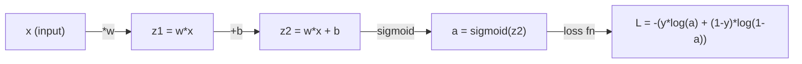
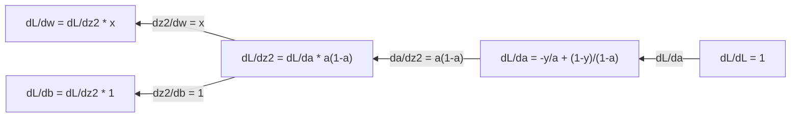
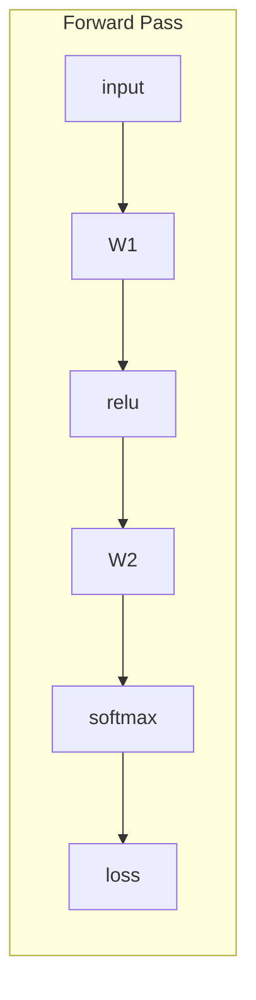
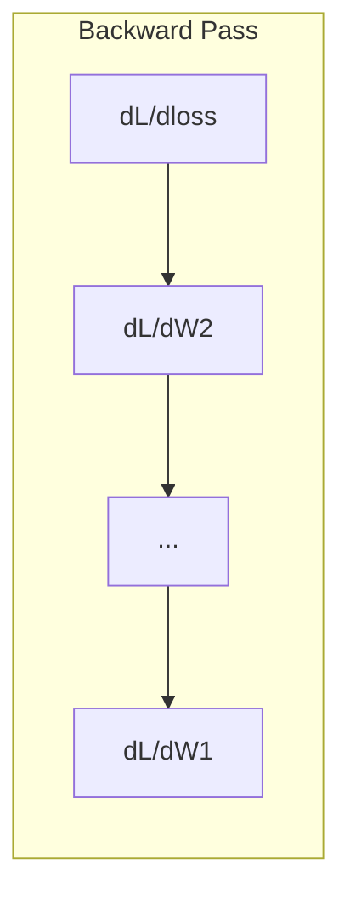

# Aprendizaje automático 微积分

> 导数会告诉你哪边是下坡──这是神经网络学习所需的一切──

**Type:** Learn
**Language:**Python
**Prerequisites:** Phase 1, Lessons 01-03
**Time:** ~60 minutes

## El objetivo del aprendizaje

- 计算常见 ML 函数(x^2、sigmoid、cross-entropy) de la cantidad de valores y de la resolución
- Desde el 0 a la realización de Descenso Gradiente, en 1D y 2D Minimizar la Función de Pérdida
- 推导 linear regresión 模型的渐变,并通过手动更新权重来训练它
- Explicar la Matriz Hessiana, la serie Taylor, los recientes, así como su relación con los métodos de optimización

##  problemas

Tienes una red neuronal que contiene millones de pesos. Cada peso es un giro. Necesitas saber en qué dirección debe girar cada giro para que el modelo se equivoque un poco.

没有微积分, entrenar la red neuronal significa intentar variadas variaciones, luego esperar buena suerte. Si tienes un número de direcciones, puedes saber con exactitud cómo cada peso afecta el error.

## 概念

### ¿Qué es el número de guías?

导数量衡变化率──对函数 y = f(x),导数 f'(x) 会告诉你: si usted hace x 微小地推动一点, y 会变化多少?

Desde la geometría, el número de dirección es la inclinación de una línea en un punto.

**f(x) = x^2：**

| x | f(x) | f'(x)（斜率） |
|---|------|---------------|
| 0 | 0    | 0（平坦，在底部） |
| 1 | 1    | 2 |
| 2 | 4    | 4（该点处切线的斜率） |
| 3 | 9    | 6 |

Cuando x es igual a 2, la inclination es 4 ⋅ si se pone x hacia la derecha se mueve muy pequeño un punto, y 大约 aumentará esta movilidad 4 veces ⋅ cuando x es igual a 0, la inclination es 0 ⋅ si se encuentra en la parte inferior del recipiente ⋅

 формально определение:

```
f'(x) = lim   f(x + h) - f(x)
        h->0  -----------------
                     h
```

En el código, saltarás el límite, directamente usando una h muy pequeña.

### 偏导数: una vez sólo mira una variación

La pérdida de la red neuronal depende de miles de millones de pesos. La función real tiene muchas entradas. La pérdida de la red neuronal depende de miles de millones de pesos.

```
f(x, y) = x^2 + 3xy + y^2

df/dx = 2x + 3y     (treat y as a constant)
df/dy = 3x + 2y     (treat x as a constant)
```

Cada parámetro de la respuesta es: si sólo me reduce este peso, ¿cómo perdería?

### Gradiente: todos los vectores de los cuales componen los números de orientación

El gradiente reunirá cada número de orientación en un vector. Para la función f ((x, y, z), el gradiente es:

```
grad f = [ df/dx, df/dy, df/dz ]
```

El gradiente indica hacia la dirección más alta.

**f(x,y) = x^2 + y^2 的等高线图：**

Esta función forma una forma de cubo, igual a la línea alta es el círculo central. El valor mínimo es (0, 0)

| 点 | grad f | -grad f（下降方向） |
|-------|--------|----------------------------|
| (1, 1) | [2, 2]（指向上坡，远离最小值） | [-2, -2]（指向下坡，朝向最小值） |
| (0, 0) | [0, 0]（平坦，在最小值处） | [0, 0] |

Éste es el descenso gradual en la gráfica.

### Enlace con la optimización

训练 Neural Network 就是优化──你有一个损失函数 L(w1, w2, ..., wn),它衡量模型有多错──你想最小化它──

```
Gradient descent update rule:

  w_new = w_old - learning_rate * dL/dw

For every weight:
  1. Compute the partial derivative of loss with respect to that weight
  2. Subtract a small multiple of it from the weight
  3. Repeat
```

Rate de aprendizaje  control 步长── demasiado grande para superar el objetivo── demasiado pequeño para subir lentamente──

**Loss landscape（1D 切片）：**

Función de pérdida L(w)  Con la variación del peso w se forma una curva de un vértice de un valle―

| 特征 | 描述 |
|---------|-------------|
| Global minimum | 整条曲线上的最低点，即最佳解 |
| Local minimum | 比邻近位置更低、但不是整体最低点的谷 |
| Slope | Gradient Descent 会从任意起点沿斜率向下走 |

El Descenso Gradiente se realiza a lo largo de la inclinancia descendente. Puede caer en los mínimos locales, pero en el espacio de varios millones de pesos, esto es muy poco un problema real.

### Número de valores de la dirección frente a la dirección de la resolución

计算导数 tiene dos formas:

解析方式:手动应用微积分规则──对 f(x) = x^2,导数是 f'(x) = 2x──精确,快速──

El método de cálculo de la cantidad de valores: utilizar la definición para hacer un aproximamiento.

```
Numerical (central difference):

f'(x) ~= f(x + h) - f(x - h)
          -----------------------
                  2h

h = 0.0001 works well in practice
```

El número de direcciones de valor es más lento, pero se aplica a cualquier función. El número de direcciones de resolución es rápido, pero necesita que se haga una fórmula.

### Manual de la función de la dirección

Estos son los números que verás repetidamente en ML.

```
Function        Derivative       Used in
--------        ----------       -------
f(x) = x^2     f'(x) = 2x      Loss functions (MSE)
f(x) = wx + b  f'(w) = x        Linear layer (gradient w.r.t. weight)
                f'(b) = 1        Linear layer (gradient w.r.t. bias)
                f'(x) = w        Linear layer (gradient w.r.t. input)
f(x) = e^x     f'(x) = e^x     Softmax, attention
f(x) = ln(x)   f'(x) = 1/x     Cross-entropy loss
f(x) = 1/(1+e^-x)  f'(x) = f(x)(1-f(x))   Sigmoid activation
```

对于 f ((x) = x^2:

```
f(x) = x^2    f'(x) = 2x

  x    f(x)   f'(x)   meaning
  -2    4      -4      slope tilts left (decreasing)
  -1    1      -2      slope tilts left (decreasing)
   0    0       0      flat (minimum!)
   1    1       2      slope tilts right (increasing)
   2    4       4      slope tilts right (increasing)
```

对于 f(w) = wx + b, y x=3、b=1:

```
f(w) = 3w + 1    f'(w) = 3

The derivative with respect to w is just x.
If x is big, a small change in w causes a big change in output.
```

### 链式法则 链式法则 链式法则 链式法则 链式法则 链式法则 链式法则 链式法则

Cuando se compone una función, la ley de cadena te dice cómo buscar la dirección.

```
If y = f(g(x)), then dy/dx = f'(g(x)) * g'(x)

Example: y = (3x + 1)^2
  outer: f(u) = u^2       f'(u) = 2u
  inner: g(x) = 3x + 1    g'(x) = 3
  dy/dx = 2(3x + 1) * 3 = 6(3x + 1)
```

Red Neural es una serie de funciones: entrada -> lineal -> activación -> lineal -> activación -> pérdida。Backpropagation es la forma de la aplicación de la cadena de entrada de la entrada.

### Matriz de Hessian

Gradiente 告诉你斜率──Hessian 告诉你曲率──

Hessian es la matriz de la matriz de la matriz de la matriz de la matriz de la matriz de la matriz de la matriz de la matriz de la matriz de la matriz de la matriz de la matriz de la matriz de la matriz de la matriz de la matriz de la matriz de la matriz de la matriz de la matriz de la matriz de la matriz de la matriz de la matriz de la matriz de la matriz de la matriz de la matriz de la matriz de la matriz de la matriz de la matriz de la matriz de la matriz de la matriz de la matriz de la matriz de la matriz de la matriz de la matriz de la matriz de la matriz de la matriz de la matriz de la matriz de la matriz de la matriz de la matriz de la matriz de la matriz de la matriz de la matriz de la matriz de la matriz de la matriz de la matriz de la matriz de la matriz de la matriz de la matriz de la matriz de la matriz de la matriz de la matriz de la matriz de la matriz de la matriz de la matriz de la matriz de la matriz de la matriz de la matriz de la matriz de la matriz de la matriz de la matriz de la matriz de la matriz de la matriz de la matriz de la matriz de la matriz de la matriz de la matriz de la matriz de la matriz de la matriz de la matriz de la matriz de la matriz de la matriz de la matriz de la matriz de la matriz de la matriz de la matriz de la matriz de la matriz de la matriz de la matriz de la matriz de la matriz de la matriz de la matriz de la matriz de la matriz de la matriz de la matriz de la matriz de la matriz de la matriz de la matriz de la matriz de la matriz de la matriz de la matriz de la matriz de la matriz de la matriz de la matriz de la matriz de la matriz de la matriz de la matriz de la matriz de la mat

```
H[i][j] = d^2f / (dx_i * dx_j)
```

对于二变量函数 f ((x, y):

```
H = | d^2f/dx^2    d^2f/dxdy |
    | d^2f/dydx    d^2f/dy^2 |
```

**Hessian 在临界点（Gradient = 0 的地方）告诉你什么：**

| Hessian 性质 | 含义 | 示例曲面 |
|-----------------|---------|-----------------|
| 正定（所有 eigenvalues > 0） | Local minimum | 向上开口的碗 |
| 负定（所有 eigenvalues < 0） | Local maximum | 向下开口的碗 |
| 不定（eigenvalues 正负混合） | Saddle point | 马鞍形 |

**示例：**f(x, y) = x^2 - y^2(una silla 函数)

```
df/dx = 2x       df/dy = -2y
d^2f/dx^2 = 2    d^2f/dy^2 = -2    d^2f/dxdy = 0

H = | 2   0 |
    | 0  -2 |

Eigenvalues: 2 and -2 (one positive, one negative)
--> Saddle point at (0, 0)
```

与 f(x, y) = x^2 + y^2(Una función de forma de copa)

```
H = | 2  0 |
    | 0  2 |

Eigenvalues: 2 and 2 (both positive)
--> Local minimum at (0, 0)
```

**为什么 Hessian 在 ML 中重要：**

El método de Newton utiliza el Hessian para tomar un mejor mejor mejoramiento de la descenso gradiente.

```
Newton's update:    w_new = w_old - H^(-1) * gradient
Gradient descent:   w_new = w_old - lr * gradient
```

El método de Newton 收更快, porque el Hessian 会 se vuelve a reducir en un grado: 方向的步子更小,平坦方向的步子更大──

El problema es que para una red neuronal con N parámetros, Hessian es N x N. Un modelo de 100 millones de parámetros necesita una matriz con mil millones de elementos.

| 方法 | 使用什么 | 成本 | 收敛 |
|--------|-------------|------|-------------|
| Gradient Descent | 只使用一阶导数 | 每步 O(N) | 慢（线性） |
| Newton's method | 完整 Hessian | 每步 O(N^3) | 快（二次） |
| L-BFGS | 从 Gradient 历史近似 Hessian | 每步 O(N) | 中等（超线性） |
| Adam | 每参数自适应 rate（对角 Hessian 近似） | 每步 O(N) | 中等 |
| Natural gradient | Fisher information matrix（统计 Hessian） | 每步 O(N^2) | 快 |

En la práctica, Adam es el Optimizador predeterminado de Deep Learning.

### Serie Taylor 近似

Cualquier función plana puede ser localmente utilizada en varios términos:

```
f(x + h) = f(x) + f'(x)*h + (1/2)*f''(x)*h^2 + (1/6)*f'''(x)*h^3 + ...
```

包含的项越多,近似越好, pero sólo en el punto x 附近成立──

**为什么 Taylor series 对 ML 重要：**

- **一阶 Taylor = Gradient Descent。**Cuando usted utiliza f(x + h) ~ f(x) + f'(x) *h 时, usted está haciendo la línea de aproximación.

- **二阶 Taylor = Newton's method。**Utiliza f(x + h) ~ f(x) + f'(x) *h + (1/2) *f'(x) *h^2 时, tu obtienes un segundo modelo── minimización.

- **Loss Function 设计。**MSE y entropía cruzada son planas, lo que significa que sus expansiones Taylor se muestran bien. Esto no es casualidad.

```
Approximation order    What it captures    Optimization method
-------------------    -----------------   -------------------
0th order (constant)   Just the value      Random search
1st order (linear)     Slope               Gradient descent
2nd order (quadratic)  Curvature           Newton's method
Higher orders          Finer structure     Rarely used in ML
```

关键洞见是: todas las optimizaciones basadas en Gradiente, en esencia están en la función local de pérdida aproximada, y hacia el valor mínimo de la función aproximada.

### ML en el medio

导数 te dice la tasa de variación―积分计算累积量, es decir, la superficie debajo de la curva―

En ML, tienes muy pocos cálculos manuales, pero este concepto está presente:

**概率。**对于具有密度 p(x) de continuas con cambios:
```
P(a < X < b) = integral from a to b of p(x) dx
```
概率 densidad curva en la superficie entre a y b  , es la probabilidad en el área en que se encuentra 

**期望值。**按概率加权的平均结果:
```
E[f(X)] = integral of f(x) * p(x) dx
```
La pérdida esperada en la distribución de datos es una积分――la experiencia de la formación se reduce al mínimo.

**KL divergence。**medir dos distribuciones diferentes:
```
KL(p || q) = integral of p(x) * log(p(x) / q(x)) dx
```
Utilizando VAEs, destilación del conocimiento y inferencia bayesiana.

**归一化常数。**En la inferencia bayesiana:
```
p(w | data) = p(data | w) * p(w) / integral of p(data | w) * p(w) dw
```
La divisor es el cuadro de todos los valores de los parámetros posibles. Por lo general es imposible de manejar, por lo que utilizamos el método de aproximación MCMC y inferencia variativa, etc.

| 积分概念 | 在 ML 中出现的位置 |
|-----------------|----------------------|
| 曲线下面积 | 由 density functions 得到概率 |
| 期望值 | Loss Functions、risk minimization |
| KL divergence | VAEs、policy optimization、distillation |
| 归一化 | Bayesian posteriors、softmax denominator |
| Marginal likelihood | Model comparison、evidence lower bound (ELBO) |

### Gráfico de computación La ley de cadenas de múltiples variables

La ley de cadena no sólo se aplica a la función de la cantidad de uníntesis en una línea. En la red neuronal, la variación se divide y se combina.



Pasado hacia atrás 会从右到左计算 Gradiente:



Cada arco se multiplica por la dirección local. El gradiente de cualquier parámetro es la multiplicidad de todas las direcciones locales en el camino de los parámetros desde la pérdida hasta la dirección del parámetro. Cuando el camino se divide y se combina, se suma la contribución de cada ruta.

Todo el contenido de la retropropagación es: desde la salida hasta la entrada, sistemáticamente en el gráfico de computación.

### Matriz jacobiana

Cuando una función trae un vector 映射到一个向量 时(por ejemplo, la capa de red neuronal), su dirección es una matriz―Jacobian 包含每个输出对每个输入的所有偏导数―

对于 f: R^n -> R^m, Jacobian J 是一个 m x n Matrix:

| | x1 | x2 | ... | xn |
|---|---|---|---|---|
| f1 | df1/dx1 | df1/dx2 | ... | df1/dxn |
| f2 | df2/dx1 | df2/dx2 | ... | df2/dxn |
| ... | ... | ... | ... | ... |
| fm | dfm/dx1 | dfm/dx2 | ... | dfm/dxn |

Usted no se encargará de la red neuronal de calcular Jacobian. Pero saber que existe, le ayudará a entender la forma de la Backpropagation. Si una capa coloca R^n ¿m ¿m ¿m ¿r?r?r?r?r?r?r?r?r?r?r?r?r?r?r?r?r?r?r?r?r?r?r?r?r?r?r?r?r?r?r?r?r?r?r?r?r?r?r?r?r?r?r?r?r?r?r?r?r?r?r?r?r?r?r?r?r?r?r?r?r?r?r?r?r?r?r?r?r?r?r?r?r?r?r?r?r?r?r?r?r?r?r?r?r?r?r?r?r?r?r?r?r?r?r?r?r?r?r?r?r?r?r?r?r?r?r?r?r?r?r?r?r?r?r?r?r?r?r?r?r?r?r?r?r?r?r?r?r?r?r?r?r?r?r?r?r?r?r?r?r?r?r?r?r?r?r?r?r?r?r?r?r?r?r?r?r?r?r?r?r?r?r?r?r?r?r?r?r?r?r?r?r?r?r?r?r?r?r?r?r?r?r?r?r?r?r?r?r?r?r?r?r?r?r?r?r?r?r?r?r?r?r?r?r?r?r?r?r?r?r?r?r?r?r?r?r?r?r?r?r?r?r?r?r?r?r?r

### ¿ Por qué es importante para la red neuronal ?

Cada peso en la red neuronal se obtiene un Gradiente. El Gradiente te dirá cómo ajustar ese peso para reducir la pérdida.





Cada vez más:
- `W1 = W1 - lr * dL/dW1`
- `W2 = W2 - lr * dL/dW2`

Paso adelante 计算预测和损失── pasa hacia atrás 计算 Loss 相对每权重的梯度──然后每权重都向下坡方向迈一小步──重复数百万步──这是深度学习──


```figure
derivative-tangent
```

## Construirlo

### Paso 1: Realizar desde cero el número de valores

```python
def numerical_derivative(f, x, h=1e-7):
    return (f(x + h) - f(x - h)) / (2 * h)

def f(x):
    return x ** 2

for x in [-2, -1, 0, 1, 2]:
    numerical = numerical_derivative(f, x)
    analytical = 2 * x
    print(f"x={x:2d}  f'(x) numerical={numerical:.6f}  analytical={analytical:.1f}")
```

Los valores de la dirección de resolución coinciden en muchos números pequeños.

### Paso 2: Orientación con Gradiente

```python
def numerical_gradient(f, point, h=1e-7):
    gradient = []
    for i in range(len(point)):
        point_plus = list(point)
        point_minus = list(point)
        point_plus[i] += h
        point_minus[i] -= h
        partial = (f(point_plus) - f(point_minus)) / (2 * h)
        gradient.append(partial)
    return gradient

def f_multi(point):
    x, y = point
    return x**2 + 3*x*y + y**2

grad = numerical_gradient(f_multi, [1.0, 2.0])
print(f"Numerical gradient at (1,2): {[f'{g:.4f}' for g in grad]}")
print(f"Analytical gradient at (1,2): [2*1+3*2, 3*1+2*2] = [{2*1+3*2}, {3*1+2*2}]")
```

### Paso 3: con Descenso Gradiente  encontrar f(x) = el valor mínimo de x^2

```python
x = 5.0
lr = 0.1
for step in range(20):
    grad = 2 * x
    x = x - lr * grad
    print(f"step {step:2d}  x={x:8.4f}  f(x)={x**2:10.6f}")
```

Desde x=5                                                                                                                                                                                                                                                                                                                                                                                                                                                                                                                          

### Paso 4: ejecutar Descenso Gradiente en 2D

```python
def f_2d(point):
    x, y = point
    return x**2 + y**2

point = [4.0, 3.0]
lr = 0.1
for step in range(30):
    grad = numerical_gradient(f_2d, point)
    point = [p - lr * g for p, g in zip(point, grad)]
    loss = f_2d(point)
    if step % 5 == 0 or step == 29:
        print(f"step {step:2d}  point=({point[0]:7.4f}, {point[1]:7.4f})  f={loss:.6f}")
```

### Paso 5: Comparar los valores de las direcciones y los valores de las direcciones

```python
import math

test_functions = [
    ("x^2",      lambda x: x**2,          lambda x: 2*x),
    ("x^3",      lambda x: x**3,          lambda x: 3*x**2),
    ("sin(x)",   lambda x: math.sin(x),   lambda x: math.cos(x)),
    ("e^x",      lambda x: math.exp(x),   lambda x: math.exp(x)),
    ("1/x",      lambda x: 1/x,           lambda x: -1/x**2),
]

x = 2.0
print(f"{'Function':<12} {'Numerical':>12} {'Analytical':>12} {'Error':>12}")
print("-" * 50)
for name, f, df in test_functions:
    num = numerical_derivative(f, x)
    ana = df(x)
    err = abs(num - ana)
    print(f"{name:<12} {num:12.6f} {ana:12.6f} {err:12.2e}")
```

### 步骤 6: Número de valores de cálculo Hessian

```python
def hessian_2d(f, x, y, h=1e-5):
    fxx = (f(x + h, y) - 2 * f(x, y) + f(x - h, y)) / (h ** 2)
    fyy = (f(x, y + h) - 2 * f(x, y) + f(x, y - h)) / (h ** 2)
    fxy = (f(x + h, y + h) - f(x + h, y - h) - f(x - h, y + h) + f(x - h, y - h)) / (4 * h ** 2)
    return [[fxx, fxy], [fxy, fyy]]

def saddle(x, y):
    return x ** 2 - y ** 2

def bowl(x, y):
    return x ** 2 + y ** 2

H_saddle = hessian_2d(saddle, 0.0, 0.0)
H_bowl = hessian_2d(bowl, 0.0, 0.0)
print(f"Saddle Hessian: {H_saddle}")  # [[2, 0], [0, -2]] -- mixed signs
print(f"Bowl Hessian:   {H_bowl}")    # [[2, 0], [0, 2]]  -- both positive
```

Saddle 函数的Hessian tiene valores propios 2 和 -2(符号混合,确认是 Saddle Point) ・・・bowl 函数有 eigenvalues 2 和 2(均为正,确认是最小) ・・・

### Paso 7: Taylor recientemente

```python
import math

def taylor_approx(f, f_prime, f_double_prime, x0, h, order=2):
    result = f(x0)
    if order >= 1:
        result += f_prime(x0) * h
    if order >= 2:
        result += 0.5 * f_double_prime(x0) * h ** 2
    return result

x0 = 0.0
for h in [0.1, 0.5, 1.0, 2.0]:
    true_val = math.sin(h)
    t1 = taylor_approx(math.sin, math.cos, lambda x: -math.sin(x), x0, h, order=1)
    t2 = taylor_approx(math.sin, math.cos, lambda x: -math.sin(x), x0, h, order=2)
    print(f"h={h:.1f}  sin(h)={true_val:.4f}  order1={t1:.4f}  order2={t2:.4f}")
```

En el caso de las pequeñas, esta aproximación es muy buena; pero en el caso de las grandes, no funciona. Es por eso que el Descenso Gradiente en las tasas de aprendizaje menores es el mejor resultado: cada paso supone que la aproximación lineal es exacta.

### Paso 8: Por qué esto es importante para la red neuronal

```python
import random

random.seed(42)

w = random.gauss(0, 1)
b = random.gauss(0, 1)
lr = 0.01

xs = [1.0, 2.0, 3.0, 4.0, 5.0]
ys = [3.0, 5.0, 7.0, 9.0, 11.0]

for epoch in range(200):
    total_loss = 0
    dw = 0
    db = 0
    for x, y in zip(xs, ys):
        pred = w * x + b
        error = pred - y
        total_loss += error ** 2
        dw += 2 * error * x
        db += 2 * error
    dw /= len(xs)
    db /= len(xs)
    total_loss /= len(xs)
    w -= lr * dw
    b -= lr * db
    if epoch % 40 == 0 or epoch == 199:
        print(f"epoch {epoch:3d}  w={w:.4f}  b={b:.4f}  loss={total_loss:.6f}")

print(f"\nLearned: y = {w:.2f}x + {b:.2f}")
print(f"Actual:  y = 2x + 1")
```

Cada ciclo de entrenamiento basado en Gradiente sigue este modelo: predicción, cálculo de pérdidas, cálculo de Gradiente, actualización de peso.

## Usalo

Usando NumPy, el mismo funcionamiento será más rápido, más simple:

```python
import numpy as np

x = np.array([1, 2, 3, 4, 5], dtype=float)
y = np.array([3, 5, 7, 9, 11], dtype=float)

w, b = np.random.randn(), np.random.randn()
lr = 0.01

for epoch in range(200):
    pred = w * x + b
    error = pred - y
    loss = np.mean(error ** 2)
    dw = np.mean(2 * error * x)
    db = np.mean(2 * error)
    w -= lr * dw
    b -= lr * db

print(f"Learned: y = {w:.2f}x + {b:.2f}")
```

Usted acaba de construir Gradient Descent desde cero. PyTorch se completa automáticamente Gradient  calcular, pero el ciclo de actualización es el mismo.

##  ejercicios

1. Uso de la palabra`numerical_derivative`Cómo lograrlo`numerical_second_derivative(f, x)` prueba x^3 en x=2 处的二阶导数是12──
2. Utiliza Descenso Gradiente 找到 f(x, y) = (x - 3) ^ 2 + (y + 1) ^ 2 de la mínima valoración── desde (0, 0) 开始──答案应收到 (3, -1)──
3. En el ciclo de Descenso Gradiente, se añade el impulso:维护一个会累积过去.

## 关键术语: "El hombre es un hombre"

| 术语 | 人们常说 | 实际含义 |
|------|----------------|----------------------|
| Derivative | “斜率” | 函数在某一点的变化率。告诉你输入每变化一个单位，输出会变化多少。 |
| Partial derivative | “一个变量的导数” | 在保持其他所有变量不变时，对某一个变量求导。 |
| Gradient | “最陡上升方向” | 由所有偏导数组成的 Vector。指向让函数增长最快的方向。 |
| Gradient Descent | “往下坡走” | 从参数中减去 Gradient（乘以 learning rate），从而降低 Loss。Neural Network 训练的核心。 |
| Learning rate | “步长” | 控制每一步 Gradient Descent 有多大的标量。太大：发散。太小：收敛缓慢。 |
| Chain rule | “把导数相乘” | 对复合函数求导的规则：df/dx = df/dg * dg/dx。Backpropagation 的数学基础。 |
| Jacobian | “导数 Matrix” | 当一个函数把 Vector 映射到 Vector 时，Jacobian 是所有输出相对于输入的偏导数组成的 Matrix。 |
| Numerical derivative | “有限差分” | 通过在两个相邻点上评估函数并计算它们之间的斜率来近似导数。 |
| Backpropagation | “Reverse-mode autodiff” | 使用链式法则，从输出到输入逐层计算 Gradient。Neural Network 就是这样学习的。 |
| Hessian | “二阶导数 Matrix” | 所有二阶偏导数组成的 Matrix。描述函数的曲率。在临界点处 Hessian 正定意味着 local minimum。 |
| Taylor series | “多项式近似” | 使用函数的导数在某一点附近近似函数：f(x+h) ~ f(x) + f'(x)h + (1/2)f''(x)h^2 + ... 它是理解 Gradient Descent 和 Newton's method 为什么有效的基础。 |
| Integral | “曲线下面积” | 某个量在一个范围内的累积。在 ML 中，积分定义概率、期望值和 KL divergence。 |

## 延伸阅读

- [3Blue1Brown: Essence of Calculus](https://www.3blue1brown.com/topics/calculus)-                                                                                                                                                                                                                                                                                                                                                                                                                                                                                                                             
- [Stanford CS231n: Backpropagation](https://cs231n.github.io/optimization-2/)- Gradiente  cómo fluye la capa de la red neuronal
