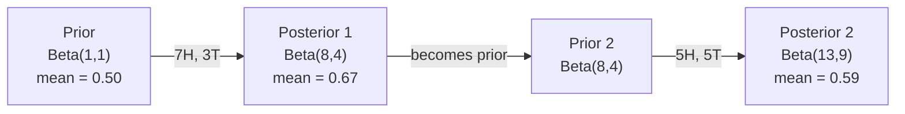

# Teorema de Bayes

> La probabilidad  preocupación es lo que espera que suceda―. Teorema de Bayes  preocupación es lo que has aprendido―.

**类型：**Construir
**语言：**Python
**前置要求：**Fase 1, Lección 06
**时间：**~ 75 minutos

## El objetivo del aprendizaje

-  aplicar el teorema de Bayes, según la probabilidad previa y la evidencia  calcular la probabilidad posterior
- Desde zero construir una con Laplace suavizando y el cálculo de log-espacio de Bayes Ingenuo 文本分类器
- Comparar MLE y estimación del MAP,并解释MAP 如何应对L2 regularización
- Utiliza los anteriores conjugados beta-binomial para pruebas A/B  lograr actualización bayesiana secuencial

##  problemas

Un examen médico tiene una precisión del 99%... ¿Cuál es la probabilidad de que tengas una enfermedad real?

La mayoría de la gente dirá que el 99%... la respuesta real depende de la rareza de esta enfermedad... si solo 1 de cada 10.000 personas tiene una enfermedad, entonces un resultado positivo significa que sólo tienes una probabilidad de enfermedad de aproximadamente el 1%... el otro 99% de resultados positivos son errores producidos por personas sanas...

Esto no es un cambio de cerebro rápido. Este es el teorema de Bayes. Cada filtro de spam, cada diagnóstico médico, cada modelo de ML de incertidumbre, utiliza la misma hipótesis.

Si no entiendes esto, construye un sistema de inteligencia artificial, y entonces mal entiendes los resultados del modelo, estableces un umbral malo y publicas predicciones con demasiada confianza.

## 概念

### Desde la probabilidad conjunta hasta Bayes

Ya sabes en la lección 06 que la probabilidad condicional es:

```
P(A|B) = P(A and B) / P(B)
```

Para el país:

```
P(B|A) = P(A and B) / P(A)
```

两个 expresos compartidos en la misma molécula: P(A y B) ――令它们相等并重新整理:

```
P(A and B) = P(A|B) * P(B) = P(B|A) * P(A)

Therefore:

P(A|B) = P(B|A) * P(A) / P(B)
```

Éste es el teorema de Bayes.

### Cuatro partes

| Part | Name | What it means |
|------|------|---------------|
| P(A\|B) | Posterior | 看到 evidence B 之后，你对 A 的更新后 belief |
| P(B\|A) | Likelihood | 如果 A 为真，evidence B 出现的概率有多大 |
| P(A) | Prior | 在看到任何 evidence 之前，你对 A 的 belief |
| P(B) | Evidence | 在所有可能性下看到 B 的总概率 |

La evidencia 项 P(B) 起归一化因子的作用── puedes usar la ley de probabilidad total 展开它:

```
P(B) = P(B|A) * P(A) + P(B|not A) * P(not A)
```

### 医学检测 ejemplos

Una enfermedad afecta a 1 de cada 10.000 personas. La tasa de detección exacta es del 99% de los pacientes.

```
P(sick)          = 0.0001     (prior: disease is rare)
P(positive|sick) = 0.99       (likelihood: test catches it)
P(positive|healthy) = 0.01    (false positive rate)

P(positive) = P(positive|sick) * P(sick) + P(positive|healthy) * P(healthy)
            = 0.99 * 0.0001 + 0.01 * 0.9999
            = 0.000099 + 0.009999
            = 0.010098

P(sick|positive) = P(positive|sick) * P(sick) / P(positive)
                 = 0.99 * 0.0001 / 0.010098
                 = 0.0098
                 = 0.98%
```

No hasta el 1%. En casos muy raros, incluso los exámenes precisos producen falsos resultados.

### Filtro de spam Muestras

¿Has recibido un correo electrónico que contenía la palabra "lotería"? ¿Es spam?

```
P(spam)                = 0.3      (30% of email is spam)
P("lottery"|spam)      = 0.05     (5% of spam emails contain "lottery")
P("lottery"|not spam)  = 0.001    (0.1% of legitimate emails contain "lottery")

P("lottery") = 0.05 * 0.3 + 0.001 * 0.7
             = 0.015 + 0.0007
             = 0.0157

P(spam|"lottery") = 0.05 * 0.3 / 0.0157
                  = 0.955
                  = 95.5%
```

Una palabra tiene una probabilidad de 30% 推高至95.5%── el verdadero filtro de spam se aplicará simultáneamente a cientos de palabras Bayes──

### Bayes ingenuo: suposición de independencia

Naive Bayes                                                                                                                                                                                                                                                                                                                                                                                                                                                                                                                          

```
P(class | feature_1, feature_2, ..., feature_n)
  = P(class) * P(feature_1|class) * P(feature_2|class) * ... * P(feature_n|class)
    / P(feature_1, feature_2, ..., feature_n)
```

La parte "naiva" es la suposición de independencia. En el texto, la aparición de palabras no es independiente. "Nuevo" y "York" son relacionados. Pero esta suposición tiene un efecto sorprendente en la práctica, ya que la clasificación sólo requiere la clasificación de las clases, y no la generación de una buena probabilidad de calificación.

Como las moléculas son iguales, puedes saltar por encima de ellas.

```
score(class) = P(class) * product of P(feature_i | class)
```

选择分最高的类──

### Estimación máxima de probabilidad (MLE)

¿Cómo se obtiene el dato de entrenamiento en la clase de P?

```
P("free"|spam) = (number of spam emails containing "free") / (total spam emails)
```

Esto es MLE: seleccionar los parámetros más posibles para que los datos observados aparezcan.

问题: si un término no aparece en spam durante el entrenamiento, MLE le dará una probabilidad de distribución de 0.

```
P(word|class) = (count(word, class) + 1) / (total_words_in_class + vocabulary_size)
```

Demos cada cuento más 1, asegurando que ninguna probabilidad será cero.

### El importe máximo a posteriori (MAP)

MLE 问的是: ¿cuáles son los parámetros máximos de los parámetros de datos?

MAP 问是: ¿qué parámetros maximizan los parámetros de los datos?

Según el teorema de Bayes:

```
P(parameters|data) proportional to P(data|parameters) * P(parameters)
```

MAP se encuentra en los parámetros en sí mismo para agregar un anterior. Si usted piensa que los parámetros deben ser más pequeños, entonces se codifica para castigar el valor de la prioridad. Esto es exactamente lo mismo que la regularización de L2 en ML.

| Estimation | Optimizes | ML equivalent |
|------------|-----------|---------------|
| MLE | P(data\|params) | 未 regularize 的训练 |
| MAP | P(data\|params) * P(params) | L2 / L1 regularization |

### Bayesiano vs frecuentista: prácticas diferencias

Los frecuentistas ponen los parámetros en forma de cantidades fijas pero desconocidas. Ellos preguntan: ¿Qué pasaría si repitiera este experimento muchas veces?

Los bayesianos colocan parámetros en las distribuciones. Ellos preguntan: ¿basándose en lo que he observado, qué creemos de estos parámetros?

Para la construcción de sistemas de gestión de datos, las diferencias de práctica son las siguientes:

| Aspect | Frequentist | Bayesian |
|--------|-------------|----------|
| Output | 点估计 | 值上的 distribution |
| Uncertainty | Confidence intervals（关于过程） | Credible intervals（关于 parameter） |
| Small data | 可能 overfit | Prior 起到 regularization 的作用 |
| Computation | 通常更快 | 通常需要 sampling（MCMC） |

La mayoría de las clases de producción de ML es frecuente de la (SGD 点估计) ⋅ cuando usted necesita la (校准) buena incertidumbre (医学决策 安全关键系统), o el dato es muy pequeño (少 shot learning 寒开始) ⋅ cuando los métodos bayesianos serán muy útiles.

### ¿Por qué el pensamiento bayesiano es importante para la ML?

Esta clase de conexiones es más profunda:

**Priors 就是 regularization。**Los valores de los parámetros de la expectativa se hacen en una declaración bayesiana.

**Posteriors 就是不确定性。**单个预测概率不能告诉你模型对该估计有多信心―― los métodos bayesianos te darán una distribución:我认为P(spam) entre 0.8 a 0.95 

**Bayes updates 就是 online learning。**El posterior de hoy se convertirá en el anterior de mañana. Cuando tu modelo ve nuevos datos, aumenta su creencia, en lugar de volver a entrenar desde cero.

**Model comparison 是 Bayesian 的。**El criterio de información bayesiana (BIC) ▌la probabilidad marginal y los factores de Bayes usan el razonamiento bayesiano en casos de selección de modelos ▌.


```figure
bayes-update
```

## Construirlo
### 步骤 1: Función del teorema de Bayes

```python
def bayes(prior, likelihood, false_positive_rate):
    evidence = likelihood * prior + false_positive_rate * (1 - prior)
    posterior = likelihood * prior / evidence
    return posterior

result = bayes(prior=0.0001, likelihood=0.99, false_positive_rate=0.01)
print(f"P(sick|positive) = {result:.4f}")
```

### 步骤 2: Clasificador de Bayes

```python
import math
from collections import defaultdict

class NaiveBayes:
    def __init__(self, smoothing=1.0):
        self.smoothing = smoothing
        self.class_counts = defaultdict(int)
        self.word_counts = defaultdict(lambda: defaultdict(int))
        self.class_word_totals = defaultdict(int)
        self.vocab = set()

    def train(self, documents, labels):
        for doc, label in zip(documents, labels):
            self.class_counts[label] += 1
            words = doc.lower().split()
            for word in words:
                self.word_counts[label][word] += 1
                self.class_word_totals[label] += 1
                self.vocab.add(word)

    def predict(self, document):
        words = document.lower().split()
        total_docs = sum(self.class_counts.values())
        vocab_size = len(self.vocab)
        best_class = None
        best_score = float("-inf")
        for cls in self.class_counts:
            score = math.log(self.class_counts[cls] / total_docs)
            for word in words:
                count = self.word_counts[cls].get(word, 0)
                total = self.class_word_totals[cls]
                score += math.log((count + self.smoothing) / (total + self.smoothing * vocab_size))
            if score > best_score:
                best_score = score
                best_class = cls
        return best_class
```

Las probabilidades de registro pueden evitar el flujo inferior. Muchas probabilidades muy pequeñas se multiplican para generar un punto flotante para decir números más pequeños.

### Paso 3: Entrenamiento en datos de spam

```python
train_docs = [
    "win free money now",
    "free lottery ticket winner",
    "claim your prize today free",
    "urgent offer free cash",
    "congratulations you won free",
    "meeting tomorrow at noon",
    "project update attached",
    "can we schedule a call",
    "quarterly report review",
    "lunch on thursday sounds good",
    "team standup notes attached",
    "please review the pull request",
]

train_labels = [
    "spam", "spam", "spam", "spam", "spam",
    "ham", "ham", "ham", "ham", "ham", "ham", "ham",
]

classifier = NaiveBayes()
classifier.train(train_docs, train_labels)

test_messages = [
    "free money waiting for you",
    "meeting rescheduled to friday",
    "you won a free prize",
    "please review the attached report",
]

for msg in test_messages:
    print(f"  '{msg}' -> {classifier.predict(msg)}")
```

### Paso 4: Probabilidad de aprendizaje de la inspección

```python
def show_top_words(classifier, cls, n=5):
    vocab_size = len(classifier.vocab)
    total = classifier.class_word_totals[cls]
    probs = {}
    for word in classifier.vocab:
        count = classifier.word_counts[cls].get(word, 0)
        probs[word] = (count + classifier.smoothing) / (total + classifier.smoothing * vocab_size)
    sorted_words = sorted(probs.items(), key=lambda x: x[1], reverse=True)
    for word, prob in sorted_words[:n]:
        print(f"    {word}: {prob:.4f}")

print("\nTop spam words:")
show_top_words(classifier, "spam")
print("\nTop ham words:")
show_top_words(classifier, "ham")
```

## Usalo
Scikit-learn ha proporcionado Bayes ingenuos que pueden ser producidos:

```python
from sklearn.feature_extraction.text import CountVectorizer
from sklearn.naive_bayes import MultinomialNB
from sklearn.metrics import classification_report

vectorizer = CountVectorizer()
X_train = vectorizer.fit_transform(train_docs)
clf = MultinomialNB()
clf.fit(X_train, train_labels)

X_test = vectorizer.transform(test_messages)
predictions = clf.predict(X_test)
for msg, pred in zip(test_messages, predictions):
    print(f"  '{msg}' -> {pred}")
```

Con un algoritmo―CountVectorizer  procesar tokenización y construcción de vocabulario―MultinomialNB en el procesamiento interno de suavizamiento y log-probabilidades―Tu desde la versión de zero-writing con 40 行代码 completó lo mismo―

##  entregarlo
En esta construcción, la clase NaiveBayes  ha mostrado una línea completa: tokenización  uso de la suavización de Laplace  estimación de probabilidad  predicción del espacio log `code/bayes.py`El código medio puede ejecutarse de un lado a otro, excepto la biblioteca estándar de Python.

### Los antecesores conjuntos

Cuando el anterior y posterior pertenecen a la misma familia de distribución, este anterior se llama "conjugado"― esto permite que la actualización bayesiana en el代数 sea muy limpia no se necesita integración numérica para obtener posterior en forma cerrada―.

| Likelihood | Conjugate Prior | Posterior | Example |
|-----------|----------------|-----------|---------|
| Bernoulli | Beta(a, b) | Beta(a + successes, b + failures) | Coin flip bias estimation |
| Normal (known variance) | Normal(mu_0, sigma_0) | Normal(weighted mean, smaller variance) | Sensor calibration |
| Poisson | Gamma(a, b) | Gamma(a + sum of counts, b + n) | Modeling arrival rates |
| Multinomial | Dirichlet(alpha) | Dirichlet(alpha + counts) | Topic modeling, language models |

Esto es importante: cuando no hay antecedentes conjugados, necesitas muestreo de Monte Carlo o inferencia variativa para acercarte posteriormente.

La distribución beta es la más común de la práctica conjugada anterior。Beta, b) Expresa tu creencia en un parámetro de probabilidad。 el valor promedio es a/(a+b)。a+b 越大, distribución 越集中(越自信)。

Las situaciones especiales del beta anterior:
- Beta(1, 1) = uniforme── Usted sobre el parámetro 没有意见──
- Beta(10, 10) = En 0,5  cerca de alcanzar el máximo valor.
- Beta(1, 10) = hacia 0 偏斜──你相信参数 很小──

更新规则极其简单:

```
Prior:     Beta(a, b)
Data:      s successes, f failures
Posterior: Beta(a + s, b + f)
```

No hay muestreo, sólo un extra.

### Actualización Bayesiana secuencial

La inferencia bayesiana es natural de secuencia. El posterior de hoy se convertirá en el anterior de mañana.

具体例: estimate de si una moneda es justa o no.

**Day 1：还没有数据。**
Desde Beta(1, 1) 开始一个统一的前──你没有意见──
- Mediano anterior: 0,5
- El anterior en [0, 1] arriba es plano

**Day 2：观察到 7 次正面，3 次反面。**
Posterior = Beta(1 + 7, 1 + 3) = Beta(8, 4)
- Mediano posterior:8/12 = 0,667
- La evidencia muestra que el moneda está orientada hacia la derecha

**Day 3：又观察到 5 次正面，5 次反面。**
Utiliza ayer posterior como hoy anterior.
Posterior = Beta(8 + 5, 4 + 5) = Beta(13, 9)
- Mediano posterior: 13/22 = 0,591
- Los datos de nuevo equilibrio han vuelto a la estimación de la cantidad de 0,5.



观测顺序不重要――Beta(1,1) 一次性用全部12次正面和8次反面更新,也会得到Beta(13, 9) 结果相同──Sequenciales actualizaciones和批次更新 在数学上等价──但序列更新 允许你在每一步做决策,无需存储原始数据──

Esta es la base del aprendizaje en línea en el sistema ML de producción. Se utiliza este modelo para el muestreo Thompson de bandidos.

### Enlace con Pruebas A/B

Las pruebas A/B son en esencia una falsa inferencia bayesiana.

设定: 你正在测试两种按颜色──Variante A(azul) y variante B(verde)──你想知道哪一个获得更多点击──

Prueba de A/B bayesiana:

1. **Prior。**两个 variantes están en Beta(1, 1) 开始── no hay preferencia previa──
2. **Data。**Variación A:1000 veces muestra 50 veces点击──Variación B:1000 veces muestra 65 veces点击──
3. **Posteriors。**
   - A:Beta(1 + 50, 1 + 950) = Beta(51, 951)―Medio = 0,051
   - B:Beta(1 + 65, 1 + 935) = Beta(66, 936)。Medio = 0,066
4. **Decision。**计算 P(B > A)B de la tasa de conversión real 高于 A 的概率──

解析地计算 P(B > A) 很困难――但蒙特卡罗 让它变得非常简单:

```
1. Draw 100,000 samples from Beta(51, 951)  -> samples_A
2. Draw 100,000 samples from Beta(66, 936)  -> samples_B
3. P(B > A) = fraction of samples where B > A
```

Si P(B > A) > 0.95, se lanza la variante B―Si está entre 0.05 y 0.95, se continúa recopilando datos―Si P(B > A) < 0.05, se lanza la variante A―

Las ventajas de las pruebas A/B frecuentes:
- Obtendrás una probabilidad directa:
- 没有 p-value 混──没有 fail to reject the null hypothesis  这种回避表述──
- Puedes ver los resultados en cualquier momento, sin subir tasas falsas positivas.
- Puedes incluir conocimientos previos, por ejemplo, los test anteriores muestran que las tasas de conversión suelen ser de 3-8%.

| Aspect | Frequentist A/B | Bayesian A/B |
|--------|----------------|--------------|
| Output | p-value | P(B > A) |
| Interpretation | “如果 A=B，这些数据有多令人意外？” | “B 比 A 更好的可能性有多大？” |
| Early stopping | 会抬高 false positives | 任意时点都是安全的（前提是 prior 选择合理且 model specification 正确） |
| Prior knowledge | 不使用 | 编码为 Beta prior |
| Decision rule | p < 0.05 | P(B > A) > threshold |

##  ejercicios
1. **Multiple tests。**Un paciente en dos exámenes independientes fue positivo en dos exámenes, el 99% de la precisión, la tasa de propagación de la enfermedad fue de 1 en cada 10.000 personas.

2. **Smoothing impact。**Utiliza 0.01、0.1、1.0 y 10.0 de valores de suavizamiento 运行垃圾邮件分类器──Top word probabilities 会如何变化?当 smoothing=0 且某个词只出现 中时会发生什么?

3. **Add features。**扩展 NaiveBayes clase, hacer que aparte de contar palabras 之外, también utilizar el mensaje de longitud(corto/largo) como característica。 de entrenamiento datos estimar P(shortfallspam) 和 P(shortfallham),并把它合并到预测分中──

4. **MAP by hand。**给定观测数据(10 veces lanzamientos de monedas en el medio de 7 veces cabezas), utilizar Beta(2,2) previo 计算偏差的 MAP estimación──把它与 MLE estimación(7/10) para hacer una comparación──

## 关键术语: "El hombre es un hombre"
| Term | What people say | What it actually means |
|------|----------------|----------------------|
| Prior | “我的初始猜测” | 观测 evidence 之前的 P(hypothesis)。在 ML 中：regularization 项。 |
| Likelihood | “数据拟合得有多好” | P(evidence\|hypothesis)。在特定 hypothesis 下，观测数据出现的概率有多大。 |
| Posterior | “我更新后的 belief” | P(hypothesis\|evidence)。Prior 乘以 likelihood，然后归一化。 |
| Evidence | “归一化常数” | 所有 hypotheses 下的 P(data)。确保 posterior 求和为 1。 |
| Naive Bayes | “那个简单的文本分类器” | 一个假设 features 在给定 class 时相互独立的分类器。尽管该假设不成立，效果仍然很好。 |
| Laplace smoothing | “Add-one smoothing” | 给每个 feature 增加一个小计数，以防止未见数据产生零概率。 |
| MLE | “直接用频率” | 选择最大化 P(data\|parameters) 的 parameters。没有 prior。在小数据上可能 overfit。 |
| MAP | “带 prior 的 MLE” | 选择最大化 P(data\|parameters) * P(parameters) 的 parameters。等价于 regularized MLE。 |
| Log-probability | “在 log space 中工作” | 使用 log(P) 而不是 P，避免许多小数相乘时发生 floating-point underflow。 |
| False positive | “错误警报” | 检测结果为阳性，但真实状态为阴性。它会推动 base rate fallacy。 |

## 延伸阅读
- [3Blue1Brown: Bayes' theorem](https://www.youtube.com/watch?v=HZGCoVF3YvM)- Uso de ejemplos de análisis médicos explicación visible
- [Stanford CS229: Generative Learning Algorithms](https://cs229.stanford.edu/notes2022fall/cs229-notes2.pdf)- la relación de Bayes con los modelos discriminatorios
- [Think Bayes](https://greenteapress.com/wp/think-bayes/)- 免费书籍, contiene Python 代码 de estadísticas bayesianas
- [scikit-learn Naive Bayes](https://scikit-learn.org/stable/modules/naive_bayes.html)- Clasificación de producción y cuándo utilizar las variantes
