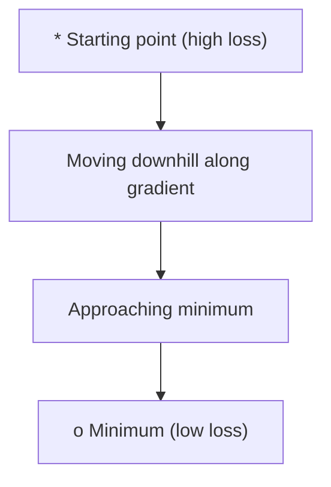
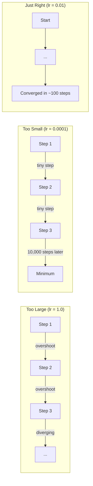
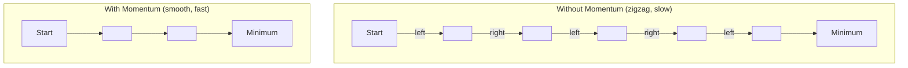
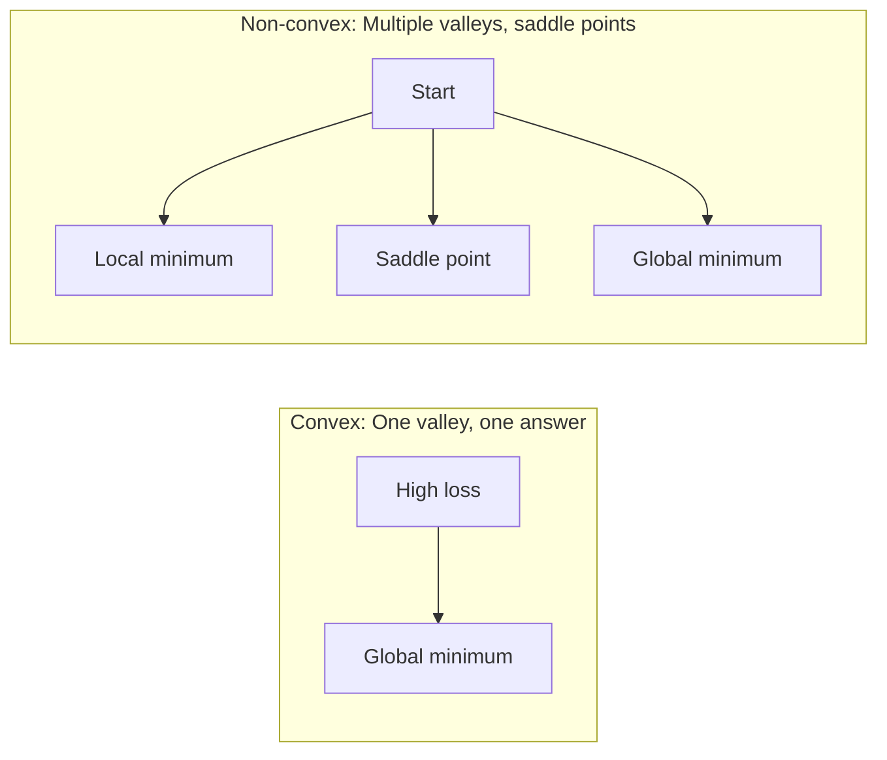
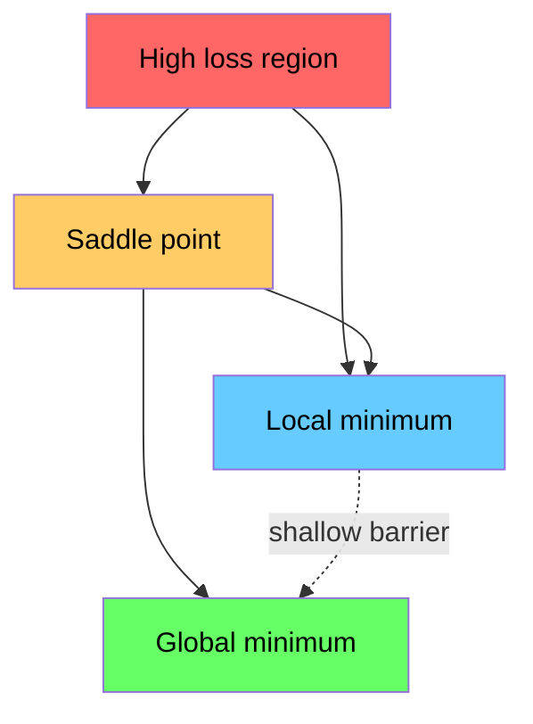

# Optimización

> Entrenando una red neuronal, es buscar el punto mínimo del valle.

**Type:** Build
**Language:**Python
**Prerequisites:** Phase 1, Lessons 04-05 (Derivatives, Gradients)
**Time:** ~75 minutes

## El objetivo del aprendizaje
- Desde el 0 de la realización de la baja de la gradiente de vainilla 带 momentum SGD, así como Adam
- Comparación de la función Rosenbrock 收表现,并解释为什么 Adam 会为每一个重量自适应调整学习率
- 区分 convex con no convex Loss paisaje,并解释 седло punto 在高维空间中的作用
- Configurar los horarios de la tasa de aprendizaje                                                                                                                                                                                                                                                         

##  problemas
Tienes una función de pérdida. Te dice que el modelo está equivocado. Tienes Gradientes. Te dicen en qué dirección hará que la pérdida se ponga peor. Ahora necesitas una estrategia para bajar.

El método más simple es muy simple: moverse en la dirección opuesta del gradiente. Usando un número llamado de tasas de aprendizaje para acelerar el descenso. Repecto de ejecución. Este es el descenso del gradiente, y es realmente efectivo. Pero el ritmo de aprendizaje es demasiado grande, pasarás directamente por todo el valle, entre ambos lados.

Cada optimizador en el Deep Learning, está respondiendo a la misma pregunta: ¿cómo llegar más rápido, más confiable al fondo del valle?

## 概念
### Qué significa la optimización

La optimización es buscar el valor de entrada de una función que puede hacer que se minimice o maximice. En el aprendizaje automático, esta función es la pérdida.

```
minimize L(w) where:
  L = loss function
  w = model weights (could be millions of parameters)
```

### Descenso gradual (vanilla)

La pérdida de peso en relación con cada Gradiente. Deja que cada peso se mueva en la dirección opuesta de su Gradiente.

```
w = w - lr * gradient
```

Éste es el algoritmo completo.



### Rate de aprendizaje: hiperparámetro más importante

La tasa de aprendizaje 控制步长── Determinó sobre todo lo que se recibiera──



No existe una fórmula que pueda dar directamente la tasa de aprendizaje correcta. Necesitas encontrarla a través de la experiencia.

### SGD vs lote vs mini lote

La descesión del gradiente de vainilla en el paso de la partida, se calcula en todo el conjunto de datos. Esto se llama descesión del gradiente de lote.

Descenso de gradiente estocástico (SGD) calculado en un solo modelo de gradiente,并立即更新──.

Descenso de gradiente de mini lote 折中处理──先在一个小批(32、64、128、256 个样本) 计算上 Gradient,然后更新──这是实际中大家真正使用的方法──

| Variant | Batch size | Gradient quality | Speed per step | Noise |
|---------|-----------|-----------------|---------------|-------|
| Batch GD | 整个 dataset | 精确 | 慢 | 无 |
| SGD | 1 个样本 | 噪声很大 | 快 | 高 |
| Mini-batch | 32-256 | 良好估计 | 均衡 | 中等 |

El ruido en SGD y mini-batch no es un error.

### Momentum: Un pequeño balón que se rodea hacia abajo

El descenso del gradiente de vainilla sólo se observa en el actual gradiente. Si el gradiente se mueve en forma de swing (en el valle estrecho), el progreso es lento.

```
v = beta * v + gradient
w = w - lr * v
```

类比是: una bola que se rodea hacia abajo de la montaña. No se detiene en cada pequeña columna de altura, se vuelve a empezar.



`beta`(normalmente 0.9) control conservan mucho información histórica.

### Adam: tasas de aprendizaje adaptativas

Diferentes pesos requieren diferentes tasas de aprendizaje. Algunos muy poco obtienen un gran gradiente, en el final obtienen un gran gradiente, deben dar pasos más grandes.

Adam (Estimación de Momento Adaptativo) se pondrá por cada peso y seguirá dos cosas:

1. Primero momento ((m):Gradientes de promedio corriente ((( similar a impulso)
2. Segundo momento ((v):gradientes cuadrados de promedio corriente ((magnitud de gradiente)

```
m = beta1 * m + (1 - beta1) * gradient
v = beta2 * v + (1 - beta2) * gradient^2

m_hat = m / (1 - beta1^t)    bias correction
v_hat = v / (1 - beta2^t)    bias correction

w = w - lr * m_hat / (sqrt(v_hat) + epsilon)
```

Además de`sqrt(v_hat)`Es un punto de vista clave. Los pesos de los Gradientes grandes serán separados por un gran número de fases. Cada peso obtendrá su propio ritmo de aprendizaje adaptativo.

默认 hiperparámetros:`lr=0.001, beta1=0.9, beta2=0.999, epsilon=1e-8` Estos valores imperativos tienen un efecto negativo en la mayoría de los problemas

### Horarios de tasa de aprendizaje

固定的学习率是一种折中──训练早期,你希望步子大一些,以便快速取得进展──训练后期,你希望步子小一些,以便在最小的附近精调──

常见 horarios:

| Schedule | Formula | Use case |
|----------|---------|----------|
| Step decay | lr = lr * factor every N epochs | 简单，手动控制 |
| Exponential decay | lr = lr_0 * decay^t | 平滑降低 |
| Cosine annealing | lr = lr_min + 0.5 * (lr_max - lr_min) * (1 + cos(pi * t / T)) | Transformers，现代训练 |
| Warmup + decay | 线性上升，然后 decay | 大模型，防止早期不稳定 |

### Conveja vs no conveja

Función convexa 只有一个最小──渐进下降 总能找到它──像 `f(x) = x^2`Este tipo de cuadrático es convexo.

Las funciones de pérdida de red neuronal son no convexas.



En la práctica, los mínimos locales en las redes neuronales de alto nivel son muy pocos problemas reales. La mayoría de los mínimos locales tienen un valor de pérdida que se acerca al mínimo global.

### Visualización de paisajes perdidos

La pérdida es una función de todos los pesos. Para un modelo que tiene 100 millones de pesos, el paisaje de pérdida existe en 1.000,001 dimensiones del espacio.



Los mínimos agudos 泛化较差──Flat minima 泛化较好── esto también lleva impulso de SGD en la precisión de los ensayos finales 上经常优于亚当的原因之一: su ruido evitará que el modelo se quede en mínimos agudos ⋅


```figure
gradient-descent
```

## Construirlo
### 步骤 1: Definir una función de prueba

La función Rosenbrock es un estándar de optimización clásica. Su mínimo se encuentra en (1, 1), está en un estrecho valle de la curva, fácil de encontrar pero difícil de seguir.

```
f(x, y) = (1 - x)^2 + 100 * (y - x^2)^2
```

```python
def rosenbrock(params):
    x, y = params
    return (1 - x) ** 2 + 100 * (y - x ** 2) ** 2

def rosenbrock_gradient(params):
    x, y = params
    df_dx = -2 * (1 - x) + 200 * (y - x ** 2) * (-2 * x)
    df_dy = 200 * (y - x ** 2)
    return [df_dx, df_dy]
```

### 步骤 2: Descenso de gradiente de vainilla

```python
class GradientDescent:
    def __init__(self, lr=0.001):
        self.lr = lr

    def step(self, params, grads):
        return [p - self.lr * g for p, g in zip(params, grads)]
```

### 步骤 3: SGD con impulso

```python
class SGDMomentum:
    def __init__(self, lr=0.001, momentum=0.9):
        self.lr = lr
        self.momentum = momentum
        self.velocity = None

    def step(self, params, grads):
        if self.velocity is None:
            self.velocity = [0.0] * len(params)
        self.velocity = [
            self.momentum * v + g
            for v, g in zip(self.velocity, grads)
        ]
        return [p - self.lr * v for p, v in zip(params, self.velocity)]
```

### Paso 4: Adán

```python
class Adam:
    def __init__(self, lr=0.001, beta1=0.9, beta2=0.999, epsilon=1e-8):
        self.lr = lr
        self.beta1 = beta1
        self.beta2 = beta2
        self.epsilon = epsilon
        self.m = None
        self.v = None
        self.t = 0

    def step(self, params, grads):
        if self.m is None:
            self.m = [0.0] * len(params)
            self.v = [0.0] * len(params)

        self.t += 1

        self.m = [
            self.beta1 * m + (1 - self.beta1) * g
            for m, g in zip(self.m, grads)
        ]
        self.v = [
            self.beta2 * v + (1 - self.beta2) * g ** 2
            for v, g in zip(self.v, grads)
        ]

        m_hat = [m / (1 - self.beta1 ** self.t) for m in self.m]
        v_hat = [v / (1 - self.beta2 ** self.t) for v in self.v]

        return [
            p - self.lr * mh / (vh ** 0.5 + self.epsilon)
            for p, mh, vh in zip(params, m_hat, v_hat)
        ]
```

### 步骤 5: ejecutar y comparar

```python
def optimize(optimizer, func, grad_func, start, steps=5000):
    params = list(start)
    history = [params[:]]
    for _ in range(steps):
        grads = grad_func(params)
        params = optimizer.step(params, grads)
        history.append(params[:])
    return history

start = [-1.0, 1.0]

gd_history = optimize(GradientDescent(lr=0.0005), rosenbrock, rosenbrock_gradient, start)
sgd_history = optimize(SGDMomentum(lr=0.0001, momentum=0.9), rosenbrock, rosenbrock_gradient, start)
adam_history = optimize(Adam(lr=0.01), rosenbrock, rosenbrock_gradient, start)

for name, history in [("GD", gd_history), ("SGD+M", sgd_history), ("Adam", adam_history)]:
    final = history[-1]
    loss = rosenbrock(final)
    print(f"{name:6s} -> x={final[0]:.6f}, y={final[1]:.6f}, loss={loss:.8f}")
```

预期输出:Adam 收最快──带动的 SGD 路径更平滑──Vanilla GD Progreso en el estrecho valle es lento──

## Usalo
En la práctica, utilizan PyTorch o JAX Optimizers. Ellos tratan grupos de parámetros, deterioro de peso, recorte de gradientes y aceleración de GPU.

```python
import torch

model = torch.nn.Linear(784, 10)

sgd = torch.optim.SGD(model.parameters(), lr=0.01, momentum=0.9)
adam = torch.optim.Adam(model.parameters(), lr=0.001)
adamw = torch.optim.AdamW(model.parameters(), lr=0.001, weight_decay=0.01)

scheduler = torch.optim.lr_scheduler.CosineAnnealingLR(adam, T_max=100)
```

经验法则:

- Desde Adam (r=0.001) comenzó.
- Cuando necesites la mejor precisión final, y puedas soportar más costos de ajuste, cambia a SGD de impulso de LR=0.01, impulso=0.9)
- Para transformadores utiliza AdánW(带 desacoplado de pérdida de peso Adán)
- Para más de varias épocas de entrenamiento, siempre utilizar el horario de tasa de aprendizaje.
- Si el entrenamiento no está estable, baja la tasa de aprendizaje... si el entrenamiento es demasiado lento, mejora el mismo.

##  entregarlo
Este curso se produce en un momento de la elección de un optimizador adecuado.`outputs/prompt-optimizer-guide.md`¿Qué es eso?

Las clases de optimización que se construyen aquí aparecerán de nuevo en la Fase 3, cuando entrenaremos desde cero una red neuronal.

##  ejercicios
1. **Learning rate sweep.**En la función Rosenbrock 上使用学习率 [0.0001, 0.0005, 0.001, 0.005, 0.01] 运行瓦尼拉梯度下降──对每一个学习率,在5000步后图图或打印最终损失──找出仍能收的最大学习率──

2. **Momentum comparison.**En la función Rosenbrock 上 utiliza valores de impulso [0.0, 0.5, 0.9, 0.99] 运行带动态的 SGD──跟踪每一步的损失──哪个动态值 收最快?哪个会超越?

3. **Saddle point escape.**定义函数   Función de definición`f(x, y) = x^2 - y^2`(original punto de un punto de silla) ∼ desde (0.01, 0.01) 开始── Comparar vanilla GD、带动态 的 SGD 和 Adam 的行为──哪个能逃离 ?? 车点?

4. **Implement learning rate decay.**Por GradientDescent clase  Añadir el horario de desintegración exponencial:`lr = lr_0 * 0.999^step` Comparar en la función Rosenbrock la función de descomposición de la utilización y la de la descomposición de la utilización.

## 关键术语: "El hombre es un hombre"
| Term | What people say | What it actually means |
|------|----------------|----------------------|
| Gradient descent | “Go downhill” | 通过减去按 learning rate 缩放后的 Gradient 来更新 weights。最基础的 Optimizer。 |
| Learning rate | “Step size” | 控制每次更新让 weights 移动多远的标量。太大会导致发散。太小会浪费计算。 |
| Momentum | “Keep rolling” | 将过去的 Gradients 累积到一个 velocity Vector 中。抑制震荡，并加速沿一致方向的移动。 |
| SGD | “Random sampling” | Stochastic gradient descent。用随机子集而不是完整 dataset 计算 Gradient。实践中几乎总是指 mini-batch SGD。 |
| Mini-batch | “A chunk of data” | 用于估计 Gradient 的一小部分训练数据（32-256 个样本）。平衡速度与 Gradient 准确性。 |
| Adam | “The default optimizer” | Adaptive Moment Estimation。跟踪每个 weight 的 Gradients 和 squared gradients 的 running averages，从而为每个 weight 提供自己的 learning rate。 |
| Bias correction | “Fix the cold start” | Adam 的 first 和 second moments 初始化为零。Bias correction 在早期步骤中通过除以 (1 - beta^t) 进行补偿。 |
| Learning rate schedule | “Change lr over time” | 在训练过程中调整 learning rate 的函数。早期大步，后期小步。 |
| Convex function | “One valley” | 任意 local minimum 都是 global minimum 的函数。Gradient descent 总能找到它。Neural Network losses 不是 convex。 |
| Saddle point | “Flat but not a minimum” | Gradient 为零，但在某些方向上是 minimum、在另一些方向上是 maximum 的点。高维空间中很常见。 |
| Loss landscape | “The terrain” | 在 weight space 上绘制出的 Loss function。通过沿两个随机方向切片来可视化。 |
| Convergence | “Getting there” | Optimizer 已到达一个继续更新也无法显著降低 Loss 的点。 |

## 延伸阅读
- [Sebastian Ruder: An overview of gradient descent optimization algorithms](https://ruder.io/optimizing-gradient-descent/)- Un resumen completo de todos los principales optimizadores
- [Why Momentum Really Works (Distill)](https://distill.pub/2017/momentum/)- la interacción de la dinámica del impulso
- [Adam: A Method for Stochastic Optimization (Kingma & Ba, 2014)](https://arxiv.org/abs/1412.6980)- original papel de Adán, fácil de leer y breve
- [Visualizing the Loss Landscape of Neural Nets (Li et al., 2018)](https://arxiv.org/abs/1712.09913)-  mostrar papel nítido vs. mínimo plano
