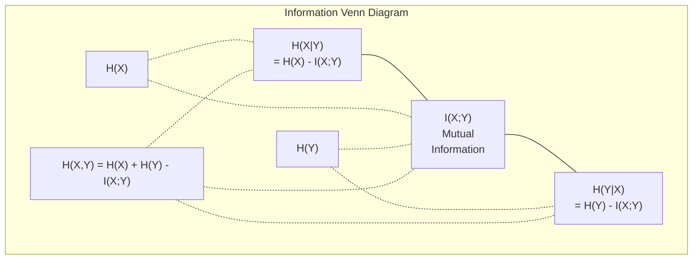

# Teoría de la información

> Teoría de la información medir la sorpresa―La pérdida de funciones 建立在之上―

**Type:** Learn
**Language:**Python
**Prerequisites:** Phase 1, Lesson 06 (Probability)
**Time:** ~60 分钟

## El objetivo del aprendizaje

- Desde la entropía de la computadora de cero, la entropía cruzada y la divergencia KL, y explicar la relación entre ellos
- 推导为什么最小化交叉热损等价格最大化日志概率
- 计算 características y información mutua entre el objetivo, para la clasificación de la importancia de las características
- 将 perplexity 解释为语言模型 从中选择的有效词汇库大小 从中选择的有效词汇库大小 的语言模型 解释为语言模型 从中选择的有效词汇库大小 的语言模型 从中选择的有效词汇库大小 的语言模型 的语言模型

##  problemas

Cada modelo de clasificación que estás entrenando se utiliza en la ciudad.`CrossEntropyLoss()` Usted verá en cada modelo de lenguaje  en el artículo  verá  perplejidad  Usted verá en VAEs、distillación 和 RLHF en el que se lee KL divergencia♦ Estos conceptos no se dividen entre sí♦ son el mismo pensamiento sobre diferentes vestidos♦

La teoría de la información te proporciona un raciocinio sobre la incertidumbre, la compresión y la predicción. Claude Shannon lo inventó en 1948 para resolver problemas de comunicación.

Esta clase te enseñará a construir cada fórmula desde cero, a ver de dónde provienen y por qué es efectiva.

## 概念

### 信息量(sorpresa)

Cuando ocurre algo que no es probable, lleva más información.

概率为 p 的事件的信息量是:

```
I(x) = -log(p(x))
```

Utiliza en 2 por debajo de un registro  obtendemos bits ⋅ Utiliza en el registro natural  obtendemos nats ⋅ la misma idea, diferentes unidades ⋅

```
Event              Probability    Surprise (bits)
Fair coin heads    0.5            1.0
Rolling a 6        0.167          2.58
1-in-1000 event    0.001          9.97
Certain event      1.0            0.0
```

El hecho de que haya un evento con información es algo que ya sabes que va a suceder.

### Entropiedad (en inglés)

La entropía es una distribución de todas las expectativas de sorpresa de los posibles resultados.

```
H(P) = -sum( p(x) * log(p(x)) )  for all x
```

公平硬币对二元变量 具有最大エントロピー:1 bit──偏置硬币(99% 正面)具有低エントロピー:0.08 bits──你已经知道会发生什么,因此每次抛几乎不会告诉你任何信息──

```
Fair coin:    H = -(0.5 * log2(0.5) + 0.5 * log2(0.5)) = 1.0 bit
Biased coin:  H = -(0.99 * log2(0.99) + 0.01 * log2(0.01)) = 0.08 bits
```

Entropia mide una distribución de incertidumbre incontrolável.

### La función de pérdida (你每日使用的损失函数)

Entropias cruzas  medida cuando utilizas la distribución Q 来编码实际来自分布 P 的事件时, sorpresa media es cuánto──

```
H(P, Q) = -sum( p(x) * log(q(x)) )  for all x
```

P es la distribución verdadera (la etiqueta) Q es la predicción de tu modelo. Si Q y P se ajustan completamente, la entropía cruzada y la entropía se ajustan.

En la clasificación, P es un vector de una clase real con probabilidad de 1, otros todos en 0).

```
H(P, Q) = -log(q(true_class))
```

Ésta es la clasificación de la pérdida completa de entropía cruzada 公式──最大化正确类的预测概率──

### KL Divergencia (distribuciones  entre distancias)

KL divergencia  medir el uso de Q en lugar de P  traerá una sorpresa extra 

```
D_KL(P || Q) = sum( p(x) * log(p(x) / q(x)) )  for all x
             = H(P, Q) - H(P)
```

La entropía cruzada es la entropía + divergencia KL. Debido a que la verdadera distribución de la entropía durante el entrenamiento es constante, la entropía cruzada minimizada es igual a la mínima divergencia KL.

La divergencia KL 不是对称的:D_KL(P  Q) != D_KL(Q  P)──no es una verdadera métrica de distancia──

### Información mutua

Información mutua  medir saber una variable 能 decirte otra variable 多少信息──

```
I(X; Y) = H(X) - H(X|Y)
        = H(X) + H(Y) - H(X, Y)
```

Si X y Y son independientes, la información mutua es nula. Si uno de ellos no te dice ninguna información del otro, la información mutua es como la entropía de una variable.

En la selección de características, la información mutua entre la característica y el objetivo  高, significa que la característica tiene uso.

### Entropia condicional

H(Y delX) ∆ medir observado hasta X 后, sobre Y todavía queda mucha incertidumbre―

```
H(Y|X) = H(X,Y) - H(X)
```

两个极端:
- Si X  totalmente decide Y, entonces H  Y X                                                                                                                                                                                                                                                         
- Si X a Y   no tiene información, entonces H      Y                                                                                                                                                                                                                                                                                                                                                                                                                                                                                                            

Entropia condicional 始终非负,并且永远不超过 H(Y):

```
0 <= H(Y|X) <= H(Y)
```

En el aprendizaje automático, la entropía condicional aparece en los árboles de decisión. En cada división, el algoritmo selecciona H(Y que no tiene X) La característica mínima de X, es decir, la eliminación de la característica de la máxima incertidumbre sobre la etiqueta Y.

### Entropia conjunta

H(X,Y) es la entropía de la distribución conjunta de X y Y 一起.

```
H(X,Y) = -sum sum p(x,y) * log(p(x,y))   for all x, y
```

关键性质:

```
H(X,Y) <= H(X) + H(Y)
```

Cuando X y Y 独立时等号成立──如果它们共享信息, entropía conjunta就小于各自的エントロピー 之和──这个缺失的エントロピー 正是相互信息──



Estas relaciones:
- H(X,Y) = H(X) + H(Y que sea X) = H(Y) + H(X que sea)
- El valor de la cantidad de residuos de la producción de la planta de producción de la planta de producción de la planta de producción de la planta de producción de la planta de producción de la planta de producción de la planta de producción de la planta de producción de la planta de producción de la planta de producción de la planta de producción de la planta de producción de la planta de producción de la planta de producción de la planta de producción de la planta de producción de la planta de producción de la planta de producción de la planta de producción de la planta de producción de la planta de producción de la planta de producción de la planta de producción de la planta de producción de la planta de la planta de producción de la planta de la planta de producción de la planta de la planta de la planta de producción de la planta de la planta de la planta de la planta de la planta de la planta de la planta de la planta de la planta de la planta de la planta de la planta de la planta de la planta de la planta de la planta de la planta de la planta de la planta de la planta de la planta de la planta de la planta de la planta de la planta de la planta de la planta de la planta de la planta de la planta de la planta de la planta de la planta de la planta de la planta de la planta de la planta de la planta de la planta de la planta de la planta de la planta de la planta de la planta de la planta de la planta de la planta de la planta de la planta de la planta de la planta de la planta de la planta de la planta de la planta de la planta de la planta de la planta de la planta de la planta de la planta de la planta de la planta de la planta de la planta de la planta de la planta de la planta de la planta de la planta de la planta de la planta de la planta de la planta de la planta de la planta de la planta de la planta de la planta de la planta de la planta de la planta de la planta de la planta de la planta de la planta de la planta de la planta de la planta de la planta de la planta de la planta de la planta de la planta de la planta de la planta de la planta de la planta de la planta de la planta de la planta de la planta de la planta de la planta de la planta de la planta de la planta de la planta de la planta de la planta de la planta de la planta de la planta de la planta de la planta de la planta de la planta de
- H(X,Y) = H(X) + H(Y) - I(X;Y)

### Información mutua (Depth Diving)

Información mutua I(X;Y) 量化知道一个变量会减少关于另一个变量的多少不确定性──

```
I(X;Y) = H(X) - H(X|Y)
       = H(Y) - H(Y|X)
       = H(X) + H(Y) - H(X,Y)
       = sum sum p(x,y) * log(p(x,y) / (p(x) * p(y)))
```

Sexualidad:
- I(X;Y) >= 0 siempre se ha establecido. Observar algo nunca te hará perder información.
- Cuando y sólo cuando X y Y  independiente, I  X; Y) = 0。
- I(X;Y) = I(Y;X)。 es un homogéneo, diferente a la divergencia KL。
- I(X;X) = H(X)。 Una variable y compartir toda la información.

**用于 feature selection 的 mutual information。**En ML, las características que deseas para el objetivo tienen información.

1. Para cada característica X_i, calcular I(X_i; Y), de las cuales Y es la variable objetivo。
2. 按 MI puntuación 排序 características。
3. Mantener las características.

Esta se aplica a cualquier relación entre la característica y el objetivo: lineal, no lineal, monótono o cualquier otra relación. Correlación sólo puede captar relaciones lineales.

| Method | Detects | Computational cost | Handles categorical? |
|--------|---------|-------------------|---------------------|
| Pearson correlation | Linear relationships | O(n) | No |
| Spearman correlation | Monotonic relationships | O(n log n) | No |
| Mutual information | 任意 statistical dependency | O(n log n) with binning | Yes |

### Limpiación de etiquetas y entropía cruzada

标准分类 使用hard targets:[0, 0, 1, 0]──true class 的概率为 1,其他全部为 0──Littering Label 会用软目标 替换它们:

```
soft_target = (1 - epsilon) * hard_target + epsilon / num_classes
```

Cuando epsilon = 0,1 y hay 4 clases 时:
- Objetivo duro: [0, 0, 1, 0]
- Objetivo suave: [0,025, 0,025, 0,925, 0,025]

Desde la Teoría de la Información 视角看, etiqueta suavizando 增加 la entropía de la distribución de objetivos。 entropía de objetivos de una sola caliente dura 为 0,也就是没有不确定性── soft targets 具有正正的 Entrropy──

¿Por qué esto ayuda?
- 防止模型 将 logits 推向极端值(在交叉内, 下, 要完美匹配一热目标 需要无限大的 logits)
-  Como regularización:modelo incapaz de 100% de confianza
-  Mejorar la calibración:预测概率更好地 reflejar la incertidumbre real
-                                                                                                                                                                                                                                                                                                                                                                                                                                                                                                                              

Uso de etiqueta de suavización de pérdida de entropía cruzada 变为:

```
L = (1 - epsilon) * CE(hard_target, prediction) + epsilon * H_uniform(prediction)
```

El segundo punto es que las predicciones de la distancia a la uniformidad, es decir, la regularización directa de la confianza.

### ¿Por qué la entropía cruzada es el núcleo de la pérdida de clasificación ?

Tres puntos de vista, con un mismo final.

**Information Theory 视角。**La entropía cruzada mide la distribución de su modelo en lugar de la distribución real. Gastaba muchos bits cuando lo utilizaba. Minimizándolo, se convertiría en el codificador de mayor eficacia de la realidad.

**Maximum likelihood 视角。**对于 N 个 true classes 为 y_i de las muestras de formación:

```
Likelihood     = product( q(y_i) )
Log-likelihood = sum( log(q(y_i)) )
Negative log-likelihood = -sum( log(q(y_i)) )
```

La última línea es la pérdida de entropía cruzada. Minimizar la entropía cruzada.

**Gradient 视角。**La entropía cruzada  Sobre las logitas 简单地是(predecible - verdad) ⋅干净、稳定、计算快速── ése es el motivo de su perfecta combinación con softmax ⋅

### Los bits vs los nats

La única diferencia es el número de registro.

```
log base 2   -> bits      (information theory tradition)
log base e   -> nats      (machine learning convention)
log base 10  -> hartleys  (rarely used)
```

1 nat = 1/ln(2) bits = 1,4427 bits。PyTorch 和 TensorFlow 默认使用自然log (nat) ⋅

### Perplejidad

La perplejidad es un índice de entropía cruzada. Te dice que el modelo es incierto.

```
Perplexity = 2^H(P,Q)   (if using bits)
Perplexity = e^H(P,Q)   (if using nats)
```

La perplejidad es el modelo de 50 idiomas, en promedio, como si tuviéramos que elegir entre los 50 tokens siguientes posibles.

GPT-2 en los puntos de referencia de uso común alcanza una complejidad de aproximadamente 30 años.


```figure
entropy-kl
```

## Construirlo

### Paso 1: Contenido de información y entropía

```python
import math

def information_content(p, base=2):
    if p <= 0 or p > 1:
        return float('inf') if p <= 0 else 0.0
    return -math.log(p) / math.log(base)

def entropy(probs, base=2):
    return sum(
        p * information_content(p, base)
        for p in probs if p > 0
    )

fair_coin = [0.5, 0.5]
biased_coin = [0.99, 0.01]
fair_die = [1/6] * 6

print(f"Fair coin entropy:   {entropy(fair_coin):.4f} bits")
print(f"Biased coin entropy: {entropy(biased_coin):.4f} bits")
print(f"Fair die entropy:    {entropy(fair_die):.4f} bits")
```

### 步骤 2: Entropia cruzada y divergencia KL

```python
def cross_entropy(p, q, base=2):
    total = 0.0
    for pi, qi in zip(p, q):
        if pi > 0:
            if qi <= 0:
                return float('inf')
            total += pi * (-math.log(qi) / math.log(base))
    return total

def kl_divergence(p, q, base=2):
    return cross_entropy(p, q, base) - entropy(p, base)

true_dist = [0.7, 0.2, 0.1]
good_model = [0.6, 0.25, 0.15]
bad_model = [0.1, 0.1, 0.8]

print(f"Entropy of true dist:     {entropy(true_dist):.4f} bits")
print(f"CE (good model):          {cross_entropy(true_dist, good_model):.4f} bits")
print(f"CE (bad model):           {cross_entropy(true_dist, bad_model):.4f} bits")
print(f"KL divergence (good):     {kl_divergence(true_dist, good_model):.4f} bits")
print(f"KL divergence (bad):      {kl_divergence(true_dist, bad_model):.4f} bits")
```

### 步骤 3: Entropia cruzada como pérdida de clasificación

```python
def softmax(logits):
    max_logit = max(logits)
    exps = [math.exp(z - max_logit) for z in logits]
    total = sum(exps)
    return [e / total for e in exps]

def cross_entropy_loss(true_class, logits):
    probs = softmax(logits)
    return -math.log(probs[true_class])

logits = [2.0, 1.0, 0.1]
true_class = 0

probs = softmax(logits)
loss = cross_entropy_loss(true_class, logits)

print(f"Logits:      {logits}")
print(f"Softmax:     {[f'{p:.4f}' for p in probs]}")
print(f"True class:  {true_class}")
print(f"Loss:        {loss:.4f} nats")
print(f"Perplexity:  {math.exp(loss):.2f}")
```

### Paso 4: La entropía cruzada es igual a probabilidad de registro negativo

```python
import random

random.seed(42)

n_samples = 1000
n_classes = 3
true_labels = [random.randint(0, n_classes - 1) for _ in range(n_samples)]
model_logits = [[random.gauss(0, 1) for _ in range(n_classes)] for _ in range(n_samples)]

ce_loss = sum(
    cross_entropy_loss(label, logits)
    for label, logits in zip(true_labels, model_logits)
) / n_samples

nll = -sum(
    math.log(softmax(logits)[label])
    for label, logits in zip(true_labels, model_logits)
) / n_samples

print(f"Cross-entropy loss:      {ce_loss:.6f}")
print(f"Negative log-likelihood: {nll:.6f}")
print(f"Difference:              {abs(ce_loss - nll):.2e}")
```

### Paso 5: Información mutua

```python
def mutual_information(joint_probs, base=2):
    rows = len(joint_probs)
    cols = len(joint_probs[0])

    margin_x = [sum(joint_probs[i][j] for j in range(cols)) for i in range(rows)]
    margin_y = [sum(joint_probs[i][j] for i in range(rows)) for j in range(cols)]

    mi = 0.0
    for i in range(rows):
        for j in range(cols):
            pxy = joint_probs[i][j]
            if pxy > 0:
                mi += pxy * math.log(pxy / (margin_x[i] * margin_y[j])) / math.log(base)
    return mi

independent = [[0.25, 0.25], [0.25, 0.25]]
dependent = [[0.45, 0.05], [0.05, 0.45]]

print(f"MI (independent): {mutual_information(independent):.4f} bits")
print(f"MI (dependent):   {mutual_information(dependent):.4f} bits")
```

## Usalo

Usando NumPy expresar el mismo concepto, es la forma en que se utiliza en la práctica:

```python
import numpy as np

def np_entropy(p):
    p = np.asarray(p, dtype=float)
    mask = p > 0
    result = np.zeros_like(p)
    result[mask] = p[mask] * np.log(p[mask])
    return -result.sum()

def np_cross_entropy(p, q):
    p, q = np.asarray(p, dtype=float), np.asarray(q, dtype=float)
    mask = p > 0
    return -(p[mask] * np.log(q[mask])).sum()

def np_kl_divergence(p, q):
    return np_cross_entropy(p, q) - np_entropy(p)

true = np.array([0.7, 0.2, 0.1])
pred = np.array([0.6, 0.25, 0.15])
print(f"Entropy:    {np_entropy(true):.4f} nats")
print(f"Cross-ent:  {np_cross_entropy(true, pred):.4f} nats")
print(f"KL div:     {np_kl_divergence(true, pred):.4f} nats")
```

Tu construiste desde cero.`torch.nn.CrossEntropyLoss()` Lo que se hace dentro― ahora sabes por qué la pérdida va a bajar en el proceso de entrenamiento: la distribución prevista de tu modelo está cerca de la distribución verdadera, usando las nubes de información de la pérdida para medir―

##  ejercicios

1. 假设英文字母表服服从统一分布(26 个字母), calcular su entropía―, luego usar la frecuencia de las letras reales para estimarla―, ¿cuál es más alto, por qué?

2. 某模型对真级为 1的样本 输出 logits [5.0, 2.0, 0.5]──手算交叉输入损失,然后用你的 `cross_entropy_loss`¿Qué tipo de logitos darán cero pérdida?

3. 证明 KL divergencia 不是对称的──选择两个分布 P 和 Q,计算 D_KL(P   Q) 和 D_K  L(Q  P)──解释它们为什么不同──

4. 构建一个函数,为一段代币预测 序列计算困难──给定一个由 (true_token_index, predicted_logits) pares 组成的列表,返回该序列的困难──

## 关键术语: "El hombre es un hombre"

| Term | What people say | What it actually means |
|------|----------------|----------------------|
| Information content | “Surprise” | 编码一个事件所需的 bits（或 nats）数量：-log(p) |
| Entropy | “Randomness” | 一个 distribution 中所有 outcomes 的平均 surprise。衡量不可约 uncertainty。 |
| Cross-entropy | “The loss function” | 使用 model distribution Q 编码来自 true distribution P 的事件时的平均 surprise。 |
| KL divergence | “Distance between distributions” | 使用 Q 而不是 P 所浪费的额外 bits。等于 cross-entropy 减 entropy。不是对称的。 |
| Mutual information | “How related are X and Y” | 知道 Y 后，关于 X 的 uncertainty 减少量。为零表示独立。 |
| Softmax | “Turn logits into probabilities” | 取指数并归一化。将任意 real-valued vector 映射为有效 probability distribution。 |
| Perplexity | “How confused the model is” | Cross-entropy 的指数。model 在每一步从中选择的有效 vocabulary size。 |
| Bits | “Shannon's unit” | 使用以 2 为底的 log 衡量的信息。一个 bit 解决一次公平抛硬币。 |
| Nats | “ML's unit” | 使用 natural log 衡量的信息。PyTorch 和 TensorFlow 默认使用。 |
| Negative log-likelihood | “NLL loss” | 对 one-hot labels 来说，与 cross-entropy loss 完全相同。最小化它会最大化正确 predictions 的概率。 |

## 延伸阅读

- [Shannon 1948: A Mathematical Theory of Communication](https://people.math.harvard.edu/~ctm/home/text/others/shannon/entropy/entropy.pdf)- Original, hasta ahora todavía fácil de leer
- [Visual Information Theory (Chris Olah)](https://colah.github.io/posts/2015-09-Visual-Information/)- La mejor explicación visible de la entropía y la divergencia KL
- [PyTorch CrossEntropyLoss docs](https://pytorch.org/docs/stable/generated/torch.nn.CrossEntropyLoss.html)- marco  cómo implementar el contenido que estás construyendo
