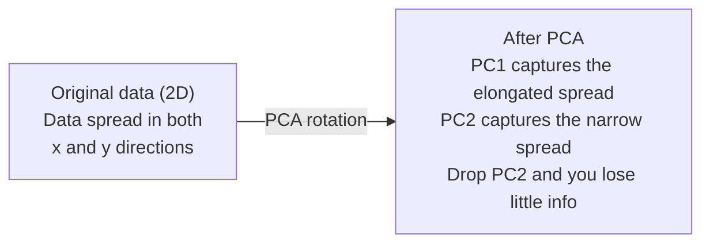

# Reducción de la dimensionalidad

> Alta dimensión de datos tiene estructura.

**Type:** Build
**Language:**Python
**Prerequisites:** Phase 1, Lessons 01（Linear Algebra Intuition）、02（Vectors, Matrices & Operations）、03（Eigenvalues & Eigenvectors）、06（Probability & Distributions）
**Time:** ~90 分钟

## Objetivos de aprendizaje

- Desde la implementación de PCA: centro de datos, calcular matriz de covarianza, componer y llevar a cabo proyectos
- Uso explicado de la relación de variación y método de codo  seleccionar componentes principales de la cantidad
- Comparar los efectos de PCA, t-SNE y UMAP en 2D en el interior de las cifras MNIST, y explicar su peso
- Utiliza带 RBF kernel del kernel PCA Se separa de estándar PCA  imposible de procesar estructuras de datos no lineales

## El problema

Tienes un conjunto de datos de 784 características en cada muestra. Tal vez sea un conjunto de valores de píxeles digitales escritos a mano. Tal vez sea un nivel de expresión génica. Tal vez sea un nivel de comportamiento del usuario.

Pero la mayoría de estas 784 características son redundantes. La verdadera información existe en una superficie mucho más pequeña. La "7" escrita por una mano no necesita 784 números independientes para describirla.

La reducción de dimensión encontrará una superficie más pequeña. Se comprime a sus datos 784 dimensiones a 2 10 o 50 dimensiones, mientras se conserva la estructura importante.

## El concepto

### La maldición de la dimensionalidad

El espacio alto no está en línea con la idea.

**距离变得没有意义。**En el alto, cualquier distancia entre dos puntos arbitrarios recibirá el mismo valor. Si cada punto a cada otro punto de distancia es diferente, la búsqueda del vecino más cercano se perderá.

```
Dimension    Avg distance ratio (max/min between random points)
2            ~5.0
10           ~1.8
100          ~1.2
1000         ~1.02
```

**体积集中在角落。**D 维 Unit Hypercube tiene 2 个角. En 100 维中, casi todo el volumen está en la esquina, lejos del centro.

**你需要指数级更多的数据。**Para mantener la misma densidad de muestras en un espacio, de 2D a 20D significa que necesitas 10 a 18 veces más datos. Nunca tendrás suficientes datos.

### PCA: encontrar las direcciones que importan

El análisis de componentes principales (PCA) encontrará el mayor cambio de datos en el eje.

算法:

```
1. Center the data        (subtract the mean from each feature)
2. Compute covariance     (how features move together)
3. Eigendecomposition     (find the principal directions)
4. Sort by eigenvalue     (biggest variance first)
5. Project               (keep top k eigenvectors, drop the rest)
```

¿Por qué usar la propia composición?La matriz de covarianza es simétrica y semi-definida positiva. Sus propios vectores son direcciones ortogonales en el espacio de características. Los valores de la propiedad le dicen en cada dirección cuánta variación ha capturado.



- **Before PCA:**Nube de datos  along x y y 两个 axes presentando contra la línea de la escala
- **After PCA:**坐标系 se giran, haciendo que PC1 a la derecha de la dirección de la variación máxima de la misma (extendido de la diferencia), PC2 a la derecha de la derecha de la diferencia mínima de la diferencia)
- **Dimensionality reduction:** Perder PC2 pondrá los datos proyectados en PC1 en la cima, sólo perder muy poca información

### Ratio de variación explicado

Cada componente principal captura una parte de la variación total.

```
Component    Eigenvalue    Explained ratio    Cumulative
PC1          4.73          0.473              0.473
PC2          2.51          0.251              0.724
PC3          1.12          0.112              0.836
PC4          0.89          0.089              0.925
...
```

Cuando la variación explicada acumulativa alcanza 0,95 时, ya sabes que estos componentes capturan el 95% de la información.

### Elegir el número de componentes

Tres estrategias:

1. **Threshold.**Mantenga suficientes componentes, para explicar la variación del 90-95%.
2. **Elbow method.** trazar una variación explicada de cada componente― buscar puntos de rápida bajada­­­­­­­­­­­­­­­­­­­­­­­­­­­­­­­­­­­­­­­­­­­­­­­­­­­­­­­­­­­­­­­­­­­­­­­­­­­­­­­­­­­­­­­­­­­­­­­­­­­­­­­­­­­­­­­­­­­­­­­­­­­­­­­­­­­­­­­­­­­­­­­­­­­­­­­­­­­­­­­­­­­­­­­­­­­­­­­­­­­­­­­­­­­­­­­­­­­­­­­­­­­­­­­­­­­­­­­­­­­­­­­­­­­­­­­­­­­­­­­­­­­­­­­­­­­­­­­­­­­­­­­­­­­­­­­­­­­­­­­­­­­­­­­­­­­­­­­­­­­­­­­­­­­­­­­­­­­­­­­­­­­­­­­­­­­­­­­­­­­­­­­­­­­­­­­­­­­­­­­­­­­­­­­­­­­­­­­­­­­­­­­­­­­­­­­­­­­­­­­­­­­­­­­­­­­­­­­­­­­­­­­­­­­­­­­­­­­­­­­­­­­­­­­­­­­­­­­­­­­­­­­­­­­­­­­­­­­­­­­­­­­­­­­­­­­
3. **Downstream performance.**La precisión del modelo de análisis y medición de datos de PCA será la mejor precisión en la posición del tiempo de la plataforma.

### T-SNE: preservar los barrios

t-Distribuido Stochastic Neighbor Embedding (t-SNE) es un diseño visual.

直觉是: en el espacio primitivo, en función de la distancia entre los puntos, se calcula una distribución de probabilidad. En el punto cercano se obtiene una probabilidad alta. En el punto distante se obtiene una probabilidad baja.

La clave de la T-SNE:
- No lineal. Puede desarrollar múltiples complejos de PCA que no pueden ser procesados.
- Estocástica. Diferentes operaciones producen diferentes diseños.
- Perplejidad 参数控制考虑多少邻居 (títpico rango: 5-50)
- 输出中集群  距离无意义―― sólo los grupos tienen significado propio―
- En grandes conjuntos de datos 上很慢──默认是O(n^2)──

### UMAP: una estructura global más rápida y mejor

El método de trabajo de la aproximación y proyección de manifiesto uniforme (UMAP) es similar al t-SNE, pero tiene dos ventajas:
- Más rápido. Utiliza gráficos aproximados de vecino más cercano, en lugar de calcular todas las distancias en par.
- Mejor estructura global―en el caso de los grupos de salida y salida, su posición relativa es más significativa­mente superior a la de los clusters de salida y salida.

UMAP en el espacio alto construye un gráfico ponderado, luego busca un diseño de nivel bajo, manteniendo este gráfico lo más posible.

关键参数:
- `n_neighbors`En el caso de los países de la Unión Europea, el número de vecinos definido en la estructura local es similar a la confusión.
- `min_dist`: los puntos de salida se agrupan más estrechamente. Los valores más bajos producen grupos más densos.

### Cuándo utilizar cuál

| Method | Use case | Preserves | Speed |
|--------|----------|-----------|-------|
| PCA | Preprocessing before training | Global variance | Fast (exact), works on millions of samples |
| PCA | Quick exploratory visualization | Linear structure | Fast |
| t-SNE | Publication-quality 2D plots | Local neighborhoods | Slow (< 10k samples ideal) |
| UMAP | 2D visualization at scale | Local + some global structure | Medium (handles millions) |
| PCA | Feature reduction for models | Variance-ranked features | Fast |
| t-SNE / UMAP | Understanding cluster structure | Cluster separation | Medium to slow |

經驗法则: con PCA hacer preprocesamiento y compresión de datos. Cuando necesites una estructura de 2D en el medio, utiliza t-SNE o UMAP.

### PCA del núcleo

标准PCA encontrará subespacios lineales― rotará tu坐标系并丢弃轴― pero si el dato se encuentra en un variante no lineal 上怎么办?

El núcleo PCA se aplica en el espacio de características de alto nivel inducido por la función del núcleo, sin calcular claramente los encabezados en ese espacio.

算法:
1. 计算 matriz del núcleo K, de la cual K_ij = k(x_i, x_j)
2. En el espacio de características en el centro de la matriz del núcleo
3. Para la matriz del núcleo centrado hacer su propiocompuesto
4. 顶部 eigenvectors(按1/sqrt(eigenvalue) 缩放) es las proyecciones

常见 funciones del núcleo:

| Kernel | Formula | Good for |
|--------|---------|----------|
| RBF (Gaussian) | exp(-gamma * \|\|x - y\|\|^2) | 大多数 nonlinear data、smooth manifolds |
| Polynomial | (x . y + c)^d | Polynomial relationships |
| Sigmoid | tanh(alpha * x . y + c) | Neural network-like mappings |

¿Cuándo usar PCA del núcleo y no PCA estándar:

| Criterion | Standard PCA | Kernel PCA |
|-----------|-------------|------------|
| Data structure | Linear subspace | Nonlinear manifold |
| Speed | O(min(n^2 d, d^2 n)) | O(n^2 d + n^3) |
| Interpretability | Components are linear combinations of features | Components lack direct feature interpretation |
| Scalability | Works on millions of samples | Kernel matrix is n x n, memory-limited |
| Reconstruction | Direct inverse transform | Requires pre-image approximation |

经典例:2D:Círculos concéntricos en el seno de dos círculos. Dos círculos, un círculo dentro de otro círculo.

### Erro de reconstrucción

¿Qué te ha pasado en la reducción de dimensiones? ¿Has reducido el 784 a 50 dimensiones? ¿Qué has perdido?

测量 error de reconstrucción:
1. 将数据投影到k 维:X_reduced = X @ W_k
2. 重建: X_hat = X_reducido @ W_k^T
3. 计算 MSE:medio((X - X_hat) ^2)

En el caso de la PCA, el error de reconstrucción y la variación explicada tienen una relación clara:

```
Reconstruction error = sum of eigenvalues NOT included
Total variance = sum of ALL eigenvalues
Fraction lost = (sum of dropped eigenvalues) / (sum of all eigenvalues)
```

Cada componente de la relación de variación explicada es:

```
explained_ratio_k = eigenvalue_k / sum(all eigenvalues)
```

Si se explica la variación acumulada de los componentes, se obtiene una curva de "elbo"―.
- 曲线变平的位置(收益递减)
- La variación acumulada  transversal de tu umbral de posición(generalmente es de 0,90 o 0,95)
- Desempeño de tareas en el flujo subyacente 进入平台期的位置

El error de reconstrucción no solo se utiliza para seleccionar k. Se puede utilizar para detectar anomalías: el error de reconstrucción de alta muestra es de valores fuera de línea, que no corresponden al subspacio aprendido.


```figure
pca-axes
```

## Construye el mismo

### Paso 1: PCA desde cero

```python
import numpy as np

class PCA:
    def __init__(self, n_components):
        self.n_components = n_components
        self.components = None
        self.mean = None
        self.eigenvalues = None
        self.explained_variance_ratio_ = None

    def fit(self, X):
        self.mean = np.mean(X, axis=0)
        X_centered = X - self.mean

        cov_matrix = np.cov(X_centered, rowvar=False)

        eigenvalues, eigenvectors = np.linalg.eigh(cov_matrix)

        sorted_idx = np.argsort(eigenvalues)[::-1]
        eigenvalues = eigenvalues[sorted_idx]
        eigenvectors = eigenvectors[:, sorted_idx]

        self.components = eigenvectors[:, :self.n_components].T
        self.eigenvalues = eigenvalues[:self.n_components]
        total_var = np.sum(eigenvalues)
        self.explained_variance_ratio_ = self.eigenvalues / total_var

        return self

    def transform(self, X):
        X_centered = X - self.mean
        return X_centered @ self.components.T

    def fit_transform(self, X):
        self.fit(X)
        return self.transform(X)
```

### Paso 2: Prueba de datos sintéticos

```python
np.random.seed(42)
n_samples = 500

t = np.random.uniform(0, 2 * np.pi, n_samples)
x1 = 3 * np.cos(t) + np.random.normal(0, 0.2, n_samples)
x2 = 3 * np.sin(t) + np.random.normal(0, 0.2, n_samples)
x3 = 0.5 * x1 + 0.3 * x2 + np.random.normal(0, 0.1, n_samples)

X_synthetic = np.column_stack([x1, x2, x3])

pca = PCA(n_components=2)
X_reduced = pca.fit_transform(X_synthetic)

print(f"Original shape: {X_synthetic.shape}")
print(f"Reduced shape:  {X_reduced.shape}")
print(f"Explained variance ratios: {pca.explained_variance_ratio_}")
print(f"Total variance captured: {sum(pca.explained_variance_ratio_):.4f}")
```

### Paso 3: Los dígitos MNIST en 2D

```python
from sklearn.datasets import fetch_openml

mnist = fetch_openml("mnist_784", version=1, as_frame=False, parser="auto")
X_mnist = mnist.data[:5000].astype(float)
y_mnist = mnist.target[:5000].astype(int)

pca_mnist = PCA(n_components=50)
X_pca50 = pca_mnist.fit_transform(X_mnist)
print(f"50 components capture {sum(pca_mnist.explained_variance_ratio_):.2%} of variance")

pca_2d = PCA(n_components=2)
X_pca2d = pca_2d.fit_transform(X_mnist)
print(f"2 components capture {sum(pca_2d.explained_variance_ratio_):.2%} of variance")
```

### Paso 4: Compare con sklearn

```python
from sklearn.decomposition import PCA as SklearnPCA
from sklearn.manifold import TSNE

sklearn_pca = SklearnPCA(n_components=2)
X_sklearn_pca = sklearn_pca.fit_transform(X_mnist)

print(f"\nOur PCA explained variance:     {pca_2d.explained_variance_ratio_}")
print(f"Sklearn PCA explained variance: {sklearn_pca.explained_variance_ratio_}")

diff = np.abs(np.abs(X_pca2d) - np.abs(X_sklearn_pca))
print(f"Max absolute difference: {diff.max():.10f}")

tsne = TSNE(n_components=2, perplexity=30, random_state=42)
X_tsne = tsne.fit_transform(X_mnist)
print(f"\nt-SNE output shape: {X_tsne.shape}")
```

### Paso 5: Comparación de UMAP

```python
try:
    from umap import UMAP

    reducer = UMAP(n_components=2, n_neighbors=15, min_dist=0.1, random_state=42)
    X_umap = reducer.fit_transform(X_mnist)
    print(f"UMAP output shape: {X_umap.shape}")
except ImportError:
    print("Install umap-learn: pip install umap-learn")
```

## Usalo

Para poner PCA Usó como clasificador  Previo procesamiento:

```python
from sklearn.decomposition import PCA as SklearnPCA
from sklearn.linear_model import LogisticRegression
from sklearn.model_selection import train_test_split
from sklearn.metrics import accuracy_score

X_train, X_test, y_train, y_test = train_test_split(
    X_mnist, y_mnist, test_size=0.2, random_state=42
)

results = {}
for k in [10, 30, 50, 100, 200]:
    pca_k = SklearnPCA(n_components=k)
    X_tr = pca_k.fit_transform(X_train)
    X_te = pca_k.transform(X_test)

    clf = LogisticRegression(max_iter=1000, random_state=42)
    clf.fit(X_tr, y_train)
    acc = accuracy_score(y_test, clf.predict(X_te))
    var_captured = sum(pca_k.explained_variance_ratio_)
    results[k] = (acc, var_captured)
    print(f"k={k:>3d}  accuracy={acc:.4f}  variance={var_captured:.4f}")
```

El rendimiento será muy pequeño en el tiempo de entrada en la plataforma.

## Envío

Encuentro de trabajo:
- `outputs/skill-dimensionality-reduction.md`- una habilidad técnica para seleccionar una tarea determinada adecuada reducción de dimensiones

## Los ejercicios

1. 修改 PCA class 以支持                                                                                                                                                                                                                                                                                                                                                                                                                                                                                                                      `inverse_transform`△ Usar 10、50 和 200 componentes para volver a construir los dígitos MNIST―分别打印重建错误(en comparación con la diferencia media al cuadrado de los datos originales) 

2. En el mismo subconjunto MNIST 上运行 t-SNE,perplexity 值分别为 5、30 和 100─describir cómo cambia la salida―¿Por qué la perplejidad afectará la tensión del grupo?

3. Tenga un conjunto de datos con 50 características  pero sólo 5 características informativas `sklearn.datasets.make_classification`生成) ・ aplicar PCA,并检查 explicó que la curva de variación si no correctamente identifica los datos en realidad es de 5 dimensiones。

## Términos clave

| Term | What people say | What it actually means |
|------|----------------|----------------------|
| Curse of dimensionality | "Too many features" | 随着维度增长，距离、体积和数据密度都会表现得反直觉。Models 需要指数级更多的数据来补偿。 |
| PCA | "Reduce dimensions" | 旋转你的坐标系，使各轴与 maximum variance 的方向对齐，然后丢弃 low-variance axes。 |
| Principal component | "An important direction" | Covariance matrix 的一个 eigenvector。Feature space 中数据变化最大的方向。 |
| Explained variance ratio | "How much info this component has" | 一个 principal component 捕获的 total variance 比例。对前 k 个 ratios 求和，就能看到 k 个 components 保留了多少信息。 |
| Covariance matrix | "How features correlate" | 一个 symmetric matrix，其中 entry (i,j) 衡量 feature i 和 feature j 如何共同变化。Diagonal entries 是各自的 variances。 |
| t-SNE | "That cluster plot" | 一种 nonlinear 方法，通过保留 pairwise neighborhood probabilities 将高维数据映射到 2D。适合可视化，不适合 preprocessing。 |
| UMAP | "Faster t-SNE" | 一种基于 topological data analysis 的 nonlinear 方法。既保留 local structure，也保留部分 global structure。比 t-SNE 更容易扩展。 |
| Perplexity | "A t-SNE knob" | 控制每个点考虑的有效邻居数量。低 perplexity 聚焦非常 local 的结构。高 perplexity 捕获更宽泛的模式。 |
| Manifold | "The surface the data lives on" | Embedding在更高维空间中的低维表面。一张在 3D 中揉皱的纸是一个 2D manifold。 |

## Leer más

- [A Tutorial on Principal Component Analysis](https://arxiv.org/abs/1404.1100)(Shlens) - Desde零开始清晰推导 PCA
- [How to Use t-SNE Effectively](https://distill.pub/2016/misread-tsne/)(Wattenberg et al.) -                                                                                                                                                                                                                                                                                                                                                                                                                                                                                                                      
- [UMAP documentation](https://umap-learn.readthedocs.io/)- Orientación teórica y práctica de los autores de UMAP
