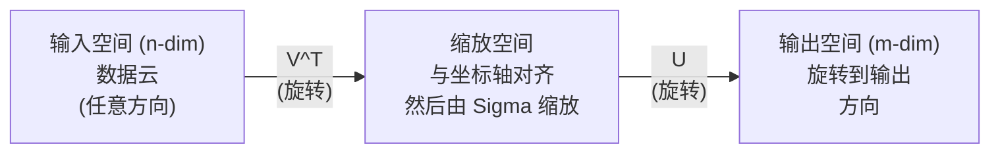
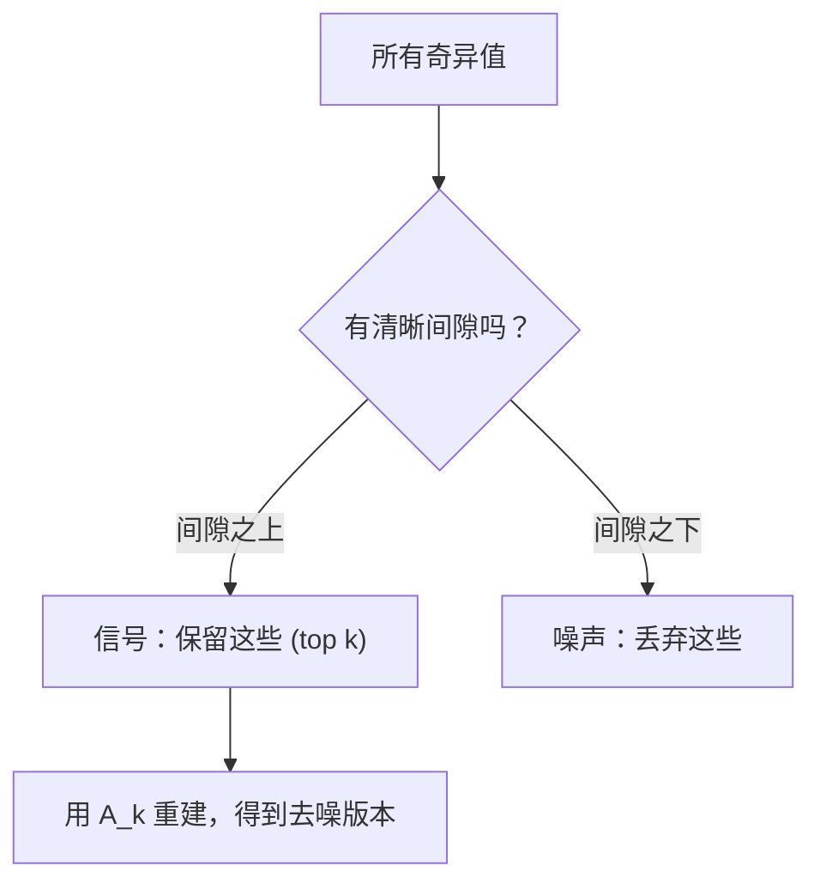

# Descomposición de valores singulares

> El SVD es el ejército de la línea de los números. Cada matriz tiene SVD.

**Type:** Build
**Languages:** Python, Julia
**Prerequisites:** Phase 1，Lessons 01 (Linear Algebra Intuition)、02 (Vectors & Matrices Operations)、03 (Matrix Transformations)
**Time:** ~120 minutes

## El objetivo del aprendizaje
- 通过功率实现 SVD,并解释 U、Sigma 和 V^T 的几何含义
-  aplicación de SVD truncado  realizar compresión de imágenes,并 medir la relación entre la tasa de compresión y el error de reconstrucción
- A través de SVD  calcular Moore-Penrose pseudoinverso, en busca de resolver super-determinado cuadrados mínimos  sistema
- Para el análisis de la LPN, el análisis de la LPN se debe a la LPN.

##  problemas
Usted tiene una matriz de 1000x2000. Puede ser un usuario-filme. Puede ser un archivo. También puede ser un valor de imagen. Necesitas comprimirla, descubriendo la estructura oculta de la imagen, o usarla para resolver un sistema de cuadrados mínimos.

SVD  se aplica a cualquier Matriz―¿¿¿¿¿¿¿¿¿¿¿¿¿¿¿¿¿¿¿¿¿¿¿¿¿¿¿¿¿¿¿¿¿¿¿¿¿¿¿¿¿¿¿¿¿¿¿¿¿¿¿¿¿¿¿¿¿¿¿¿¿¿¿¿¿¿¿¿¿¿¿¿¿¿¿¿¿¿¿¿¿¿¿¿¿¿¿¿¿¿¿¿¿¿¿¿¿¿¿¿¿¿¿¿¿¿¿¿¿¿¿¿¿¿¿¿¿¿¿¿¿¿¿¿¿¿¿¿¿¿¿¿¿¿¿¿¿¿¿¿¿¿¿¿¿¿¿¿¿¿¿¿¿¿¿¿¿¿¿¿¿¿¿¿¿¿¿¿¿¿¿¿¿¿¿¿¿¿¿¿¿¿¿¿¿¿¿¿¿¿¿¿¿¿¿¿¿¿¿¿¿¿¿¿¿¿¿¿¿¿¿¿¿¿¿¿¿¿¿¿¿¿¿¿¿¿¿¿¿¿¿¿¿¿¿¿¿¿¿¿¿¿¿¿¿¿¿¿¿¿¿¿¿¿¿¿¿¿¿¿¿¿¿¿¿¿¿¿¿¿¿¿¿¿¿¿¿¿¿¿¿¿¿¿¿¿¿¿¿¿¿¿¿¿¿¿¿¿¿¿¿¿¿¿¿¿¿¿¿¿¿¿¿¿¿¿¿¿¿¿¿¿¿¿¿¿¿¿¿¿¿¿¿¿¿¿¿¿¿¿¿¿¿¿¿¿¿¿¿¿¿¿¿¿¿¿¿¿¿¿¿¿¿¿¿¿¿¿¿¿¿¿¿¿¿¿¿¿¿¿¿¿¿¿¿¿¿¿¿¿¿¿¿¿¿¿¿¿¿¿¿¿¿¿¿¿¿¿¿¿¿¿¿¿¿¿¿¿¿¿¿¿¿¿¿¿¿¿¿¿¿¿¿¿¿¿¿¿¿¿¿¿¿¿¿¿¿¿¿¿¿¿¿¿¿¿¿¿¿¿¿¿¿¿¿¿¿¿¿¿¿¿¿¿¿¿¿¿¿¿¿¿¿¿¿¿¿¿¿¿¿¿¿¿¿¿¿¿¿¿

## 概念
### SVD en que hacer

Cada matriz, sin importar su forma, ejecutará tres operaciones en orden: rotación, acrecentamiento, rotación.

```
A = U * Sigma * V^T

      m x n     m x m    m x n    n x n
     (任意)    (旋转)   (缩放)   (旋转)
```

给定任意 Matrix A,SVD se dividirá en:
- V^T 旋转输入空间 (n 维) Vector en el espacio
- Sigma  en cada eje se realiza la aceleración 拉伸或压缩)
- El resultado se convertirá en espacio de salida



Así se entiende. Usted entrega una Matriz a SVD. Te dice:  Esta Matriz primero utiliza V^T  rotación en el cuerpo, luego utiliza Sigma para extenderse en la bola, y finalmente utiliza U  rotación en esta bola.  Un valor extraño es la longitud de cada eje de la bola.

### La completa descomposición

对于形为 m x n 的矩阵 A:

```
A = U * Sigma * V^T

其中：
  U     是 m x m，正交 (U^T U = I)
  Sigma 是 m x n，对角（奇异值位于对角线上）
  V     是 n x n，正交 (V^T V = I)

奇异值 sigma_1 >= sigma_2 >= ... >= sigma_r > 0
其中 r = rank(A)
```

U de la línea se llama V de la línea se llama V de la línea derecha de la línea de la línea de la línea de la línea de la línea de sigma se llama V de la línea de la línea de la línea de la línea de la línea de la línea de sigma.

### Véctores singulares izquierdistas, valores singulares, vectores singulares derechos

Cada componente de la SVD tiene diferentes significados geográficos.

**Right singular vectors（V 的列）：**它们 for input space (R^n) constituyen un conjunto de bases ortónormas. Son direcciones en el espacio de entrada, la matriz los traerá a la dirección correcta en el espacio de salida.

**Singular values（Sigma 的对角线）：**它们 son factores reducidos.                                                                                                                                                                                                                                                            

**Left singular vectors（U 的列）：**它们为输出空间(R^m) constituyen un conjunto de bases ortónmicas.

 Relaciones entre ellas:

```
A * v_i = sigma_i * u_i

Matrix A 接收第 i 个右奇异Vector v_i，
用 sigma_i 对其缩放，并将其映射到第 i 个左奇异Vector u_i。
```

Esto da una imagen de lo que la Matrix hace por cada satélite.

### Forma de producto exterior

SVD puede ser escrito en la matriz de rango-1 y:

```
A = sigma_1 * u_1 * v_1^T + sigma_2 * u_2 * v_2^T + ... + sigma_r * u_r * v_r^T

每一项 sigma_i * u_i * v_i^T 都是一个 rank-1 Matrix（一个 outer product）。
完整 Matrix 是 r 个这类 Matrix 的和，其中 r 是 rank。
```

Esta forma es la base de la aproximación de rango bajo. Cada uno de ellos añade una estructura de una capa. El primero capta un modelo más importante. El segundo capta un modelo más importante. De acuerdo con este tipo de sugerencias, la intersección de este tipo de datos puede ser obtenida en cualquier rango determinado.

```
Rank-1 approx:    A_1 = sigma_1 * u_1 * v_1^T
                  (捕获主导模式)

Rank-2 approx:    A_2 = sigma_1 * u_1 * v_1^T + sigma_2 * u_2 * v_2^T
                  (捕获两个最重要的模式)

Rank-k approx:    A_k = top k 项之和
                  (根据 Eckart-Young theorem，这是最优的)
```

### Relación con la propia composición

SVD y su propia composición tienen un profundo vínculo. Un valor extraño y un vector extraño provienen directamente de los valores propios de A^T A y A^T con los vectores propios.

```
A^T A = V * Sigma^T * U^T * U * Sigma * V^T
      = V * Sigma^T * Sigma * V^T
      = V * D * V^T

其中 D = Sigma^T * Sigma 是一个对角 Matrix，其对角线上为 sigma_i^2。

因此：
- 右奇异Vector (V) 是 A^T A 的 eigenvectors
- 奇异值的平方 (sigma_i^2) 是 A^T A 的 eigenvalues

类似地：
A A^T = U * Sigma * V^T * V * Sigma^T * U^T
      = U * Sigma * Sigma^T * U^T

因此：
- 左奇异Vector (U) 是 A A^T 的 eigenvectors
- A A^T 的 eigenvalues 也都是 sigma_i^2
```

Este contacto te dice tres cosas:
1. 奇异值总是实数且非负 (¿¿¿¿¿¿¿¿¿¿¿¿¿¿¿¿¿¿¿¿¿¿¿¿¿¿¿¿¿¿¿¿¿¿¿¿¿¿¿¿¿¿¿¿¿¿¿¿¿¿¿¿¿¿¿¿¿¿¿¿¿¿¿¿¿¿¿¿¿¿¿¿¿¿¿¿¿¿¿¿¿¿¿¿¿¿¿¿¿¿¿¿¿¿¿¿¿¿¿¿¿¿¿¿¿¿¿¿¿¿¿¿¿¿¿¿¿¿¿¿¿¿¿¿¿¿¿¿¿¿¿¿¿¿¿¿¿¿¿¿¿¿¿¿¿¿¿¿¿¿¿¿¿¿¿¿¿¿¿¿¿¿¿¿¿¿¿¿¿¿¿¿¿¿¿¿¿¿¿¿¿¿¿¿¿¿¿¿¿¿¿¿¿¿¿¿¿¿¿¿¿¿¿¿¿¿¿¿¿¿¿¿¿¿¿¿¿¿¿¿¿¿¿¿¿¿¿¿¿¿¿¿¿¿¿¿¿¿¿¿¿¿¿¿¿¿¿¿¿¿¿¿¿¿¿¿¿¿¿¿¿¿¿¿¿¿¿¿¿¿¿¿¿¿¿¿¿¿¿¿¿¿¿¿¿¿¿¿¿¿¿¿¿¿¿¿¿¿¿¿¿¿¿¿¿¿¿¿¿¿¿¿¿¿¿¿¿¿¿¿¿¿¿¿¿¿¿¿¿¿¿¿¿¿¿¿¿¿¿¿¿¿¿¿¿¿¿¿¿¿¿¿¿¿¿¿¿¿¿¿¿¿¿¿¿¿¿¿¿¿¿¿¿¿¿¿¿¿¿¿¿¿¿¿¿¿¿¿¿¿¿¿¿¿¿¿¿¿¿¿¿¿¿¿¿¿¿¿¿¿¿¿¿¿¿¿¿¿¿¿¿¿¿¿¿¿¿¿¿¿¿¿¿¿¿¿¿¿¿¿¿¿¿¿¿¿¿¿¿¿¿¿¿¿¿¿¿¿¿¿¿¿¿¿¿¿¿¿¿¿¿¿¿¿¿¿¿¿¿¿¿¿¿¿¿¿¿¿¿¿¿¿¿¿¿¿¿¿
2. Puede hacer su propia composición a través de A^T A para calcular SVD, pero este número de condición cuadrada no perderá la precisión numérica.
3. Cuando A es una forma y tiene un semidefinido positivo simétrico, SVD y su propia composición son lo mismo.

### VVD truncado: aproximación de bajo rango

El teorema de Eckart-Young-Mirsky  indica que A de mejor rango-k近似 (en la norma de Frobenius y la norma espectral abajo) puede sólo conservar el valor superior de k 个奇异及其对应向量 得到:

```
A_k = U_k * Sigma_k * V_k^T

其中：
  U_k     是 m x k  (U 的前 k 列)
  Sigma_k 是 k x k  (Sigma 的左上 k x k 块)
  V_k     是 n x k  (V 的前 k 列)

近似误差 = sigma_{k+1}  (在 spectral norm 下)
         = sqrt(sigma_{k+1}^2 + ... + sigma_r^2)  (在 Frobenius norm 下)
```

Esto no es sólo un buen acercamiento. Es el mejor rango de cercanías. No hay otra matriz de rango que pueda acercarse más a A.

| Component | Relative magnitude | Kept in rank-3 approx? |
|-----------|-------------------|------------------------|
| sigma_1 | 最大 | 是 |
| sigma_2 | 大 | 是 |
| sigma_3 | 中等偏大 | 是 |
| sigma_4 | 中等 | 否（误差） |
| sigma_5 | 中等偏小 | 否（误差） |
| sigma_6 | 小 | 否（误差） |
| sigma_7 | 很小 | 否（误差） |
| sigma_8 | 极小 | 否（误差） |

保留 top 3:A_3 捕获三个最大奇异值──误差 = 剩值(sigma_4 到 sigma_8)。

Si el declive es lento, esta matriz no tiene una estructura baja.

### Utiliza SVD  para realizar compresión de imágenes

灰度图像是像素强度组成的矩阵――一张800x600 图像有480,000 个值――SVD 让你用更少的值来接近它――

```
原始图像：800 x 600 = 480,000 个值

rank k 的 SVD：
  U_k:      800 x k 个值
  Sigma_k:  k 个值
  V_k:      600 x k 个值
  总计:     k * (800 + 600 + 1) = k * 1401 个值

  k=10:   14,010 个值   (原始的 2.9%)
  k=50:   70,050 个值  (原始的 14.6%)
  k=100: 140,100 个值  (原始的 29.2%)

  k 越小，压缩率越好，
  但视觉质量会下降。
```

关键洞察: los extraños de las imágenes naturales se desvanecen rápidamente. Las primeras extrañas capturan grandes estructuras de forma y progreso.

### SVD utiliza el sistema de

Netflix Prize 让这个点广为人知──你有一个用户电影评分矩阵, la mayoría de los artículos son de falta──

```
             Movie1  Movie2  Movie3  Movie4  Movie5
  User1      [  5      ?       3       ?       1  ]
  User2      [  ?      4       ?       2       ?  ]
  User3      [  3      ?       5       ?       ?  ]
  User4      [  ?      ?       ?       4       3  ]

  ? = 未知评分
```

核心思想:这个评分 矩阵 具有低级别──用户的品味不是完全独立──有几个隐藏因素──动作vs剧情、旧vs新、理性vs感官)能够解释大多数偏好──

Para la matriz de SVD, se desglosará en:
- U:espacio de factor latente 中的用户配置
- Sigma: la importancia de cada factor latente
- V^T: espacio de factor latente 中的电影资料

El perfil de usuario se compara con el producto de punto del perfil de película.

En la práctica, usará SVD o ALS incremental de Simon Funk (alternando los cuadrados mínimos) para tratar directamente los cambios de datos que faltan, pero la idea central es la misma: a través de SVD hacer la descomposición de factores latentes.

### El análisis semántico latente de la PNL

El análisis semántico latente (LSA), también llamado índice semántico latente (LSI), se utilizará en SVD para el término-documento Matrix。

```
             Doc1   Doc2   Doc3   Doc4
  "cat"      [  3      0      1      0  ]
  "dog"      [  2      0      0      1  ]
  "fish"     [  0      4      1      0  ]
  "pet"      [  1      1      1      1  ]
  "ocean"    [  0      3      0      0  ]

rank k=2 的 SVD 之后：

  每个文档变成 2D “概念空间”中的一个点。
  每个词项变成同一个 2D 空间中的一个点。
  主题相似的文档会聚在一起。
  含义相似的词项会聚在一起。

  "cat" 和 "dog" 最终会靠近彼此（陆地宠物）。
  "fish" 和 "ocean" 最终会靠近彼此（水相关概念）。
  如果 Doc1 和 Doc3 共享相似主题，它们会聚在一起。
```

LSA es uno de los primeros métodos de éxito para capturar la semanalogía de palabras en el texto original. Por lo tanto, es eficaz porque las semanalogías suelen aparecer en documentos similares, por lo que SVD las clasificará en las mismas dimensiones latentes.

### SVD para la reducción del ruido

Los datos de ruido generalmente se centran en los valores más altos, mientras que el ruido se distribuye en todos los valores más altos.

**干净信号的奇异值：**

| Component | Magnitude | Type |
|-----------|-----------|------|
| sigma_1 | 非常大 | 信号 |
| sigma_2 | 大 | 信号 |
| sigma_3 | 中等 | 信号 |
| sigma_4 | 接近零 | 可忽略 |
| sigma_5 | 接近零 | 可忽略 |

**有噪声信号的奇异值（噪声会加到所有分量上）：**

| Component | Magnitude | Type |
|-----------|-----------|------|
| sigma_1 | 非常大 | 信号 |
| sigma_2 | 大 | 信号 |
| sigma_3 | 中等 | 信号 |
| sigma_4 | 小 | 噪声 |
| sigma_5 | 小 | 噪声 |
| sigma_6 | 小 | 噪声 |
| sigma_7 | 小 | 噪声 |



Esto se utiliza para el procesamiento de señales, medición científica y limpieza de datos. En cualquier momento, siempre y cuando su matriz esté contaminada por el ruido, el SVD truncado es un método de separación de ruido de la confianza.

### Pseudoinversión a través de SVD

Moore-Penrose pseudoinverso A+ va a invertir la matriz                                                                                                                                                                                                                                                                                                                                                                                                                                                                                                             

```
如果 A = U * Sigma * V^T，那么：

A+ = V * Sigma+ * U^T

其中 Sigma+ 的构造方式为：
  1. 转置 Sigma（交换行和列）
  2. 将每个非零对角元素 sigma_i 替换为 1/sigma_i
  3. 零保持为零

对于 A (m x n)：      A+ 是 (n x m)
对于 Sigma (m x n)：  Sigma+ 是 (n x m)
```

pseudoinverso se puede pedir los cuadrados mínimos 问题──如果Ax = b 没有精确解(超定系统), entonces x = A+b 就是最小的平方 解(最小化的Ax - b 时时时) ‖

```
超定系统（方程数多于未知数）：

  [1  1]         [3]
  [2  1] x   =   [5]       不存在精确解。
  [3  1]         [6]

  x_ls = A+ b = V * Sigma+ * U^T * b

  这给出了使残差平方和最小的 x。
  结果与 normal equations (A^T A)^(-1) A^T b 相同，
  但数值上更稳定。
```

### Estabilidad numérica 优势

计算 A^T A's eigenendecomposition 会平方奇异值(A^T A's eigenvalues are sigma_i^2)。

```
示例：
  A 的奇异值为 [1000, 1, 0.001]
  A 的 condition number：1000 / 0.001 = 10^6

  A^T A 的 eigenvalues 为 [10^6, 1, 10^{-6}]
  A^T A 的 condition number：10^6 / 10^{-6} = 10^{12}

  直接计算 SVD：使用 condition number 10^6
  通过 A^T A 计算：使用 condition number 10^{12}
                   （额外损失 6 位精度）
```

现代 SVD 算法(Golub-Kahan bi-diagonalización) directamente en A 上工作,从不构建 A^T A── ése es el motivo por el que siempre debes priorizar el uso `np.linalg.svd(A)`, en lugar de`np.linalg.eig(A.T @ A)`¿Qué es eso?

### Conexión a PCA

PCA es el SVD para hacer datos centralizados. Esto no es un tipo de cálculo.

```
给定数据 Matrix X (n_samples x n_features)，已中心化（减去均值）：

Covariance Matrix: C = (1/(n-1)) * X^T X

PCA 寻找 C 的 eigenvectors。但：

  X = U * Sigma * V^T    (X 的 SVD)

  X^T X = V * Sigma^2 * V^T

  C = (1/(n-1)) * V * Sigma^2 * V^T

所以 principal components 恰好就是右奇异Vector V。
每个 component 的 explained variance 是 sigma_i^2 / (n-1)。

在 sklearn 中，PCA 使用 SVD 实现，而不是 eigendecomposition。
它更快，数值上也更稳定。
```

Esto significa que en la Lección 10 de la Lección 10 de la Lección 10 de la Lección 10 de la Lección 10 de la Lección 10 de la Lección 10 de la Lección 10 de la Lección 10 de la Lección 10 de la Lección 10 de la Lección 10 de la Lección 10 de la Lección 10 de la Lección 10 de la Lección 10 de la Lección 10 de la Lección 10 de la Lección 10 de la Lección 10 de la Lección 10 de la Lección 10 de la Lección 10 de la Lección 10 de la Lección 10 de la Lección 10 de la Lección 10 de la Lección 10 de la Lección 10 de la Lección 10 de la Lección 10 de la Lección 10 de la Lección 10 de Lección 10 de Lección 10 de Lección 10 de Lección 10 de Lección 10 de Lección 10 de Lección 10 de Lección 10 de Lección 10 de Lección 10 de Lección 10 de Lección 10 de Lección 10 de Lección 10 de Lección 10 de Lección 10 de Lección 10 de Lección 10 de Lección de Lección 10 de Lección de Lección de Lección de Lección de Lección de Lección de Lección de Lección de Lección de Lección de Lección de Lección de Lección de Lección de Lección de Lección de Lección de Lección de Lección de Lección de Lección de Lección de Lección de Lección de Lección de Lección de Lección de Lección de Lección de Lección de Lección de Lección de Lección de Lección de Lección de Lección de Lección de Lección de Lección de Lección de Lección de Lección de Lección de Lección de Lección de Lección de Lección de Lección de Lección de Lección de Lección de Lección de Lección de Lección de Lección de Lección de Lección de Lección de Lección de Lección de Lección de Lección de Lección de Lección de Lección de Lección de Lección de la Lección de Lección de la Lección de la Lección de Lección de la Lección de la Lección de la Lección de la Lección de la Lección de la Lección de la Lección de la Lección de la Lección de la Lección de la Lección


```figure
svd-rank-reconstruction
```

## Construirlo
### 步骤 1: SVD desde cero utilizando la iteración de energía

Pens路: para encontrar el mayor valor extraño y su vector, podemos usar la iteración de potencia A^T A^T A^T A^T A^T A^T A^T A^T A^T A^T A^T A^T A^T A^T A^T A^T A^T A^T A^T A^T A^T A^T A^T A^T A^T A^T A^T A^T A^T A^T A^T A^T A^T A^T A^T A^T A^T A^T A^T A^T A^T A^T A^T A^T A^T A^T A^T A^T A^T A^T A^T A^T A^T A^T A^T A^T A^T A^T A^T A^T A^T A^T A^T A^T A^T A^T A^T A^T A^T A^T^T^T^T^T^T^T^T^T^T^T^T^T^T^T^T^T^T^T^T^T^T^T^T^T^T^T^T^T^T^T^T^T^T^T^T^T^T^T^T^T^T^T^T^T^T^T^T^T^T^T^T^T^T^T^T^T^T^T^T^T^T^T^T^T^T^T^T^T^T^T^T^T^T^T^T^T^T^T^T^T^T^T^T^T^T^T^T^T^T^T^T^T^T^T^T^T^T^T^T^T^T^T^T^T^T^T^T^T^T^T^T^T^T^T^T^T^T^T^T^T^T^T^T^T^T^T^T^T^T^T^T^T^T^T^T^T^T^T^T

```python
import numpy as np

def power_iteration(M, num_iters=100):
    n = M.shape[1]
    v = np.random.randn(n)
    v = v / np.linalg.norm(v)

    for _ in range(num_iters):
        Mv = M @ v
        v = Mv / np.linalg.norm(Mv)

    eigenvalue = v @ M @ v
    return eigenvalue, v

def svd_from_scratch(A, k=None):
    m, n = A.shape
    if k is None:
        k = min(m, n)

    sigmas = []
    us = []
    vs = []

    A_residual = A.copy().astype(float)

    for _ in range(k):
        AtA = A_residual.T @ A_residual
        eigenvalue, v = power_iteration(AtA, num_iters=200)

        if eigenvalue < 1e-10:
            break

        sigma = np.sqrt(eigenvalue)
        u = A_residual @ v / sigma

        sigmas.append(sigma)
        us.append(u)
        vs.append(v)

        A_residual = A_residual - sigma * np.outer(u, v)

    U = np.column_stack(us) if us else np.empty((m, 0))
    S = np.array(sigmas)
    V = np.column_stack(vs) if vs else np.empty((n, 0))

    return U, S, V
```

### 步骤 2: Prueba y comparación con NumPy

```python
np.random.seed(42)
A = np.random.randn(5, 4)

U_ours, S_ours, V_ours = svd_from_scratch(A)
U_np, S_np, Vt_np = np.linalg.svd(A, full_matrices=False)

print("Our singular values:", np.round(S_ours, 4))
print("NumPy singular values:", np.round(S_np, 4))

A_reconstructed = U_ours @ np.diag(S_ours) @ V_ours.T
print(f"Reconstruction error: {np.linalg.norm(A - A_reconstructed):.8f}")
```

### Paso 3: Demo de compresión de imagen

```python
def compress_image_svd(image_matrix, k):
    U, S, Vt = np.linalg.svd(image_matrix, full_matrices=False)
    compressed = U[:, :k] @ np.diag(S[:k]) @ Vt[:k, :]
    return compressed

image = np.random.seed(42)
rows, cols = 200, 300
image = np.random.randn(rows, cols)

for k in [1, 5, 10, 20, 50]:
    compressed = compress_image_svd(image, k)
    error = np.linalg.norm(image - compressed) / np.linalg.norm(image)
    original_size = rows * cols
    compressed_size = k * (rows + cols + 1)
    ratio = compressed_size / original_size
    print(f"k={k:>3d}  error={error:.4f}  storage={ratio:.1%}")
```

### 步骤 4: Reducción del ruido

```python
np.random.seed(42)
clean = np.outer(np.sin(np.linspace(0, 4*np.pi, 100)),
                 np.cos(np.linspace(0, 2*np.pi, 80)))
noise = 0.3 * np.random.randn(100, 80)
noisy = clean + noise

U, S, Vt = np.linalg.svd(noisy, full_matrices=False)
denoised = U[:, :5] @ np.diag(S[:5]) @ Vt[:5, :]

print(f"Noisy error:    {np.linalg.norm(noisy - clean):.4f}")
print(f"Denoised error: {np.linalg.norm(denoised - clean):.4f}")
print(f"Improvement:    {(1 - np.linalg.norm(denoised - clean) / np.linalg.norm(noisy - clean)):.1%}")
```

### 步骤 5: Pseudoinverso

```python
A = np.array([[1, 1], [2, 1], [3, 1]], dtype=float)
b = np.array([3, 5, 6], dtype=float)

U, S, Vt = np.linalg.svd(A, full_matrices=False)
S_inv = np.diag(1.0 / S)
A_pinv = Vt.T @ S_inv @ U.T

x_svd = A_pinv @ b
x_lstsq = np.linalg.lstsq(A, b, rcond=None)[0]
x_pinv = np.linalg.pinv(A) @ b

print(f"SVD pseudoinverse solution:  {x_svd}")
print(f"np.linalg.lstsq solution:   {x_lstsq}")
print(f"np.linalg.pinv solution:    {x_pinv}")
```

## Usalo
完整可运行 demo 位于 `code/svd.py` Se puede ver SVD 应用于图像压缩、推系统、 latente semántico análisis 和噪音降低──

```bash
python svd.py
```

`code/svd.jl`中的 Julia 版本使用 Julia Original `svd()`函数和 `LinearAlgebra`paquete 演示相同概念──

```bash
julia svd.jl
```

##  entregarlo
Encuentro de trabajo:
- `outputs/skill-svd.md`- Una habilidad para entender cuándo y cómo aplicar la SVD en proyectos reales

##  ejercicios
1. Desde el zero para lograr un SVD completo, no se utiliza la iteración de potencia.

2. Cargar una imagen de gris verdadero (o convertir una imagen en gris) ⋅ en las filas 1、5、10、25、50、100, comprimirla ⋅ en cada fila, calcular la tasa de compresión y los errores relativos ⋅ encontrar una imagen en la visión que se convierta en aceptable ⋅ en la filas de la imagen.

3. Construir un sistema de recomendación de tipo micro. Crear una matriz de evaluación de usuarios de películas de 10x8, que contiene algunos artículos conocidos.

4. Crear una Matriz de 100x50 de documentos, que contiene 3 temas sintéticos. Cada tema tiene 5 términos relacionados. ∙ ∙ ∙ ∙ ∙ ∙ ∙ ∙ ∙ ∙ ∙ ∙ ∙ ∙ ∙ ∙ ∙ ∙ ∙ ∙ ∙ ∙ ∙ ∙ ∙ ∙ ∙ ∙ ∙ ∙ ∙ ∙ ∙ ∙ ∙ ∙ ∙ ∙ ∙ ∙ ∙ ∙ ∙ ∙ ∙ ∙ ∙ ∙ ∙ ∙ ∙ ∙ ∙ ∙ ∙ ∙ ∙ ∙ ∙ ∙ ∙ ∙ ∙ ∙ ∙ ∙ ∙ ∙ ∙ ∙ ∙ ∙                                                                                                                                                                                                                                                                                                                                                 

5. 生成一个干净的低级矩阵(ranking 3,大小 50x40), y en diferentes niveles añadir al ruido de Gaussian(sigma = 0.1、0.5、1.0、2.0)。 a cada nivel de ruido, a través de k=1 hasta 40 扫描并测量对干净矩阵的重建错误, encontrar el mejor rango de corte。 dibujar el mejor k 如何随随噪水平变化──

## 关键术语: "El hombre es un hombre"
| Term | What people say | What it actually means |
|------|----------------|----------------------|
| SVD | “Factor 任意 Matrix” | 将 A 分解为 U Sigma V^T，其中 U 和 V 是正交的，Sigma 是具有非负元素的对角 Matrix。适用于任意形状的任意 Matrix。 |
| Singular value | “这个 component 有多重要” | Sigma 的第 i 个对角元素。衡量 Matrix 沿第 i 个 principal direction 拉伸的程度。总是非负，并按降序排列。 |
| Left singular vector | “输出方向” | U 的一列。第 i 个右奇异Vector 经过 sigma_i 缩放后映射到的输出空间方向。 |
| Right singular vector | “输入方向” | V 的一列。输入空间中的一个方向，Matrix 会将其映射到第 i 个左奇异Vector（经过 sigma_i 缩放后）。 |
| Truncated SVD | “Low-rank approximation” | 只保留 top k 个奇异值及其 Vector。生成原始 Matrix 的可证明最佳 rank-k 近似（Eckart-Young theorem）。 |
| Rank | “真实维度” | 非零奇异值的数量。告诉你 Matrix 实际使用了多少个独立方向。 |
| Pseudoinverse | “广义逆” | V Sigma+ U^T。对非零奇异值取倒数，零保持为零。为非方阵或奇异 Matrix 求解 least-squares 问题。 |
| Condition number | “对误差有多敏感” | sigma_max / sigma_min。大的 condition number 意味着很小的输入变化会造成很大的输出变化。SVD 直接揭示这一点。 |
| Latent factor | “隐藏变量” | SVD 发现的 low-rank space 中的一个维度。在推荐中，latent factor 可能对应类型偏好。在 NLP 中，它可能对应一个主题。 |
| Frobenius norm | “Matrix 的总大小” | 所有元素平方和的平方根。等于所有奇异值平方和的平方根。用于衡量近似误差。 |
| Eckart-Young theorem | “SVD 给出最佳压缩” | 对任意目标 rank k，truncated SVD 会在所有可能的 rank-k Matrix 中最小化近似误差。 |
| Power iteration | “找到最大的 eigenvector” | 反复用 Matrix 乘以一个随机 Vector 并归一化。会收敛到具有最大 eigenvalue 的 eigenvector。它是许多 SVD 算法的构建模块。 |

## 延伸阅读
- [Gilbert Strang: Linear Algebra and Its Applications, Chapter 7](https://math.mit.edu/~gs/linearalgebra/)- Una explicación más detallada de las SVD y su aplicación
- [3Blue1Brown: But what is the SVD?](https://www.youtube.com/watch?v=vSczTbgc8Rc)- ¿Cómo es la situación de la SVD?
- [We Recommend a Singular Value Decomposition](https://www.ams.org/publicoutreach/feature-column/fcarc-svd)- Sociedad Americana de Matemáticas  proporcionado fácil comprensión
- [Netflix Prize and Matrix Factorization](https://sifter.org/~simon/journal/20061211.html)- Simon Funk  Sobre el SVD Usado para sugerir original blog artículos
- [Latent Semantic Analysis](https://en.wikipedia.org/wiki/Latent_semantic_analysis)- Aplicación temprana de la SVD en la PNL
- [Numerical Linear Algebra by Trefethen and Bau](https://people.maths.ox.ac.uk/trefethen/text.html)- Comprender el algoritmo de SVD y su carácter numérico
