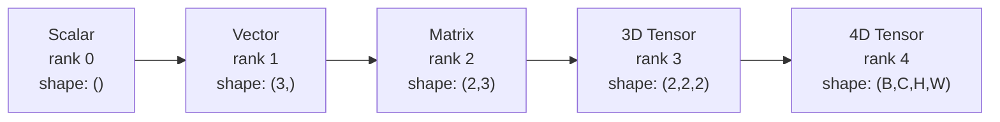
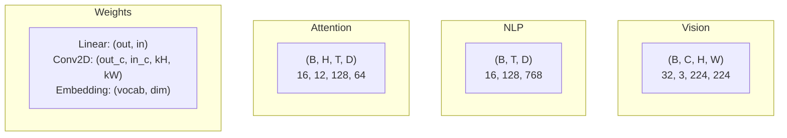
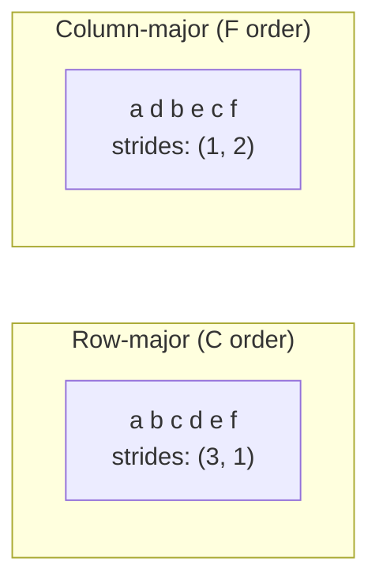
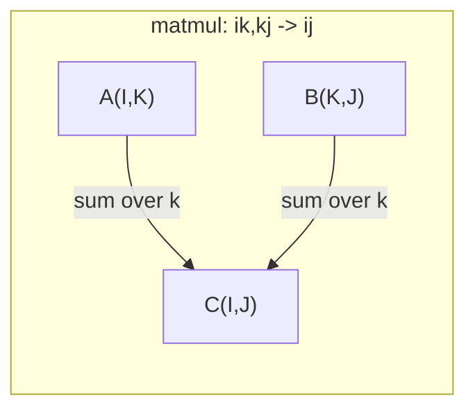

# Operaciones de tensión

> Los tensores son el lenguaje común entre datos y aprendizaje profundo. Cada imagen, cada frase, cada gradiente se mueve a través de ellos.

**Type:** Build
**Language:**Python
**前置要求：**Fase 1, Lecciones 01 (Intucción de álgebra lineal),02 (Vectores, matrices y operaciones)
**Time:** ~90 分钟

## El objetivo del aprendizaje
- Desde el zero implementar una clase de tensor, soporte de forma, pasos, remodelación, trasposición y operaciones de elementos
-  aplicación de la radiodifusión  reglas, en caso de no composición de datos  realizar el cálculo de tensores de diferentes formas 
- Por productos de puntos, multiplicidades de matrices, productos externos y operaciones en lotes
-  Tracking Multi-Head Atención Cada paso de las formas de tensor precisas

##  problemas
Tu construiste un transformador... paso adelante... parece muy limpio... y después de la operación obtienes:`RuntimeError: mat1 and mat2 shapes cannot be multiplied (32x768 and 512x768)`✿ Tú着这些形状──你试试转换──现在它提示 `Expected 4D input (got 3D input)`❖ Has añadido una no apretada― y otra vez en otro lugar se ha roto―

Los errores de forma son los errores más comunes en el código de aprendizaje profundo. No son difíciles en concepto. Cada operación tiene un contrato de forma. Pero se superponen rápidamente. Un transformador puede crear varias decenas de remodelaciones, transpuestas y transmisiones.

Matrices  procesar dos grupos de cosas entre la relación entre los dos.`(32, 3, 224, 224)`❖ con 12 cabezas de auto-atención también es 4D:`(batch, heads, seq_len, head_dim)`◊ necesitas una estructura de datos que pueda ampliarse a cualquier dimensión, y que pueda funcionar en todas las dimensiones. Esta estructura es Tensor.

## 概念
### Qué es un tensor

El tensor es un número de dimensiones de un tipo de datos unificado llamado **rank**(o **order**)― Cada dimensión es una **axis**¿Qué es eso?**shape**Es un tuple, que se encuentra en cada eje.



总元素数 = todos los tamaños de la multiplicidad.`(2, 3, 4)`包含 `2 * 3 * 4 = 24`个元素── es el mismo.

### Las formas de tensor en el aprendizaje profundo

Según la costumbre, diferentes tipos de datos se proyectan en formas tensoras específicas.



PyTorch utiliza NCHW(canal-primero) ――TensorFlow 默认使用 NHWC(canal-last)── no coincide de diseños 会导致静默变慢或报错──

### Cómo funciona el diseño de memoria

Array 2D en la memoria es un segmento de bytes 1D.**Strides**Te diré en cada eje, ¿cuántos elementos necesitarás saltar?



Transponer datos inmóviles. Se intercambian pasos, hace que el Tensor**non-contiguous**-- Elementos de una línea en la memoria ya no se encuentran juntos.

### Reglas de radiodifusión

La radiodifusión permite que se realice un cálculo de tensores de diferentes formas en un caso de no copia de datos. Dos dimensiones en fase e igual o una de ellas para 1 时兼容.

```
Tensor A:     (8, 1, 6, 1)
Tensor B:        (7, 1, 5)
Padded B:     (1, 7, 1, 5)
Result:       (8, 7, 6, 5)
```

### Einsum: operación de tensor de uso general

La sumación de Einstein con letras marcadas para cada eje. Se presentan en la entrada pero no en la salida. Los ejes en el medio se buscarán y se conservarán.



关键模式:`i,i->`(producto punto)`i,j->ij`(producto externo)`ii->`(traza)`ij->ji`(transponer)`bij,bjk->bik`(batch matmul)`bhtd,bhsd->bhts`(puntuaciones de atención)


```figure
tensor-broadcast
```

## Construirlo
代码位于                                                                                                                                                                                                                                                                                                                                                                                                                                                                                                                          `code/tensors.py` Cada paso cita la realización de la misma

### Paso 1: Tensor  almacenamiento y pasos

Tensor  almacenar una lista de números y metadatos de forma 平──Strides  indicar la lógica de indexación  cómo hacer más índices 映射到平位置──

```python
class Tensor:
    def __init__(self, data, shape=None):
        if isinstance(data, (list, tuple)):
            self._data, self._shape = self._flatten_nested(data)
        elif isinstance(data, np.ndarray):
            self._data = data.flatten().tolist()
            self._shape = tuple(data.shape)
        else:
            self._data = [data]
            self._shape = ()

        if shape is not None:
            total = reduce(lambda a, b: a * b, shape, 1)
            if total != len(self._data):
                raise ValueError(
                    f"Cannot reshape {len(self._data)} elements into shape {shape}"
                )
            self._shape = tuple(shape)

        self._strides = self._compute_strides(self._shape)

    @staticmethod
    def _compute_strides(shape):
        if len(shape) == 0:
            return ()
        strides = [1] * len(shape)
        for i in range(len(shape) - 2, -1, -1):
            strides[i] = strides[i + 1] * shape[i + 1]
        return tuple(strides)
```

 Por la forma `(3, 4)`, pasos es `(4, 1)`-- Prevención de una línea saltó 4 elementos, prevención de una línea saltó 1 elemento.

### 步骤 2: Reforma, apretar, desprender

Redesignación  cambia de forma, pero no cambia el orden de los elementos― el número total de elementos debe mantenerse constante― uso `-1`让某一个维度自动推断其大小──

```python
t = Tensor(list(range(12)), shape=(2, 6))
r = t.reshape((3, 4))
r = t.reshape((-1, 3))
```

Squeeze 会移除大小为 1 的轴──Unsqueeze 会插入一个──Unsqueezing对广播 至关重要 -- 一个偏向向向`(D,)`Agregado al lote`(B, T, D)`arriba, necesita desprenderse hasta `(1, 1, D)`¿Qué es eso?

```python
t = Tensor(list(range(6)), shape=(1, 3, 1, 2))
s = t.squeeze()
v = Tensor([1, 2, 3])
u = v.unsqueeze(0)
```

### Paso 3: Transponer y permute

Transponer  intercambiar dos ejes―Permute 重新排序 todos los ejes―, así es como se transfiere entre NCHW y NHWC―.

```python
mat = Tensor(list(range(6)), shape=(2, 3))
tr = mat.transpose(0, 1)

t4d = Tensor(list(range(24)), shape=(1, 2, 3, 4))
perm = t4d.permute((0, 2, 3, 1))
```

Trasponer o permute  Después, el tensor en el almacenamiento es no contiguo ∙ en PyTorch,`view`会在非连接的子 上失败 -- 使用 `reshape`, o primero se utiliza`.contiguous()`¿Qué es eso?

### 步骤 4: Operaciones y reducciones según los elementos

Opciones por elemento (s) se aplicarán independientemente a cada elemento, y se mantendrán en forma, no cambiarán. Reducciones (s) se doblarán uno o varios ejes.

```python
a = Tensor([[1, 2], [3, 4]])
b = Tensor([[10, 20], [30, 40]])
c = a + b
d = a * 2
s = a.sum(axis=0)
```

El promedio global de CNN en el medio:`(B, C, H, W).mean(axis=[2, 3])` producirse `(B, C)` NLP 中的 secuencia significa agrupamiento:`(B, T, D).mean(axis=1)` producirse `(B, D)`¿Qué es eso?

### 步骤 5: Radiodifusión con NumPy

`tensors.py`En el centro`demo_broadcasting_numpy()`La función  demostró el modelo central 

```python
activations = np.random.randn(4, 3)
bias = np.array([0.1, 0.2, 0.3])
result = activations + bias

images = np.random.randn(2, 3, 4, 4)
scale = np.array([0.5, 1.0, 1.5]).reshape(1, 3, 1, 1)
result = images * scale

a = np.array([1, 2, 3]).reshape(-1, 1)
b = np.array([10, 20, 30, 40]).reshape(1, -1)
outer = a * b
```

通过广播 计算双向距离:将 `(M, 2)`reformulación`(M, 1, 2)`,将 `(N, 2)`reformulación`(1, N, 2)`,相减、平方、沿最后轴 求和、取平方根──结果为:`(M, N)`¿Qué es eso?

### Paso 6: Operaciones de Einsum

`demo_einsum()`Y `demo_einsum_gallery()`Las funciones aparecerán de forma gradual en cada uno de los modelos comunes.

```python
a = np.array([1.0, 2.0, 3.0])
b = np.array([4.0, 5.0, 6.0])
dot = np.einsum("i,i->", a, b)

A = np.array([[1, 2], [3, 4], [5, 6]], dtype=float)
B = np.array([[7, 8, 9], [10, 11, 12]], dtype=float)
matmul = np.einsum("ik,kj->ij", A, B)

batch_A = np.random.randn(4, 3, 5)
batch_B = np.random.randn(4, 5, 2)
batch_mm = np.einsum("bij,bjk->bik", batch_A, batch_B)
```

El costo de cálculo de una contracción es la multiplicidad de todos los tamaños de índice (reservados y solicitados) para B=32、I=128、J=64、K=128`bij,bjk->bik`¿Qué es esto ?`32 * 128 * 64 * 128 = 33,554,432`Dos veces más adiciones.

### Paso 7: Mecanismo de atención a través de un sumo

`demo_attention_einsum()`Función 端到端实现 Multi-Head Attention──

```python
B, H, T, D = 2, 4, 8, 16
E = H * D

X = np.random.randn(B, T, E)
W_q = np.random.randn(E, E) * 0.02

Q = np.einsum("bte,ek->btk", X, W_q)
Q = Q.reshape(B, T, H, D).transpose(0, 2, 1, 3)

scores = np.einsum("bhtd,bhsd->bhts", Q, K) / np.sqrt(D)
weights = softmax(scores, axis=-1)
attn_output = np.einsum("bhts,bhsd->bhtd", weights, V)

concat = attn_output.transpose(0, 2, 1, 3).reshape(B, T, E)
output = np.einsum("bte,ek->btk", concat, W_o)
```

Cada paso es una operación tensor:proyección(a través de einsum 执行 matmul) 、head splitting(reshape + transpose) 、puntuaciones de atención(a través de einsum 执行 batch matmul) 、 suma ponderada(a través de einsum 执行 batch matmul) 、head merging(transpose + reshape) 、proyección de salida(a través de einsum 执行 matmul) 。

## Usalo
### Scratch vs NumPy

| Operation | Scratch (Tensor class) | NumPy |
|---|---|---|
| Create | `Tensor([[1,2],[3,4]])` | `np.array([[1,2],[3,4]])` |
| Reshape | `t.reshape((3,4))` | `a.reshape(3,4)` |
| Transpose | `t.transpose(0,1)` | `a.T` or `a.transpose(0,1)` |
| Squeeze | `t.squeeze(0)` | `np.squeeze(a, 0)` |
| Sum | `t.sum(axis=0)` | `a.sum(axis=0)` |
| Einsum | N/A | `np.einsum("ij,jk->ik", a, b)` |

### Scratch vs PyTorch

```python
import torch

t = torch.tensor([[1, 2, 3], [4, 5, 6]], dtype=torch.float32)
t.shape
t.stride()
t.is_contiguous()

t.reshape(3, 2)
t.unsqueeze(0)
t.transpose(0, 1)
t.transpose(0, 1).contiguous()

torch.einsum("ik,kj->ij", A, B)
```

PyTorch  aumentó el soporte de autograd, GPU y optimiza los kernels BLAS―la semántica de la forma es la misma―si entiendes la versión de raspado, los errores de forma de PyTorch se volverán legibles―

### Cada capa de red neuronal es una operación de tensores .

| Operation | Tensor Form | Einsum |
|---|---|---|
| Linear layer | `Y = X @ W.T + b` | `"bd,od->bo"` + bias |
| Attention QKV | `Q = X @ W_q` | `"btd,dh->bth"` |
| Attention scores | `Q @ K.T / sqrt(d)` | `"bhtd,bhsd->bhts"` |
| Attention output | `softmax(scores) @ V` | `"bhts,bhsd->bhtd"` |
| Batch norm | `(X - mu) / sigma * gamma` | element-wise + broadcast |
| Softmax | `exp(x) / sum(exp(x))` | element-wise + reduction |

##  entregarlo
Este curso se produce en dos instrucciones repetibles:

1. **`outputs/prompt-tensor-shapes.md`**-- Un sistema de comprobación de las incompatibilidades de forma de Tensor para deshacerse.

2. **`outputs/prompt-tensor-debugger.md`**-- Un prompt de desarreglo paso a paso, cuando el error de forma te bloquea, puedes pegarlo en cualquier asistente de IA en el centro.

##  ejercicios
1. **Easy -- Reshape round-trip.**¿ Qué es eso ?`(2, 3, 4)`La tensión... se transformará para...`(6, 4)`, Reformar para`(24,)`, y luego vuelve a cambiar .`(2, 3, 4)` Por medio de la impresión de datos planos 验证 cada paso de los elementos ordenados son conservados 

2. **Medium -- Implement broadcasting.**Por lo tanto ,`Tensor`clase 扩展一个 `broadcast_to(shape)`método,将大小为 1 de dimensiones  expandiéndose a la forma objetivo―, luego modificando `_elementwise_op`, hacer que en la operación pre-emisión automática.`(3, 1)`Y `(1, 4)` realizar pruebas, resultados deben producirse `(3, 4)`¿Qué es eso?

3. **Hard -- Build einsum from scratch.**                                                                                                                                                                                                                                                                                                                                                                                                                                                                                                                             `einsum(subscripts, *tensors)`Función, al menos apoyo:producto punto(`i,i->`)、matriz multiplicada`ij,jk->ik`)、producto externo`i,j->ij`) y trasponer`ij->ji`)。 resuelve la cadena de suscripto, identifica los índices contratados,并遍历所有指数组合──将你的结果与 `np.einsum`En comparación.

4. **Hard -- Attention shape tracker.**编写一个函数,输入 `batch_size`¿Qué es esto?`seq_len`¿Qué es esto?`embed_dim`Y `num_heads`,并印印多头目注意每步的精确形:input、Q/K/V projección、head split、attention scores、softmax weights、weighted sum、head merge、output projección──与`demo_attention_einsum()`Producción  realizar pruebas。

## 关键术语: "El hombre es un hombre"
| Term | What people say | What it actually means |
|---|---|---|
| Tensor | “一个 Matrix，但有更多 dimensions” | 一个具有统一 type 以及已定义 shape、strides 和 operations 的多维数组 |
| Rank | “dimensions 的数量” | axes 的数量。一个 Matrix 的 rank 是 2，而不是等于它的 matrix rank |
| Shape | “Tensor 的大小” | 一个 tuple，列出每个 axis 上的大小。`(2, 3)` 表示 2 行、3 列 |
| Stride | “内存如何排列” | 沿每个 axis 前进一个位置需要跳过的元素数量 |
| Broadcasting | “shapes 不同时它也能直接工作” | 一组严格规则：从右对齐，dimensions 必须相等，或其中一个必须是 1 |
| Contiguous | “Tensor 是正常的” | 元素在内存中按逻辑 layout 顺序连续存储，没有间隙或重排 |
| Einsum | “一种花哨的 matmul 写法” | 一种通用记法，可以用一行表达任意 Tensor contraction、outer product、trace 或 transpose |
| View | “和 reshape 一样” | 一个共享相同 memory buffer，但具有不同 shape/stride metadata 的 Tensor。会在 non-contiguous data 上失败 |
| Contraction | “对某个 index 求和” | Tensor 之间共享的 index 被相乘并求和，从而产生更低 rank 结果的一般 operation |
| NCHW / NHWC | “PyTorch vs TensorFlow format” | image tensors 的 memory layout conventions。NCHW 把 channels 放在 spatial dims 之前，NHWC 把它们放在之后 |

## 延伸阅读
- [NumPy Broadcasting](https://numpy.org/doc/stable/user/basics.broadcasting.html)-- 带有可见化示例的规范规则 带有可见化示例的规范规则
- [PyTorch Tensor Views](https://pytorch.org/docs/stable/tensor_view.html)-- vistas ¿Cuándo se puede usar ¿Cuándo se puede copiar?
- [einops](https://github.com/arogozhnikov/einops)-- Una que permita que el Tensor se remodele más fácilmente, más seguro
- [The Illustrated Transformer](https://jalammar.github.io/illustrated-transformer/)-- 可視化 Atención de las formas de tensión en movimiento
- [Einstein Summation in NumPy](https://numpy.org/doc/stable/reference/generated/numpy.einsum.html)-- 带有示例的完整的总数文件
