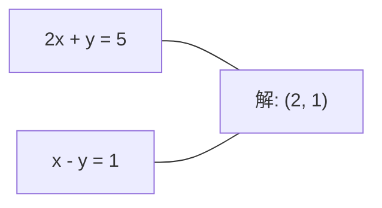
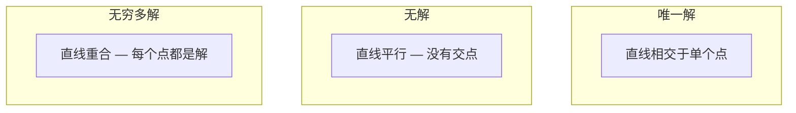

# Sistemas lineales

> Reseñar Ax = b es uno de los problemas más antiguos de la matemática, y todavía está en funcionamiento en tu red neuronal.

**Type:** Build
**Language:**Python
**前置要求：**Fase 1, Lecciones 01 (Intucción de álgebra lineal),02 (Vectores y matrices),03 (Transformaciones de matriz)
**Time:** ~120 minutes

## El objetivo del aprendizaje
- Utiliza带 pivotando parcial y sustitución de atrás de eliminación gaussiana 求解 Ax = b
- Utiliza LU、QR 和 Cholesky descompuestas 分解 Matrix,并解释每种方法适用场景
- 推导 mínimos cuadrados de las ecuaciones normales,并将其与线性回归和脊回归 联系起来
- Uso de la condición número  diagnóstico de sistemas mal condicionados,并 aplicar regularización 使其稳定

##  problemas
Cada vez que se practica la regresión lineal, se trata de resolver un sistema lineal. Cada vez que se calcula el tamaño de los cuadrados mínimos, se trata de resolver un sistema lineal.`y = Wx + b`Cuando, está en el lado de evaluar el sistema lineal. Cuando se une a la regularización, usted está modificando este sistema. Cuando utiliza procesos de Gaussian. Cuando se descompone una matriz.

方程 Ax = b 无处不在──A es la matriz de la matriz de la matriz de la matriz de la matriz de la matriz de la matriz de la matriz de la matriz de la matriz de la matriz de la matriz de la matriz de la matriz de la matriz de la matriz de la matriz de la matriz de la matriz de la matriz de la matriz de la matriz de la matriz de la matriz de la matriz de la matriz de la matriz de la matriz de la matriz de la matriz de la matriz de la matriz de la matriz de la matriz de la matriz de la matriz de la matriz de la matriz de la matriz de la matriz de la matriz de la matriz de la matriz de la matriz de la matriz de la matriz de la matriz de la matriz de la matriz de la matriz de la matriz de la matriz de la matriz de la matriz de la matriz de la matriz de la matriz de la matriz de la matriz de la matriz de la matriz de la matriz de la matriz de la matriz de la matriz de la matriz de la matriz de la matriz de la matriz de la matriz de la matriz de la matriz de la matriz de la matriz de la matriz de la matriz de la matriz de la matriz de la matriz de la matriz de la matriz de la matriz de la matriz de la matriz de la matriz de la matriz de la matriz de la matriz de la matriz de la matriz de la matriz de la matriz de la matriz de la matriz de la matriz de la matriz de la matriz de la matriz de la matriz de la matriz de la matriz de la matriz de la matriz de la matriz de la matriz de la matriz de la matriz de la matriz de la matriz de la matriz de la matriz de la matriz de la matriz de la matriz de la matriz de la matriz de la matriz de la matriz de la matriz de la matriz de la matriz de la matriz de la matriz de la matriz de la

En esta clase se entenderán todos los métodos principales para resolver esta ecuación desde cero. Usted entenderá por qué algunos métodos son más rápidos y otros más estables, por qué algunos métodos sólo se aplican a sistemas cuadrados y otros pueden tratar sistemas sobredeterminados, y por qué el número de condiciones de la matriz decide si su respuesta tiene sentido.

## 概念
### Ax = b en la geometría significa qué

Un sistema de ecuaciones lineales 具有几何解释── cada ecuación 定义一个超平面──解就是所有超平面相交的点(或点集)──

```
2x + y = 5          2D 中的两条直线。
x - y  = 1          它们相交于 x=2, y=1。
```



Se pueden presentar tres situaciones:



En la matriz 形式中, "una solución" significa A es invertible──"No solución" significa sistema es inconsistente──"Soluciones infinitas" significa A tiene un espacio nulo──la mayoría de los problemas de ML pertenecen a  no hay una definición exacta de los tipos de clases, porque tus ecuaciones (punto de datos) son más desconocidos (parámetros) 更多── esto es el lugar donde los cuadrados más pequeños (play role) ──

### imagen de columna vs imagen de fila

Hay dos formas de entender Ax = b:

**Row picture.**Cada línea de un define una ecuación. Cada ecuación es un hiperplano.

**Column picture.**Cada una de las columnas de A es un vector. ¿Qué combinación lineal de columnas de A puede producir b?

```
A = | 2  1 |    b = | 5 |
    | 1 -1 |        | 1 |

Row picture: 同时求解 2x + y = 5 和 x - y = 1。

Column picture: 找到 x1, x2，使得：
  x1 * [2, 1] + x2 * [1, -1] = [5, 1]
  2 * [2, 1] + 1 * [1, -1] = [4+1, 2-1] = [5, 1]   check.
```

Si b se encuentra en el espacio de columna de A, el sistema tiene una solución. Si b no está en uno de ellos, se encuentra en el espacio de columna de la distancia del punto más cercano. Este punto más cercano es la solución de cuadrados mínimos.

### Eliminación gaussiana

La eliminación gaussiana 将 Ax = b 转换为 上方三角形系统 Ux = c, luego utiliza la sustitución de atrás 求解──这是最直接的方法──

算法:

```
1. 对每一列 k（pivot column）：
   a. 在第 k 行及其下方，找到 column k 中最大的 entry（partial pivoting）。
   b. 将该行与第 k 行交换。
   c. 对 k 下方的每一行 i：
      - 计算 multiplier m = A[i][k] / A[k][k]
      - 从第 i 行中减去 m 倍的第 k 行。
2. Back substitute：从最后一个 equation 向上求解。
```

Muestras:

```
Original:
| 2  1  1 | 8 |       R2 = R2 - (2)R1     | 2  1   1 |  8 |
| 4  3  3 |20 |  -->  R3 = R3 - (1)R1 --> | 0  1   1 |  4 |
| 2  3  1 |12 |                            | 0  2   0 |  4 |

                       R3 = R3 - (2)R2     | 2  1   1 |  8 |
                                       --> | 0  1   1 |  4 |
                                           | 0  0  -2 | -4 |

Back substitute:
  -2 * x3 = -4    -->  x3 = 2
  x2 + 2  = 4     -->  x2 = 2
  2*x1 + 2 + 2 = 8 --> x1 = 2
```

El costo de cálculo de la eliminación gaussiana es de O (n^3) ⋅ para el sistema 1000x1000, esto es aproximadamente mil millones de veces operaciones de puntos flotantes⋅ es rápido, pero si necesitas usar el mismo sistema, también puedes hacerlo mejor.

### Pivotado parcial: ¿Por qué es importante?

 sin pivot, eliminación gaussiana puede fracasar o producir resultados basura Si el elemento pivot es para cero, se separará para cero Si es muy pequeño, se aumentará los errores de redondeo

```
Bad pivot:                       With partial pivoting:
| 0.001  1 | 1.001 |            先交换行：
| 1      1 | 2     |            | 1      1 | 2     |
                                 | 0.001  1 | 1.001 |
m = 1/0.001 = 1000              m = 0.001/1 = 0.001
R2 = R2 - 1000*R1               R2 = R2 - 0.001*R1
| 0.001  1     | 1.001   |      | 1      1     | 2     |
| 0     -999   | -999.0  |      | 0      0.999 | 0.999 |

x2 = 1.000（正确）              x2 = 1.000（正确）
x1 = (1.001 - 1)/0.001          x1 = (2 - 1)/1 = 1.000（正确）
   = 0.001/0.001 = 1.000        稳定，因为 multiplier 很小。
```

En la aritmética de puntos flotantes de precisión limitada, la versión de un pivot no tiene un pivot puede perder cifras significativas.

### Descomposición de las LU

La descomposición de LU se dividirá en una matriz triangular inferior L y una matriz triangular superior U:A = LU──L Matriz  almacenamiento de los multiplicadores Gaussian elimination en el medio──U Matrix is the result of elimination──

```
A = L @ U

| 2  1  1 |   | 1  0  0 |   | 2  1   1 |
| 4  3  3 | = | 2  1  0 | @ | 0  1   1 |
| 2  3  1 |   | 1  2  1 |   | 0  0  -2 |
```

¿Por qué hay que eliminar el factor y no eliminarlo directamente? Porque una vez que hay L y U, se necesita un nuevo b para resolver Ax = b sólo O (n^2):

```
Ax = b
LUx = b
令 y = Ux:
  Ly = b    (forward substitution, O(n^2))
  Ux = y    (back substitution, O(n^2))
```

El costo de O (n^3) sólo se paga una vez en la factorization. Después de cada vez de resolver, se trata de O (n^2) ⋅ Si necesitas utilizar los mismos A (n^3) y diferentes b (b) vectores para resolver 1000 sistemas, LU permite que el total de trabajo se ahorra en aproximadamente 1000/3 veces.

Usando pivotando parcial, obtienes PA = LU, en el cual P es la matriz de permutación de los swaps de filas registrados.

### Descomposición de las QR

La descomposición QR se dividirá en una matriz ortogonal Q y una matriz triangular superior R:A = QR。

Matriz ortogonal 具有 Q^T Q = I 的性质── sus columnas son vectores ortónormales──乘以 Q 会保持长和角──

```
A = Q @ R

Q has orthonormal columns: Q^T Q = I
R is upper triangular

To solve Ax = b:
  QRx = b
  Rx = Q^T b    (只需乘以 Q^T，不需要 inversion)
  Back substitute to get x.
```

En la búsqueda de solucionar los problemas de cuadrados mínimos 时,QR比 LU en estabilidad numérica 上更好──Gram-Schmidt proceso 逐列构建 Q:

```
Given columns a1, a2, ... of A:

q1 = a1 / ||a1||

q2 = a2 - (a2 . q1) * q1        (减去到 q1 上的 projection)
q2 = q2 / ||q2||                (normalize)

q3 = a3 - (a3 . q1) * q1 - (a3 . q2) * q2
q3 = q3 / ||q3||

R[i][j] = qi . aj    for i <= j
```

Cada paso se moverá a lo largo de todos los componentes de los vectores anteriores, sólo dejando una nueva dirección ortogonala.

### Descomposición de Cholesky

Cuando A es simétrico (A = A^T) y positivo definido (T) (T) (T) (T) (T) (T) (T) (T) (T) (T) (T) (T) (T) (T) (T) (T) (T) (T) (T) (T) (T) (T) (T) (T) (T) (T) (T) (T) (T) (T) (T) (T) (T) (T) (T) (T) (T) (T) (T) (T) (T) (T) (T) (T) (T) (T) (T) (T) (T) (T) (T) (T) (T) (T) (T) (T) (T) (T) (T) (T) (T) (T) (T) (T) (T) (T) (T) (T) (T) (T) (T) (T) (T) (T) (T) (T) (T) (T) (T) (T) (T) (T) (T) (T) (T) (T) (T) (T) (T) (T) (T) (T) (T) (T) (T) (T) (T) (T) (T) (T) (T) (T) (T) (T) (T) (T) (T) (T) (T) (T) (T) (T) (T) (T) (T) (T) (T) (T) (T) (T) (T) (T) (T) (T) (T) (T) (T) (T) (T) (T) (T) (T) (T) (T) (T) (T) (T) (T) (T) (T) (T) (T) (T) (T) (T) (T) (T) (T) (T) (T) (T) (T) (T) (T) (T) (T) (T) (T) (T) (T) (T) (T) (T) (T) (

```
A = L @ L^T

| 4  2 |   | 2  0 |   | 2  1 |
| 2  5 | = | 1  2 | @ | 0  2 |

L[i][i] = sqrt(A[i][i] - sum(L[i][k]^2 for k < i))
L[i][j] = (A[i][j] - sum(L[i][k]*L[j][k] for k < j)) / L[j][j]    for i > j
```

Cholesky es casi dos veces más grande que LU, y sólo necesita la mitad del espacio de almacenamiento.

- Las matrices de covarianza son semidefinidas simétricas positivas (a través de la regularización, se pueden cambiar por definidas positivas)
- La matriz del núcleo de procesos gaussianos en el medio es una definición positiva simétrica.
- La función convexa en el mínimo de la posición de Hessian es un definido positivo simétrico.
- A^T A 总是 simétrico positivo semi-definido。

En los procesos gaussianos, se utiliza Cholesky para resolver la matriz del núcleo K, y luego se busca la solución K alfa = y para obtener el significado predictivo.

### Cuadrados mínimos:当 Ax = b 没有精确解时

Si A es m x n 且 m > n(equaciones Más que desconocidos), el sistema es sobredeterminado.

```
minimize ||Ax - b||^2

这是 squared residuals 的总和：
  sum((A[i,:] @ x - b[i])^2 for i in range(m))
```

Minimizar  satisfagan las ecuaciones normales:

```
A^T A x = A^T b
```

推导:展开A 求 Gradient,并令其为零:2 A  A x - 2 A  T b = 0

```
Original system (overdetermined, 4 equations, 2 unknowns):
| 1  1 |         | 3 |
| 1  2 | x     = | 5 |       没有精确的 x 能满足全部 4 个 equations。
| 1  3 |         | 6 |
| 1  4 |         | 8 |

Normal equations:
A^T A = | 4  10 |    A^T b = | 22 |
        | 10 30 |            | 63 |

Solve: x = [1.5, 1.7]

这就是 linear regression。x[0] 是 intercept，x[1] 是 slope。
```

### Equaciones normales = regresión lineal

Esta relación es precisa. En la regresión lineal, la matriz de datos X cada una línea se corresponde a una muestra, cada una línea se corresponde a una característica y cada entrada a una muestra.

```
X^T X w = X^T y
w = (X^T X)^(-1) X^T y
```

Esta es una solución de forma cerrada de regresión lineal.`sklearn.linear_model.LinearRegression.fit()`Ciudad calcular este resultado (o a través de QR o SVD  calcular resultados similares)

A la matriz añade el término de regularización lambda * I, tú tienes regresión de la cresta:

```
(X^T X + lambda * I) w = X^T y
w = (X^T X + lambda * I)^(-1) X^T y
```

Regularización hará que la matriz esté condicionada mejor (más fácilmente se puede obtener la inversa), y a través de los pesos hacia el cero se contraerá para evitar el sobreajuste. Cuando lambda > 0 时, la matriz X^T X + lambda * I 总是对称正确, por lo tanto se puede utilizar Cholesky 求解──

### Pseudoinverso (Moore-Penrose)

Pseudoinverso A+ va a invertir la matriz 推广到非平方 和 singular matrices── para cualquier Matrix A:

```
x = A+ b

where A+ = V Sigma+ U^T    (computed via SVD)
```

Sigma + 通過對每個非零單位值 取相互并轉置結果构成──如果 A = U Sigma V^T,那么 A+ = V Sigma+ U^T──

```
A = U Sigma V^T        (SVD)

Sigma = | 5  0 |       Sigma+ = | 1/5  0  0 |
        | 0  2 |                | 0  1/2  0 |
        | 0  0 |

A+ = V Sigma+ U^T
```

Pseudoinverso                                                                                                                                                                                                                                                                                                                                                                                                                                                                                                                          
- 唯一解: A+ b 给出该解──
- 无解:A+b 给出 solución de cuadrados mínimos。
- ¡A+b 给出 给出 给出 给出 给出 给出 给出 给出 给出 给出 给出 给出 给出 给出 给出 给出 给出 给出 给出 给出 给出 给出 给出 给出 给出 给出 给出 给出 给出 给出 给出 给出 给出 给出 给出 给出 给出 给出 给出 给出 给出 给出 给出 给出 给出 给出 给出 给出 给出 给出 给出 给出 给出 给出 给出 给出 给出 给出 给给出 给出 给给 给 给 给 给 给 给 给 给 给 给 给 给 给 给 给 给 给 给 给 给 给 给 给 给 给 给 给 给 给 给 给 给 给 给 给 给 给 给 给 给 给 给 给 给 给 给 给 给 给 给 给 给 给 给 给 给 给 给 给 给 给 给 给 给 给

NumPy de `np.linalg.lstsq`Y `np.linalg.pinv`内部都使用 SVD。

### Número de condición

Número de condición Solución de medida tiene una gran sensibilidad a las pequeñas variaciones de la entrada  Para la Matriz A, el número de condición es:

```
kappa(A) = ||A|| * ||A^(-1)|| = sigma_max / sigma_min
```

Entre ellos sigma_max 和 sigma_min 分别是最大和最小单数值──

```
Well-conditioned (kappa ~ 1):        Ill-conditioned (kappa ~ 10^15):
b 中的小变化 -->                    b 中的小变化 -->
x 中的小变化                         x 中的巨大变化

| 2  0 |   kappa = 2/1 = 2          | 1   1          |   kappa ~ 10^15
| 0  1 |   safe to solve            | 1   1+10^(-15) |   solution is garbage
```

经验法则:
- Kappa < 100: seguridad, solución 准确。
- ¿Cómo es que el tiempo de la vida de los hombres es un tiempo de vida?
- para float64):solución 没有意义──Matrix 实际上是单一──

En ML, mal-condicionamiento ocurre en características 几乎 collinear 时――Regularization(添加 lambda * I)将将条件数 从 sigma_max / sigma_min 改善为 (sigma_max + lambda) / (sigma_min + lambda) ⋅

### Métodos iterativos: gradiente conjugado

Para sistemas muy grandes y raros, millones de desconocidos, métodos directos como LU o Cholesky, métodos iterativos, que pueden ser utilizados en varias ocasiones, pueden mejorar una conjetura para una solución similar.

El gradiente conjugado (CG) en A es un gradiente positivo simétrico definido 时求解 Ax = b。 en la aritmética exacta se encuentra una solución exacta, pero si los valores propios de A se agrupan, normalmente se obtendrán más rápidamente ──

```
Algorithm sketch:
  x0 = initial guess (often zero)
  r0 = b - A x0           (residual)
  p0 = r0                 (search direction)

  For k = 0, 1, 2, ...:
    alpha = (rk . rk) / (pk . A pk)
    x_{k+1} = xk + alpha * pk
    r_{k+1} = rk - alpha * A pk
    beta = (r_{k+1} . r_{k+1}) / (rk . rk)
    p_{k+1} = r_{k+1} + beta * pk
    if ||r_{k+1}|| < tolerance: stop
```

CG Usado para:
- Optimización a gran escala (método Newton-CG)
- 求解 Discretizations de la PDE
- Métodos del núcleo, entre los cuales la matriz del núcleo 太大无法 factor
-  Como precondicionamiento de otros solventes iterativos

La tasa de convergencia depende del número de condiciones.

### El cuadro completo:何时使用哪种方法

| Method | Requirements | Cost | Use case |
|--------|-------------|------|----------|
| Gaussian elimination | Square, nonsingular A | O(n^3) | 对 square system 的一次性求解 |
| LU decomposition | Square, nonsingular A | O(n^3) factor + O(n^2) solve | 使用相同 A 的多次求解 |
| QR decomposition | Any A (m >= n) | O(mn^2) | Least squares，numerically stable |
| Cholesky | Symmetric positive definite A | O(n^3/3) | Covariance matrices，Gaussian processes，ridge regression |
| Normal equations | Overdetermined (m > n) | O(mn^2 + n^3) | Linear regression（小 n） |
| SVD / pseudoinverse | Any A | O(mn^2) | Rank-deficient systems，minimum-norm solutions |
| Conjugate gradient | Symmetric positive definite, sparse A | O(n * k * nnz) | Large sparse systems，k = iterations |

### Conexión a ML

Cada método de esta clase se encuentra en el ML de producción:

**Linear regression.**Solución de forma cerrada 求解 las ecuaciones normales X^T X w = X^T y。 esto puede pasar por Cholesky 如果 n 很小)、QR 如果数学的稳定性 很重要) 或 SVD 如果矩阵可能级缺)完成──

**Ridge regression.**hacia X^T X 添加 lambda * I。 Sistema regularizado (X^T X + lambda * I) w = X^T y 总是可以通过Cholesky 求解,因为当 lambda > 0 时,X^T X + lambda * I 是对称正确的──

**Gaussian processes.**Medios predictivos 需要求解 K alfa = y, entre los cuales K es matriz del núcleo。对 K 做 Cholesky factorization 是标准方法。Log probabilidad marginal 使用 log det(K) = 2 suma(log(diag(L)))。

**Neural network initialization.**Inicialización ortogonal Utiliza la descomposición QR  Crea columnas para matrices de peso ortónormales― esto puede prevenir el colapso de señales en redes profundas―

**Preconditioning.**Optimizadores a gran escala Utilizan Cholesky incompleto o LU incompleto como precondiciones de solventes de gradientes conjugados。

**Feature engineering.**El número de condición de X^T X  te dice si las características son colinearias. Si la kappa es grande, elimina las características o añade regularización.


```figure
linear-system-conditioning
```

## Construirlo
### 步骤 1: Eliminación gaussiana con pivotado parcial

```python
import numpy as np

def gaussian_elimination(A, b):
    n = len(b)
    Ab = np.hstack([A.astype(float), b.reshape(-1, 1).astype(float)])

    for k in range(n):
        max_row = k + np.argmax(np.abs(Ab[k:, k]))
        Ab[[k, max_row]] = Ab[[max_row, k]]

        if abs(Ab[k, k]) < 1e-12:
            raise ValueError(f"Matrix is singular or nearly singular at pivot {k}")

        for i in range(k + 1, n):
            m = Ab[i, k] / Ab[k, k]
            Ab[i, k:] -= m * Ab[k, k:]

    x = np.zeros(n)
    for i in range(n - 1, -1, -1):
        x[i] = (Ab[i, -1] - Ab[i, i+1:n] @ x[i+1:n]) / Ab[i, i]

    return x
```

### Paso 2: Descomposición de la LU

```python
def lu_decompose(A):
    n = A.shape[0]
    L = np.eye(n)
    U = A.astype(float).copy()
    P = np.eye(n)

    for k in range(n):
        max_row = k + np.argmax(np.abs(U[k:, k]))
        if max_row != k:
            U[[k, max_row]] = U[[max_row, k]]
            P[[k, max_row]] = P[[max_row, k]]
            if k > 0:
                L[[k, max_row], :k] = L[[max_row, k], :k]

        for i in range(k + 1, n):
            L[i, k] = U[i, k] / U[k, k]
            U[i, k:] -= L[i, k] * U[k, k:]

    return P, L, U

def lu_solve(P, L, U, b):
    n = len(b)
    Pb = P @ b.astype(float)

    y = np.zeros(n)
    for i in range(n):
        y[i] = Pb[i] - L[i, :i] @ y[:i]

    x = np.zeros(n)
    for i in range(n - 1, -1, -1):
        x[i] = (y[i] - U[i, i+1:] @ x[i+1:]) / U[i, i]

    return x
```

### Paso 3: Descomposición de Cholesky

```python
def cholesky(A):
    n = A.shape[0]
    L = np.zeros_like(A, dtype=float)

    for i in range(n):
        for j in range(i + 1):
            s = A[i, j] - L[i, :j] @ L[j, :j]
            if i == j:
                if s <= 0:
                    raise ValueError("Matrix is not positive definite")
                L[i, j] = np.sqrt(s)
            else:
                L[i, j] = s / L[j, j]

    return L
```

### 步骤 4: Cuadrados mínimos a través de ecuaciones normales

```python
def least_squares_normal(A, b):
    AtA = A.T @ A
    Atb = A.T @ b
    return gaussian_elimination(AtA, Atb)

def ridge_regression(A, b, lam):
    n = A.shape[1]
    AtA = A.T @ A + lam * np.eye(n)
    Atb = A.T @ b
    L = cholesky(AtA)
    y = np.zeros(n)
    for i in range(n):
        y[i] = (Atb[i] - L[i, :i] @ y[:i]) / L[i, i]
    x = np.zeros(n)
    for i in range(n - 1, -1, -1):
        x[i] = (y[i] - L.T[i, i+1:] @ x[i+1:]) / L.T[i, i]
    return x
```

### 步骤 5: Número de condición

```python
def condition_number(A):
    U, S, Vt = np.linalg.svd(A)
    return S[0] / S[-1]
```

## Usalo
Para combinar estas partes, realizar una regresión lineal y una regresión de la cresta en datos reales:

```python
np.random.seed(42)
X_raw = np.random.randn(100, 3)
w_true = np.array([2.0, -1.0, 0.5])
y = X_raw @ w_true + np.random.randn(100) * 0.1

X = np.column_stack([np.ones(100), X_raw])

w_ols = least_squares_normal(X, y)
print(f"OLS weights (ours):    {w_ols}")

w_np = np.linalg.lstsq(X, y, rcond=None)[0]
print(f"OLS weights (numpy):   {w_np}")
print(f"Max difference: {np.max(np.abs(w_ols - w_np)):.2e}")

w_ridge = ridge_regression(X, y, lam=1.0)
print(f"Ridge weights (ours):  {w_ridge}")

from sklearn.linear_model import Ridge
ridge_sk = Ridge(alpha=1.0, fit_intercept=False)
ridge_sk.fit(X, y)
print(f"Ridge weights (sklearn): {ridge_sk.coef_}")
```

##  entregarlo
本课产 出:
- `code/linear_systems.py`, contiene desde el zero la eliminación gaussiana de la realización, la descomposición de LU, la descomposición de Cholesky, los cuadrados mínimos y la regresión de la cresta
- Una demostración de una operación, que muestra las ecuaciones normales y la Regresión Lineal de los cálculos produce los mismos pesos

##  ejercicios
1. Utiliza tu eliminación gaussiana, tu solvente de LU y`np.linalg.solve`求解 sistema `[[1,2,3],[4,5,6],[7,8,10]] x = [6, 15, 27]`❖ Experimentación en tolerancia de punto flotante en en da la misma respuesta―

2. 生成一个50x5 matriz aleatoria X 和 objetivo y = X @ w_true + ruido──分别使用正常方程、QR(通过 `np.linalg.qr`)、SVD( a través de `np.linalg.svd`) y `np.linalg.lstsq`求解 w―比较四个解决方案──测量 X^T X 的条件数,并解释它如何影响你信任哪种方法──

3. 通过让两列几乎相同来创建一个几乎单一矩阵 (例如, columna 2 = columna 1 + 1e-10 * ruido) ⋅ calcular su número de condición ⋅分别在有规律化和无规律化的情况下求解 Ax = b(加0.01 * I) ⋅ Compare soluciones 和残留──解释为什么规律化有帮助──

4. Para una matriz positiva definida simétrica aleatoria 100x100  lograr algoritmo de gradiente conjugado―统计它收到容忍 1e-8 需要多少次反复──与n 代代代代代代代代代代代代代代代代代代代代代代代代代代代代代代代代代代代代代代代代代代代代代代代代代代代代代代代代代代代代代代代代代代代代代代代代代代代代代代代代代代代代代代代代代代代代代代代代代代代代代代代代代代代代代代代代代代代代代代代代代代代代代代代代代代代代代代代代代代代代代代代代代代代代代代代代代代代代代代代代代代代代代代代代代代代代代代代代代代代代代代代代代代代代代代代代代代代代代代代代代代代代代代代代代代代代代代代代代代代代代代代代代代代代代代代代代代代代代代代代代代代代代代代代代代代代代代代代代代代代代代代代代代代代代代代代代代代代代代代代代代代代代代代代代代代代代代代代代代代代代代代代代代代代代代代代代代代代代代代代代代代代代代代代代代代代代代代代代代代代代代代代代代代代代代代代代代代代代代代代代代代代代代代代代代代代代代代代代代代代代代代代代代代代代代代代代代代代代代代代代代代代代代代代代代代代代代代代代代代代代代代代代代代代代代代代代代代代代代代代代代代代代代代代代代代代代代代代代代代代代代代代

5. En la matriz positiva definida de 10 50 200 500 en la matriz de la matriz, en la matriz de la matriz de la matriz de la matriz de la matriz de la matriz de la matriz de la matriz de la matriz de la matriz de la matriz de la matriz de la matriz de la matriz de la matriz de la matriz de la matriz de la matriz de la matriz de la matriz de la matriz de la matriz de la matriz de la matriz de la matriz de la matriz de la matriz de la matriz de la matriz de la matriz de la matriz de la matriz de la matriz de la matriz de la matriz de la matriz de la matriz de la matriz de la matriz de la matriz de la matriz de la matriz de la matriz de la matriz de la matriz de la matriz de la matriz de la matriz de la matriz de la matriz de la matriz de la matriz de la matriz de la matriz de la matriz de la matriz de la matriz de la matriz de la matriz de la matriz de la matriz de la matriz de la matriz de la matriz de la matriz de la matriz de la matriz de la matriz de la matriz de la matriz de la matriz de la matriz de la matriz de la matriz de la matriz de la matriz de la matriz de la matriz de la matriz de la matriz de la matriz de la matriz de la matriz de la matriz de la matriz de la matriz de la matriz de la matriz de la matriz de la matriz de la matriz de la matriz de la matriz de la matriz de la matriz de la matriz de la matriz de la matriz de la matriz de la matriz de la matriz de la matriz de la matriz de la matriz de la matriz de la matriz de la matriz de la matriz de la matriz de la matriz de la matriz de la matriz de la matriz de la matriz de la matriz de la matriz de la matriz de la matriz de la matriz de la matriz de la matriz de la matriz de`np.linalg.solve`计时――绘制结果――验证 Cholesky 大约比 LU 快 2倍――

## 关键术语: "El hombre es un hombre"
| Term | What people say | What it actually means |
|------|----------------|----------------------|
| Linear system | "Solve for x" | 一组 linear equations Ax = b。找到 x 意味着找到在 transformation A 下产生 output b 的 input。 |
| Gaussian elimination | "Row reduce" | 使用 row operations 系统性地将 diagonal 下方的 entries 置零，产生可通过 back substitution 求解的 upper triangular system。O(n^3)。 |
| Partial pivoting | "Swap rows for stability" | 在 column k 中进行 elimination 前，将该 column 中 absolute value 最大的行交换到 pivot 位置。防止除以很小的数。 |
| LU decomposition | "Factor into triangles" | 写成 A = LU，其中 L 是 lower triangular（存储 multipliers），U 是 upper triangular（eliminated matrix）。将 O(n^3) 成本摊销到多次求解中。 |
| QR decomposition | "Orthogonal factorization" | 写成 A = QR，其中 Q 的 columns 是 orthonormal，R 是 upper triangular。对于 least squares，比 LU 更稳定。 |
| Cholesky decomposition | "Square root of a matrix" | 对 symmetric positive definite A，写成 A = LL^T。成本是 LU 的一半。用于 covariance matrices、kernel matrices 和 ridge regression。 |
| Least squares | "Best fit when exact is impossible" | 当 system overdetermined（equations 多于 unknowns）时，最小化 squared residuals 的总和 ||Ax - b||^2。 |
| Normal equations | "The calculus shortcut" | A^T A x = A^T b。将 ||Ax - b||^2 的 Gradient 设为零。这就是 linear regression 的 closed-form solution。 |
| Pseudoinverse | "Inversion for non-square matrices" | A+ = V Sigma+ U^T via SVD。对于任意 Matrix，无论 square 或 rectangular、singular 与否，给出 minimum-norm least-squares solution。 |
| Condition number | "How trustworthy is this answer" | kappa = sigma_max / sigma_min。衡量对 input perturbations 的敏感性。大约损失 log10(kappa) 位精度。 |
| Ridge regression | "Regularized least squares" | 求解 (X^T X + lambda I) w = X^T y。添加 lambda I 改善 conditioning，并将 weights 向零收缩。防止 overfitting。 |
| Conjugate gradient | "Iterative Ax=b for big matrices" | 用于 symmetric positive definite systems 的 iterative solver。最多 n 步收敛。适合 factorization 成本过高的大型 sparse systems。 |
| Overdetermined system | "More data than parameters" | 在 m-by-n system 中 m > n。不存在精确解。Least squares 找到最佳近似。这就是每个 regression problem。 |
| Back substitution | "Solve from the bottom up" | 给定 upper triangular system，先求解最后一个 equation，然后向后 substitute。O(n^2)。 |
| Forward substitution | "Solve from the top down" | 给定 lower triangular system，先求解第一个 equation，然后向前 substitute。O(n^2)。用于 LU solves 中的 L step。 |

## 延伸阅读
- [MIT 18.06: Linear Algebra](https://ocw.mit.edu/courses/18-06-linear-algebra-spring-2010/)(Gilbert Strang) --                                                                                                                                                                                                                                                                                                                                                                                                                                                                                                                      
- [Numerical Linear Algebra](https://people.maths.ox.ac.uk/trefethen/text.html)(Trefethen & Bau) -- Comprender la estabilidad numérica, el acondicionamiento y los algoritmos por qué no
- [Matrix Computations](https://www.cs.cornell.edu/cv/GolubVanLoan4/golubandvanloan.htm)(Golub & Van Loan) --  охватыва разных матричных алгоритмов 百科式参考
- [3Blue1Brown: Inverse Matrices](https://www.3blue1brown.com/lessons/inverse-matrices)-- para la búsqueda de la solución de Ax = b 几何意义的可见化直觉
