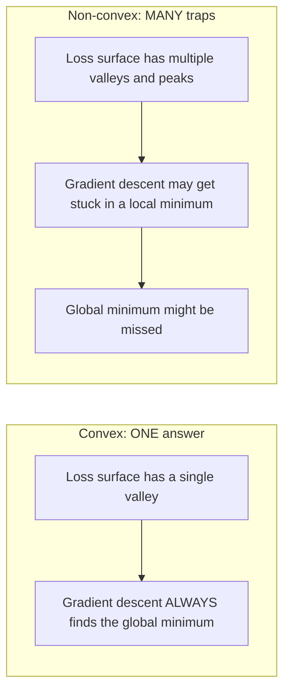
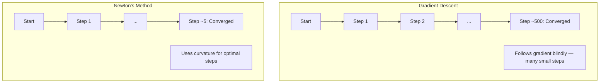
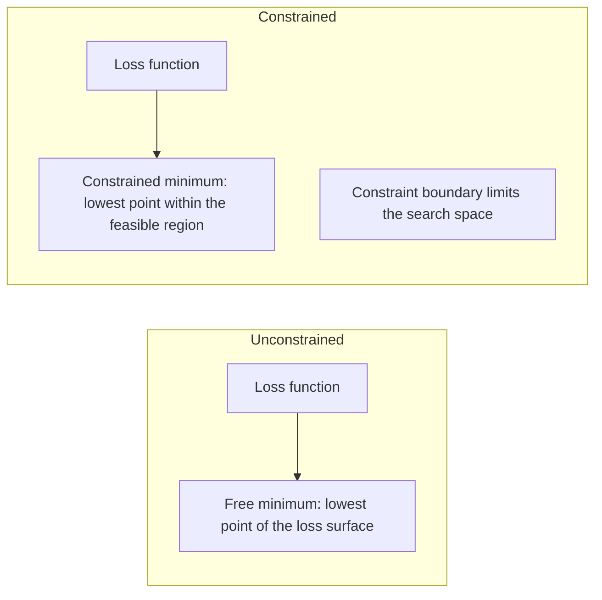
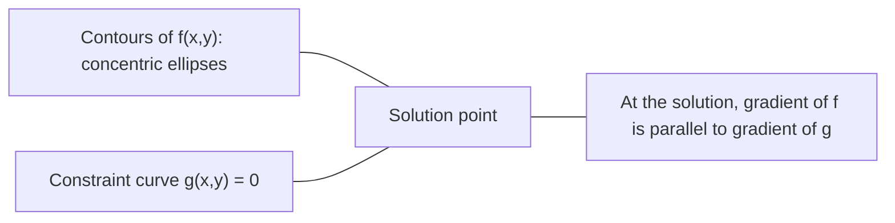

# 凸优化

> 凸问题只有一个谷底――Neural Network 拥有数百万个――了解这种差异很重要――

**类型：**Construcción
**语言：**Python
**前置要求：**Fase 1, Lecciones 04 ((Calculo para ML) 、08 ((Optimización)
**时间：**90 minutos

## El objetivo del aprendizaje

- Utiliza definición、二阶导数和 Hessian 判据测试 ¿se trata de una función de la forma de una función de la forma de un cuadro?
-  realizar el método de Newton,并将其二次收速度与渐进下降  hacer comparación
- Utiliza los multiplicadores de la laguna 求解带约束的优化问题,并解释 KKT condiciones
- Explica por qué el panorama de pérdida de la red neuronal no es obvio, pero SGD todavía puede encontrar una buena solución

##  problemas

Lección 08 Te enseñó Descenso Gradiente, Momento y Adán. Estos optimizadores pueden moverse en cualquier superficie hacia abajo. Pero no están garantizados. Descenso Gradiente en un paisaje no confuso.

Pero muchos problemas en el ML son de la conmoción. La regresión lineal, la regresión lógica, los SVMs, los LASSO, la regresión de la conmoción. Para estos problemas, hay herramientas más fuertes: con una garantía matemática de optimización. La conmoción es un problema de un solo fondo. Cualquier algoritmo que vaya hacia abajo alcanzará el valor mínimo de la totalidad.

Comprender la conmoción tiene tres puntos de valor. Primero, le dice a usted cuál es el problema cuando es simple, cuál es el problema cuando es difícil. Segundo, le ofrece herramientas más rápidas, como el método de Newton. Tercero, explica el concepto de regularización que aparece de nuevo en el ML: la dualidad de los SVMs, y por qué el aprendizaje profundo sigue funcionando en todo lo que ofrece la buena naturaleza de la conmoción.

## 概念

### 凸集

Si para el conjunto S hay dos puntos, el intervalo entre ellos está completamente en el centro de S, entonces el conjunto S es un conjunto de simbolos.

| 凸集 | 非凸 |
|---|---|
| **矩形**：内部任意两点都可以用一条仍在内部的线段连接 | **星形/月牙形**：两个内部点之间的线段可能穿过集合外部 |
| **三角形**：对所有内部点都满足相同性质 | **甜甜圈/环形**：中间的孔意味着某些线段会离开集合 |
| 任意两点之间的线段都留在集合内 | 某些点对之间的线段会离开集合 |

形式化测试: para S en cualquier punto x、y, así como en cualquier t en [0, 1], punto tx + (1-t) y 也在 S 中。

凸集 ejemplos:
- Una línea recta, una plana, toda la R^n
- Una bola (en inglés)
- Una mitad de espacio: {x: a^T x <= b}
- 任意数凸集的交交集 任意数凸集的交交集 交集 交集 交集 交集 交集 交集 交集 交集 交集 交集 交集 交集 交集 交集 交集 交集 交集 交集 交集 交集 交集 交集 交集 交集 交集 交集 交集 交集 交集 交集 交集 交集 交集 交集 交集 交集 交集 交集 交集 交集 交集 交集 交集 交集 交集 交集 交集 交集 交集 交集 交集 交集 交集 交集 交集 交集 交集 交集 交集 交集 交集 交集 交集 交集 交集 交集 交集 交集 交集 交集 交集 交集 交集 交集 交集 交集 交集 交集 交集 交集 交集 交集 交集 交集 交集 交集 交集 交集 交集 交集 交集 交集 交集 交集 交集 交集 交集 交集 交集 交集 交集 交

Ejemplos de no-concentración:
- Un dulce dulce (es decir, un círculo)
- 两个不相交圆的并集
-  cualquier conjunto con trampas o agujeros 

### 凸函数

Si la función f define un dominio de forma gráfica, y para cualquier dos puntos x、y, así como cualquier t en [0, 1]:

```
f(tx + (1-t)y) <= t*f(x) + (1-t)*f(y)
```

几何上看: la línea entre cualquier punto de la imagen se encuentra sobre la imagen o sobre la imagen.

| 属性 | 凸函数 | 非凸函数 |
|---|---|---|
| **线段测试** | 图像上任意两点之间的线段位于曲线**之上或之上** | 图像上某些点之间的线段会下探到曲线**之下** |
| **形状** | 单个向上弯曲的碗/谷底 | 多个峰和谷，曲率混合 |
| **局部最小值** | 每个局部最小值都是全局最小值 | 可能存在多个高度不同的局部最小值 |

常见凸函数:
- f(x) = x^2(抛物线)
- F (x) = (x) es un valor absoluto
- f(x) = e^x(指数)
- f(x) = max(0, x)(ReLU, aunque es分段线性)
- f(x) = -log(x) para x > 0(负对数)
- 任意线性函数 f(x) = a^T x + b(既凸又)

### 测试凸性

Tres pruebas prácticas, desde las más fáciles hasta las más rigurosas.

**测试 1：二阶导数测试（1D）。**Si para todos los x hay f'(x) >= 0, entonces f es una función de la forma.

- f(x) = x^2:f'(x) = 2 >= 0。凸。
- f(x) = x^3:f'(x) = 6x。x < 0 时为负──非凸──
- f(x) = e^x: f'(x) = e^x > 0。凸。

**测试 2：Hessian 测试（多变量）。**Si la matriz hessiana H(x) para todas las x es semidefinida positiva, entonces f es la función de la forma en que la matriz es la matriz de la forma en que la matriz es la segunda.

**测试 3：定义测试。**直接检查不等式 f(tx + (1-t) y) <= t*f(x) + (1-t) *f(y)。适用于导数难以计算的函数。

### ¿Por qué es importante?

La definición central de la optimización:

**对于凸函数，每个局部最小值都是全局最小值。**

Esto significa que el Descenso Gradiente no se quedará atrapado. Cualquier camino hacia abajo se dirigirá a la misma respuesta.



结果:
- No necesita reiniciar
- No necesita una complejidad de la tasa de aprendizaje
- Puede probar la recepción (la velocidad depende de la naturaleza de la función)
- 解是唯一的 (más allá de la región)

### Cumbos y no cumbos en el ML

| 问题 | 凸？ | 原因 |
|---------|---------|-----|
| Linear regression (MSE) | 是 | Loss 关于权重是二次的 |
| Logistic regression | 是 | Log-loss 关于权重是凸的 |
| SVM (hinge loss) | 是 | 线性函数的最大值 |
| LASSO (L1 regression) | 是 | 凸函数之和是凸的 |
| Ridge regression (L2) | 是 | 二次 + 二次 = 凸 |
| Neural Network（任意 Loss） | 否 | 非线性 activations 会产生非凸 landscape |
| k-means clustering | 否 | 离散分配步骤 |
| Matrix factorization | 否 | 未知量的乘积 |

带有凸 Loss 线性模型是凸的. Una vez que se suma a las camadas ocultas de las activaciones no lineales, la凸性 se destruye.

### Matriz de Hessian

函数 f: R^n -> R de Hessian H es por la segunda etapa de la matriz n x n.

```
H[i][j] = d^2 f / (dx_i dx_j)
```

对于 f ((x, y) = x^2 + 3xy + y^2:

```
df/dx = 2x + 3y       d^2f/dx^2 = 2      d^2f/dxdy = 3
df/dy = 3x + 2y       d^2f/dydx = 3      d^2f/dy^2 = 2

H = [ 2  3 ]
    [ 3  2 ]
```

Hessian 告诉你曲率信息:
- Valores propios: función en cada dirección
- Valores propios: en cada dirección está todo hacia abajo (la mayor parte de la posición)
- 符号混合: punto de sellado (( ciertas direcciones hacia arriba, otras direcciones hacia abajo)
- 零 valor propio: este sentido es plano de 退化)

Para la conmoción, el Hessian tiene que estar en todas las posiciones semidefinido positivo, y no sólo en un punto.

### El método de Newton

Descenso Gradiente Utiliza una etapa de información(Gradiente) ――Método de Newton Utiliza una segunda etapa de información(Hessian)──Esto se adapta a un segundo punto de aproximación, y luego salta directamente al valor mínimo de esta segunda función―

```
Update rule:
  x_new = x - H^(-1) * gradient

Compare to gradient descent:
  x_new = x - lr * gradient
```

El método de Newton utiliza el método hessiano 替代标量学习率── esto se ajusta automáticamente en función de la curvatura local.



优点:
- 接近最小值时二次收( cada paso de error en el cuadrado de la escala de abajo)
- No necesita la tasa de aprendizaje
- 尺度不变 (cualquiera que sea el problema de la estadística)

缺点:
- 计算 Hessian 需要 O(n^2) 内存,求逆需要 O(n^3)
- Para una red neuronal de un millón de pesos, eso significa 10 a 12 artículos y 10 a 18 operaciones.
- No es práctico para el aprendizaje profundo

### 约束优化 约束优化 约束优化 约束优化 约束优化 约束优化 约束优化 约束优化 约束优化 约束优化 约束优化 约束优化 约束优化 约束优化

无约束优化: 在所有 x 上最小化 f(x) ⋅
约束优化: en condiciones de约束 bajo minimizar f ((x) ⋅

现实问题有约束――你想最小化成本,但预算有限――你想最小化错误,但模型复杂度有限――



### Multiplicadores de laranja

Los multiplicadores de lagarilla 方法把束问题转换为无束问题──

问题:在 g(x) = 0 的约束下最小化 f(x)。

解法: introducir un nuevo cambio (Lagrange multiplier lambda),并求解无约束问题:

```
L(x, lambda) = f(x) + lambda * g(x)
```

En la descripción, L's Gradiente 为零:

```
dL/dx = df/dx + lambda * dg/dx = 0
dL/dlambda = g(x) = 0
```

几何直觉: en el límite mínimo de valores, f de Gradiente 必须与束 g de Gradiente 平行──. Si no son iguales, puedes moverte en el límite de la curva, y reducir aún más f──.



Ejemplo: en x + y = 1 de约束下最小化 f(x,y) = x^2 + y^2。

```
L = x^2 + y^2 + lambda(x + y - 1)

dL/dx = 2x + lambda = 0  =>  x = -lambda/2
dL/dy = 2y + lambda = 0  =>  y = -lambda/2
dL/dlambda = x + y - 1 = 0

From first two: x = y
Substituting: 2x = 1, so x = y = 0.5, lambda = -1
```

Linea directa x + y = 1 arriba distancia del punto de origen punto de proximidad es (0,5, 0,5)。

### Condiciones de la TCC

Las condiciones de Karush-Kuhn-Tucker ampliarán los multiplicadores de Lagrange hasta un tipo de restricción.

问题:在 g_i(x) <= 0,i = 1, ..., m 的约束下最小化 f(x) 』

Condiciones de la TCC:

```
1. Stationarity:    df/dx + sum(lambda_i * dg_i/dx) = 0
2. Primal feasibility:  g_i(x) <= 0  for all i
3. Dual feasibility:    lambda_i >= 0  for all i
4. Complementary slackness:  lambda_i * g_i(x) = 0  for all i
```

La lentitud complementaria es un factor clave.

Las condiciones de KKT son el núcleo de los SVM. Los vectores de soporte son el núcleo de los datos activos de los puntos de datos de los sistemas de datos.

### Regularización  como restricción optimizada

La regularización de L1 y L2 no son técnicas arbitrarias. Son un problema de optimización de la composición en forma de no-construsión.

**L2 regularization (Ridge)：**

```
minimize  Loss(w)  subject to  ||w||^2 <= t

Equivalent unconstrained form:
minimize  Loss(w) + lambda * ||w||^2
```

约束 约束 约束 约束 约束 约束 约束 约束 约束 约束 约束 约束 约束 约束 约束 约束 约束 约束 约束 约束 约束 约束 约束 约束 约束 约束 约束 约束 约束 约束 约束 约束 约束 约束 约束 约束 约束 约束 约束 约束 约束 约束 约束 约束 约束 约束 约束 约束 约束 约束 约束 约束 约束 约束 约束 约束 约束 约束 约束 约束 约束 约束 约 约 约 约 约 约 约 约 约 约 约 约 约 约 约 约 约 约 约 约 约 约 约 约 约 约 约 约 约 约 约 约 约 约 约 约 约 约 约 约 约 约 约 约 约 约 约                                                                                                                                                                                                                                      

**L1 regularization (LASSO)：**

```
minimize  Loss(w)  subject to  ||w||_1 <= t

Equivalent unconstrained form:
minimize  Loss(w) + lambda * ||w||_1
```

约束 束 束 束 束 束 束 束 束 束 束 束 束 束 束 束 束 束 束 束 束 束 束 束 束 束 束 束 束 束 束 束 束 束 束 束 束 束 束 束 束 束 束 束 束 束 束 束 束 束 束 束 束 束 束 束 束 束 束 束 束 束 束 束 束 束 束 束 束 束 束 束 束 束 束 束 束 束 束 束 束 束 束 束 束 束 束 束 束 束 束 束 束 束 束 束 束 束 束 束 束 束 束 束 束 束 束 束 束 束 束 束 束 束 束 束 束 束 束 束 束 束 束 束 束 束 束 束 束 束 束 束 束 束 束 束 束 束                                                                                                                                                                                                                                         

| 属性 | L2 约束（圆） | L1 约束（菱形） |
|---|---|---|
| **约束形状** | 圆（更高维中是球面） | 菱形（2D 中旋转的正方形） |
| **Loss 等高线接触的位置** | 光滑边界：圆上的任意点 | 角点：与某个轴对齐 |
| **解的行为** | 权重较小但非零 | 某些权重恰好为零（稀疏） |
| **结果** | 权重收缩 | 特征选择 |

Esto explica por qué L1 producirá un modelo raro (la característica de selección), mientras que L2 sólo se reduce en peso.

### La dualidad

Cada problema de optimización de un conjunto de elementos tiene un problema de doble complemento.

Función doble de Lagrange:

```
Primal: minimize f(x) subject to g(x) <= 0
Lagrangian: L(x, lambda) = f(x) + lambda * g(x)
Dual function: d(lambda) = min_x L(x, lambda)
Dual problem: maximize d(lambda) subject to lambda >= 0
```

¿Por qué la dualidad es importante:
- Problema doble a veces más fácil de resolver que el primordial
- Los SVM en forma dual 求解, entre los cuales el problema depende de los productos de puntos entre datos (para activar el truco del núcleo)
- doble  proporcionar el óptimo primal 的下界, se puede utilizar para examinar la calidad

 concretos hasta los SVM:

```
Primal: find w, b that maximize the margin 2/||w|| subject to
        y_i(w^T x_i + b) >= 1 for all i

Dual:   maximize sum(alpha_i) - 0.5 * sum_ij(alpha_i * alpha_j * y_i * y_j * x_i^T x_j)
        subject to alpha_i >= 0 and sum(alpha_i * y_i) = 0

The dual only involves dot products x_i^T x_j.
Replace x_i^T x_j with K(x_i, x_j) to get the kernel trick.
```

### ¿Por qué el aprendizaje profundo sigue funcionando a pesar de la falta de formación?

Función de pérdida de red neuronal 极其非凸── de acuerdo con cada estándar clásico, optimizarlos todos deberían fracasar── sin embargo, el Descenso Gradiente estocástico puede encontrar una buena solución.

**大多数局部最小值已经足够好。**En el espacio alto, los puntos críticos de cada momento (gradiente en posición de cero) son puntos de sella, no el valor mínimo local. La probabilidad de un mínimo local de un pequeño número de puntos es muy baja.

**真正的障碍是 saddle points，而不是局部最小值。**En una función de n 个参数, el punto de sellado tiene la misma dirección de curvatura positiva y negativa. Para el punto crítico arbitrario de alto nivel, la probabilidad de que todos los n 个 eigenwales tengan un valor mínimo local de 2 个 (n) ⋅n es de aproximadamente 2 ⋅n.

**Overparameterization 会平滑 landscape。** El número de parámetros es mayor que el de las redes de ejemplos de entrenamiento con superficies de pérdida más suaves, más conectadas.  Las redes más amplias tienen menos valores mínimos de mal localización.

**Loss landscape 结构：**

| 属性 | 低维空间 | 高维空间 |
|---|---|---|
| **Landscape** | 许多孤立的峰和谷 | 平滑连通的谷 |
| **最小值** | 许多孤立局部最小值 | 很少有糟糕局部最小值；大多数接近最优 |
| **导航** | 难以找到全局最小值 | 许多路径通向好的解 |
| **Critical points** | 局部最小值和 saddle points 混合 | 压倒性地是 saddle points，而非局部最小值 |

**随机噪声充当隐式 regularization。**Mini-batch SGD  introducción de ruido, evitar que se caiga en mínimos agudos―Minimos agudos  fácilmente adaptados; mínimos planos  generalización mejor―

###  práctica en el segundo paso

El método de Newton para el gran modelo no es práctico.

**L-BFGS (Limited-memory BFGS)：**Utiliza m 个 Gradient 差分近似逆 Hessian── necesita O(mn) 内存, en lugar de O(n^2)── se aplica a más de 10.000 个参数的问题── se utiliza en el clásico ML(logística regresión、CRFs), pero no se utiliza en el aprendizaje profundo──

**Natural gradient：**Utilice la matriz de información de Fisher (en inglés) en lugar de la estándar de Hessian. Esto tendrá en cuenta la probabilidad de distribución de la estructura de la información.

**Hessian-free optimization：**Utiliza gradiente conjugado 求解 Hx = g, no se forma claramente H― sólo se necesitan productos de vector hessiano, que se puede hacer a través de diferenciación automática en O n 时间内计算―

**Diagonal approximations：**El segundo momento de Adam es la aproximación de Hessian a la línea de la esquina. AdaHessian                                                                                                                                                                                                                                                   

| 方法 | 内存 | 每步成本 | 何时使用 |
|--------|--------|--------------|-------------|
| Gradient Descent | O(n) | O(n) | Baseline，大模型 |
| Newton's method | O(n^2) | O(n^3) | 小型凸问题 |
| L-BFGS | O(mn) | O(mn) | 中型凸问题 |
| Adam | O(n) | O(n) | Deep Learning 默认选择 |
| K-FAC | O(n) | 每层 O(n) | 研究、大 batch training |


```figure
convex-vs-nonconvex
```

## Construirlo

### Paso 1: Inspector de la forma de la cámara

Construir una función, a través de la toma de puntos y la definición de la prueba experimental 

```python
import random
import math

def check_convexity(f, dim, bounds=(-5, 5), samples=1000):
    violations = 0
    for _ in range(samples):
        x = [random.uniform(*bounds) for _ in range(dim)]
        y = [random.uniform(*bounds) for _ in range(dim)]
        t = random.uniform(0, 1)
        mid = [t * xi + (1 - t) * yi for xi, yi in zip(x, y)]
        lhs = f(mid)
        rhs = t * f(x) + (1 - t) * f(y)
        if lhs > rhs + 1e-10:
            violations += 1
    return violations == 0, violations
```

### Paso 2: Utiliza el método de Newton en 2D

Utilización de la forma clara de Hessian  realizar el método de Newton 将收速度与渐进降比较

```python
def newtons_method(f, grad_f, hessian_f, x0, steps=50, tol=1e-12):
    x = list(x0)
    history = [x[:]]
    for _ in range(steps):
        g = grad_f(x)
        H = hessian_f(x)
        det = H[0][0] * H[1][1] - H[0][1] * H[1][0]
        if abs(det) < 1e-15:
            break
        H_inv = [
            [H[1][1] / det, -H[0][1] / det],
            [-H[1][0] / det, H[0][0] / det],
        ]
        dx = [
            H_inv[0][0] * g[0] + H_inv[0][1] * g[1],
            H_inv[1][0] * g[0] + H_inv[1][1] * g[1],
        ]
        x = [x[0] - dx[0], x[1] - dx[1]]
        history.append(x[:])
        if sum(gi ** 2 for gi in g) < tol:
            break
    return history
```

### 步骤 3: Multiplicador de gran tamaño 求解器

通过在拉格兰吉安上执行 Gradient Descent 求解约束优化──

```python
def lagrange_solve(f_grad, g_val, g_grad, x0, lr=0.01,
                   lr_lambda=0.01, steps=5000):
    x = list(x0)
    lam = 0.0
    history = []
    for _ in range(steps):
        fg = f_grad(x)
        gv = g_val(x)
        gg = g_grad(x)
        x = [
            xi - lr * (fgi + lam * ggi)
            for xi, fgi, ggi in zip(x, fg, gg)
        ]
        lam = lam + lr_lambda * gv
        history.append((x[:], lam, gv))
    return history
```

### Paso 4: Comparar el primer paso con el segundo

En la misma función secundaria se ejecuta el Descenso Gradiente y el método de Newton.

```python
def quadratic(x):
    return 5 * x[0] ** 2 + x[1] ** 2

def quadratic_grad(x):
    return [10 * x[0], 2 * x[1]]

def quadratic_hessian(x):
    return [[10, 0], [0, 2]]
```

El método de Newton se realiza en 1 paso, lo que hace que el descenso gradual necesite cientos de pasos, ya que los valores propios de Hessian se diferencian 5 veces, formando un valle de longitud.

## Usalo

En la elección de modelos y soluciones de ML, el análisis de la conmoción puede aplicarse directamente.

对于凸问题(regressión logística、SVMs、LASSO):
- Utilizaciones de solver especial (liblinear, CVXPY, scipy, optimizar, minimizar con el método)
- 预期 obtener la única solución completa
- 2o paso método práctico y rápido

对于非凸问题:                                                                                                                                                                                                                                                            
- Utiliza un método de la primera fase
-  aceptación de la dependencia de la iniciación y la casualidad
- Usar la sobreparametrización, el ruido y la frecuencia de aprendizaje como regularización de la forma oculta
- No pierdas tiempo buscando el mínimo de la zona.

```python
from scipy.optimize import minimize

result = minimize(
    fun=lambda w: sum((y - X @ w) ** 2) + 0.1 * sum(w ** 2),
    x0=np.zeros(d),
    method='L-BFGS-B',
    jac=lambda w: -2 * X.T @ (y - X @ w) + 0.2 * w,
)
```

Para SVM, formulación doble, puedes usar el truco del núcleo:

```python
from sklearn.svm import SVC

svm = SVC(kernel='rbf', C=1.0)
svm.fit(X_train, y_train)
print(f"Support vectors: {svm.n_support_}")
```

##  ejercicios

1. **凸性画廊。**Utiliza controles de pruebas de estas funciones de la cartera: f(x) = x^4、f(x) = sin(x)、f(x,y) = x^2 + y^2、f(x,y) = x*y、f(x) = max(x, 0)。 Explica por qué cada resultado es razonable。

2. **Newton vs Gradient Descent 竞赛。**Desde el punto de partida (10, 10) 出发,在 f(x,y) = 50*x^2 + y^2 上运行两种方法──每种方法需要多少步才能达到损失 < 1e-10?

3. **Lagrange multiplier 几何。**En el conjunto x + 2y = 4 下最小化 f(x,y) = (x-3)^2 + (y-3)^2── a través del examen de la clasificación de f de Gradiente y g de Gradiente de la Plantilla para la evaluación de la clasificación──

4. **Regularization 约束。**实现 L1-constrained optimization: en ̊x ̊s ̊s ̊s ̊s ̊s ̊s ̊s ̊s ̊s ̊s ̊s ̊s ̊s ̊s ̊s ̊s ̊s ̊s ̊s ̊s ̊s ̊s ̊s ̊s ̊s ̊s ̊s ̊s ̊s ̊s ̊s ̊s ̊s ̊s ̊s ̊s ̊s ̊s ̊s ̊s ̊s ̊s ̊s ̊s ̊s ̊s ̊s ̊s ̊s ̊s ̊s ̊s ̊s ̊s ̊s ̊s ̊s ̊s ̊s ̊s ̊s ̊s ̊s ̊s ̊s ̊s ̊s ̊s ̊s ̊s ̊s ̊s ̊s ̊s ̊s ̊s ̊s ̊s ̊s ̊s ̊s ̊s ̊s ̊s ̊s ̊s ̊s ̊s ̊s ̊s ̊s ̊s ̊s ̊s ̊s ̊s ̊s ̊s ̊s ̊s ̊s ̊s ̊s ̊s ̊s ̊s ̊s ̊s ̊s ̊s ̊s ̊s ̊s ̊s ̊s ̊s ̊s ̊s ̊s ̊s ̊s ̊s ̊s ̊s ̊s ̊s ̊s ̊s ̊s ̊s ̊s ̊s ̊s ̊s ̊s ̊s ̊s  ̊s ̊s ̊s ̊s ̊s    ̊s ̊s   ̊s            ̊s         ̊s      ̊s                      

5. **Hessian eigenvalue 分析。** calcular la función Rosenbrock en (1,1) y (-1,1) 处的赫西亚语――计算两个点处的自值――Eigenvalues 告诉你近最小值与远最小值处的曲率有什么区别?

## 关键术语: "El hombre es un hombre"

| 术语 | 含义 |
|------|---------------|
| 凸集 | 集合中任意两点之间的线段仍留在集合内部的集合 |
| 凸函数 | 图像上任意两点之间的线段位于图像之上或图像上的函数。等价地，Hessian 在所有位置都是 positive semidefinite |
| 局部最小值 | 比所有邻近点都低的点。对于凸函数，每个局部最小值都是全局最小值 |
| 全局最小值 | 函数在其整个定义域上的最低点 |
| Hessian Matrix | 所有二阶偏导数组成的 Matrix。编码曲率信息 |
| Positive semidefinite | Eigenvalues 全部非负的 Matrix。是“二阶导数 >= 0”的多维类比 |
| Condition number | Hessian 的最大 eigenvalue 与最小 eigenvalue 的比值。高 condition number 意味着拉长的谷和缓慢的 Gradient Descent |
| Newton's method | 使用逆 Hessian 确定步进方向和大小的二阶 Optimizer。接近最小值时二次收敛 |
| Lagrange multiplier | 为了将约束优化问题转换为无约束问题而引入的变量 |
| KKT conditions | 不等式约束下最优性的必要条件。推广了 Lagrange multipliers |
| Complementary slackness | 在解处，约束要么是 active 的，要么其 multiplier 为零。二者不会同时非零 |
| Duality | 每个约束问题都有一个伴随的 dual problem。对于凸问题，二者具有相同的最优值 |
| Strong duality | Primal 和 dual 的最优值相等。对满足 Slater's condition 的凸问题成立 |
| L-BFGS | 近似二阶方法，存储最近 m 个 Gradient 差分，而不是完整 Hessian |
| Saddle point | Gradient 为零，但在某些方向上是最小值、在另一些方向上是最大值的点 |
| Overparameterization | 使用比训练样本更多的参数。会平滑 Loss landscape 并减少糟糕局部最小值 |

## 延伸阅读

- [Boyd & Vandenberghe: Convex Optimization](https://web.stanford.edu/~boyd/cvxbook/)- 标准教材, en línea gratis
- [Bottou, Curtis, Nocedal: Optimization Methods for Large-Scale Machine Learning (2018)](https://arxiv.org/abs/1606.04838)- 连接凸优化理论与深度学习 实践  连接凸优化理论与深度学习 实践  连接凸优化理论与深度学习 实践
- [Choromanska et al.: The Loss Surfaces of Multilayer Networks (2015)](https://arxiv.org/abs/1412.0233)- ¿Por qué los paisajes de la red neuronal no parecen tan mal?
- [Nocedal & Wright: Numerical Optimization](https://link.springer.com/book/10.1007/978-0-387-40065-5)- El método de Newton, L-BFGS y la optimización de la concentración
