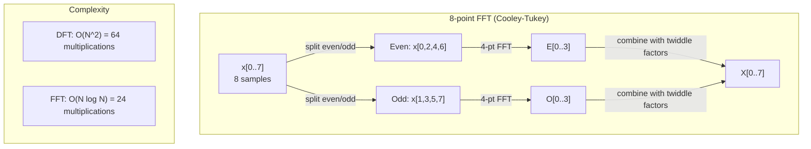
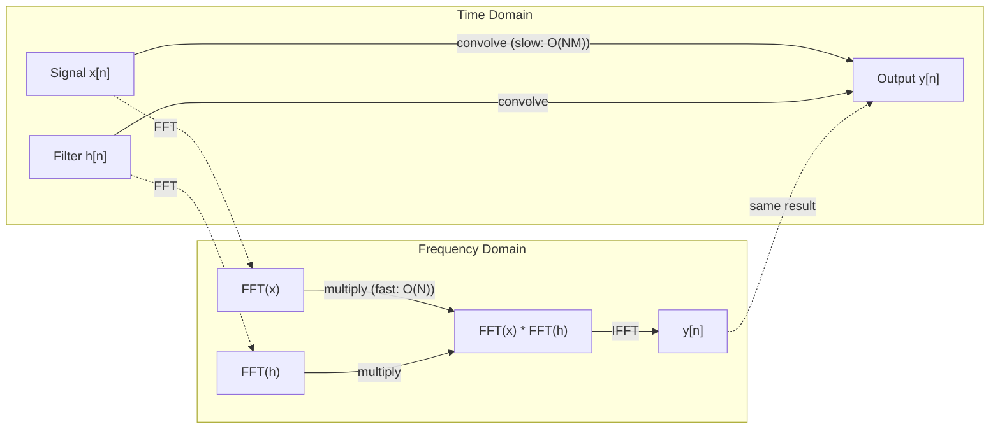

# Transformación de Fourier

> Cada señal es una superposición de ondas sinusoideas. La transformación de Fourier te dirá cuáles son.

**Type:** Build
**Language:**Python
**Prerequisites:** Phase 1, Lessons 01-04, 19 (complex numbers)
**Time:** ~90 分钟

## El objetivo del aprendizaje
- Desde零 realizar DFT,并使用O(N log N) de Cooley-Tukey FFT 验证它
- Comprender los coeficientes de frecuencia: de señal en el espectro de amplitud, fase y potencia
-  aplicación del teorema de la convolución, a través de la multiplicación FFT  ejecutar la convolución
- La descomposición de la frecuencia de Fourier con los codificadores posicionales del transformador y las capas de convolución de CNN  enlace

##  problemas
Una serie de valores de la presión que cambian con el tiempo. El precio de la acción es una serie de valores de la intensidad de los píxeles en el espacio.

Pero muchos patrones en el dominio del tiempo son invisibles. ¿Esta señal de audio es tono puro o acorde? ¿Existe un ciclo semanal? ¿Esta imagen tiene textura repetitiva?

La transformación de Fourier transformará los datos del dominio del tiempo 转换到频域── recibe una señal,并将其分解成不同频率的弦波── cada una de las ondas sine tiene una amplitud (强度) y una fase (起始位置)──La transformación de Fourier transformará simultáneamente para indicarles estas dos cosas──

Esto es importante para el ML, porque el pensamiento de dominio de frecuencia 隨處可见──Convolución de redes neuronales  ejecutar la convolución, mientras que la convolución en el dominio de frecuencia es la multiplicación──Transformar codificaciones posicionales Utiliza la descomposición de frecuencia para indicar la posición──Modelos de audio(Reconocimiento de habla、 generación de música) procesar espectrogramas, es decir, representaciones de frecuencia de sonido──Modelos de serie de tiempo 会寻找周期模式──entender la transformación de Fourier, hacerte equipar para tratar estos problemas el vocabulario necesario──

## 概念
### La definición de DFT

给定 N 个 muestras x[0], x[1], ..., x[N-1],Discrete Fourier Transform 会生成 N 个 frecuencias coeficientes X[0], X[1], ..., X[N-1]:

```
X[k] = sum_{n=0}^{N-1} x[n] * e^(-2*pi*i*k*n/N)

for k = 0, 1, ..., N-1
```

Cada X[k] es un número complejo. Su magnitud. X[k] también representa la amplitud de la frecuencia k. Su ángulo de fase.

¿Qué es esto?`e^(-2*pi*i*k*n/N)`Es una fase que gira en frecuencia k. La DFT calcula la correlación entre la señal y N 个等间隔频率. Si la señal en frecuencia k arriba contiene energía, la correlación es muy grande.

### El significado de cada uno de los números

**X[0]: DC component。**Es la suma de todas las muestras, con la proporción de 成比例 media.

```
X[0] = sum_{n=0}^{N-1} x[n] * e^0 = sum of all samples
```

**X[k] for 1 <= k <= N/2: positive frequencies。**X[k] muestra cada N 个 muestras 中 k 个周期 的频率──k 越大,频率 越高(oscillación 越快)──

**X[N/2]: Nyquist frequency。**Es la frecuencia máxima de N 个 muestras 能表示的── exceder esta frecuencia, se produce alias, es decir, frecuencias altas 伪装成低频──

**X[k] for N/2 < k < N: negative frequencies。**对于真实值的信号,X[N-k] = conj(X[k])。 las frecuencias negativas son las positivas de las imágenes── ése es el motivo por el cual la información útil se encuentra en los coeficientes anteriores N/2 + 1 ‖ 中──

### DFT inverso

Reverso DFT de los coeficientes de frecuencia de la reunión 重建原始信号:

```
x[n] = (1/N) * sum_{k=0}^{N-1} X[k] * e^(2*pi*i*k*n/N)

for n = 0, 1, ..., N-1
```

La única diferencia entre el DFT de adelante y el exponente medio es que el símbolo es positivo, y que tiene un factor de normalización 1/N.

La DFT inversa es una reconstrucción perfecta. No perderá ningún tipo de información. Puedes pasar del dominio del tiempo al dominio de la frecuencia, volver y volver sin producir ningún error.

### El FFT: hacerlo rápido

Como se define anteriormente, el DFT es O(N^2): para cada uno de los coeficientes de salida de N, es necesario para N 个输入样本求和──当 N = 1 millón 时, esto es una operación de 10^12 veces──

La transformación rápida de Fourier (FFT) se realizará con O(N log N) 计算同样结果──当N = 1 millón 时, esto es aproximadamente 2.000.000 veces operaciones, en lugar de 1.000.000 veces── esto hace que el análisis de frecuencia 变得可行──

Algorithm Cooley-Tukey (FFT) utiliza dividir y conquistar:

1. Se dividirá la señal en muestras de índice par y impar.
2. 递归计算每一半的 DFT──
3. Utiliza "factores de doble" e^(-2*pi*i*k/N) 合并两个 DFT de medio tamaño。

```
X[k] = E[k] + e^(-2*pi*i*k/N) * O[k]          for k = 0, ..., N/2 - 1
X[k + N/2] = E[k] - e^(-2*pi*i*k/N) * O[k]    for k = 0, ..., N/2 - 1

where E = DFT of even-indexed samples
      O = DFT of odd-indexed samples
```

Esta simetría significa que cada uno de los niveles de la recurrente ejecuta el trabajo O (N), y también tiene un log2 (N) 层──总计:O (N) log N (N)).



FFT  requerir longitud de señal es de 2 ── En la práctica, las señales normalmente se cero-pad hasta el siguiente de 2 ──

### Análisis espectral

**power spectrum**Sí, X es el cuadrado de cada coeficiente de frecuencia.

**phase spectrum**Es el ángulo ((X[k]), es el defset de fase de cada frecuencia. Para la mayoría de las tareas de análisis, lo que te preocupa es el espectro de potencia, y no te preocupas por la fase.

```
Power at frequency k:  P[k] = |X[k]|^2 = X[k].real^2 + X[k].imag^2
Phase at frequency k:  phi[k] = atan2(X[k].imag, X[k].real)
```

### Resolución de frecuencia

Resolución de frecuencia de DFT  depende de las muestras 数量 N 和 muestreo de tasa fs。

```
Frequency of bin k:      f_k = k * fs / N
Frequency resolution:    delta_f = fs / N
Maximum frequency:       f_max = fs / 2  (Nyquist)
```

Para distinguir dos frecuencias muy cercanas, necesitas más muestras... para capturar frecuencias altas, necesitas una tasa de muestreo más alta...

### El teorema de la convolución

Este es uno de los resultados más importantes del procesamiento de señales, y está directamente relacionado con las CNN.

**time domain 中的 convolution 等于 frequency domain 中的 pointwise multiplication。**

```
x * h = IFFT(FFT(x) . FFT(h))

where * is convolution and . is element-wise multiplication
```

¿Por qué es importante ?

- 两个长度为 N 和 M de señales 直接卷曲 需要 O(N*M) operaciones。
- 基于 FFT 的卷曲 需要 O(N log N):transform 两者、multiply、transform back。
-  Para los núcleos grandes, la convolución FFT 会快得多──
- Esto es lo que ocurre en las capas convolutivas de campos receptivos grandes.

Nota:DFT  calcular es una convolución circular (signal 会 wrap around) ・・・ Para la convolución lineal (linear convolución) ⋅ sin envoltura, por favor en el cálculo anterior se darán dos señales de cero pad hasta la longitud N + M - 1―



### Las ventanas

DFT 假设信号是周期的,也就是把N个样本视为无限重复信号的一个周期――如果信号的起点和终点不是同一个值,就会在边界产生间断,并表现为虚假的高频内容――这称为光谱泄漏――

Las ventanas se encuentran en el cálculo de DFT, de modo que la señal de los dos extremos se reduce a cero, lo que reduce la fuga.

常见 ventanas:

| Window | Shape | Main lobe width | Side lobe level | Use case |
|--------|-------|----------------|-----------------|----------|
| Rectangular | 平坦（无 window） | 最窄 | 最高 (-13 dB) | 当 signal 在 N 个 samples 中正好 periodic 时 |
| Hann | Raised cosine | 中等 | 低 (-31 dB) | 通用 spectral analysis |
| Hamming | Modified cosine | 中等 | 更低 (-42 dB) | Audio processing、speech analysis |
| Blackman | Triple cosine | 宽 | 非常低 (-58 dB) | 当 side lobe suppression 至关重要时 |

```
Hann window:    w[n] = 0.5 * (1 - cos(2*pi*n / (N-1)))
Hamming window: w[n] = 0.54 - 0.46 * cos(2*pi*n / (N-1))
```

Antes de DFT, la ventana se aplicará a la señal haciendo la multiplicación de elementos para la ventana:`X = DFT(x * w)`¿Qué es eso?

### Propiedades de DFT

| Property | Time Domain | Frequency Domain |
|----------|-------------|-----------------|
| Linearity | a*x + b*y | a*X + b*Y |
| Time shift | x[n - k] | X[f] * e^(-2*pi*i*f*k/N) |
| Frequency shift | x[n] * e^(2*pi*i*f0*n/N) | X[f - f0] |
| Convolution | x * h | X * H (pointwise) |
| Multiplication | x * h (pointwise) | X * H (circular convolution, scaled by 1/N) |
| Parseval's theorem | sum \|x[n]\|^2 | (1/N) * sum \|X[k]\|^2 |
| Conjugate symmetry (real input) | x[n] real | X[k] = conj(X[N-k]) |

El teorema de Parseval expresa la energía total en dos dominios entre los mismos.

### Enlace con codificación posicional

Original Transformer Utiliza codificaciones posicionales sinusoidales:

```
PE(pos, 2i)   = sin(pos / 10000^(2i/d_model))
PE(pos, 2i+1) = cos(pos / 10000^(2i/d_model))
```

Cada par de dimensiones (2i, 2i+1) oscila con diferentes frecuencias. Las frecuencias de alta (dimensión 0,1) a baja (dimensiones finales) se realizan según el espacio geométrico. Esto permite que cada posición en todas las bandas de frecuencia tenga un patrón único, similar a los coeficientes de Fourier.

Ofrece propiedades clave:

- **Uniqueness:**Cualquier dos posiciones no tendrán la misma codificación.
- **Bounded values:**Sin 和 cos 始终在 [-1, 1] 内。
- **Relative position:**La codificación de posición p+k puede expresarse como función lineal de la posición p 处 codificación──modelo puede aprender a concentrarse en posiciones relativas──

### Conexión con las CNN

La capa de conversión                                                                                                                                                                                                                                                                                                                                                                                                                                                                                                                         

Según el teorema de la convolución, esto es lo siguiente:
1. Para la entrada  ejecutar FFT
2. Para ejecutar el FFT
3. En el dominio de frecuencia multiplicar
4. Para el resultado de la ejecución de la IFFT

标准 CNN 实现使用直接卷积 (convolucción directa) 对小型3x3 kernels 更快) 但是对于大型 kernels或全球卷积,基于FFT的方法会显著更快──一些架构 (por ejemplo, FNet) 完全使用FFT 替代注意,在 O(N log N) 而非 O(N^2) complejidad 下获得有竞争力的精度──

### Espectogramas y Transformación de Fourier de corto plazo

单次 FFT dará el contenido de frecuencia de toda la señal, pero no puede decirte estas frecuencias cuándo aparecen.                                                                                                                                                                                                                                                 

La transformación de Fourier de tiempo corto (STFT) 通过在信号的重叠窗户上计算 FFT来解决这个问题──结果是光谱:一种2D representación, una de las cuales es el tiempo, otro eje es la frecuencia──intensidad de cada punto indicando el tiempo arriba de esta frecuencia──energía──

```
STFT procedure:
1. Choose a window size (e.g., 1024 samples)
2. Choose a hop size (e.g., 256 samples -- 75% overlap)
3. For each window position:
   a. Extract the windowed segment
   b. Apply a Hann/Hamming window
   c. Compute FFT
   d. Store the magnitude spectrum as one column of the spectrogram
```

Los espectrogramas son la representación estándar de los modelos de audio ML. Los modelos de reconocimiento de voz (Whisper, DeepSpeech) procesan los espectrogramas mel, es decir, las frecuencias se proyectan a escala mel, lo que se ajusta más a la percepción de tono humana.

### Alfabetización

Si la señal incluye frecuencias superiores a fs/2 (frecuencia Nyquist), a la velocidad de fs muestreo se producirán copias alias. Una señal de 90 Hz de muestreo de 100 Hz se parece a la señal de 10 Hz  completamente igual. Sólo con muestras  imposible distinguirlos.

```
Example:
  True signal: 90 Hz sine wave
  Sampling rate: 100 Hz
  Apparent frequency: 100 - 90 = 10 Hz

  The samples from the 90 Hz signal at 100 Hz sampling rate
  are identical to the samples from a 10 Hz signal.
  No amount of math can recover the original 90 Hz.
```

Es por eso que los convertidores analógicos a digitales contendrán filtros antialiasing, en muestreo de la muestreo anterior a la transferencia de frecuencias de Nyquist. En ML, cuando no hay un filtro de bajo paso apropiado en cuanto a mapas de características de muestreo de abajo, surgirá aliasing; algunas arquitecturas utilizan capas de aglutinamiento antialiasing para tratar este problema.

### El empate cero no mejora la resolución

Un error común es: en FFT antes de la señal  realizar empadeo cero 会提升频分辨率──它不会──零padding 只是插在现有频段之间,让频谱看起来更平滑──但它无法揭示原始样本中不存在的频率细节──

La resolución de frecuencia verdadera sólo depende del tiempo de observación T = N / fs。 para distinguir la diferencia de las dos frecuencias del delta_f, usted necesita al menos T = 1 / delta_f 秒 de datos。 No importa cuánto haga el empate cero, no puede cambiar este límite fundamental―


```figure
fourier-synthesis
```

## Construirlo
### 步骤 1: DFT desde cero

O  N ^ 2) DFT  directamente de la definición

```python
import math

class Complex:
    ...

def dft(x):
    N = len(x)
    result = []
    for k in range(N):
        total = Complex(0, 0)
        for n in range(N):
            angle = -2 * math.pi * k * n / N
            w = Complex(math.cos(angle), math.sin(angle))
            xn = x[n] if isinstance(x[n], Complex) else Complex(x[n])
            total = total + xn * w
        result.append(total)
    return result
```

### 步骤 2: DFT inverso

结构 igual, exponente 为正,并除以 N。

```python
def idft(X):
    N = len(X)
    result = []
    for n in range(N):
        total = Complex(0, 0)
        for k in range(N):
            angle = 2 * math.pi * k * n / N
            w = Complex(math.cos(angle), math.sin(angle))
            total = total + X[k] * w
        result.append(Complex(total.real / N, total.imag / N))
    return result
```

### 步骤 3: FFT (Cooley-Tukey)

FFT recursiva 要求长度为 2 的──拆分为 even 和 odd,递归, luego con factores de doble 合并──

```python
def fft(x):
    N = len(x)
    if N <= 1:
        return [x[0] if isinstance(x[0], Complex) else Complex(x[0])]
    if N % 2 != 0:
        return dft(x)

    even = fft([x[i] for i in range(0, N, 2)])
    odd = fft([x[i] for i in range(1, N, 2)])

    result = [Complex(0)] * N
    for k in range(N // 2):
        angle = -2 * math.pi * k / N
        twiddle = Complex(math.cos(angle), math.sin(angle))
        t = twiddle * odd[k]
        result[k] = even[k] + t
        result[k + N // 2] = even[k] - t
    return result
```

### 步骤 4: Auxiliares de análisis espectral

```python
def power_spectrum(X):
    return [xk.real ** 2 + xk.imag ** 2 for xk in X]

def convolve_fft(x, h):
    N = len(x) + len(h) - 1
    padded_N = 1
    while padded_N < N:
        padded_N *= 2

    x_padded = x + [0.0] * (padded_N - len(x))
    h_padded = h + [0.0] * (padded_N - len(h))

    X = fft(x_padded)
    H = fft(h_padded)

    Y = [xk * hk for xk, hk in zip(X, H)]

    y = idft(Y)
    return [y[n].real for n in range(N)]
```

## Usalo
En el trabajo real, usando FFT de numpy, es apoyado por bibliotecas C altamente optimizadas.

```python
import numpy as np

signal = np.sin(2 * np.pi * 5 * np.arange(256) / 256)
spectrum = np.fft.fft(signal)
freqs = np.fft.fftfreq(256, d=1/256)

power = np.abs(spectrum) ** 2

positive_freqs = freqs[:len(freqs)//2]
positive_power = power[:len(power)//2]
```

 Para el análisis espectral de ventanas y más avanzado:

```python
from scipy.signal import windows, stft

window = windows.hann(256)
windowed = signal * window
spectrum = np.fft.fft(windowed)
```

 Para la convolución:

```python
from scipy.signal import fftconvolve

result = fftconvolve(signal, kernel, mode='full')
```

 Para los espectrogramas:

```python
from scipy.signal import stft

frequencies, times, Zxx = stft(signal, fs=sample_rate, nperseg=256)
spectrogram = np.abs(Zxx) ** 2
```

Es la forma de la matriz de espectro es (n_frecuencias, n_time_frames) ⋅ cada una de las filas son una ventana de tiempo ⋅ el espectro de potencia de la matriz ⋅ esto es el audio de los modelos ML ⋅ como entrada ⋅ consumo ⋅ contenido

##  entregarlo
运行                                                                                                                                                                                                                                                                                                                                                                                                                                                                                                                           `code/fourier.py`¿Qué es esto ?`outputs/prompt-spectral-analyzer.md`¿Qué es eso?

##  ejercicios
1. **Pure tone identification。**创建一个信号,其中包含一个未知频率(1到50 Hz 之间) de una sola onda senoidal, con muestreo de 128 Hz 1 秒──使用你的DFT 识别频率──验证答案是否匹配──现在加入标准偏差为0.5的高斯噪音,并重复──噪音 如何影响光谱?

2. **FFT vs DFT verification。**生成一个长度为 64 的随机信号――同时计算 DFT(O(N^2)) y FFT──验证所有系数在 1e-10 以内匹配──在长度为 256、512、1024 和 2048 的信号上分别计时两个函数──绘制 DFT时间与 FFT时间的比例──

3. **Convolution theorem proof by example。**创建信号 x = [1, 2, 3, 4, 0, 0, 0, 0] 和 filter h = [1, 1, 1, 0, 0, 0, 0, 0]──直接计算它们的圆卷 (圆卷) 嵌套)──然后通过FFT 计算(转换、乘用、逆转)──验证结果匹配──现在通过适当的零执行线性卷──

4. **Windowing effects。**Crear una señal, es 10 Hz y 12 Hz ((muy cerca) dos ondas senolares de y ⋅ en 128 Hz muestreo 1 segundo separado en sin ventana ⋅ ventana Hann y ventana Hamming ⋅ en el cálculo del espectro de potencia ⋅ en qué ventana es más fácil distinguir entre dos picos? ¿Por qué?

5. **Positional encoding analysis。**Por d_modelo = 128 y max_pos = 512 生成 sinusidal positional encodings──对每一对位置 (p1, p2),计算它们的点产品──说明点产品 只依赖于p1 - p2的位置,而不依赖于绝对位置──随着距离 增加,点产品会发生什么?

## 关键术语: "El hombre es un hombre"
| Term | What it means |
|------|---------------|
| DFT (Discrete Fourier Transform) | 将 N 个 time-domain samples 转换为 N 个 frequency-domain coefficients。每个 coefficient 都是与该 frequency 上 complex sinusoid 的 correlation |
| FFT (Fast Fourier Transform) | 用于计算 DFT 的 O(N log N) algorithm。Cooley-Tukey algorithm 递归拆分 even/odd indices |
| Inverse DFT | 从 frequency coefficients 重建 time-domain signal。公式与 DFT 相同，但 exponent sign 相反，并带有 1/N scaling |
| Frequency bin | DFT output 中的每个 index k 表示 frequency k*fs/N Hz。"bin" 是离散的 frequency slot |
| DC component | X[0]，zero-frequency coefficient。与 signal mean 成比例 |
| Nyquist frequency | fs/2，在 sampling rate fs 下可表示的最大 frequency。高于它的 frequencies 会 alias |
| Power spectrum | \|X[k]\|^2，每个 frequency coefficient 的 squared magnitude。显示 energy 在 frequencies 上的分布 |
| Phase spectrum | angle(X[k])，每个 frequency component 的 phase offset。在 analysis 中通常会忽略 |
| Spectral leakage | 将 non-periodic signal 当作 periodic 处理导致的虚假 frequency content。可通过 windowing 减少 |
| Window function | 在 DFT 前应用的 tapering function（Hann、Hamming、Blackman），用于减少 spectral leakage |
| Twiddle factor | FFT butterfly computation 中用于合并 sub-DFTs 的 complex exponential e^(-2*pi*i*k/N) |
| Convolution theorem | time domain 中的 convolution 等于 frequency domain 中的 pointwise multiplication。它是 signal processing 和 CNNs 的基础 |
| Circular convolution | signal 会 wrap around 的 convolution。这是 DFT 自然计算的内容 |
| Linear convolution | 没有 wraparound 的标准 convolution。通过在 DFT 前 zero-padding 实现 |
| Parseval's theorem | 总 energy 在 Fourier transform 中保持不变。sum \|x[n]\|^2 = (1/N) sum \|X[k]\|^2 |
| Aliasing | 当 sampling rate 不足时，高于 Nyquist 的 frequencies 表现为较低 frequencies |

## 延伸阅读
- [Cooley & Tukey: An Algorithm for the Machine Calculation of Complex Fourier Series (1965)](https://www.ams.org/journals/mcom/1965-19-090/S0025-5718-1965-0178586-1/)-   modificar la informática  original FFT 论文
- [3Blue1Brown: But what is the Fourier Transform?](https://www.youtube.com/watch?v=spUNpyF58BY)-  Sobre las mejores visibilidades de las transformaciones de Fourier
- [Lee-Thorp et al.: FNet: Mixing Tokens with Fourier Transforms (2021)](https://arxiv.org/abs/2105.03824)- En transformadores en el uso de FFT  sustitución de la auto-atención
- [Smith: The Scientist and Engineer's Guide to Digital Signal Processing](http://www.dspguide.com/)- 免费在线教材, en profundidad, FFT, ventanas y análisis espectral
- [Vaswani et al.: Attention Is All You Need (2017)](https://arxiv.org/abs/1706.03762)- Descomposición de la frecuencia de Fourier  Derivados codificadores sinusoidales de posición
- [Radford et al.: Whisper (2022)](https://arxiv.org/abs/2212.04356)- Utiliza mel-spectrogramas  como representación de entrada de reconocimiento de voz
