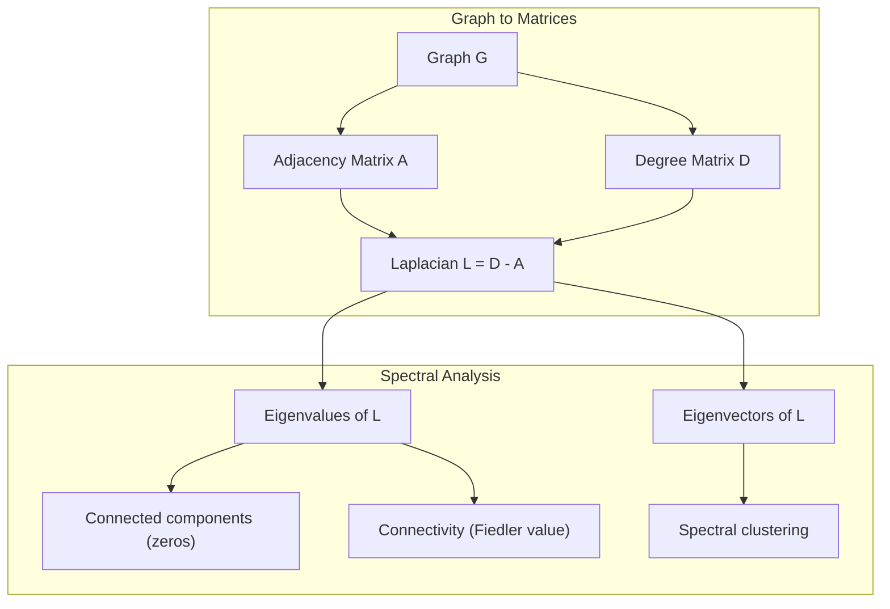
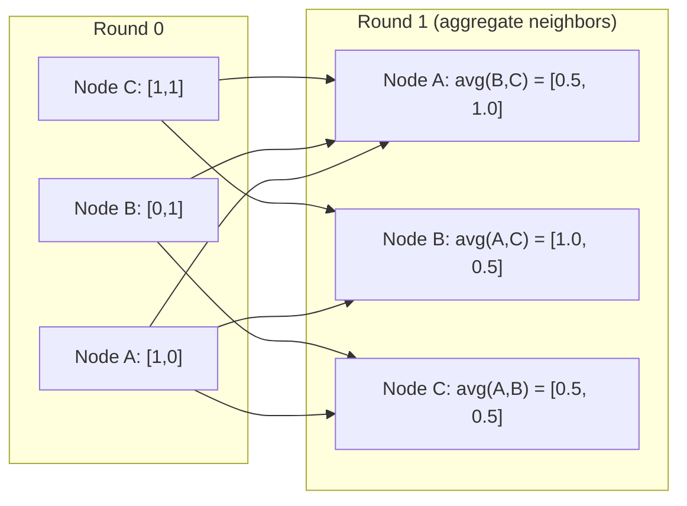

# 面向 Máquina de aprendizaje de la teoría de gráficos

> El gráfico es la estructura de datos de la relación. Si sus datos contienen conexiones, usted necesita la teoría de gráficos.

**Type:** Build
**Language:**Python
**Prerequisites:** Phase 1, Lessons 01-03（linear algebra, matrices）
**Time:** ~90 分钟

## El objetivo del aprendizaje
- Construir una clase de gráfico, contenida matriz/lista adyacente 表示,并实现 BFS 和 DFS 遍历
- 计算 graph Laplacian,并使用其自值 检测 conectados componentes 和对节点 聚类
- 将一轮 GNN 风格的信息传递 实现为正常化的邻接矩阵乘法
- Utiliza Fiedler vector  aplicación de agrupación espectral para dividir gráfico

##  problemas
Las redes sociales, las moléculas, las bases de conocimiento, las redes de citas, los mapas de carretera son gráficos. Tradicionalmente, los sistemas de comunicación se consideran gráficos. Cada línea es independiente.

考虑一个社交网络――你想预测某用户会购买什么产品―― su historial de compra es importante―― pero el historial de compra de sus amigos es más importante―― la conexión misma lleva el mensaje――

O pensar en una molécula. Usted piensa en predecir si se unirá con una proteína. Los átomos son importantes, pero lo que realmente importa es cómo los átomos se hacen unidos.

Las redes neuronales gráficas (GNN) son el campo de desarrollo más rápido del aprendizaje profundo. Impulsan el descubrimiento de drogas, la recomendación social, la detección de fraudes y el razonamiento gráfico del conocimiento.

Necesitas cuatro cosas:
1. Un tipo de gráficos expresan matrices de manera que puedes hacer multiplicas para ellos)
2. Usado para explorar la estructura del gráfico de algoritmos de cruce
3. Laplacian, esta es la teoría de gráficos espectrales.
4. El mensaje de paso, es hacer GNNs 工作的操作

## 概念
### Gráficos: nodos y bordes

Un gráfico G = (V, E) por vertices (nodos) V 和 bordes E 组成──每条 edge 连接两个节点──

**Directed vs undirected。**En el gráfico no dirigido, el borde (u, v) muestra u 连接到 v,并且 v 也连接到 u──En el gráfico dirigido, el borde (u, v) muestra u 指向 v, pero反向不一定成立──

**Weighted vs unweighted。**En el gráfico sin peso, los bordes deben existir o no existir. En el gráfico con peso, cada borde tiene un peso de valor, por ejemplo, distancia, costo o fuerza.

| Graph type | Example |
|-----------|---------|
| Undirected, unweighted | Facebook friendship network |
| Directed, unweighted | Twitter follow network |
| Undirected, weighted | Road map（distances） |
| Directed, weighted | Web page links（PageRank scores） |

### La matriz de la proximidad

Matriz de adyacencia A es el núcleo de la muestra.

```
A[i][j] = 1    if there is an edge from node i to node j
A[i][j] = 0    otherwise
```

对于不指向图表,A 是对称:A[i][j] = A[j][i]。对于权重图表,A[i][j] =边缘 (i, j) 的重量。

**示例：一个 triangle：**

```
Nodes: 0, 1, 2
Edges: (0,1), (1,2), (0,2)

A = [[0, 1, 1],
     [1, 0, 1],
     [1, 1, 0]]
```

Matriz de adyacencia es cada entrada de GNN.

### Grado

El grado de nodo es conectado a sus bordes 数量── para los gráficos dirigidos, tienes en grado(edges de entrada) y fuera de grado(edges de salida)──

Matriz de grados D es diagonal:

```
D[i][i] = degree of node i
D[i][j] = 0    for i != j
```

对于三角形示例:D = diag(2,2,2), pues cada nodo están conectados a otros dos nodos.

Grado 告诉你节点的重要性──High degree = hub node──a red de grado distribución 揭示了它的结构──Social networks 遵循电力规律(少量枢纽,许多叶节)──random graphs 具有波森分布级――

### BFS y DFS

Dos algoritmos básicos de travesía gráfica.

**Breadth-First Search (BFS)：**Antes de explorar todos los vecinos, después de explorar los vecinos de los vecinos, uso de cola (FIFO)

```
BFS from node 0:
  Visit 0
  Queue: [1, 2]        (neighbors of 0)
  Visit 1
  Queue: [2, 3]        (add neighbors of 1)
  Visit 2
  Queue: [3]           (neighbors of 2 already visited)
  Visit 3
  Queue: []            (done)
```

BFS se encuentra en los gráficos sin ponderación de los caminos más cortos. La distancia desde el punto de partida hasta cualquier nodo es igual a la primera vez que se encuentra en el nivel BFS de este nodo.

**Depth-First Search (DFS)：**En el caso de la reversión, el uso de la pila (LIFO) o la recursión, se puede utilizar en el proceso de reversión.

```
DFS from node 0:
  Visit 0
  Stack: [1, 2]        (neighbors of 0)
  Visit 2               (pop from stack)
  Stack: [1, 3]         (add neighbors of 2)
  Visit 3               (pop from stack)
  Stack: [1]
  Visit 1               (pop from stack)
  Stack: []             (done)
```

DFS se puede utilizar:
- 查找 componentes conectados(从未访问的节点 运行 DFS)
- Detección de ciclo (DFS árbol)
- Sortado topológico (en orden de finalización de DFS)

| Algorithm | Data structure | Finds | Use case |
|-----------|---------------|-------|----------|
| BFS | Queue | Shortest paths | Social network distance, knowledge graph traversal |
| DFS | Stack | Components, cycles | Connectivity, topological sort |

### El gráfico laplaciano

L = D - A。 teoría del gráfico espectral 中最重要的矩阵──

 Para el triángulo:

```
D = [[2, 0, 0],    A = [[0, 1, 1],    L = [[2, -1, -1],
     [0, 2, 0],         [1, 0, 1],         [-1, 2, -1],
     [0, 0, 2]]         [1, 1, 0]]         [-1, -1,  2]]
```

La laplacia 具有非常重要的性质:

1. **L 是 positive semi-definite。**Todos los valores propios tienen >= 0

2. **zero eigenvalues 的数量等于 connected components 的数量。**Un gráfico conectado 恰恰有一个零 eigenvalue──一个有3 个分离的组件的图片有三个零 eigenvalue──

3. **最小的 non-zero eigenvalue（Fiedler value）衡量 connectivity。**较大的Fiedler value 表示图 连接良好──较小的Fiedler value 表示图 有一个薄弱点,也就是瓶──

4. **Fiedler value 的 eigenvector（Fiedler vector）揭示最佳切分。**值为正的节点 进入一组,值为负的节点 进入另一组──这就是光谱集群──



### Propiedades espectral

Los valores propios de la matriz adyacente y la laplacia pueden revelar propiedades estructurales en caso de no hacer ningún cruce.

**Spectral clustering**El método de trabajo es el siguiente:
1. 计算 Laplacian L
2. 找到 L's k 个最小 eigenvectors(跳过第一个; para los gráficos conectados, es todo 1)
3. Para usar estos propios vectores como nuevos marcadores de cada nodo
4. En estos lugares se ejecuta k-means

¿Por qué esto es efectivo? Los vectores propios de L  codificaron la gráfica                                                                                                                                                                                                                                                     

**Random walk connection。**La distribución estacionaria de la marcha aleatoria tiene un efecto negativo en la distribución de la marcha aleatoria.

### El mensaje se pasa

Es el núcleo de las redes neuronales gráficas. Cada nodo recolecta mensajes de sus vecinos, los agrupa y luego actualiza su propio estado.

```
h_v^(k+1) = UPDATE(h_v^(k), AGGREGATE({h_u^(k) : u in neighbors(v)}))
```

En la forma más simple, AGGREGATE = media, UPDATE = transformación lineal + activación:

```
h_v^(k+1) = sigma(W * mean({h_u^(k) : u in neighbors(v)}))
```

Esto es en realidad una falsa forma de multiplicación de matriz. Si H es la matriz de todas las características de los nodos, A es la matriz de adyacencia:

```
H^(k+1) = sigma(A_norm * H^(k) * W)
```

Entre ellos, la norma A es una matriz de adyacencia normalizada.

Una ronda de mensajes pasando 让每个节点 看到它的邻居――两轮让它看到邻居的邻居――K 轮让每个节点 获得来自其K-hop社区的信息――



### 概念与 ML 应用

| Concept | ML Application |
|---------|---------------|
| Adjacency matrix | GNN input representation |
| Graph Laplacian | Spectral clustering, community detection |
| BFS/DFS | Knowledge graph traversal, path finding |
| Degree distribution | Node importance, feature engineering |
| Message passing | GNN layers (GCN, GAT, GraphSAGE) |
| Eigenvalues of L | Community detection, graph partitioning |
| Spectral clustering | Unsupervised node grouping |
| PageRank | Node importance, web search |


```figure
graph-degree-distribution
```

## Construirlo
### Paso 1: desde cero para lograr gráfico

```python
class Graph:
    def __init__(self, n_nodes, directed=False):
        self.n = n_nodes
        self.directed = directed
        self.adj = {i: {} for i in range(n_nodes)}

    def add_edge(self, u, v, weight=1.0):
        self.adj[u][v] = weight
        if not self.directed:
            self.adj[v][u] = weight

    def neighbors(self, node):
        return list(self.adj[node].keys())

    def degree(self, node):
        return len(self.adj[node])

    def adjacency_matrix(self):
        import numpy as np
        A = np.zeros((self.n, self.n))
        for u in range(self.n):
            for v, w in self.adj[u].items():
                A[u][v] = w
        return A

    def degree_matrix(self):
        import numpy as np
        D = np.zeros((self.n, self.n))
        for i in range(self.n):
            D[i][i] = self.degree(i)
        return D

    def laplacian(self):
        return self.degree_matrix() - self.adjacency_matrix()
```

lista de adyacentes`self.adj`) puede almacenar al lado de la matriz adyacente 转换使用numpy, pues todas las operaciones espectrales la necesitan 

### 步骤 2: BFS y DFS

```python
from collections import deque

def bfs(graph, start):
    visited = set()
    order = []
    distances = {}
    queue = deque([(start, 0)])
    visited.add(start)
    while queue:
        node, dist = queue.popleft()
        order.append(node)
        distances[node] = dist
        for neighbor in graph.neighbors(node):
            if neighbor not in visited:
                visited.add(neighbor)
                queue.append((neighbor, dist + 1))
    return order, distances


def dfs(graph, start):
    visited = set()
    order = []
    stack = [start]
    while stack:
        node = stack.pop()
        if node in visited:
            continue
        visited.add(node)
        order.append(node)
        for neighbor in reversed(graph.neighbors(node)):
            if neighbor not in visited:
                stack.append(neighbor)
    return order
```

BFS utiliza deque(dos filas de filas) para realizar O(1) popleft。DFS utiliza lista 作为堆──两者都会恰好访问每个节点 一次,时间复杂度为 O(V + E)。

### Paso 3:Componentes conectados y valores propios laplacios

```python
def connected_components(graph):
    visited = set()
    components = []
    for node in range(graph.n):
        if node not in visited:
            order, _ = bfs(graph, node)
            visited.update(order)
            components.append(order)
    return components


def laplacian_eigenvalues(graph):
    import numpy as np
    L = graph.laplacian()
    eigenvalues = np.linalg.eigvalsh(L)
    return eigenvalues
```

`eigvalsh`Se utiliza para matrices simétricas, mientras que la laplacia para gráficos no dirigidos es siempre simétrica.

### Paso 4: Clustering espectral

```python
def spectral_clustering(graph, k=2):
    import numpy as np
    L = graph.laplacian()
    eigenvalues, eigenvectors = np.linalg.eigh(L)
    features = eigenvectors[:, 1:k+1]

    labels = np.zeros(graph.n, dtype=int)
    for i in range(graph.n):
        if features[i, 0] >= 0:
            labels[i] = 0
        else:
            labels[i] = 1
    return labels
```

对于 k=2,Fiedler vector 符号会将图分成两个集群──对于 k>2,你会在前 k 个个个个个个个个个个个个个个个个个个个个个个个个个个个个个个个个个个个个个个个个个个个个个个个个个个个个个个个个个个个个个个个个个个个个个个个个个个个个个个个个个个个个个个个个个个个个个个个个个个个个个个个个个个个个个个个个个个个个个个个个个个个个个个个个个个个个个个个个个个个个个个个个个个个个个个个个个个个个个个个个个个个个个个个个个个个个个个个个个个个个个个个个个个个个个个个个个个个个个个个个个个个个个个个个个个个个个个个个个个个个个个个个个个个个个个个个个个个个个个个个个个个个个个个个个个个个个个个个个个个个个个个个个个个个个个个个个个个个个个个个个个个个个个个个个个个个个个个个个个个个个个个个个个个个个个个个个个个个个个个个个个个个个个个个个个个个个个个个个个个个个个个个个个个个个个个个个个个个个个个个个个个个个个个个个个个个个个个个个个个个个个个个个个个个个个个个个个个个个个个个个个个个个个个个个个个个个个个个个个个个个个个个个个个个个个个个个个个个个个个个个个个个个个个个个个个个个个个个个个个个个个个个个个个个个个个个个个个个个个

### Paso 5: Pasa de mensaje

```python
def message_passing(graph, features, weight_matrix):
    import numpy as np
    A = graph.adjacency_matrix()
    row_sums = A.sum(axis=1, keepdims=True)
    row_sums[row_sums == 0] = 1
    A_norm = A / row_sums
    aggregated = A_norm @ features
    output = aggregated @ weight_matrix
    return output
```

Esta es una ronda de transmisión de mensajes GNN. Las nuevas características de cada nodo son la media ponderada de las características de sus vecinos, re-transformando la matriz de peso.

## Usalo
Utilizando redx y numpy, las mismas operaciones son de una línea:

```python
import networkx as nx
import numpy as np

G = nx.karate_club_graph()

A = nx.adjacency_matrix(G).toarray()
L = nx.laplacian_matrix(G).toarray()

eigenvalues = np.linalg.eigvalsh(L.astype(float))
print(f"Smallest eigenvalues: {eigenvalues[:5]}")
print(f"Connected components: {nx.number_connected_components(G)}")

communities = nx.community.greedy_modularity_communities(G)
print(f"Communities found: {len(communities)}")

pr = nx.pagerank(G)
top_nodes = sorted(pr.items(), key=lambda x: x[1], reverse=True)[:5]
print(f"Top 5 PageRank nodes: {top_nodes}")
```

networkx puede utilizarse para optimizar los backends de C  procesar gráficos de cualquier tamaño  en producción  en uso en la producción  en versión de implementación para entender lo que está haciendo

### análisis espectral de la nudidad

```python
import numpy as np

A = np.array([
    [0, 1, 1, 0, 0],
    [1, 0, 1, 0, 0],
    [1, 1, 0, 1, 0],
    [0, 0, 1, 0, 1],
    [0, 0, 0, 1, 0]
])

D = np.diag(A.sum(axis=1))
L = D - A

eigenvalues, eigenvectors = np.linalg.eigh(L)
print(f"Eigenvalues: {np.round(eigenvalues, 4)}")
print(f"Fiedler value: {eigenvalues[1]:.4f}")
print(f"Fiedler vector: {np.round(eigenvectors[:, 1], 4)}")

fiedler = eigenvectors[:, 1]
group_a = np.where(fiedler >= 0)[0]
group_b = np.where(fiedler < 0)[0]
print(f"Cluster A: {group_a}")
print(f"Cluster B: {group_b}")
```

El vector Fiedler 承担了主要工作──正值条目位于一个集群,负值条目位于另一个集群── no necesita optimización iterativa, sólo necesita una sola propia composición──

##  entregarlo
本课产 出:
- `outputs/skill-graph-analysis.md`: para analizar datos estructurados en gráficos

## Las conexiones

| Concept | Where it shows up |
|---------|------------------|
| Adjacency matrix | GCN, GAT, GraphSAGE input |
| Laplacian | Spectral clustering, ChebNet filters |
| BFS | Knowledge graph traversal, shortest path queries |
| Message passing | Every GNN layer, neural message passing |
| Spectral gap | Graph connectivity, mixing time of random walks |
| Degree distribution | Power-law networks, node feature engineering |
| Connected components | Preprocessing, handling disconnected graphs |
| PageRank | Node importance ranking, attention initialization |

GNNs 值得特别说明──GCN(Kipf & Welling, 2017) en la operación de convolución de gráfico Utilizando añadido matriz de adyacencia de los bucles automáticos, A_hat = A + I:

```text
H^(l+1) = sigma(D_hat^(-1/2) * A_hat * D_hat^(-1/2) * H^(l) * W^(l))
```

Entre ellos A_hat = A + I(adyacencia加自环),D_hat es una matriz de grado de A_hat, los self-loops 确保每个节在集中的 期间包含自身特征──这正是带有对称的正常化的信息传递──D_hat^(-1/2) *A_hat *D_hat^(-1/2) es una matriz de adyacencia normalizada──Laplacian aparece aquí, es porque esta normalización se asocia con L_sym = I - D^(-1/2) *A * D^(-1/2) 相关── Comprender Laplacian,就意味着理解GCNs为什么有效──

##  ejercicios
1. **从零实现 PageRank。**Desde puntuaciones uniformes 开始──每一步:score(v) = (1-d) /n + d * suma(score(u) /out_degree(u)), de los cuales u es todo orientado hacia v nodos──使用 d=0.85──运行直到收(change < 1e-6)──在一个小型网页图上测试──

2. **使用 spectral clustering 查找 communities。**创建一个包含两个明显分离的集群的图表 (例如, dos clics 通过一条边缘 连接) 运行光谱集群,并验证它能找到正确分──当你添加更多跨集群边缘时会发生什么?

3. **为 weighted graphs 中的 shortest paths 实现 Dijkstra's algorithm。**En el mismo gráfico de con pesos uniformes, los resultados se compararán con BFS.

4. **构建一个 2-layer message passing network。**Utiliza diferentes matrices de peso  aplicando dos mensajes de paso 展示经过2轮后, cada nodo tiene información de su vecindario de 2 pasos 

5. **分析一个真实世界 graph。**Utiliza el gráfico del Club de Karate(34 nodos, 78 bordes)。 calcular la distribución de grados、valores propios Laplacian 和 agrupación espectral。

## 关键术语: "El hombre es un hombre"
| Term | What people say | What it actually means |
|------|----------------|----------------------|
| Graph | “Nodes and edges” | 一种数学结构 G=(V,E)，用于编码 pairwise relationships |
| Adjacency matrix | “The connection table” | 一个 n x n matrix，其中如果 nodes i 和 j 相连，则 A[i][j] = 1 |
| Degree | “一个 node 有多 connected” | 接触某个 node 的 edges 数量 |
| Laplacian | “D minus A” | L = D - A，其 eigenvalues 会揭示 graph structure 的 matrix |
| Fiedler value | “The algebraic connectivity” | L 的最小 non-zero eigenvalue，用于衡量 graph 连接得有多好 |
| BFS | “Level-by-level search” | 在深入之前先访问所有 neighbors 的 traversal，可找到 shortest paths |
| DFS | “Go deep first” | 在回溯之前沿一条 path 走到末端的 traversal |
| Message passing | “Nodes talk to neighbors” | 每个 node 从其 neighbors 聚合信息，这是 GNNs 的核心 |
| Spectral clustering | “Cluster by eigenvectors” | 使用 graph 的 Laplacian 的 eigenvectors 来划分 graph |
| Connected component | “A separate piece” | 一个 maximal subgraph，其中每个 node 都能到达其他每个 node |

## 延伸阅读
- **Kipf & Welling (2017)**: Clasificación semisupervisada con redes convolutivas de gráficos―开启现代 GNNs 的论文── mostró cómo simplificar las convoluciones de gráficos espectrales para el envío de mensajes―
- **Spielman (2012)** Teoría del gráfico espectral notas de conferencia― Sobre los laplacios― gaps espectral 和 graph partitioning―
- **Hamilton (2020)**El estudio de la representación gráfica de las GNNs es un libro de la base a la aplicación.
- **Bronstein et al. (2021)**:Depth Learning Geometric: Grids, Grupos, Gráficos, Geodésica y Medidores―统一框架论文―
- **Veličković et al. (2018)**:Graph Attention Networks──Utilise mecanismos de atención  ampliar el mensaje de transmisión──
