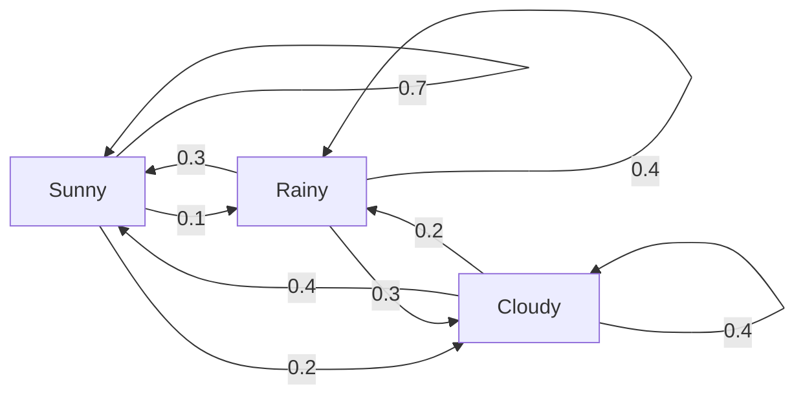
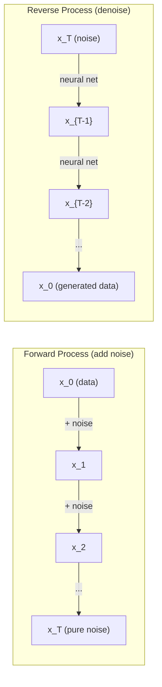

# Procesos estocásticos

> 具有结构的随机性──random walks、Markov chains 和 difusión modelos 背后的数学──

**Type:** Learn
**Language:**Python
**Prerequisites:** Phase 1, Lessons 06-07（probability, Bayes）
**Time:** ~75 分钟

## El objetivo del aprendizaje
- 模拟 1D 和 2D paseos aleatorios,并验证位移的平方(n) 缩放规律
- Construir cadena Markov 模拟器,并通过自己的组合 计算其静止分布
- realizar la dinámica de Metropolis-Hastings MCMC y Langevin, para utilizarse desde la distribución de objetivos
- Para establecer el proceso de difusión hacia adelante con el movimiento browniano                                                                                                                                                                                                                                                                                                                                                                                                                                                                                                              

##  problemas
Muchos sistemas de IA están relacionados con la casualidad de la evolución a lo largo del tiempo. No son casuales estáticos, sino estructurados, secuencializados, cada uno de los cuales depende de lo que ocurrió antes.

Los modelos de lenguaje una vez generan un token. Cada token depende del contexto anterior. El modelo saca una distribución de probabilidad, de la muestra, y luego continúa.

Los modelos de difusión país a la imagen añaden ruido, hasta que se convierta en ruido puro en estado de estado. Luego, revirtieron este proceso, denociendo gradualmente, hasta que apareció una nueva imagen.

Los agentes de aprendizaje de refuerzo toman acciones en el ambiente. Cada acción con cierta probabilidad conduce a un nuevo estado.

El muestreo MCMC es el pilar de la inferencia bayesiana, que construye una cadena de Markov, su distribución estacionaria es la que quieres tomar posteriormente.

Todo esto se basa en cuatro ideas básicas:
1. Paseos aleatorios  最简单的estochastic proceso
2. Cadena de Markov  带有过渡矩阵的结构化随机性
3. Dinámica de Langevin  带噪声的渐进下降
4. Metrópolis-Hastings  de la distribución arbitraria

## 概念
### Paseos aleatorios

Desde la posición 0 开始── cada paso,抛一枚公平硬币──正面:向右移动(+1)──反面:向左移动(-1)──

经过 n 步后, tu posición es n 个随机 +/-1 值的总和――期望位置是 0((((((((((((((((((((((((((((((((((((((((((((((((((((((((((((((((((((((((((((((((((((((((((((((((((((((((((((((((((((((((((((((((((((((((((((((((((((((((((((((((((((((((((((((((((((((((((((((((((((((((((((((((((((((((((((((((((((((((((((((((((((((((((((((((((((((((((((((((((((((((((((((((((((((((((((((((((((((((((((((((((((((((((((((((((((((((((((((((((((((((((((((((((((((((((((((((((((((((((((((((((((((((((((((((((((((((((((((((((((((((((((((()))))))))))))))))))))))))))))))))))))))))))))))))))))))))))))))))

Este paseo es justo, en las dos direcciones no hay derivación. Pero con el paso del tiempo, se aleja del punto de partida y se aleja de la distancia.

```
Step 0:  Position = 0
Step 1:  Position = +1 or -1
Step 2:  Position = +2, 0, or -2
...
Step 100: Expected distance from origin ~ 10 (sqrt(100))
Step 10000: Expected distance from origin ~ 100 (sqrt(10000))
```

**在 2D 中**,caminar a la velocidad de la probabilidad de subir, hacia abajo, hacia la izquierda o hacia la derecha.

**为什么是 sqrt(n)？**Cada paso está en una probabilidad de +1 o -1──n 步后, posición S_n = X_1 + X_2 + ... + X_n, de los cuales cada X_i es +/-1──n cada paso de variación es 1, y cada paso es independiente de uno del otro, por lo que Var(S_n) = n──diversión estándar = sqrt(n)── según el teorema de límite central, S_n / sqrt(n) 收到标准正常分布──

Esta clase de cuadrados se coloca en el ML en cualquier lugar que se vea.

**与 Brownian motion 的联系。**取一个步尺为 1/sqrt(n) 、每单位时间 n 步的随机走---当 n 趋近无穷时,这个走会收到布朗运动B(t)  一个连续时间过程,其中B(t) 服从平均值为0、变量为 t的正常分布──

El movimiento browniano es la base matemática de la difusión. El movimiento browniano representa el flujo de partículas en el cuerpo, así como el movimiento de los precios de las acciones, así como el proceso de ruido en los modelos de difusión.

**Gambler's ruin。**Un caminante aleatorio desde la posición k 开始, en 0 和 N 处有吸收障碍──到达 N 早于到达 0 的概率是多少?

### Las cadenas de Markov

La cadena de Markov es un sistema que se transfiere según la probabilidad fija entre los estados. La naturaleza clave es: el siguiente estado depende sólo del estado actual, no de la historia.

```
P(X_{t+1} = j | X_t = i, X_{t-1} = ...) = P(X_{t+1} = j | X_t = i)
```

Esta es la propiedad de Markov. Significa que puedes describir toda la dinámica con una matriz de transición P:

```
P[i][j] = probability of going from state i to state j
```

Cada una de las líneas de P de la pregunta y para 1 (tú tienes que ir a algún lugar)

**示例 —— Weather：**

```
States: Sunny (0), Rainy (1), Cloudy (2)

P = [[0.7, 0.1, 0.2],    (if sunny: 70% sunny, 10% rainy, 20% cloudy)
     [0.3, 0.4, 0.3],    (if rainy: 30% sunny, 40% rainy, 30% cloudy)
     [0.4, 0.2, 0.4]]    (if cloudy: 40% sunny, 20% rainy, 40% cloudy)
```

Desde cualquier estado 开始──经过多次过渡 后, los estados de distribución se reciben hasta la distribución estacionaria pi, de la cual pi * P = pi── es el valor propio de P para el propio vector izquierdo de 1.

 长期来看, no importa el estado de inicio es lo que sea, el 53% del tiempo es soleado.



**计算 stationary distribution。**Hay dos métodos:

1. **Power method**: se distribuirá arbitrariamente inicialmente repetidamente en P. Después de haber pasado por suficientes iteraciones, se recibirá.
2. **Eigenvalue method**: encontrar el valor propio de P para el vector propio izquierdo de 1。 esto es igual al valor propio de P^T para el vector propio de 1。

两种方法都要求链 满足收条件――

**收敛条件。**Si una cadena de Markov  satisface las siguientes condiciones, recibirá una distribución estacionaria única:
- **Irreducible**Cada estado puede llegar desde cualquier otro estado.
- **Aperiodic**: cadena no se fijará en un ciclo de ciclo

La mayoría de las cadenas que encuentras en ML cumplen con estas dos condiciones.

**Absorbing states。**Si una vez entras en un estado, nunca te dejarás ((P[i][i] = 1), este estado es absorber de la misma manera. Absorber cadenas de Markov puede ser utilizado para construir con estados terminales.

**Mixing time。**需要多少步,chain 才会接近stationary distribution?形式化地说,就是 total de variación distancia y distancia de estacionalidad disminuye a un 值以下.

### Enlace con Modelos de idiomas

Modelo de lenguaje 中的代币生成 近似是一个马科夫过程──给定当前文本,模型输出下一个代币 上的分布──温度 控制敏度:

```
P(token_i) = exp(logit_i / temperature) / sum(exp(logit_j / temperature))
```

- Temperatura = 1,0: estándar distribución
- Temperatura < 1,0: más尖(más determinista)
- Temperatura > 1,0:更平坦(更随机)
- Temperatura -> 0:argmax(compulsivo)

Muestreo de top-k 截断到概率最高的 k 个代币――Top-p(núcleo) muestreo de top 截断到累积概率 超过 p 的最小代币 集合──两者都会修改马科夫过渡概率──

### Movimiento browniano

El tiempo continuo de caminar aleatorio tiene tres características:
1. B(0) = 0
2. B(t) - B(s) 服从均值为 0、varianza 为 t - s de distribución normal de t - s)
3. Incresos en la superposición de zonas de separación

El movimiento browniano es continuo, pero es inminente. En cada medida está en movimiento. Su camino en la dimensión fractal del plano es de 2 .

En el movimiento de separación, puedes hacer esto:

```
B(t + dt) = B(t) + sqrt(dt) * z,    where z ~ N(0, 1)
```

sqrt(dt) 缩放很重要──procede de la teoría del límite central de los paseos aleatorios.

### Dinámica de Langevin

Descenso gradual 寻找函数的最小值──Langevin dinámicas 寻找与 exp(-U(x)/T) 成正比的概率分布, entre los cuales U es función de energía, T es temperatura──

```
x_{t+1} = x_t - dt * gradient(U(x_t)) + sqrt(2 * T * dt) * z_t
```

Hay dos tipos de acción en la partícula:
1. **Gradient force**(-dt * gradiente(U)): se propaga hacia una energía baja(similar a Descenso Gradiente)
2. **Random force**(sqrt(2*T*dt) * z):推向随机方向(exploración)

Cuando la temperatura T = 0 时, esto es puro Descenso Gradiente.

**与 diffusion models 的联系。**El proceso de difusión del modelo hacia adelante es:

```
x_t = sqrt(alpha_t) * x_{t-1} + sqrt(1 - alpha_t) * noise
```

Esto es un proceso de mezcla de datos con ruido de la cadena de Markov. Después de muchos pasos, es un ruido gaussiano puro.

Proceso inverso  Desde el ruido Volver a los datos  También es una cadena de Markov, pero sus probabilidades de transición son obtenidas por la Red Neural ︎.



### MCMC: Cadena de Markov Monte Carlo

Algunas veces necesitas un valor que puedes obtener (permitir que sea diferente a una constante) pero no puedes tomar directamente la distribución p (x) en la muestra.

**Metropolis-Hastings**构建一个静止分布 为 p(x) de la cadena de Markov:

1. Desde algún lugar x  empezando
2. Desde la distribución de la propuesta Q(x' en x) 提议一个新位置 x'
3. 计算 aceptación ratio:a) * Q (x) = p (x) = (x) * (x) * (x)
4. 以概率 min(1, a) 接受 x'──否则留在 x──
5. ¿Qué es eso?

Si Q es simétrico de (por ejemplo Q(x'x de) = Q(x,x de) = N(x, sigma^2)), la relación 可简化为 a = p(x') / p(x) ─你只需要概率的比率  normalizing constant 会相互抵消──

En condiciones de temperatura, esta cadena 保证收到 p(x) ・・・ pero si la propuesta 太小(random walk) o demasiado grande(高拒绝), la recepción es muy lenta.

**为什么它有效。**Ratio de aceptación  asegurar el equilibrio detallado: situado en x y se mueve a x' la probabilidad, igual a situado en x' y se mueve a x' la probabilidad.  Equilibrio detallado significa p(x) es la distribución estacionaria de la cadena.

**实践注意事项：**
- **Burn-in**: abandonado pre N 个 muestras── cadena 需要时间从起点到到静止分布──
- **Thinning**Cada muestra debe mantenerse en una, para reducir la autocorrelación.
- **Multiple chains**Si las cadenas se encuentran en la misma distribución, hay evidencia de que se encuentran en la misma distribución.
- **Acceptance rate**Para las propuestas de Gaussian, la mejor tasa de aceptación es de aproximadamente el 23% (Roberts & Rosenthal, 2001): demasiado alto significa que la cadena casi no se mueve.

### Procesos estocásticos en IA

| Process | AI Application |
|---------|---------------|
| Random walk | RL 中的 exploration、Node2Vec embeddings |
| Markov chain | Text generation、MCMC sampling |
| Brownian motion | Diffusion models（forward process） |
| Langevin dynamics | Score-based generative models、SGLD |
| Markov decision process | Reinforcement learning |
| Metropolis-Hastings | Bayesian inference、posterior sampling |


```figure
random-walk-diffusion
```

## Construirlo
### Paso 1: Simulador de caminar aleatorio

```python
import numpy as np

def random_walk_1d(n_steps, seed=None):
    rng = np.random.RandomState(seed)
    steps = rng.choice([-1, 1], size=n_steps)
    positions = np.concatenate([[0], np.cumsum(steps)])
    return positions


def random_walk_2d(n_steps, seed=None):
    rng = np.random.RandomState(seed)
    directions = rng.choice(4, size=n_steps)
    dx = np.zeros(n_steps)
    dy = np.zeros(n_steps)
    dx[directions == 0] = 1   # right
    dx[directions == 1] = -1  # left
    dy[directions == 2] = 1   # up
    dy[directions == 3] = -1  # down
    x = np.concatenate([[0], np.cumsum(dx)])
    y = np.concatenate([[0], np.cumsum(dy)])
    return x, y
```

1D caminar  almacenamiento sumas acumuladas── cada paso es +1 o -1── atravesado n 步后, posición es 总和──varianza 随 n 线性增长, por lo tanto la desviación estándar 按平方(n) 增长──

### Paso 2: cadena de Markov

```python
class MarkovChain:
    def __init__(self, transition_matrix, state_names=None):
        self.P = np.array(transition_matrix, dtype=float)
        self.n_states = len(self.P)
        self.state_names = state_names or [str(i) for i in range(self.n_states)]

    def step(self, current_state, rng=None):
        if rng is None:
            rng = np.random.RandomState()
        probs = self.P[current_state]
        return rng.choice(self.n_states, p=probs)

    def simulate(self, start_state, n_steps, seed=None):
        rng = np.random.RandomState(seed)
        states = [start_state]
        current = start_state
        for _ in range(n_steps):
            current = self.step(current, rng)
            states.append(current)
        return states

    def stationary_distribution(self):
        eigenvalues, eigenvectors = np.linalg.eig(self.P.T)
        idx = np.argmin(np.abs(eigenvalues - 1.0))
        stationary = np.real(eigenvectors[:, idx])
        stationary = stationary / stationary.sum()
        return np.abs(stationary)
```

La distribución estacionaria es el valor propio de P para el propio vector izquierdo de 1。 Nosotros mediante la calculación de los propios vectores de P^T para encontrarlo(transponeremos los propios vectores izquierdo a los propios vectores derechos)。

### Paso 3: Dinámica de Langevin

```python
def langevin_dynamics(grad_U, x0, dt, temperature, n_steps, seed=None):
    rng = np.random.RandomState(seed)
    x = np.array(x0, dtype=float)
    trajectory = [x.copy()]
    for _ in range(n_steps):
        noise = rng.randn(*x.shape)
        x = x - dt * grad_U(x) + np.sqrt(2 * temperature * dt) * noise
        trajectory.append(x.copy())
    return np.array(trajectory)
```

El gradiente x  impulsará hacia la baja energía ∼ ruido  evitar que caiga en el estancamiento local ∼ en equilibrio ⋅ tiempo, distribución de muestras con exp -U -x/temperatura) 成正比──

### Paso 4: Metrópolis-Hastings

```python
def metropolis_hastings(target_log_prob, proposal_std, x0, n_samples, seed=None):
    rng = np.random.RandomState(seed)
    x = np.array(x0, dtype=float)
    samples = [x.copy()]
    accepted = 0
    for _ in range(n_samples - 1):
        x_proposed = x + rng.randn(*x.shape) * proposal_std
        log_ratio = target_log_prob(x_proposed) - target_log_prob(x)
        if np.log(rng.rand()) < log_ratio:
            x = x_proposed
            accepted += 1
        samples.append(x.copy())
    acceptance_rate = accepted / (n_samples - 1)
    return np.array(samples), acceptance_rate
```

El algoritmo propone un nuevo punto, comprueba si tiene una probabilidad más alta (o en relación con la probabilidad de la tasa de conversión), y luego repite: para obtener una buena mezcla, la tasa de aceptación debe ser de aproximadamente 23-50% entre:

## Usalo
En la práctica, usará una biblioteca madura para implementar estos algoritmos. Pero entender el mecanismo para el descomposición y ajuste es muy importante.

```python
import numpy as np

rng = np.random.RandomState(42)
walk = np.cumsum(rng.choice([-1, 1], size=10000))
print(f"Final position: {walk[-1]}")
print(f"Expected distance: {np.sqrt(10000):.1f}")
print(f"Actual distance: {abs(walk[-1])}")
```

### Usando matrices de transición de la numpy

```python
import numpy as np

P = np.array([[0.7, 0.1, 0.2],
              [0.3, 0.4, 0.3],
              [0.4, 0.2, 0.4]])

distribution = np.array([1.0, 0.0, 0.0])
for _ in range(100):
    distribution = distribution @ P

print(f"Stationary distribution: {np.round(distribution, 4)}")
```

Después de haber pasado por suficientes iteraciones, se obtendrá una distribución estacionaria, independientemente de dónde empieces.

### Conexión con el marco real

- **PyTorch diffusion：**Un rostro abrazador .`diffusers`En el centro`DDPMScheduler`实现了 hacia adelante y hacia atrás cadenas Markov
- **NumPyro / PyMC：**Utilizando el MCMC(NUTS muestreo, es una mejoría para Metropolis-Hastings) para realizar la inferencia bayesiana
- **Gymnasium (RL)：**Función de paso medioambiental  define un proceso de decisión de Markov

### 验证 Convergencia de la cadena de Markov

```python
import numpy as np

P = np.array([[0.9, 0.1], [0.3, 0.7]])

eigenvalues = np.linalg.eigvals(P)
spectral_gap = 1 - sorted(np.abs(eigenvalues))[-2]
print(f"Eigenvalues: {eigenvalues}")
print(f"Spectral gap: {spectral_gap:.4f}")
print(f"Approximate mixing time: {1/spectral_gap:.1f} steps")
```

La brecha espectral  te dice la cadena  olvidar su estado inicial de velocidad―la brecha es 0.2 significa aproximadamente 5 pasos即可混合―la brecha es 0.01 significa aproximadamente 100 pasos―la operación de la simulación 之前务必检查这一点  mixing 很慢的链 会浪费计算―

##  entregarlo
本课产 出:
- `outputs/prompt-stochastic-process-advisor.md` Un prompt, para ayudar a identificar determinados problemas adaptados a cualquier marco de proceso estocástico

## Las conexiones

| Concept | Where it shows up |
|---------|------------------|
| Random walk | Node2Vec graph embeddings、RL 中的 exploration |
| Markov chain | LLMs 中的 Token generation、MCMC sampling |
| Brownian motion | DDPM 中的 forward diffusion process、SDE-based models |
| Langevin dynamics | Score-based generative models、stochastic gradient Langevin dynamics (SGLD) |
| Stationary distribution | MCMC convergence target、PageRank |
| Metropolis-Hastings | Bayesian posterior sampling、simulated annealing |
| Temperature | LLM sampling、RL 中的 Boltzmann exploration、simulated annealing |
| Mixing time | MCMC 的 convergence speed、spectral gap analysis |
| Absorbing state | End-of-sequence token、RL 中的 terminal states |
| Detailed balance | MCMC samplers 的 correctness guarantee |

Modelos de difusión 值得特别关注──DDPM(Ho et al., 2020) definió una cadena de Markov hacia adelante:

```
q(x_t | x_{t-1}) = N(x_t; sqrt(1-beta_t) * x_{t-1}, beta_t * I)
```

Entre ellos beta_t es un cronograma de ruido. Pasado por T 步后,x_T 近似为 N(0, I) ⋅ proceso inverso por una predicción de ruido de la red neuronal 参数化:

```
p_theta(x_{t-1} | x_t) = N(x_{t-1}; mu_theta(x_t, t), sigma_t^2 * I)
```

Cada paso de generación es un paso aprendido en la cadena de Markov. Comprender las cadenas de Markov significa entender los modelos de difusión cómo y por qué pueden generar datos.

SGLD(Stochastic Gradient Langevin Dynamics) combinará el mini-batch Gradient Descent con el ruido de Langevin 结起来──你不计算完整的 Gradient,而是使用 Stochastic estimate并添加校准的噪音──随着学习率 衰退,SGLD 会从优化 过渡到样本采样  你几乎免费得到近似的贝叶斯后面样本──这是从神经网络 获得不确定性估计的最简单方式之一──

穿穿这些联系的关键洞见是: los procesos estocásticos no son simplemente herramientas teóricas. Son mecanismos de cálculo de la IA moderna. Cuando ajustes la temperatura del LLM, estás ajustando una cadena de Markov. Cuando entrenas un modelo de difusión, estás aprendiendo a revertir un proceso similar al movimiento browniano. Cuando ejecutas la inferencia bayesiana, estás construyendo una cadena posterior de recepción.

##  ejercicios
1. **模拟 1000 条 10000 步的 random walks。**绘制最终位置的分布──验证它近似为平均 0、标准偏差平方rt(10000) = 100 的高西亚──

2. **使用 Markov chain 构建 text generator。**En un pequeño corpus 上训练: para cada palabra,统计到下一个词的过渡――construir una matriz de transición――a través de la cadena de la cadena de la producción de nuevas frases――

3. **使用 Metropolis-Hastings 实现 simulated annealing。**Desde la alta temperatura 开始 (几乎接受所有内容), luego gradualmente降温 (仅接受改进) ⋅ Usarlo para buscar el mínimo de la función con muchos mínimos locales ⋅

4. **比较不同 temperatures 下的 Langevin dynamics。**Desde el potencial de pozo doble U(x) = (x^2 - 1)^2 中采样──低温 时,样本 聚集在一个井中──高温 时,它们分布在两个井中──找到链 在井中 之间混合的关键温度──

5. **实现 forward diffusion process。**Desde una señal 1D (por ejemplo, onda seno) comienza a utilizar un horario de ruido lineal, en 100 pasos añade gradualmente ruido, mostrando cómo el señal se degrada en ruido puro, luego realiza un simple desinfectante para reversar este proceso, incluso una versión ingenua del ruido estimado también puede ser reducida.

## 关键术语: "El hombre es un hombre"
| Term | What people say | What it actually means |
|------|----------------|----------------------|
| Random walk | “抛硬币式移动” | 一个 position 在每一步按随机 increments 改变的过程 |
| Markov property | “无记忆性” | future 只依赖当前 state，而不依赖 history |
| Transition matrix | “概率表” | P[i][j] = 从 state i 移动到 state j 的概率 |
| Stationary distribution | “长期平均” | 满足 pi*P = pi 的分布 pi —— chain 的 equilibrium |
| Brownian motion | “随机抖动” | random walk 的 continuous-time limit，B(t) ~ N(0, t) |
| Langevin dynamics | “带噪声的 Gradient Descent” | 结合 deterministic Gradient 与 random perturbation 的 update rule |
| MCMC | “向目标行走” | 构造一个 stationary distribution 为你想要的分布的 Markov chain |
| Metropolis-Hastings | “提议并接受/拒绝” | 使用 acceptance ratios 来确保收敛的 MCMC algorithm |
| Temperature | “随机性旋钮” | 控制 exploration 与 exploitation 之间权衡的参数 |
| Diffusion process | “噪声进，噪声出” | Forward：逐渐添加 noise。Reverse：逐渐移除 noise。生成 data。 |

## 延伸阅读
- **Ho, Jain, Abbeel (2020)** Denoying Diffusion Probabilistic Models.  Open diffusion model 革命的 DDPM 论文──清晰推导了前方和反转马科夫链──
- **Song & Ermon (2019)** Modelado generacional mediante la estimación de los gradientes de la distribución de datos. Utiliza la dinámica de Langevin  realizar muestreo  metodología basada en la puntuación 。
- **Roberts & Rosenthal (2004)** General estado espacio cadenas de Markov y algoritmos MCMC.   Sobre MCMC 何时以及为什么有效的理论──
- **Norris (1997)** Markov Chains. 标准教材──涵盖融合、静止分布 和击时──
- **Welling & Teh (2011)**  Aprendizaje bayesiano a través de la Dinámica de Langevin Gradiente Estocástica.                                                                                                                                                                                                                                                
