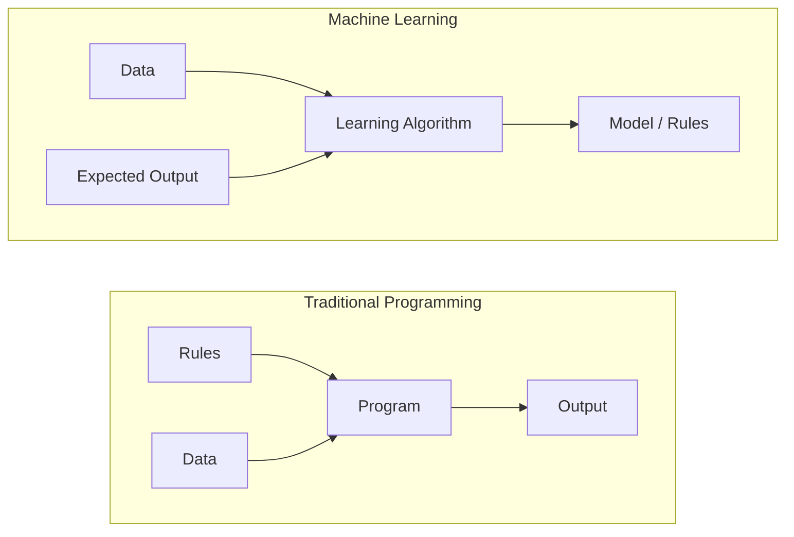
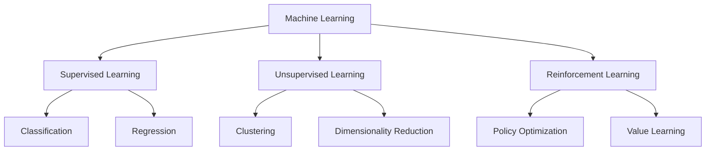
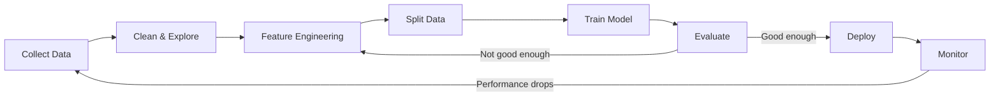
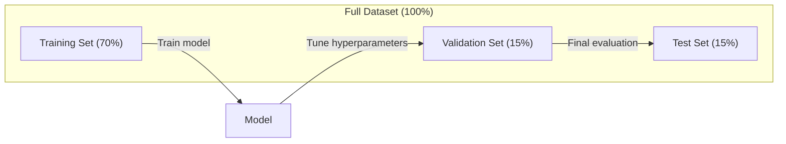
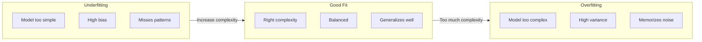
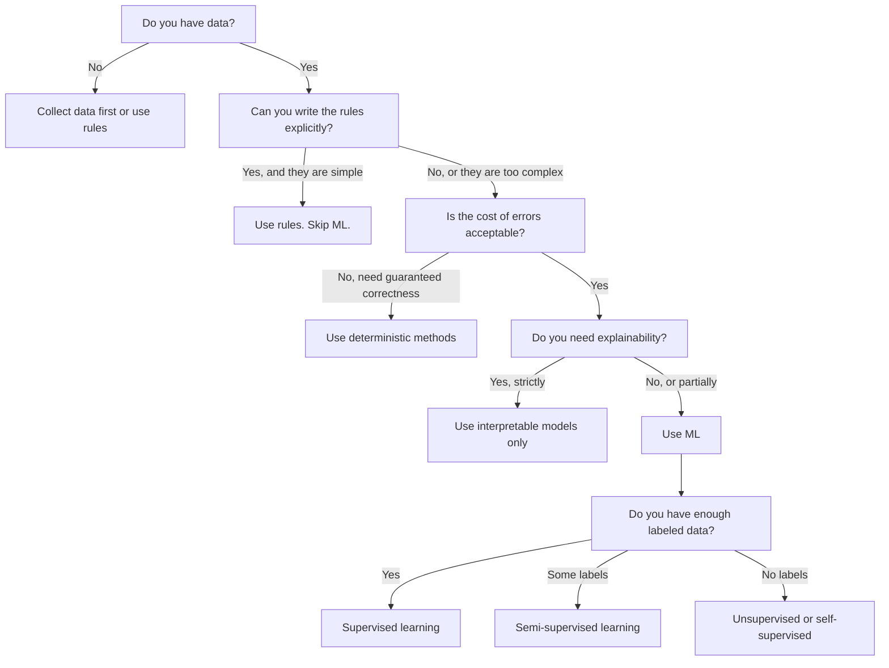

# ¿Qué es el aprendizaje automático?

> El aprendizaje automático es una forma en la que los ordenadores buscan modelos en los datos, no las reglas de escritura manual.

**类型：**El aprendizaje
**语言：**Python
**先修要求：**Fase 1 (Fundamentos de las matemáticas)
**时间：** 45 minutos

## El objetivo del aprendizaje

- 解释监督无监督和加强学习的区别,并判断给定问题适用哪种类型的问题
- Desde el punto de cero para lograr el clasificador de centróides más cercano, no se utiliza una línea de base aleatoria para evaluarlo
- 区分 Clasificación y Regresión 任务,并为每种任务选择合适的损失函数
-  evaluar si los problemas de negocio determinados son adecuados para el uso de la ML o si son más adecuados para la resolución de las normas de determinación

##  problemas

Tu quieres construir un filtro de correo basura. La práctica tradicional es: si un correo contiene 'dinero gratis', etiquete como correo basura. Si tiene más de 3 signos, etiquete como correo basura. Tu has pasado varias semanas escribiendo reglas. Luego el emisor de correo basura cambia la formulación. Tu reglas no funcionan.

El aprendizaje automático ha cambiado esta manera. Deje de escribir reglas, sino que le da a la computadora miles de mensajes de correo con etiquetas. Déjalo encontrar reglas.

Este cambio de las reglas de redacción a las de aprendizaje de datos es el núcleo del aprendizaje automático. Todos los motores de recomendación, asistentes de voz, vehículos autónomos y modelos de lenguaje trabajan de esta manera.

## 概念

### Aprender de datos, en lugar de aprender de reglas

传统编程和机器学习以相反的方向解决问题──



傳統編程:你编寫規則──程序把規則應用到數據上并產生輸出──

Aprendizaje automático: usted proporciona datos y espera que se produzcan.

Modelo entrenado  本身就是规则, en formato numérico codificado 重量、参数)                                                                                                                                                                                                                                                 

### Tres tipos de aprendizaje automático



**Supervised Learning**Tienes un par de entradas y salidas.
-  Aquí hay 10.000 张 etiquetado para fotos de gatos o perros.
-  Aquí hay características y precios de vivienda.

**Unsupervised Learning**Sólo tienes que entrar. No tienes etiqueta.
-  Aquí hay 10.000 条客户购买历史──找出自然分组──
-  Aquí hay 1.000 puntos de datos de dimensiones  en la estructura de conservación al mismo tiempo se reduce a 2 dimensiones 

**Reinforcement Learning**El agente en el entorno toma medidas, y obtiene una recompensa o una penalización.
- Juega este juego, gana +1, pierde -1...
- Controlando el brazo del robot... tomando el objeto... +1, por segundo.

En la práctica, la mayoría de los contenidos que se construyen se utilizan en el aprendizaje supervisado.

### 超越三大类型

Los tres tipos anteriores son muy claros, pero el ML del mundo real a menudo se obscurece.

**Semi-supervised learning**Utiliza una pequeña parte de datos etiquetados y una gran cantidad de datos sin etiquetar. Usted puede tener 100 张带标签的医学图像和 100,000 张未标签图像.

- **Label propagation：**Construir un gráfico de conexión similar a datos de puntos ∙ 标签 通过图从标记节 传播到未标记邻居──
- **Pseudo-labeling：**En los datos etiquetados 上训练模型, usarlo para predecir la etiqueta de los datos sin etiquetado, luego en todo el dato volver a entrenar.
- **Consistency regularization：** Para una entrada y su versión de menor interferencia, el modelo  debería dar el mismo pronóstico― incluso sin etiqueta, esto también puede funcionar―

**Self-supervised learning**Desde los datos mismos crear supervisión. Absolutamente no necesita etiqueta artificial.

- **Masked language modeling (BERT)：**隐藏句中 15% 的词,训练模型 预测缺失的词──标签 来自原始文本──
- **Contrastive learning (SimCLR)：**取一张图像, create two enhanced versions──训练模型──识别它们来自同一张图像,同时将它们与其他图像的增强版本区分──
- **Next-token prediction (GPT)：**给定前面所有词,预测下一个词―― cada texto en el archivo se convertirá en un ejemplo de entrenamiento――

Estos no son independientes de las categorías de fuera de los tres grandes tipos. Son una combinación de estrategias de pensamiento supervisado y no supervisado. El aprendizaje auto-supervisado en la técnica pertenece a la supervisión.

### Clasificación frente a regresión

Es una de las dos principales tareas de aprendizaje supervisado.

| 方面 | Classification | Regression |
|--------|---------------|------------|
| 输出 | 离散类别 | 连续数值 |
| 示例 | “这封邮件是垃圾邮件吗？” | “房价会是多少？” |
| 输出空间 | {cat, dog, bird} | 任意实数 |
| Loss Function | Cross-entropy, accuracy | Mean squared error, MAE |
| 决策 | 类别之间的边界 | 拟合数据的曲线 |

Clasificación 回答属于哪个类别?Regressión 回答多少?

Algunos problemas pueden expresarse de dos maneras.

### ML 工作流

Cada proyecto de aprendizaje automático sigue la misma línea de conducta, sin importar el algoritmo que utilice.



**Collect Data**Recolectar datos originales. Más datos son casi siempre mejores, pero la calidad es más importante que la cantidad.

**Clean & Explore**: procesar la falta de valor, eliminar los proyectos de repetición, distribuir los resultados, encontrar las anomalías, este paso generalmente ocupa entre el 60-80% del tiempo total del proyecto.

**Feature Engineering**:把原始数据转换成模型可用功能──把日期转换为星期几──归结数值列──编码分类变量── buena característica es más importante que el algoritmo de los bojos──

**Split Data**Se dividen en formación, validación y conjunto de pruebas.

**Train Model**:把 los datos de entrenamiento 输入算法──算法调整内部参数,以最小化损失函数──

**Evaluate**En los datos de validación/teste, se mide el rendimiento. Si el rendimiento es inaceptable, se vuelve a probar diferentes características, algoritmos o hiperparámetros.

**Deploy**: poner el modelo en el entorno de producción, hacer que se pueda predecir nuevos datos.

**Monitor**• Seguimiento continuo del rendimiento, distribución de datos, variación de datos, modelo, reducción de rendimiento, reentrenamiento,

### Formación, validación y prueba

Es el concepto clave más fácil de equivocarse para los principiantes. Hay que evaluar el modelo de datos que nunca se han visto durante el entrenamiento.



| 划分 | 目的 | 使用时机 | 典型大小 |
|-------|---------|-----------|-------------|
| Training | model 从这些数据中学习 | 训练期间 | 60-80% |
| Validation | 调整 hyperparameter、比较 model | 每次训练运行之后 | 10-20% |
| Test | 最终无偏 performance 估计 | 只在最后使用一次 | 10-20% |

El conjunto de pruebas es sagrado. Sólo puedes verlo una vez. Si sigues ajustando el modelo de pruebas, estás en el conjunto de pruebas, tu número de informes también no tiene sentido.

对于小数据集,使用k-fold cross-validation:把数据分成k 份,在k-1 份训练,在剩余1 份验证,轮换进行,并对结果取平均――

### El exceso de ajuste vs el exceso de ajuste



**Underfitting**Modelo 太简单,无法捕捉中的模式――就像用一条直线去适合曲关系――entrenamiento error 高――test error 也高――

**Overfitting**El modelo es demasiado complejo, recuerda los datos de entrenamiento, incluyendo el ruido de los mismos.

**Good fit**:modelo  capturar el verdadero modo, no recordar el ruido―error de entrenamiento y error de prueba 

Signos de exceso de montaje:
- Precisión de formación 远高于 precisión de validación
- El modelo en los datos de formación ha tenido un buen desempeño, pero en los nuevos datos ha tenido un muy mal desempeño.
- 增加更多训练数据 会提升性能(modelo originado en la memoria, en lugar de aprender)

修复 sobreposición:
-  obtenga más datos de formación
- 降低模型复杂性(更少参数、更简单 arquitectura)
- Regularización (para un peso mayor)
- Dejar de fumar durante el entrenamiento
- Detener temprano (con error de validación)

修复 Desajuste:
- Uso de un modelo más complejo
- 添加更多 característica
- 降低 regularización
- 训练更久

### Compartición de variaciones

Es el marco matemático detrás de la sobresposición y la sobresposición.

**Bias**El modelo lineal tendría un alto sesgo. El alto sesgo conduciría a una falta de ajuste.

**Variance**En el caso de los modelos de formación, la variación de los datos de formación puede ser muy diferente.

| Model complexity | Bias | Variance | 结果 |
|-----------------|------|----------|--------|
| 过低（用 linear model 拟合弯曲数据） | High | Low | Underfitting |
| 刚好合适 | Medium | Medium | 良好的 generalization |
| 过高（用 degree-20 polynomial 拟合 10 个点） | Low | High | Overfitting |

总 error = Bias^2 + Varianza + ruido incontrolável

Usted no puede reducir el ruido irreducible (es un fenómeno de datos en sí mismo)

### No hay teorema del almuerzo gratis

No existe un solo algoritmo que sea el mejor para todos los problemas. En una clase de problemas, los algoritmos que se desempeñan bien pueden ser muy malos en otra.

实践中, seleccion取决于:
- ¿Tienes muchos datos?
- Hay muchas características
- La relación es lineal o no lineal
- Sí o no necesita interpretación
- ¿Puedes cargar cuánto recursos de cálculo?

### ¿Cuándo no usar el aprendizaje automático

ML es muy fuerte, pero no siempre es un instrumento correcto. Antes de usar el modelo, primero pregúntate si realmente lo necesitas.

**不要在以下情况下使用 ML：**

- **规则简单且定义明确。**税费计算、排序算法、单位转换―― si puedes usar varias declaraciones si-es 写出逻辑, el modelo sólo aumentará la complejidad, sin ningún beneficio―
- **你没有数据或数据很少。**ML necesita aprender de la muestra. Sólo 10 puntos de datos, no puede entrenar algo significativo.
- **错误成本是灾难性的，并且你需要保证正确性。**medicinal dosage calculation 核反应堆控制 密码学验证──ML modelo es probables. Si                                                                                                                                                                                                                                                  
- **lookup table 或 heuristic 可以解决问题。**Si un umbral simple o una tabla cubren el 99% de la situación, añadir ML aumentaría el coste de mantenimiento, pero no significaría ninguna mejora.
- **你无法解释决策，而 explainability 又是必需的。**Algunos modelos de ML son interpretables de la regresión lineal, árbol de decisiones pequeñas, la mayoría no son.
- **问题变化得比你重新训练还快。**Si las reglas cambian cada día, y reentrenarse requiere una semana, el modelo es siempre pasado de tiempo.

Utiliza este diagrama de flujo de decisiones:




```figure
f3-learning-boundary
```

## Construirlo

`code/ml_intro.py`El código medio desde cero realiza un clasificador centroid más cercano, es el algoritmo ML más simple.

### Paso 1: desde el punto de implementación Clasificador de centróides más cercano

Clasificador de centroides más cercano 会计算训练数据 中每个类的中心 (中中每个类的中心)  (中)  (预测时) , se asigna cada nuevo punto a la clase que pertenece a la distancia del centro más cercano

```python
class NearestCentroid:
    def fit(self, X, y):
        self.classes = np.unique(y)
        self.centroids = np.array([
            X[y == c].mean(axis=0) for c in self.classes
        ])

    def predict(self, X):
        distances = np.array([
            np.sqrt(((X - c) ** 2).sum(axis=1))
            for c in self.centroids
        ])
        return self.classes[distances.argmin(axis=0)]
```

Éste es todo el algoritmo. Fita, calcula dos significados. Previene, calcula distancia.

### Paso 2: en Datos sintéticos 上训练

Hemos generado un conjunto de datos de clasificación 2D, de los cuales dos clases tienen una ligera superposición.

```python
rng = np.random.RandomState(42)
X_class0 = rng.randn(100, 2) + np.array([1.0, 1.0])
X_class1 = rng.randn(100, 2) + np.array([-1.0, -1.0])
X = np.vstack([X_class0, X_class1])
y = np.array([0] * 100 + [1] * 100)
```

### Paso 3: Comparación con el nivel de referencia

Cada modelo de ML debe compararse con una línea de base trivial. Aquí la línea de base irá a la ventaja de una clase. Si tu modelo de ML no puede superar las conjeturas, entonces habrá problemas.

```python
baseline_preds = rng.choice([0, 1], size=len(y_test))
baseline_acc = np.mean(baseline_preds == y_test)
```

En este conjunto de datos, el clasificador de centroid debería alcanzar una precisión de más del 90% en el punto de partida aleatorio, aproximadamente el 50%.

### ¿Por qué es tan importante ?

El clasificador de centróides más cercano 极其简单―― no tiene hiperparámetro, no tiene iteración, no tiene Descenso Gradiente―pero capta el modelo ML básico:

1. De los datos de formación**学习**Una especie de "centroides")
2. Usar para mostrar nuevos datos**预测**(distancia más cercana)
3. Con el nivel de referencia**评估**(随机猜测)

Cada algoritmo de ML, desde la regresión logística hasta los transformadores, sigue el mismo patrón de tres pasos.

### Paso 4: Clasificador de Centroid hacer no hasta qué

Clasificador de centroides más cercano  supongamos que cada clase forme una sola mancha―. Se muestra un límite de decisión lineal―.

- clase tiene varios grupos (por ejemplo, números 1 puede ser escrito de varias maneras diferentes)
- El límite de decisión es no lineal (por ejemplo, una clase  envuelve otra clase)
- característica de escala 差异很大(distancia 被最大规模的特点 主导)

Estos límites provocan todos los demás algoritmos que aprenderás. Los vecinos más cercanos a K pueden manejar múltiples grupos. El árbol de decisión puede manejar límites no lineales.

## Usalo

sklearn  proporcionar `NearestCentroid`Y generador de datos sintéticos:

```python
from sklearn.neighbors import NearestCentroid
from sklearn.datasets import make_classification
from sklearn.model_selection import train_test_split

X, y = make_classification(
    n_samples=500, n_features=2, n_redundant=0,
    n_clusters_per_class=1, random_state=42
)
X_train, X_test, y_train, y_test = train_test_split(X, y, test_size=0.3)

clf = NearestCentroid()
clf.fit(X_train, y_train)
print(f"Accuracy: {clf.score(X_test, y_test):.3f}")
```

##  entregarlo

本课会生成                                                                                                                                                                                                                                                                                                                                                                                                                                                                                                                          `outputs/prompt-ml-problem-framer.md`, es un problema de negocio rápido, puede transformarse en una tarea de ML específica. Déjalo una descripción de problema. Queremos reducir el churn o predecir la demanda para el próximo trimestre.

## 关键术语: "El hombre es un hombre"

| 术语 | 人们常说 | 实际含义 |
|------|----------------|----------------------|
| Model | “The AI” | 一个带有可学习 parameter 的数学函数，用于把输入映射到输出 |
| Training | “Teaching the AI” | 运行 optimization algorithm 来调整 model parameter，使预测匹配已知输出 |
| Feature | “An input column” | 数据中可测量的属性，model 用它进行预测 |
| Label | “The answer” | training example 的已知输出，用于计算 error signal |
| Hyperparameter | “A setting you tweak” | 训练前设置的 parameter，用于控制学习过程（learning rate、layer 数量） |
| Loss Function | “How wrong the model is” | 衡量预测输出与实际输出之间差距的函数，训练会尝试将其最小化 |
| Overfitting | “It memorized the test” | model 学到了 training-specific noise，而不是通用模式，因此在新数据上失败 |
| Underfitting | “It didn't learn anything” | model 太简单，无法捕捉数据中的真实模式 |
| Generalization | “It works on new data” | model 对未训练过的数据做出准确预测的能力 |
| Cross-validation | “Testing on different chunks” | 反复把数据拆分为 train/test fold 并对结果取平均，从而得到更稳健的 performance 估计 |
| Regularization | “Keeping weights small” | 向 Loss Function 添加 penalty term，以抑制过于复杂的 model |
| Data drift | “The world changed” | 传入数据的统计分布随时间发生变化，导致 model performance 下降 |

##  ejercicios

1. 选择任意数据集 (例如 Iris、Titanic) 』按 70/15/15 拆分为火车/验证/测试──解释为什么不应该在测试集上调整超参数──
2. 列出三个真世界问题──对每一个问题,判断它是分类,退缩还是集群,以及它是监督还是没有监督──
3. Un modelo en los datos de entrenamiento alcanza un 99% de precisión, pero en los datos de pruebas sólo un 60% de precisión.

## 延伸阅读

- [An Introduction to Statistical Learning](https://www.statlearning.com/)- 免费教材, abarcando todos los métodos clásicos de aprendizaje, y acompañados de ejemplos prácticos
- [Google's Machine Learning Crash Course](https://developers.google.com/machine-learning/crash-course)- introducción simplificada del concepto de ML
- [Scikit-learn User Guide](https://scikit-learn.org/stable/user_guide.html)- En Python para implementar ML
