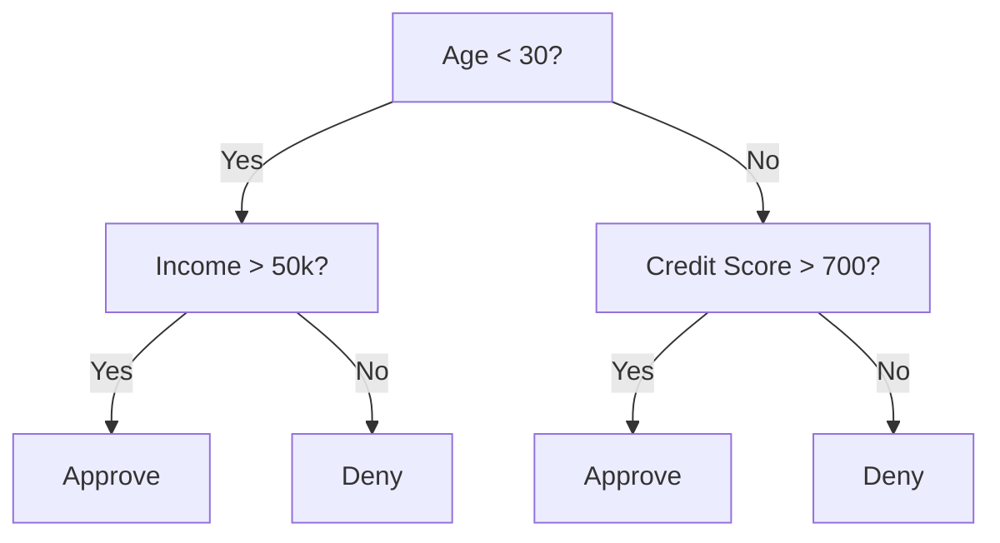
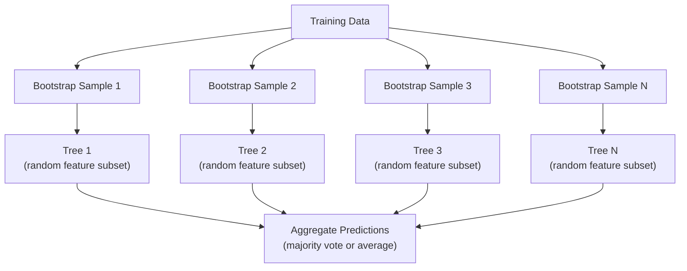

# Árboles de decisión y bosques aleatorios

> El árbol de decisión es sólo un proceso de bosque, pero el bosque compuesto por muchos árboles es uno de los instrumentos más poderosos de ML.

**类型：**Construir
**语言：**Python
**先修要求：**Fase 1 ((Lecciones 09 Teoría de la información, 06 Probabilidad)
**时间：**90 minutos

## El objetivo del aprendizaje

- realizar la impureza de Gini, la entropía y la información obtenida  calcular, para encontrar la mejor división del árbol de decisión
- Desde零 construir un árbol de decisión clasificador,并加入 pre-tuning 控制(max profundidad、min muestras)
- Usar muestreo de arranque y la función de aleatorización  Construir bosque aleatorio,并 explicar por qué puede reducir la variación
- Comparar la importancia de las características de MDI con la importancia de la permutación,并识别 MDI

##  problemas

Usted tiene datos tabulares, y es un ejemplo, y una característica, también hay una columna de objetivo que usted quiere predecir. Usted puede subir directamente a una red neuronal. Pero para los datos tabulares, modelos basados en árboles, árboles de decisión, bosques aleatorios, árboles aumentados por gradientes, continúan mejor que el aprendizaje profundo.

¿Por qué?El árbol  no necesita procesamiento previo 就能处理混合特征 类型(numeric 和 categorical)  Ellos no necesitan la ingeniería de características 就能处理非线性关系── tienen interpretabilidad: puedes ver el árbol, ver con precisión una predicción de cómo se produce── mientras que los bosques aleatorios 会对许多树木 求平均,对中等规模数据集 上的过具有很强的抵抗力──

Este curso utilizará la división recursiva de los árboles de decisión de la construcción de cero, y luego construir un bosque aleatorio en ella.

## 核心概念 核心概念 核心概念 核心概念

### Árbol de decisión hacer qué

Árbol de decisión                                                                                                                                                                                                                                                                                                                                                                                                                                                                                                                          



Cada nodo interno utiliza un umbral 测试某特征── cada nodo de hoja hace una predicción── para clasificar un nuevo punto de datos, usted comienza desde la raíz, a lo largo de las ramas hacia adelante, hasta llegar a una hoja──

Árbol                                                                                                                                                                                                                                                                                                                                                                                                                                                                                                                            

### Criterio de división: Medir la impureza

En cada nodo, tenemos un grupo de muestras. Queremos que se dividan, para que los nodos infantiles generados sean lo más puros posible.

**Gini impurity**La medida es: si según la distribución de clases de este nodo                                                                                                                                                                                                                                                                                                                                                                                                                                                                                                                

```
Gini(S) = 1 - sum(p_k^2)

where p_k is the proportion of class k in set S.
```

对于纯节点(全部属于同一个类),Gini = 0──对于50/50类的二进制分区,Gini = 0.5──越低越好──

```
Example: 6 cats, 4 dogs

Gini = 1 - (0.6^2 + 0.4^2) = 1 - (0.36 + 0.16) = 0.48
```

**Entropy**衡量 node 中的信息量(混乱程度) ――Fase 1 Lección 09 已覆盖──

```
Entropy(S) = -sum(p_k * log2(p_k))
```

Para el nodo puro, entropía = 0── para la división binaria 50/50, entropía = 1.0──越低越好──

```
Example: 6 cats, 4 dogs

Entropy = -(0.6 * log2(0.6) + 0.4 * log2(0.4))
        = -(0.6 * -0.737 + 0.4 * -1.322)
        = 0.442 + 0.529
        = 0.971 bits
```

**Information gain**Es la menor cantidad de impureza después de la división.

```
IG(S, feature, threshold) = Impurity(S) - weighted_avg(Impurity(S_left), Impurity(S_right))

where the weights are the proportions of samples in each child.
```

Cada nodo arriba del codicioso algoritmo: intentar cada característica y cada posible umbral.`(feature, threshold)`组合── y el grupo de trabajo.

### División 如何工作

对于当前节上包含 n 个功能、m 个样本的数据集:

1. Para cada característica j(j = 1 hasta n):
   - 按 característica j对样本 排序
   - Se tratará de cada punto medio entre los diferentes valores de proximidad como umbral
   - 计算每个门的信息收益
2.  seleccionar la información ganancia máxima característica y umbral
3. Se dividirá el dato en izquierda y derecha
4. Para cada niño

Este tipo de método no garantiza obtener el mejor árbol de la totalidad. Buscar el mejor árbol es NP-duro.

### 停止条件 停止 condiciones 停止 condiciones 停止 condiciones 停止 condiciones 停止 condiciones 停止 condiciones 停止 condiciones 停止 condiciones 停止 停止 条件

Si no hay condiciones para que el árbol siga creciendo, hasta que cada hoja sea pura, cada hoja una muestra. Esto recordará perfectamente los datos de entrenamiento y se generalizará.

**Pre-pruning**Me encontré en el árbol.
- Profundidad máxima: Cuando el árbol  alcanza la profundidad fijada 时停止 split
- Muestras mínimas por hoja: si un nodo muestra menos de k, entonces se detiene
- Obtención mínima de información: si la mejor división de la impureza es menor que un umbral, entonces se detiene
- Número máximo de nodos de hojas: limita la cantidad total de hojas

**Post-pruning**Primero generar el árbol completo, luego volver a volver a modificar:
- Capacidad de poda de costos-complejidad (squikit-learn): añadir una con hojas Número de árboles en proporción correcta
- Reducción de error de poda: si se elimina un subárbol no aumentará el error de validación, se elimina

Pre-tono, más simple y más rápido. La post-tono generalmente produce mejores árboles, ya que no detendrá demasiado pronto las subsecuentes ramas que pueden traer divisiones útiles.

### Utilizando árboles de decisión de Regresión

 Para la Regresión, la predicción de hoja es la media de los valores objetivo de la hoja.

**Variance reduction**替代 información ganancia:

```
VR(S, feature, threshold) = Var(S) - weighted_avg(Var(S_left), Var(S_right))
```

选择使变异 降低最多的分离―― Tree 会把输入空间 划分为多个区域, y en cada región pronósticar una constante (平均值)―

### Bosques aleatorios: fuerza del conjunto

单树决策树 具有高变化──数据中的微小变化可能产生完全不同的树木──随机森林 通过许多树木 寻求平均来解决这个问题──



两种随机性 让树木 多样性:

**Bagging（bootstrap aggregating）：**Cada árbol está en una muestra de arranque. La formación se realiza en los datos de entrenamiento, es decir, se realiza un ejemplar de extracción de cada uno de ellos. En cada arranque, el 63% de las muestras originales aparecen en la reunión.

**Feature randomization：**En cada división, sólo considere un subconjunto de características de manera aleatoria. Para la clasificación, el estándar es sqrt(n_features) ⋅ Para la regresión, es n_features/3── esto evitará que todos los árboles estén en la misma característica dominante.

关键洞见: para muchos árboles descorrelados 求平均, puede reducir la variación en caso de no aumentar el sesgo.

### Importancia de las características

Los bosques aleatorios ofrecen cifras de importancia.

**Mean Decrease in Impurity (MDI)：**Para cada característica, todos los árboles en todos los nodos que utilizan esta característica   total de reducción de impurezas                                                                                                                                                                                                                                                                                                                                                                                                                                                                                                  

```
importance(feature_j) = sum over all nodes where feature_j is used:
    (n_samples_at_node / n_total_samples) * impurity_decrease
```

Este método es muy rápido (se puede calcular durante el entrenamiento), pero se inclinará hacia características de alta cardinalidad y tiene muchas características de posibles puntos de división.

**Permutation importance**Es otro método: romper los valores de una característica, y medir la precisión del modelo, disminuye mucho.

### Árbol 何时胜过 Neural Network

Los árboles y los bosques en los datos tablales arriba suelen superar las redes neuronales. Hay varias razones:

| Factor | Trees | Neural networks |
|--------|-------|----------------|
| Mixed types (numeric + categorical) | 原生支持 | 需要 encoding |
| Small datasets (< 10k rows) | 表现良好 | 容易 overfit |
| Feature interactions | 通过 splitting 找到 | 需要 architecture design |
| Interpretability | 完全透明 | Black box |
| Training time | 分钟级 | 小时级 |
| Hyperparameter sensitivity | 低 | 高 |

Cuando los datos tienen estructura espacial o secuencial (imágenes, texto, audio) en las redes neuronales, más fuerte, los árboles son una opción de carácter.


```figure
decision-tree-depth
```

## Construirlo

### Paso 1:Inpuridad de Gini y entropía

Desde la construcción de estos dos criterios de división, y verificar que los cuales de las divisiones son buenas divisiones de juicio coinciden.

```python
import math

def gini_impurity(labels):
    n = len(labels)
    if n == 0:
        return 0.0
    counts = {}
    for label in labels:
        counts[label] = counts.get(label, 0) + 1
    return 1.0 - sum((c / n) ** 2 for c in counts.values())

def entropy(labels):
    n = len(labels)
    if n == 0:
        return 0.0
    counts = {}
    for label in labels:
        counts[label] = counts.get(label, 0) + 1
    return -sum(
        (c / n) * math.log2(c / n) for c in counts.values() if c > 0
    )
```

### Paso 2: encontrar la mejor división

尝试每个功能 和每个门──回归信息收获最高的那个──

```python
def information_gain(parent_labels, left_labels, right_labels, criterion="gini"):
    measure = gini_impurity if criterion == "gini" else entropy
    n = len(parent_labels)
    n_left = len(left_labels)
    n_right = len(right_labels)
    if n_left == 0 or n_right == 0:
        return 0.0
    parent_impurity = measure(parent_labels)
    child_impurity = (
        (n_left / n) * measure(left_labels) +
        (n_right / n) * measure(right_labels)
    )
    return parent_impurity - child_impurity
```

### Paso 3: Construir la clase DecisionTree

División recurrente, predicción y seguimiento de la importancia de las características.

```python
class DecisionTree:
    def __init__(self, max_depth=None, min_samples_split=2,
                 min_samples_leaf=1, criterion="gini",
                 max_features=None):
        self.max_depth = max_depth
        self.min_samples_split = min_samples_split
        self.min_samples_leaf = min_samples_leaf
        self.criterion = criterion
        self.max_features = max_features
        self.tree = None
        self.feature_importances_ = None

    def fit(self, X, y):
        self.n_features = len(X[0])
        self.feature_importances_ = [0.0] * self.n_features
        self.n_samples = len(X)
        self.tree = self._build(X, y, depth=0)
        total = sum(self.feature_importances_)
        if total > 0:
            self.feature_importances_ = [
                fi / total for fi in self.feature_importances_
            ]

    def predict(self, X):
        return [self._predict_one(x, self.tree) for x in X]
```

### Paso 4: Construir una clase de RandomForest

Muestreo de bootstrap, aleatorización de características y votación mayoritaria.

```python
class RandomForest:
    def __init__(self, n_trees=100, max_depth=None,
                 min_samples_split=2, max_features="sqrt",
                 criterion="gini"):
        self.n_trees = n_trees
        self.max_depth = max_depth
        self.min_samples_split = min_samples_split
        self.max_features = max_features
        self.criterion = criterion
        self.trees = []

    def fit(self, X, y):
        n = len(X)
        for _ in range(self.n_trees):
            indices = [random.randint(0, n - 1) for _ in range(n)]
            X_boot = [X[i] for i in indices]
            y_boot = [y[i] for i in indices]
            tree = DecisionTree(
                max_depth=self.max_depth,
                min_samples_split=self.min_samples_split,
                max_features=self.max_features,
                criterion=self.criterion,
            )
            tree.fit(X_boot, y_boot)
            self.trees.append(tree)

    def predict(self, X):
        all_preds = [tree.predict(X) for tree in self.trees]
        predictions = []
        for i in range(len(X)):
            votes = {}
            for preds in all_preds:
                v = preds[i]
                votes[v] = votes.get(v, 0) + 1
            predictions.append(max(votes, key=votes.get))
        return predictions
```

完整实现及所有辅助方法 见 `code/trees.py`¿Qué es eso?

## Usalo

Usando el arte de aprender, entrenar el bosque aleatorio sólo necesita tres líneas:

```python
from sklearn.ensemble import RandomForestClassifier
from sklearn.datasets import load_iris
from sklearn.model_selection import train_test_split

X, y = load_iris(return_X_y=True)
X_train, X_test, y_train, y_test = train_test_split(X, y, random_state=42)

rf = RandomForestClassifier(n_estimators=100, random_state=42)
rf.fit(X_train, y_train)
print(f"Accuracy: {rf.score(X_test, y_test):.4f}")
print(f"Feature importances: {rf.feature_importances_}")
```

En la práctica, los árboles aumentados por gradientes (XGBoost, LightGBM, CatBoost) suelen ser más fuertes que los bosques aleatorios, ya que construyen árboles en orden, cada árbol corrección de los errores de los árboles anteriores.

##  entregarlo

本课会产出                                                                                                                                                                                                                                                                                                                                                                                                                                                                                                                         `outputs/prompt-tree-interpreter.md`, es un prompt para explicar las divisiones de árboles de decisión para las personas relacionadas con el negocio. Introduce a la estructura del árbol entrenado.

##  ejercicios

1. En un conjunto de datos 2D que contiene 3 clases, la formación de un árbol de decisión se divide en un árbol de seguimiento manual, y se trazan límites de decisión de forma rectangular.

2. Por los árboles de regresión  lograr la reducción de la variación de división ∙为 200 个点生成 y = sin(x) + ruido,并拟合你的回归树──将树的分数-恒定预测与真实曲线一起绘图──

3. Construir contiene 1、5、10、50 和 200 árboles de bosque aleatorio― dibujar la precisión de entrenamiento y la precisión de los ensayos con los árboles la cantidad de cambios de curvatura― observar la precisión de los ensayos  alcanzará la plataforma period, pero no bajará  bosques  resistir el sobreposición)―

4. En 5 conjuntos de datos diferentes, se compara la impureza de Gini con la entropía como el comportamiento de criterios de división.

5. 实现 permutation importance── en un conjunto de datos 上将它与MDI importancia Compare, una de las características es el ruido aleatorio, pero con alta cardinalidad──MDI 会把 ruido característica 排得很高──Permutation importance 不会──

## 关键术语: "El hombre es un hombre"

| Term | 人们常说 | 实际含义 |
|------|----------------|----------------------|
| Decision tree | “用于 predictions 的流程图” | 一种通过学习一系列 if/else splits，将 feature space 划分为矩形区域的 model |
| Gini impurity | “node 有多混杂” | 在某个 node 上 misclassify 一个 random sample 的概率。0 = pure，0.5 = binary 情况下的最大 impurity |
| Entropy | “node 中的混乱程度” | node 上的信息量。0 = pure，1.0 = binary 情况下的最大 uncertainty。来自 information theory |
| Information gain | “split 有多好” | split 后 impurity 的降低量。用于选择 splits 的 greedy criterion |
| Pre-pruning | “提前停止 tree” | 通过设置 max depth、min samples 或 min gain thresholds，提前停止 tree growth |
| Post-pruning | “事后修剪 tree” | 先生成完整 tree，再移除不会提升 validation performance 的 subtrees |
| Bagging | “在随机 subsets 上训练” | Bootstrap aggregating。在不同的有放回 random sample 上训练每个 model |
| Random forest | “一堆 trees” | Decision trees 的 ensemble，每棵 tree 都在 bootstrap sample 上训练，并在每次 split 使用 random feature subsets |
| Feature importance (MDI) | “哪些 features 重要” | 每个 feature 贡献的总 impurity decrease，在所有 trees 和 nodes 上求和 |
| Permutation importance | “打乱后检查” | 随机打乱某个 feature 的 values 时 accuracy 的下降量。对于 noisy features，比 MDI 更可靠 |
| Variance reduction | “info gain 的 regression 版本” | Information gain 的 regression tree 对应形式。选择使 target variance 降低最多的 split |
| Bootstrap sample | “带重复的 random sample” | 从原始 dataset 中有放回抽取得到的 random sample。大小相同，但包含 duplicates |

## 延伸阅读

- [Breiman: Random Forests (2001)](https://link.springer.com/article/10.1023/A:1010933404324)- El bosque aleatorio original
- [Grinsztajn et al.: Why do tree-based models still outperform deep learning on tabular data? (2022)](https://arxiv.org/abs/2207.08815)-  Sobre árboles vs redes neuronales en tareas tablales                                                                                                                                                                                                                                                                                                                                                                                                                                                                                                               
- [scikit-learn Decision Trees documentation](https://scikit-learn.org/stable/modules/tree.html)- 带视觉化工具 的实践指南
- [XGBoost: A Scalable Tree Boosting System (Chen & Guestrin, 2016)](https://arxiv.org/abs/1603.02754)- 主导 Kaggle's gradient boosting 论文
