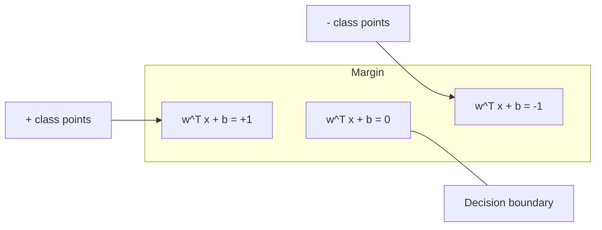
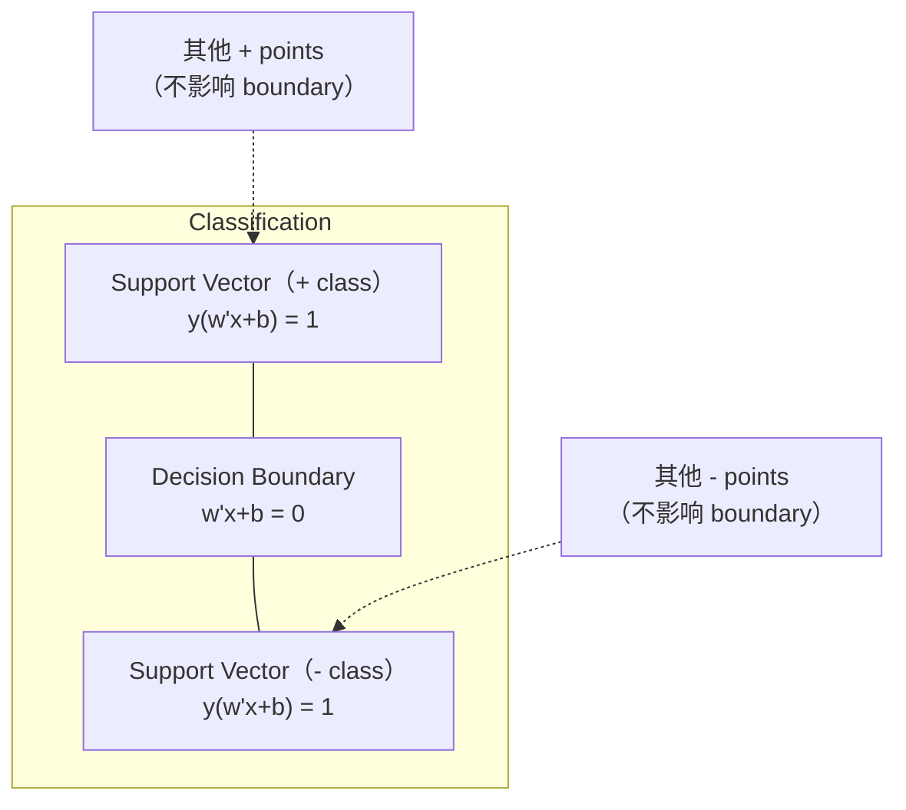
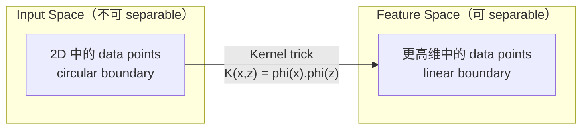

# Máquinas de apoyo de vectores

> Entre las dos categorías encontrar la calle más ancha.

**Type:** Build
**Language:**Python
**先修要求：**Fase 1 ((Lecciones 08 Optimización, 14 Normas y Distancias, 18 Optimización Convexa)
**Time:** ~90 分钟

## El objetivo del aprendizaje
- Utiliza pérdida de bisagra y la formulación primaria de descenso de gradiente, desde cero lograr una SVM lineal
-  Explicar el principio de margen máximo,并从训练好的模型中识别支持向量
- Comparar los núcleos lineares, polinómicos y RBF, y explicar el truco del núcleo  Cómo evitar la alta dimensión de la representación
-  evaluación por el parámetro C  control de la anchura del margen y los errores de clasificación 

##  problemas
Tienes dos tipos de puntos de datos, necesitas dibujar una línea recta o hiperplano) para separarlos.

选择边界 最大的那一条──margin es el límite de decisión con la distancia entre los dos puntos de datos más cercanos de ambos lados.

Este intuitivo ha dado lugar a las Máquinas Véctoras de Apoyo, que es uno de los algoritmos más elegantes de la matemática ML. Los SVM fueron el método de clasificación predominante antes del aprendizaje profundo, y siguen siendo la mejor opción en los problemas de pequeños conjuntos de datos, grandes cantidades de datos y modelos que necesitan tener principios, comprensión plena y con garantías teóricas.

Los SVM  directamente conectados a la Fase 1: la optimización es convexa de la lección 18), margen con normas de la medida de la lección 14), mientras que el truco del núcleo utiliza productos de puntos, en un contexto de no realmente calcular el alto espacio, para tratar los límites no lineales.

## 概念
### Clasificador de máximo intervalo

给定 y_i labels in {-1, +1} 和 feature vectors x_i de datos linealmente separables, nosotros queremos encontrar un hiperplano w^T x + b = 0 来分离类别。

La distancia de punto x_i a hiperplano es:

```
distance = |w^T x_i + b| / ||w||
```

对于正确分类的点:y_i * (w^T x_i + b) > 0──margen es de hiperplano hasta el lado más cercano de la distancia de punto dos veces──



problema de optimización:

```
maximize    2 / ||w||     (margin width)
subject to  y_i * (w^T x_i + b) >= 1  for all i
```

Éras­ti­mos de reducción de los precios de los productos:

```
minimize    (1/2) ||w||^2
subject to  y_i * (w^T x_i + b) >= 1  for all i
```

Este es un programa cuadrático convexo. Tiene una solución global única. Está en los límites de márgenes de los puntos de datos.

### Véctores de apoyo:关键的少数点



La mayoría de los puntos de entrenamiento no tienen importancia. Sólo los vectores de soporte son importantes. Es por eso que los SVM tienen un tiempo de predicción de memoria eficiente: solo necesitas almacenar vectores de soporte, no todo el conjunto de entrenamiento.

El número de vectores de soporte también dio un límite de error de generalización. En relación con el tamaño del conjunto de datos, los vectores de soporte son más pequeños, la generalización es mejor.

### Margen suave: Utiliza parámetro C 处理噪声

Los datos reales son muy pocos y completamente separables. Algunos puntos pueden estar en el lado equivocado del límite, o en el interior del margen.

```
minimize    (1/2) ||w||^2 + C * sum(xi_i)
subject to  y_i * (w^T x_i + b) >= 1 - xi_i
            xi_i >= 0  for all i
```

Variable de flexibilidad xi_i 衡量点 i 违反分差的程度──C 控制:

| C value | Behavior |
|---------|----------|
| Large C | 对 violations 施加重罚。margin 窄，misclassifications 更少。Overfits |
| Small C | 允许更多 violations。margin 宽，misclassifications 更多。Underfits |

C es la fuerza de regularización de la caída de la cantidad. C es la fuerza de regularización de la cantidad. C es la fuerza de regularización de la cantidad. C es la fuerza de regularización de la cantidad. C es la fuerza de regularización de la cantidad. C es la fuerza de regularización de la cantidad. C es la fuerza de regularización de la cantidad. C es la fuerza de regularización de la cantidad. C es la fuerza de regularización de la cantidad. C es la fuerza de regularización de la cantidad. C es la fuerza de regularización de la cantidad. C es la fuerza de regularización de la cantidad. C es la fuerza de regularización de la cantidad.

### Perdida de colmillos:Función de pérdida de SVM

SVM de margen blando puede ser reescribible para optimización sin restricciones:

```
minimize    (1/2) ||w||^2 + C * sum(max(0, 1 - y_i * (w^T x_i + b)))
```

项 max(0, 1 - y_i * f(x_i)) es la pérdida de bisagra.

```
单个点的 Hinge loss：

loss
  |
  | \
  |  \
  |   \
  |    \
  |     \_______________
  |
  +-----|-----|-------->  y * f(x)
       0     1

当 y*f(x) >= 1 时为 zero loss（正确分类，位于 margin 外）。
当 y*f(x) < 1 时为 linear penalty。
```

Con pérdida logística (regresión logística)

```
Hinge:     max(0, 1 - y*f(x))          在 margin 处 hard cutoff
Logistic:  log(1 + exp(-y*f(x)))        平滑，永远不会精确为零
```

Perdida de colmillos  producen soluciones escasas(sólo vectores de soporte 有非零贡献) ――perdida lógica Utiliza todos los puntos de datos―, lo que hace que los SVM en el tiempo de predicción sean más eficientes en memoria―.

### Us gradiente descenso  entrenamiento SVM lineal

Puedes usar la pérdida de bisagra + regularización de L2 de descenso de gradiente para entrenar SVM lineal, sin necesidad de buscar la solución QP restringida:

```
L(w, b) = (lambda/2) * ||w||^2 + (1/n) * sum(max(0, 1 - y_i * (w^T x_i + b)))

关于 w 的 Gradient：
  If y_i * (w^T x_i + b) >= 1:  dL/dw = lambda * w
  If y_i * (w^T x_i + b) < 1:   dL/dw = lambda * w - y_i * x_i

关于 b 的 Gradient：
  If y_i * (w^T x_i + b) >= 1:  dL/db = 0
  If y_i * (w^T x_i + b) < 1:   dL/db = -y_i
```

Esto se llama formulación primaria. El tiempo de funcionamiento de cada época es O(n * d), de los cuales n es el número de muestras, d es el número de características.

### La fórmula doble y el truco del núcleo

El problema de SVM de la doble Lagrangiana (desde la fase 1 de la lección 18, condiciones de KKKT) es:

```
maximize    sum(alpha_i) - (1/2) * sum_ij(alpha_i * alpha_j * y_i * y_j * (x_i . x_j))
subject to  0 <= alpha_i <= C
            sum(alpha_i * y_i) = 0
```

Sólo se trata de productos de puntos de datos entre puntos x_i. x_j。 es un punto clave.

```
Linear kernel:      K(x, z) = x . z
Polynomial kernel:  K(x, z) = (x . z + c)^d
RBF (Gaussian):     K(x, z) = exp(-gamma * ||x - z||^2)
```

RBF kernel se proyectará datos en espacio de dimensiones infinitas. En el espacio de entrada se puede aprender cualquier límite de decisión suave.



Trik de núcleo en el caso de no entrar en el espacio de dimensiones, calcular el producto de puntos en el espacio de dimensiones.

### MPS para regresión (MPS)

Regressión de vectores de apoyo se realizará alrededor de datos que se ajustan a una amplitud para un tubo de epsilon.

```
minimize    (1/2) ||w||^2 + C * sum(xi_i + xi_i*)
subject to  y_i - (w^T x_i + b) <= epsilon + xi_i
            (w^T x_i + b) - y_i <= epsilon + xi_i*
            xi_i, xi_i* >= 0
```

Parámetro de epsilon  control de ancho del tubo 越宽 = vectores de soporte 越少 = fit 更平滑──tube 越窄 = vectores de soporte 越多 = fit 更紧──

### ¿Por qué los SVM                                                                                                                                                                                                                                                                                                                                                                                                                                                                                                                        

Los SVM desde finales de 1990 hasta principios de 2010 dominaron el aprendizaje profundo por varias razones:

| Factor | SVMs | Deep learning |
|--------|------|---------------|
| Feature engineering | 需要它 | 学习 features |
| Scalability | kernel 为 O(n^2) 到 O(n^3) | 使用 SGD 时每个 epoch 为 O(n) |
| Image/text/audio | 需要 handcrafted features | 从 raw data 学习 |
| Large datasets (>100k) | 慢 | 扩展良好 |
| GPU acceleration | 收益有限 | 巨大加速 |

Los SVM siguen ganando en estos escenarios:
- Los conjuntos de datos pequeños ((100 a 1000 muestras)
- 高维 datos escasos(带 TF-IDF características 的文本)
- Cuando necesitas matemáticas (margen)
- Cuando el tiempo de entrenamiento 必须最小化(SVM linear 非常快)
- 具有清晰 margin structure 具有清晰 margin structure 的二进制分类
- Detección de anomalías (SVM de una clase)


```figure
svm-margin
```

## Construirlo
### 步骤 1: pérdida de la barandilla y la gradiente

基础―― calcular la pérdida de bisagra de un lote  y su gradiente―

```python
def hinge_loss(X, y, w, b):
    n = len(X)
    total_loss = 0.0
    for i in range(n):
        margin = y[i] * (dot(w, X[i]) + b)
        total_loss += max(0.0, 1.0 - margin)
    return total_loss / n
```

### 步骤 2: SVM lineal a través de la descenso de gradiente

通过最小化规律化关关损 来训练──不需要QP solver──

```python
class LinearSVM:
    def __init__(self, lr=0.001, lambda_param=0.01, n_epochs=1000):
        self.lr = lr
        self.lambda_param = lambda_param
        self.n_epochs = n_epochs
        self.w = None
        self.b = 0.0

    def fit(self, X, y):
        n_features = len(X[0])
        self.w = [0.0] * n_features
        self.b = 0.0

        for epoch in range(self.n_epochs):
            for i in range(len(X)):
                margin = y[i] * (dot(self.w, X[i]) + self.b)
                if margin >= 1:
                    self.w = [wj - self.lr * self.lambda_param * wj
                              for wj in self.w]
                else:
                    self.w = [wj - self.lr * (self.lambda_param * wj - y[i] * X[i][j])
                              for j, wj in enumerate(self.w)]
                    self.b -= self.lr * (-y[i])

    def predict(self, X):
        return [1 if dot(self.w, x) + self.b >= 0 else -1 for x in X]
```

### 步骤 3: Funciones del núcleo

实现 lineal、polinomio 和 RBF kernels。

```python
def linear_kernel(x, z):
    return dot(x, z)

def polynomial_kernel(x, z, degree=3, c=1.0):
    return (dot(x, z) + c) ** degree

def rbf_kernel(x, z, gamma=0.5):
    diff = [xi - zi for xi, zi in zip(x, z)]
    return math.exp(-gamma * dot(diff, diff))
```

### 步骤 4: Identificación de márgenes y vectores de apoyo

訓練後,识别哪些点是支持向量,并计算边界宽度──

```python
def find_support_vectors(X, y, w, b, tol=1e-3):
    support_vectors = []
    for i in range(len(X)):
        margin = y[i] * (dot(w, X[i]) + b)
        if abs(margin - 1.0) < tol:
            support_vectors.append(i)
    return support_vectors
```

完整实现和所有 demos 见 `code/svm.py`¿Qué es eso?

## Usalo
Utiliza el método de aprendizaje:

```python
from sklearn.svm import SVC, LinearSVC, SVR
from sklearn.preprocessing import StandardScaler
from sklearn.pipeline import Pipeline

clf = Pipeline([
    ("scaler", StandardScaler()),
    ("svm", SVC(kernel="rbf", C=1.0, gamma="scale")),
])
clf.fit(X_train, y_train)
print(f"Accuracy: {clf.score(X_test, y_test):.4f}")
print(f"Support vectors: {clf['svm'].n_support_}")
```

importante: entrenar SVM  Antes de siempre es necesario escalar Sus características;. Los SVM son sensibles a las magnitudes de las características   porque el margen  depende de la cantidad de datos disponibles, mientras que las características no escaladas                                                                                                                                                                                                                                                                                                                                                                                                                                                                        

对于大数据集,使用 `LinearSVC`(Fórmulación primaria, cada época 为 O  n)) en lugar de `SVC`(formación doble,O  n^2) hasta O  n^3)):

```python
from sklearn.svm import LinearSVC

clf = Pipeline([
    ("scaler", StandardScaler()),
    ("svm", LinearSVC(C=1.0, max_iter=10000)),
])
```

##  ejercicios
1. 生成 2D linearmente separable conjunto de datos。 training your LinearSVM,并识别支持向量──验证支持向量是最接近决策边界的点──

2. En un conjunto de datos ruidosos 上将 C de 0.001 变化到 1000──为每 C value 绘制决策边界──观察从宽边缘(不适合) 到狭边边缘(过) 的过渡──

3. 创建一个类界限 为圆形(非线性) 的数据集──展示线性SVM 会失败──计算RBF kernel matrix,并展示类别在内核诱导功能空间 中变得分离的──

4. En el mismo conjunto de datos, comparar la pérdida de carcasa con la pérdida logística. Entrenar un SVM lineal y regresión logística.

5. 实现 SVR(epsilon-insensitivo de pérdida) ――将它拟合到 y = sin(x) + ruido──绘制预测 周围的epsilon tube,并突出显示支持向量(tube 外的点)。

## 关键术语: "El hombre es un hombre"
| Term | What it actually means |
|------|----------------------|
| Support vectors | 最接近 decision boundary 的 training points。唯一决定 hyperplane 的点 |
| Margin | decision boundary 与最近 support vectors 之间的距离。SVMs 会最大化它 |
| Hinge loss | max(0, 1 - y*f(x))。正确分类且位于 margin 外时为零。否则为 linear penalty |
| C parameter | margin width 与 classification errors 之间的 trade-off。Large C = narrow margin，small C = wide margin |
| Soft margin | 通过 slack variables 允许 margin violations 的 SVM formulation。处理 non-separable data |
| Kernel trick | 在不显式映射到高维 feature space 的情况下，计算该空间中的 dot products |
| Linear kernel | K(x, z) = x . z。等价于标准 dot product。用于 linearly separable data |
| RBF kernel | K(x, z) = exp(-gamma * \|\|x-z\|\|^2)。映射到 infinite dimensions。学习任意 smooth boundary |
| Polynomial kernel | K(x, z) = (x . z + c)^d。映射到 polynomial combinations 的 feature space |
| Dual formulation | SVM problem 的重写形式，只依赖数据点之间的 dot products。支持 kernels |
| SVR | Support Vector Regression。围绕数据拟合 epsilon-tube。tube 内的点具有 zero loss |
| Slack variables | xi_i：衡量一个点违反 margin 的程度。正确分类且位于 margin 外的点为零 |
| Maximum margin | 选择能够最大化到每个类别最近点距离的 hyperplane 的原则 |

## 延伸阅读
- [Vapnik: The Nature of Statistical Learning Theory (1995)](https://link.springer.com/book/10.1007/978-1-4757-3264-1)-  Sobre los SVM y el aprendizaje estadístico
- [Cortes & Vapnik: Support-vector networks (1995)](https://link.springer.com/article/10.1007/BF00994018)- Papel SVM original
- [Platt: Sequential Minimal Optimization (1998)](https://www.microsoft.com/en-us/research/publication/sequential-minimal-optimization-a-fast-algorithm-for-training-support-vector-machines/)- 让SVM training 变得实用SMO algoritmo
- [scikit-learn SVM documentation](https://scikit-learn.org/stable/modules/svm.html)- 包含 detalles de la aplicación de la práctica
- [LIBSVM: A Library for Support Vector Machines](https://www.csie.ntu.edu.tw/~cjlin/libsvm/)- La mayoría de las implementaciones de SVM  detrás de la biblioteca C ++
