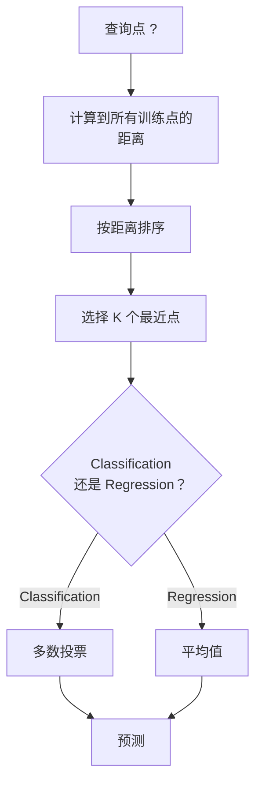
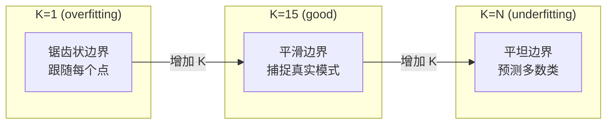
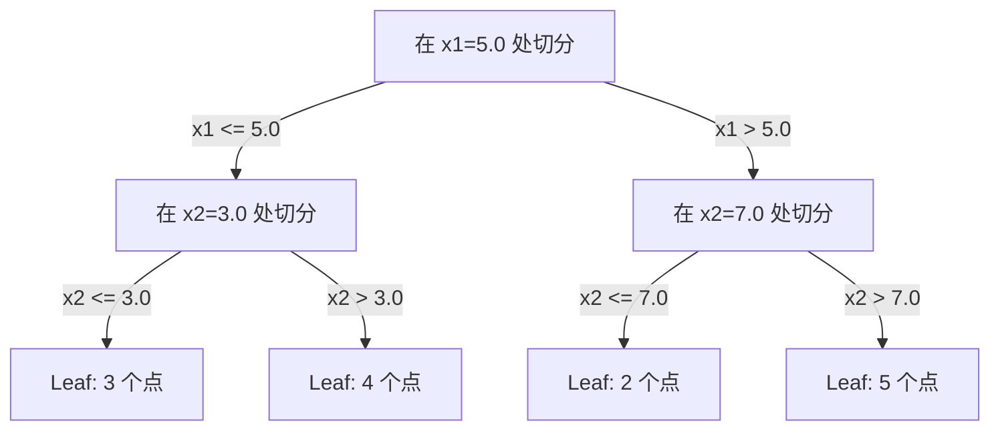

# K- Vecinos más cercanos y distancias

> 存储一切──通过查看你的邻居来预测──这是最简单而真正有效的算法──

**Type:** Build
**Language:**Python
**前置要求：**Fase 1 (Lección 14 Normas y distancias)
**Time:** ~90 分钟

## El objetivo del aprendizaje
- Desde el 0 de la realización de la Clasificación KNN y Regresión, apoyo a la configuración de K y distancia de la votación
- Comparar L1、L2、cosine 和 Minkowski  distancia de la medida, y seleccionar la medida adecuada para un determinado tipo de datos
- Explicación de la catástrofe de la dimensión, y muestra por qué la KNN en el espacio alto se desvanece
- Construir un árbol KD para lograr una búsqueda de vecino más cercano de alta eficiencia, y analizar lo que es mejor que la fuerza bruta

##  problemas
Tienes un conjunto de datos. Un nuevo punto de datos llega. Necesitas clasificarlo o predecir su valor. Con los parámetros de aprendizaje de los datos, por ejemplo, regresión lineal o SVM, solo necesitas encontrar los puntos de entrenamiento K más cercanos al nuevo punto y hacerlos votar.

Éste es el vecino más cercano de K. No tiene ninguna etapa de entrenamiento. No necesita aprender los parámetros. No necesita minimizar la función de pérdida.

Suena simple a no ser capaz de trabajar. Pero KNN es competitivo en muchos problemas, especialmente en los pequeños y medianos conjuntos de datos.

KNN también se encuentra en diferentes lugares de la IA moderna. Las bases de datos vectoriales se encuentran en Embeddings y ejecutan la búsqueda KNN. La generación aumentada de recuperación (RAG) buscará K 个近期文档片段.

## 概念
### Cómo funciona KNN

Deber un conjunto de datos con puntos de etiquetado y un nuevo punto de consulta:

1.  calcular la distancia de cada punto de consulta a cada centro de datos
2. 按距离排序
3. 取最近的 K 个点
4. 对于分类:在 K 个邻里中进行多数投票
5. 对于 Regression:对 K 个邻居的值取平均 (por lo menos por el valor de los vecinos)



Éste es el algoritmo completo. No hay ninguna adaptación.

### Elegir K

K es el único hiperparámetro.

| K | 行为 |
|---|----------|
| K = 1 | 决策边界跟随每一个点。训练误差为零。高方差。Overfits |
| Small K (3-5) | 对局部结构敏感。可以捕捉复杂边界 |
| Large K | 边界更平滑。对噪声更稳健。可能 underfit |
| K = N | 对每个点都预测多数类。最大 bias |

常见起点是对包含 N 个点的数据集使用 K = sqrt(N)。二分类时使用奇数 K,以避免平票──



### Metricas de distancia

La función de distancia define lo que se llama cercanía. Diferentes dimensiones producen diferentes vecinos. Diferentes predicciones.

**L2 (Euclidean)**Es un error.

```
d(a, b) = sqrt(sum((a_i - b_i)^2))
```

Para la sensibilidad a las características, el uso de L2 y KNN, siempre debe estandarizar las características.

**L1 (Manhattan)**Más resistir a los valores fuera de L2 porque no se opone a los valores de diferencia en el cuadrado.

```
d(a, b) = sum(|a_i - b_i|)
```

**Cosine distance**∆ medir angulos entre vectores ∆, ∆ ignorar ∆. ∆. ∆. ∆. ∆. ∆. ∆. ∆. ∆. ∆. ∆. ∆. ∆. ∆. ∆. ∆. ∆. ∆. ∆. ∆. ∆. ∆. ∆. ∆. ∆. ∆. ∆. ∆. ∆. ∆. ∆. ∆. ∆. ∆. ∆. ∆. ∆. ∆. ∆. ∆. ∆. ∆. ∆. ∆. ∆. ∆. ∆. ∆. ∆. ∆. ∆. ∆. ∆. ∆. ∆. ∆. ∆. ∆. ∆. ∆. ∆. ∆. ∆. ∆. ∆. ∆. ∆. ∆. ∆. ∆. ∆. ∆. ∆. ∆. ∆. ∆. ∆. ∆. ∆. ∆. ∆. ∆. ∆. ∆. ∆. ∆. ∆. ∆. ∆. ∆. ∆. ∆. ∆. ∆. ∆. ∆. ∆. ∆. ∆

```
d(a, b) = 1 - (a . b) / (||a|| * ||b||)
```

**Minkowski**Utiliza los parámetros p 泛化 L1 y L2。

```
d(a, b) = (sum(|a_i - b_i|^p))^(1/p)

p=1: Manhattan
p=2: Euclidean
p->inf: Chebyshev (max absolute difference)
```

Utiliza cuál es la medida que se dé en función de los datos:

| 数据类型 | 最佳度量 | 原因 |
|-----------|------------|-----|
| 数值特征，尺度相近 | L2 (Euclidean) | 默认选择，适用于空间数据 |
| 数值特征，存在 outliers | L1 (Manhattan) | 稳健，不会放大大差异 |
| Text embeddings | Cosine | 大小是噪声，方向是含义 |
| 高维稀疏 | Cosine 或 L1 | L2 受维度灾难影响严重 |
| 混合类型 | Custom distance | 按特征类型组合度量 |

### KNN ponderada

El estándar KNN otorga el mismo peso a todos los vecinos K, pero la distancia de 0.1 de los vecinos debería ser más importante que la distancia de 5.0 de los vecinos.

**Distance-weighted KNN**按距离的倒数为每个邻居加权:

```
weight_i = 1 / (distance_i + epsilon)

For classification: weighted vote
For regression:     weighted average = sum(w_i * y_i) / sum(w_i)
```

Cuando los puntos de consulta y los puntos de entrenamiento se ajustan perfectamente, el epsilon puede evitar la separación a cero.

El KNN ponderado no es tan sensible a la elección de K, ya que los vecinos de lejos contribuyen muy poco.

### 维度灾难

KNN                                                                                                                                                                                                                                                                                                                                                                                                                                                                                                                            

**问题 1：距离会收敛。** Con el aumento de la dimensión, la distancia máxima y la distancia mínima se acercan a 1.

```
In d dimensions, for random uniform points:

d=2:    max_dist / min_dist = varies widely
d=100:  max_dist / min_dist ~ 1.01
d=1000: max_dist / min_dist ~ 1.001

When all distances are nearly equal, "nearest" is meaningless.
```

**问题 2：体积会爆炸。**Para capturar K de los vecinos en una proporción fija de datos, se necesita ampliar el medio de búsqueda, para que cubra una gran parte del espacio de características.

**问题 3：角落占主导。**En d 维单位超立方体, la mayor parte del volumen se concentra cerca de la esquina, en lugar del centro. Con el crecimiento de d, el número de puntos de volumen que contienen los cuerpos de los cuadros se acerca a cero.

实际后果:KNN se muestra bien en aproximadamente 20-50 个特征. Más allá de este rango, usted necesita realizar una reducción de dimensión en la aplicación de KNN (PCA, UMAP, t-SNE), o utilizar la capacidad de utilizar datos dentro de estructuras basadas en árboles de baja dimensión.

### KD-árboles: Rapid velocidad vecino más cercano 搜索

La fuerza bruta KNN calcula la distancia de cada punto de entrenamiento. La complejidad de cada consulta es O(n * d) ⋅ para grandes conjuntos de datos, esto es demasiado lento.

KD-tree 会沿征轴递归划分空间―― en cada uno de los niveles, se realiza un corte en una dimensión según el tamaño medio――



Para buscar al vecino más cercano, primero recorre el árbol hasta incluir la hoja del punto de consulta, luego vuelve, y sólo puede incluir más puntos cercanos en la zona adyacente cuando los revise.

平均查询时间:低维时为 O(log n) ・・・ pero los árboles KD en高维(d > 20) se volverán a reducir a O(n), ya que la separación de los residuos de eliminación es cada vez menor。

### Árboles de bolas: 更适合中等维度

Los árboles de bolas se dividirán en superbolas de un conjunto de datos, en lugar de en una caja de eje en conjunto. Cada nodo define una bola, el centro + el medio de la esfera, que contiene todos los puntos del árbol.

Las ventajas de los árboles KD:
- En la media, el rendimiento es mejor (~50).
- 能处理 no eje a la estructura
- Más cerca de la frontera significa que se puede cortar más ramas cuando se busca

Los árboles KD y los árboles de bolas son un algoritmo preciso. Para una búsqueda de gran tamaño real, se utilizará el método más cercano de cuantización de productos.

### Aprendizaje perezoso vs aprendizaje ansioso

KNN es un aprendiz perezoso: entrenar cuando no hace trabajo, todo el trabajo está en el tiempo de pronóstico completado. La mayoría de los otros algoritmos (regresión lineal, SVMs, redes neuronales) son aprendices ansiosos: durante el entrenamiento realizan grandes cantidades de cálculos para construir modelos, y luego el pronóstico es rápido.

| 方面 | Lazy (KNN) | Eager (SVM, neural net) |
|--------|------------|------------------------|
| 训练时间 | O(1)，只存储数据 | O(n * epochs) |
| 预测时间 | 每次查询 O(n * d) | O(d) 或 O(parameters) |
| 预测时内存 | 存储整个训练集 | 只存储模型参数 |
| 适应新数据 | 立即添加点 | 重新训练模型 |
| 决策边界 | 隐式，在运行时计算 | 显式，训练后固定 |

Aprendizaje perezoso 适合以下场景:
- Número de datos (incluido el número de datos)
- Sólo se necesita muy poca consulta de pronóstico
- Tú quieres entrenar tiempo para cero
- Número de datos suficiente pequeño, búsqueda de fuerza bruta  muy rápido

### KNN para regresión

La Regresión de la KNN no hace mayoría de votos, sino que tiene un valor objetivo de mediación para los vecinos de K 个.

```
prediction = (1/K) * sum(y_i for i in K nearest neighbors)

Or with distance weighting:
prediction = sum(w_i * y_i) / sum(w_i)
where w_i = 1 / distance_i
```

La regresión KNN 产生分段常数预测(使用加权时为分段平滑) ・・・ no puede ser extraída del ámbito de los datos de entrenamiento― Si el objetivo de entrenamiento está entre 0 y 100, KNN 永远不会预测 200―


```figure
knn-smoothness
```

## Construirlo
### 步骤 1: Funciones de distancia

实现 L1、L2、cosine 和 Minkowski 距离──这些内容直接连接到阶段 1课 14──

```python
import math

def l2_distance(a, b):
    return math.sqrt(sum((ai - bi) ** 2 for ai, bi in zip(a, b)))

def l1_distance(a, b):
    return sum(abs(ai - bi) for ai, bi in zip(a, b))

def cosine_distance(a, b):
    dot_val = sum(ai * bi for ai, bi in zip(a, b))
    norm_a = math.sqrt(sum(ai ** 2 for ai in a))
    norm_b = math.sqrt(sum(bi ** 2 for bi in b))
    if norm_a == 0 or norm_b == 0:
        return 1.0
    return 1.0 - dot_val / (norm_a * norm_b)

def minkowski_distance(a, b, p=2):
    if p == float('inf'):
        return max(abs(ai - bi) for ai, bi in zip(a, b))
    return sum(abs(ai - bi) ** p for ai, bi in zip(a, b)) ** (1 / p)
```

### 步骤 2: clasificador KNN y regresivo

 Construir KNN completo, soportar K ̊ de distancia de medida y la capacidad de aumento de distancia de elección ̊

```python
class KNN:
    def __init__(self, k=5, distance_fn=l2_distance, weighted=False,
                 task="classification"):
        self.k = k
        self.distance_fn = distance_fn
        self.weighted = weighted
        self.task = task
        self.X_train = None
        self.y_train = None

    def fit(self, X, y):
        self.X_train = X
        self.y_train = y

    def predict(self, X):
        return [self._predict_one(x) for x in X]
```

### 步骤 3: árbol KD para una búsqueda eficiente

Desde la construcción de KD-árbol, según cada dimensión del centro de la cantidad de regreso a la parte de la parte de la pieza.

```python
class KDTree:
    def __init__(self, X, indices=None, depth=0):
        # Recursively partition the data
        self.axis = depth % len(X[0])
        # Split on median of the current axis
        ...

    def query(self, point, k=1):
        # Traverse to leaf, then backtrack
        ...
```

完整实现见 `code/knn.py`, que contiene todos los métodos y demos de ayuda.

### Paso 4: Escalado de características

KNN necesita una escala de características, ya que la distancia a las características es de gran sensibilidad.

```python
def standardize(X):
    n = len(X)
    d = len(X[0])
    means = [sum(X[i][j] for i in range(n)) / n for j in range(d)]
    stds = [
        max(1e-10, (sum((X[i][j] - means[j]) ** 2 for i in range(n)) / n) ** 0.5)
        for j in range(d)
    ]
    return [[((X[i][j] - means[j]) / stds[j]) for j in range(d)] for i in range(n)], means, stds
```

## Usalo
Utiliza el método de aprendizaje:

```python
from sklearn.neighbors import KNeighborsClassifier
from sklearn.preprocessing import StandardScaler
from sklearn.pipeline import Pipeline

clf = Pipeline([
    ("scaler", StandardScaler()),
    ("knn", KNeighborsClassifier(n_neighbors=5, metric="euclidean")),
])
clf.fit(X_train, y_train)
print(f"Accuracy: {clf.score(X_test, y_test):.4f}")
```

Cuando el conjunto de datos es lo suficientemente grande y la dimensión lo suficientemente baja, Scikit-learn se utiliza automáticamente con árboles KD o árboles de bolas.`algorithm`Los parámetros controlan esto.

Para la búsqueda de vecino más cercano a gran escala ((数百万个矢量), utiliza la base de datos FAISS、Annoy o Vector:

```python
import faiss

index = faiss.IndexFlatL2(dimension)
index.add(embeddings)
distances, indices = index.search(query_vectors, k=5)
```

##  ejercicios
1. En un conjunto de datos 2D de 3 categorías, se realiza la Clasificación KNN.

2. En 2、5、10、50、100 和 500 dimensiones se generan 1000 puntos al azar. Para cada dimensión, se calcula la proporción de la distancia paritaria máxima y la distancia paritaria mínima.

3. En el texto Clasificación  problemas sobre comparación KNN de L1、L2 y distancia cosínica(utilizando TF-IDF Vectores)  ¿Qué tipo de medida da la mejor precisión? ¿Por qué el cosínico 往往在文本上胜出?

4.                                                                                                                                                                                                                                                                                                                                                                                                                                                                                                                              

5. Por lo tanto, el aumento de la capacidad de proyección de K = 3 10 ̊30 puede generar un aumento de la capacidad de proyección de K = 3 ̊10 ̊30 ̊.

## 关键术语: "El hombre es un hombre"
| 术语 | 它实际意味着什么 |
|------|----------------------|
| K-nearest neighbors | 一种非参数算法，通过寻找距离查询点最近的 K 个训练点来预测 |
| Lazy learning | 训练时不进行计算。所有工作都发生在预测时。KNN 是典型例子 |
| Eager learning | 训练时进行大量计算以构建紧凑模型。大多数 ML 算法都是 eager |
| Curse of dimensionality | 在高维中，距离会收敛，neighborhoods 会扩展到覆盖空间的大部分，使 KNN 失效 |
| KD-tree | 沿特征轴递归划分空间的二叉树。在低维中查询为 O(log n) |
| Ball tree | 嵌套超球体构成的树。在中等维度（最高约 ~50）中比 KD-trees 表现更好 |
| Weighted KNN | neighbors 按距离倒数加权。更近的 neighbors 对预测影响更大 |
| Feature scaling | 将特征归一化到可比较范围。KNN 等基于距离的方法需要它 |
| Majority vote | 通过统计 K 个 neighbors 中哪个类别最常见来进行 Classification |
| Brute force search | 计算到每个训练点的距离。每次查询 O(n*d)。精确但在大 n 时很慢 |
| Approximate nearest neighbor | 能比精确搜索快得多地找到近似最近点的算法（HNSW、LSH、IVF） |
| Voronoi diagram | 一种空间划分，其中每个区域包含所有比任何其他训练点都更接近某个训练点的点。K=1 KNN 会产生 Voronoi 边界 |

## 延伸阅读
- [Cover & Hart: Nearest Neighbor Pattern Classification (1967)](https://ieeexplore.ieee.org/document/1053964)- 奠基性的 KNN 论文, demostrando su tasa de error hasta dos veces el óptimo de Bayes
- [Friedman, Bentley, Finkel: An Algorithm for Finding Best Matches in Logarithmic Expected Time (1977)](https://dl.acm.org/doi/10.1145/355744.355745)- Original KD-árbol 论文
- [Beyer et al.: When Is "Nearest Neighbor" Meaningful? (1999)](https://link.springer.com/chapter/10.1007/3-540-49257-7_15)- Análisis de formalización de la situación de los vecinos más cercanos
- [scikit-learn Nearest Neighbors documentation](https://scikit-learn.org/stable/modules/neighbors.html)- 包含算法选择的实践指南 (en inglés)
- [FAISS: A Library for Efficient Similarity Search](https://github.com/facebookresearch/faiss)Meta utiliza la biblioteca de búsqueda de vecino más cercano de mil millones de grados aproximados
