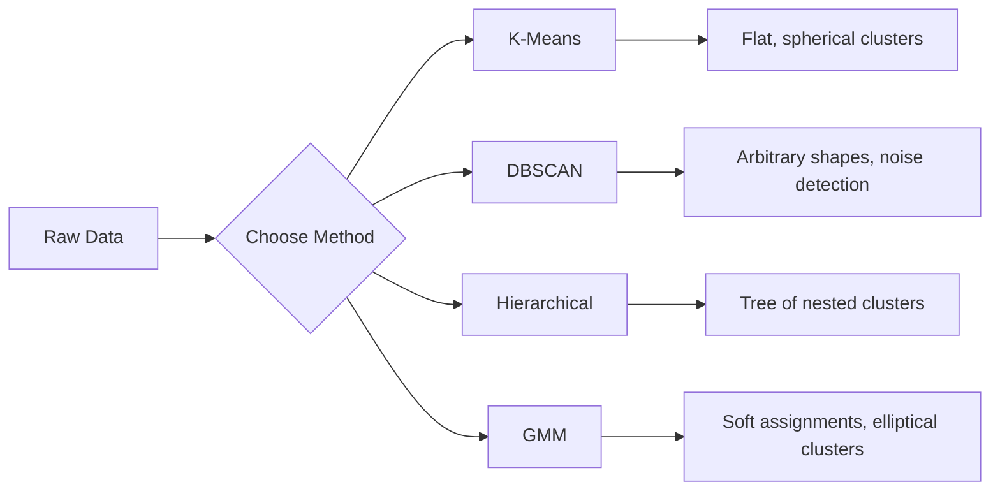

# Aprendizaje sin supervisión

> 没有标签,没有老师──算法自发发现结构──

**类型:**Construcción
**语言:**Python
**前置条件:**Fase 1(Normas y distancias、Probabilidad y distribución)
**时间:**- 90 minutos

## El objetivo del aprendizaje

- Desde la realización de K-Means、DBSCAN y Gaussian Mix Models, y comparar el comportamiento de agrupamiento de estos
- Utiliza la puntuación de silueta y el método de codo  evaluación de grupo 质量,并选择最优 K
- 解释 DBSCAN 何时优于 K-Means,并识别哪种算法能处理非球形集群 和外形
- Usar métodos de agrupamiento para construir una tubería de detección de anomalías, para marcar puntos de desviación del modo normal

##  problemas

Hasta ahora, cada sección de ML  cursos todos supuestos datos con etiquetas: es entrada, es salida correcta. En el mundo real, el costo de etiquetas es alto. En los hospitales hay millones de registros de pacientes, pero no hay nadie que haga un manual para cada registro que haga un manual para las categorías de enfermedades.

El aprendizaje no supervisado se encuentra en un contexto de no ser informado sobre qué buscar. Se encuentra un modelo. Se dividen puntos de datos similares, se descubren estructuras ocultas y se expone anomalías. Si el aprendizaje supervisado se encuentra con una respuesta de los materiales de aprendizaje, entonces el aprendizaje no supervisado se concentra en mirar los datos originales hasta que el modelo se manifiesta por sí mismo.

 El problema es que, sin etiqueta, no puedes medir directamente  verdad o  error── necesitas diferentes herramientas para evaluar si el algoritmo encuentra la estructura que tiene sentido─.

## 核心概念 核心概念 核心概念 核心概念

### Clustering: hacer cosas similares separadas

El agrupamiento distribuirá cada punto de datos en un grupo, haciendo que los puntos del mismo grupo sean más similares entre sí que los de otros grupos.



### K-Mens: método de la fuerza principal habitual

K-Means se dividirá los datos en K 个群── cada grupo tiene un centroide, cada punto pertenece a la distancia más cercana del centroide──

El algoritmo de Lloyd:

1. 随机选择 K 个点 como centroide inicial
2. Distribuir cada punto de datos al centroide más cercano
3. Para cada centroide , volver a calcular el valor medio de su punto de distribución .
4. 重复步骤 2-3, hasta que el resultado de distribución no cambie

目标函数 (incertia) mide la distancia total cuadrada de cada punto hasta su centroide perteneciente. K-Means 会最小化这个值, pero sólo puede encontrar el valor mínimo local.

### 选择 K

两种标准方法:

**Elbow method：**Para K = 1, 2, 3, ..., n 运行 K-Means── dibujar inercia con K's relation图── buscar el arco iris, es decir, continuar aumentando el cúmulo 时 inercia 不再显著下降的位置──

**Silhouette score：**Para cada punto, mide su similaridad con el propio cúmulo a) en relación con otros cúmulos más cercanos b) cómo; el coeficiente de silueta 为 (b - a) / max a, b), el rango es de -1 (分错 cluster) a +1 (分错 cluster) 划分良好) ⋅ para todos los puntos obtener el promedio de la totalidad de la cantidad de puntos.

### DBSCAN: Clustering basado en la densidad

K-Means 假设 cluster 球形的,并要求你先选择 K──DBSCAN No hace estas dos hipótesis── se encuentra el cluster 由稀疏区域分开的密区──

两个参数:
- **eps**: la mitad del área
- **min_samples**: el número mínimo de puntos necesarios para formar un área

Tres categorías:
- **Core point**En el caso de las empresas de la Unión Europea, el número de empresas de la Unión Europea es de aproximadamente un millón de millones de euros.
- **Border point**: se encuentra en un punto central de la eps, pero no es el punto central
- **Noise point**: Ni es el punto central, ni es el punto límite.

DBSCAN se pondrá en el centro de la gama de eps  conectado a un mismo grupo de datos.

优点:能发现任意形状的集群,自动确定集群数量,识别outlier──弱点:难以处理密度差较大的集群──

### Clustering jerárquico

构建嵌套 cluster 的树(dendrogram) ⋅

Aglomerativo ((自底向上):
1. Desde cada punto son su propio grupo
2. 合并两个 más recientes
3. 重复, hasta que sólo quede un grupo
4. En el esperado nivel de descifrado dendrograma, obtener K 个 agrupación

Se puede medir de esta manera la proximidad entre los grupos:
- **Single linkage**: La distancia mínima entre dos grupos arbitrarios
- **Complete linkage**: la distancia máxima entre cualquier dos puntos
- **Average linkage**: la distancia media entre todos los puntos
- **Ward's method**: condujo a un cluster en el que el total de diferencias aumenta al mínimo de la forma de combinación

### Modelos de mezcla gaussiana (GMM)

K-Medios 给出硬分配: cada punto pertenece a un grupo de datos.

GMM 假设数据由K 个 Gaussian distribution的混合生成, cada distribución tiene su propio promedio y covariance。El algoritmo de Expectation-Maximization (EM) se intercala entre los siguientes dos pasos:

- **E-step**: calcular cada punto pertenece a cada probabilidad de Gaussian
- **M-step**Actualizar el valor medio de cada Gaussian, la covarianza y el peso de mezcla, para maximizar la probabilidad de datos

GMM puede construir un cúmulo de forma circular (no sólo K-Means 那样球形), y puede tratar naturalmente el cúmulo de superposición.

### ¿Cuándo usar qué método?

| Method | Best for | Avoid when |
|--------|----------|------------|
| K-Means | 大型数据集、球形 cluster、已知 K | 形状不规则、存在 outlier |
| DBSCAN | K 未知、任意形状、outlier detection | 密度差异大、维度非常高 |
| Hierarchical | 小型数据集、需要 dendrogram、K 未知 | 大型数据集（O(n^2) memory） |
| GMM | 重叠 cluster、需要软分配 | 非常大的数据集、维度过多 |

### Utiliza Clustering hacer Detección de Anomalia

Clustering 天然支持 detección de anomalías:
- **K-Means**El punto de distancia de cualquier centroide es anomalía .
- **DBSCAN**Según la definición, el punto de ruido es una anomalía.
- **GMM**En todos los Gaussian , la probabilidad es muy baja .


```figure
kmeans-step
```

## Construirlo

### Paso 1: desde el principio de la realización de los K-Mens

```python
import math
import random


def euclidean_distance(a, b):
    return math.sqrt(sum((ai - bi) ** 2 for ai, bi in zip(a, b)))


def kmeans(data, k, max_iterations=100, seed=42):
    random.seed(seed)
    n_features = len(data[0])

    centroids = random.sample(data, k)

    for iteration in range(max_iterations):
        clusters = [[] for _ in range(k)]
        assignments = []

        for point in data:
            distances = [euclidean_distance(point, c) for c in centroids]
            nearest = distances.index(min(distances))
            clusters[nearest].append(point)
            assignments.append(nearest)

        new_centroids = []
        for cluster in clusters:
            if len(cluster) == 0:
                new_centroids.append(random.choice(data))
                continue
            centroid = [
                sum(point[j] for point in cluster) / len(cluster)
                for j in range(n_features)
            ]
            new_centroids.append(centroid)

        if all(
            euclidean_distance(old, new) < 1e-6
            for old, new in zip(centroids, new_centroids)
        ):
            print(f"  Converged at iteration {iteration + 1}")
            break

        centroids = new_centroids

    return assignments, centroids
```

### Paso 2: Método del codo y puntaje de silueta

```python
def compute_inertia(data, assignments, centroids):
    total = 0.0
    for point, cluster_id in zip(data, assignments):
        total += euclidean_distance(point, centroids[cluster_id]) ** 2
    return total


def silhouette_score(data, assignments):
    n = len(data)
    if n < 2:
        return 0.0

    clusters = {}
    for i, c in enumerate(assignments):
        clusters.setdefault(c, []).append(i)

    if len(clusters) < 2:
        return 0.0

    scores = []
    for i in range(n):
        own_cluster = assignments[i]
        own_members = [j for j in clusters[own_cluster] if j != i]

        if len(own_members) == 0:
            scores.append(0.0)
            continue

        a = sum(euclidean_distance(data[i], data[j]) for j in own_members) / len(own_members)

        b = float("inf")
        for cluster_id, members in clusters.items():
            if cluster_id == own_cluster:
                continue
            avg_dist = sum(euclidean_distance(data[i], data[j]) for j in members) / len(members)
            b = min(b, avg_dist)

        if max(a, b) == 0:
            scores.append(0.0)
        else:
            scores.append((b - a) / max(a, b))

    return sum(scores) / len(scores)


def find_best_k(data, max_k=10):
    print("Elbow method:")
    inertias = []
    for k in range(1, max_k + 1):
        assignments, centroids = kmeans(data, k)
        inertia = compute_inertia(data, assignments, centroids)
        inertias.append(inertia)
        print(f"  K={k}: inertia={inertia:.2f}")

    print("\nSilhouette scores:")
    for k in range(2, max_k + 1):
        assignments, centroids = kmeans(data, k)
        score = silhouette_score(data, assignments)
        print(f"  K={k}: silhouette={score:.4f}")

    return inertias
```

### Paso 3: Desde el principio de la implementación de DBSCAN

```python
def dbscan(data, eps, min_samples):
    n = len(data)
    labels = [-1] * n
    cluster_id = 0

    def region_query(point_idx):
        neighbors = []
        for i in range(n):
            if euclidean_distance(data[point_idx], data[i]) <= eps:
                neighbors.append(i)
        return neighbors

    visited = [False] * n

    for i in range(n):
        if visited[i]:
            continue
        visited[i] = True

        neighbors = region_query(i)

        if len(neighbors) < min_samples:
            labels[i] = -1
            continue

        labels[i] = cluster_id
        seed_set = list(neighbors)
        seed_set.remove(i)

        j = 0
        while j < len(seed_set):
            q = seed_set[j]

            if not visited[q]:
                visited[q] = True
                q_neighbors = region_query(q)
                if len(q_neighbors) >= min_samples:
                    for nb in q_neighbors:
                        if nb not in seed_set:
                            seed_set.append(nb)

            if labels[q] == -1:
                labels[q] = cluster_id

            j += 1

        cluster_id += 1

    return labels
```

### 步骤 4:modelo de mezcla gaussiana (algoritmo EM)

```python
def gmm(data, k, max_iterations=100, seed=42):
    random.seed(seed)
    n = len(data)
    d = len(data[0])

    indices = random.sample(range(n), k)
    means = [list(data[i]) for i in indices]
    variances = [1.0] * k
    weights = [1.0 / k] * k

    def gaussian_pdf(x, mean, variance):
        d = len(x)
        coeff = 1.0 / ((2 * math.pi * variance) ** (d / 2))
        exponent = -sum((xi - mi) ** 2 for xi, mi in zip(x, mean)) / (2 * variance)
        return coeff * math.exp(max(exponent, -500))

    for iteration in range(max_iterations):
        responsibilities = []
        for i in range(n):
            probs = []
            for j in range(k):
                probs.append(weights[j] * gaussian_pdf(data[i], means[j], variances[j]))
            total = sum(probs)
            if total == 0:
                total = 1e-300
            responsibilities.append([p / total for p in probs])

        old_means = [list(m) for m in means]

        for j in range(k):
            r_sum = sum(responsibilities[i][j] for i in range(n))
            if r_sum < 1e-10:
                continue

            weights[j] = r_sum / n

            for dim in range(d):
                means[j][dim] = sum(
                    responsibilities[i][j] * data[i][dim] for i in range(n)
                ) / r_sum

            variances[j] = sum(
                responsibilities[i][j]
                * sum((data[i][dim] - means[j][dim]) ** 2 for dim in range(d))
                for i in range(n)
            ) / (r_sum * d)
            variances[j] = max(variances[j], 1e-6)

        shift = sum(
            euclidean_distance(old_means[j], means[j]) for j in range(k)
        )
        if shift < 1e-6:
            print(f"  GMM converged at iteration {iteration + 1}")
            break

    assignments = []
    for i in range(n):
        assignments.append(responsibilities[i].index(max(responsibilities[i])))

    return assignments, means, weights, responsibilities
```

### Paso 5: Generar datos de prueba y ejecutar todo el contenido

```python
def make_blobs(centers, n_per_cluster=50, spread=0.5, seed=42):
    random.seed(seed)
    data = []
    true_labels = []
    for label, (cx, cy) in enumerate(centers):
        for _ in range(n_per_cluster):
            x = cx + random.gauss(0, spread)
            y = cy + random.gauss(0, spread)
            data.append([x, y])
            true_labels.append(label)
    return data, true_labels


def make_moons(n_samples=200, noise=0.1, seed=42):
    random.seed(seed)
    data = []
    labels = []
    n_half = n_samples // 2
    for i in range(n_half):
        angle = math.pi * i / n_half
        x = math.cos(angle) + random.gauss(0, noise)
        y = math.sin(angle) + random.gauss(0, noise)
        data.append([x, y])
        labels.append(0)
    for i in range(n_half):
        angle = math.pi * i / n_half
        x = 1 - math.cos(angle) + random.gauss(0, noise)
        y = 1 - math.sin(angle) - 0.5 + random.gauss(0, noise)
        data.append([x, y])
        labels.append(1)
    return data, labels


if __name__ == "__main__":
    centers = [[2, 2], [8, 3], [5, 8]]
    data, true_labels = make_blobs(centers, n_per_cluster=50, spread=0.8)

    print("=== K-Means on 3 blobs ===")
    assignments, centroids = kmeans(data, k=3)
    print(f"  Centroids: {[[round(c, 2) for c in cent] for cent in centroids]}")
    sil = silhouette_score(data, assignments)
    print(f"  Silhouette score: {sil:.4f}")

    print("\n=== Elbow Method ===")
    find_best_k(data, max_k=6)

    print("\n=== DBSCAN on 3 blobs ===")
    db_labels = dbscan(data, eps=1.5, min_samples=5)
    n_clusters = len(set(db_labels) - {-1})
    n_noise = db_labels.count(-1)
    print(f"  Found {n_clusters} clusters, {n_noise} noise points")

    print("\n=== GMM on 3 blobs ===")
    gmm_assignments, gmm_means, gmm_weights, _ = gmm(data, k=3)
    print(f"  Means: {[[round(m, 2) for m in mean] for mean in gmm_means]}")
    print(f"  Weights: {[round(w, 3) for w in gmm_weights]}")
    gmm_sil = silhouette_score(data, gmm_assignments)
    print(f"  Silhouette score: {gmm_sil:.4f}")

    print("\n=== DBSCAN on moons (non-spherical clusters) ===")
    moon_data, moon_labels = make_moons(n_samples=200, noise=0.1)
    moon_db = dbscan(moon_data, eps=0.3, min_samples=5)
    n_moon_clusters = len(set(moon_db) - {-1})
    n_moon_noise = moon_db.count(-1)
    print(f"  Found {n_moon_clusters} clusters, {n_moon_noise} noise points")

    print("\n=== K-Means on moons (will fail to separate) ===")
    moon_km, moon_centroids = kmeans(moon_data, k=2)
    moon_sil = silhouette_score(moon_data, moon_km)
    print(f"  Silhouette score: {moon_sil:.4f}")
    print("  K-Means splits moons poorly because they are not spherical")

    print("\n=== Anomaly detection with DBSCAN ===")
    anomaly_data = list(data)
    anomaly_data.append([20.0, 20.0])
    anomaly_data.append([-5.0, -5.0])
    anomaly_data.append([15.0, 0.0])
    anomaly_labels = dbscan(anomaly_data, eps=1.5, min_samples=5)
    anomalies = [
        anomaly_data[i]
        for i in range(len(anomaly_labels))
        if anomaly_labels[i] == -1
    ]
    print(f"  Detected {len(anomalies)} anomalies")
    for a in anomalies[-3:]:
        print(f"    Point {[round(v, 2) for v in a]}")
```

## Usalo

Usando un poco de aprendizaje, el mismo algoritmo puede ser un poco completado:

```python
from sklearn.cluster import KMeans, DBSCAN, AgglomerativeClustering
from sklearn.mixture import GaussianMixture
from sklearn.metrics import silhouette_score as sklearn_silhouette

km = KMeans(n_clusters=3, random_state=42).fit(data)
db = DBSCAN(eps=1.5, min_samples=5).fit(data)
agg = AgglomerativeClustering(n_clusters=3).fit(data)
gmm_model = GaussianMixture(n_components=3, random_state=42).fit(data)
```

Desde la primera versión de la implementación se mostrará con precisión estos libros en el cálculo. K-Medios en la distribución y recalculación entre los años. DBSCAN desde la semilla secreta comienza a expandir el grupo. GMM en la espera y la maximización.

##  entregarlo

Este curso se ha producido a partir de la realización de K-Means、DBSCAN y GMM── aquí el código de agrupamiento puede ser utilizado como base de un método más avanzado sin supervisión──

##  ejercicios

1. 实现 K-Means++ Iniciación: no elegir arbitrariamente el centroide, sino primero elegir arbitrariamente el primer centroide, después de que cada centroide sea seleccionado para comparar su velocidad de recepción con la probabilidad de la distancia cuadrada de la centroide que ya haya en el centroide reciente.
2. En el código se incluye el aglomerado jerárquico de los grupos. Se realiza el enlace de Ward, se genera un dendrograma.
3. Construir un simple oleoducto de detección de anomalías: en el mismo dato DBSCAN y GMM, marcando dos métodos considerados como puntos de excedencia                                                                                                                                                                                                                                          

## 关键术语: "El hombre es un hombre"

| Term | What people say | What it actually means |
|------|----------------|----------------------|
| Clustering | “把相似的事物分组” | 将数据划分为若干子集，使组内相似度高于组间相似度，并由特定距离度量来衡量 |
| Centroid | “cluster 的中心” | 分配给某个 cluster 的所有点的均值；K-Means 将其用作 cluster 的代表 |
| Inertia | “cluster 有多紧凑” | 每个点到其所属 centroid 的平方距离之和；越低表示越紧凑 |
| Silhouette score | “cluster 分离得有多好” | 对每个点计算 (b - a) / max(a, b)，其中 a 是平均 cluster 内距离，b 是最近 cluster 的平均距离 |
| Core point | “稠密区域中的点” | 在 DBSCAN 中，eps 距离内至少有 min_samples 个邻居的点 |
| EM algorithm | “软 K-Means” | Expectation-Maximization：迭代计算成员概率（E-step）并更新 distribution 参数（M-step） |
| Dendrogram | “cluster 的树” | 一种树状图，展示 hierarchical clustering 中 cluster 被合并的顺序以及合并时的距离 |
| Anomaly | “一个 outlier” | 不符合预期模式的数据点，在 DBSCAN 中被识别为 noise，或在 GMM 中被识别为低概率点 |

## 延伸阅读

- [Stanford CS229 - Unsupervised Learning](https://cs229.stanford.edu/notes2022fall/main_notes.pdf)- Andrew Ng  sobre los comentarios de la conferencia de Clustering y EM
- [scikit-learn Clustering Guide](https://scikit-learn.org/stable/modules/clustering.html)- Comparación práctica de todos los algoritmos de agrupamiento, y ejemplos visibles
- [DBSCAN original paper (Ester et al., 1996)](https://www.aaai.org/Papers/KDD/1996/KDD96-037.pdf)-  proponer el clustering basado en la densidad
